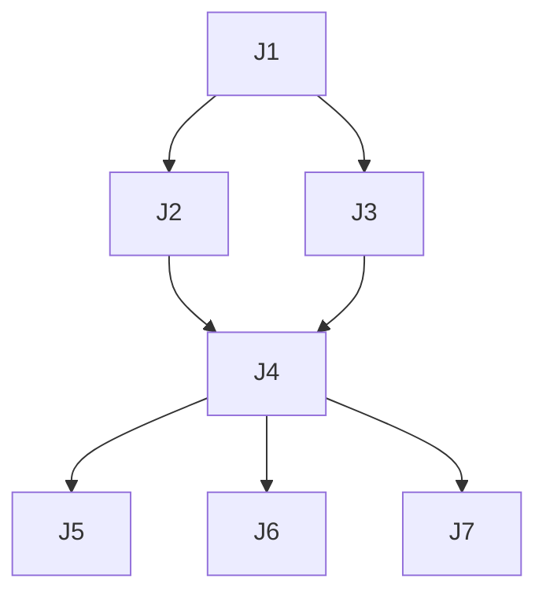

# Phase 4 — Decomposition

## 목적

큰 스펙을 **DAG 기반 작은 job 들** 로 쪼갭니다. 각 job 은 자기 완결적이어야 하며, 병렬 가능한 것은 병렬로 선언합니다.

## 입력

- Phase 2 의 spec
- Phase 3 의 visuals

## 출력

- `.harness/spec/decomposition-{YYYY-MM-DD}-{feature}.md`

## Decomposition 템플릿

```markdown
# Decomposition — {feature-slug}

> Spec: .harness/spec/{YYYY-MM-DD}-{feature-slug}.md

## Jobs (DAG)

| ID | 제목 | 의존성 | 예상 | 유형 |
|----|------|--------|------|------|
| J1 | 스키마 추가 | — | 30m | dev |
| J2 | API 엔드포인트 | J1 | 2h | dev |
| J3 | 프론트엔드 폼 | J1 | 2h | dev |
| J4 | 통합 테스트 | J2, J3 | 1h | dev |
| J5 | 코드 critic | J4 | auto | eval |
| J6 | 테스트 critic | J4 | auto | eval |
| J7 | e2e eval | J4 | auto | eval |

## 의존성 그래프



## Job 상세

### J1: 스키마 추가
- **인수 기준**: migration 적용 + 단위 테스트 통과
- **산출물**: `migrations/NNN_add_X.sql` + 관련 엔티티

### J2: ...
```

## 원칙

1. **Job 크기**: 1 커밋 = 1 job. 너무 크면 쪼개라 (최대 ~4시간 분량)
2. **독립성**: 가능한 한 병렬화. 공유 상태를 통한 암묵적 의존 제거
3. **평가 job 분리**: dev job 과 eval job 을 명시적으로 분리 (Oracle Problem 대응)
4. **역추적 가능**: 각 job 은 spec 의 어떤 성공 기준을 만족시키는지 명시

## AC Tree (Acceptance Criteria 상태 전파)

> ouroboros 의 AC Tree 패턴 흡수: 계층형 인수 기준 + 상태를 명시해 진행률을 파일로 추적.

DAG 와 별개로, **인수 기준 트리** 를 함께 작성한다. 파일: `.harness/spec/ac-tree-{YYYY-MM-DD}-{feature}.md`.

### 상태 어휘

| 상태 | 의미 |
|---|---|
| `pending` | 시작 전 |
| `in_progress` | Job 진행 중 |
| `passed` | 인수 기준 충족 (테스트 + eval 통과) |
| `failed` | 인수 기준 불충족 (재작업 필요) |

### AC Tree 템플릿

```markdown
# AC Tree — {feature-slug}

> 최종 갱신: {YYYY-MM-DD HH:MM}

## AC-0 [feature-slug] 전체 기능 (pending)
- **설명**: spec §1 요약
- **만족 조건**: 모든 자식 AC 가 passed
- **담당 job**: —

  ### AC-1 [데이터 모델] 스키마 추가 (pending)
  - **만족 조건**: migration 적용 + 단위 테스트 통과
  - **담당 job**: J1
  - **관련 테스트**: tests/test_schema.py::test_new_table

  ### AC-2 [API] 엔드포인트 (pending)
  - **만족 조건**: 201 응답 + DB insert 확인
  - **담당 job**: J2
  - **관련 테스트**: tests/test_api.py::test_create_endpoint

    #### AC-2.1 [인증] 권한 체크 (pending)
    - **만족 조건**: 비인증 요청 401 반환
    - **담당 job**: J2
    - **관련 테스트**: tests/test_api.py::test_unauthenticated
```

### 상태 전파 규칙

- 자식이 모두 `passed` → 부모를 `passed` 로 승격
- 자식 중 하나라도 `failed` → 부모도 `failed`
- 자식 중 하나라도 `in_progress` → 부모를 `in_progress`
- 리프(leaf) AC 만 관련 테스트에 바인딩 (중간 노드는 집계 전용)

### 활용처

- **cg-execution-loop**: job 시작 시 관련 AC 를 `in_progress` 로 변경, 완료 시 `passed`
- **cg-qa / cg-evaluation**: 남은 `pending` AC 만 검증 대상
- **drift-monitor / cg-status**: AC Tree 상태 변화로 드리프트 감지

## 완료 조건

- DAG 가 모든 spec 성공 기준을 커버
- **AC Tree 작성 완료** (모든 AC 초기 `pending`)
- 사용자 승인
- **`cg-plan-check`(Phase 4.5) 게이트 PASS** — Phase 5 실행 진입 전 필수. REVISE 면 위 DAG/AC Tree 를 고친 뒤 재검증.
