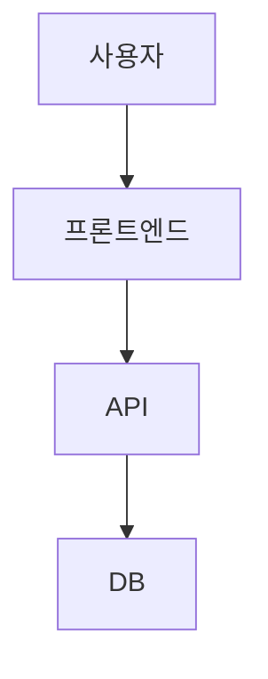
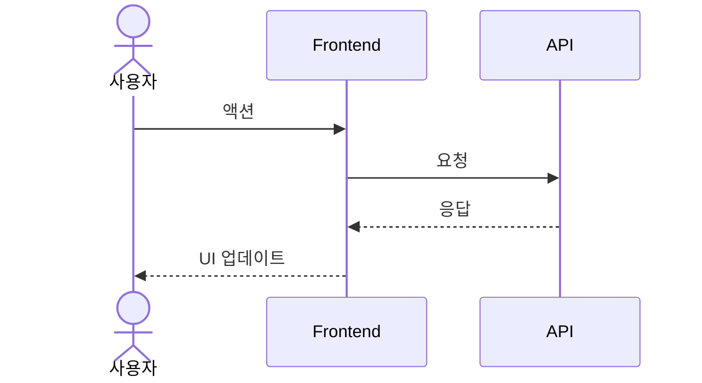
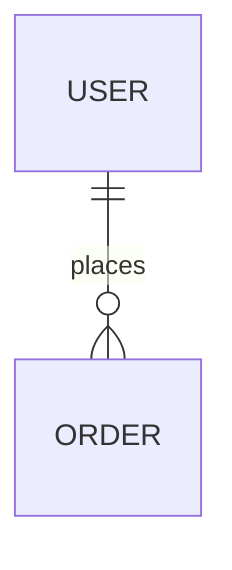

# Phase 3 — Visuals

## 목적

사람과 에이전트 모두 "그림으로 먼저 이해" 하도록 합니다. 시각화는 spec 의 누락을 드러내는 강력한 검증 도구이기도 합니다.

## 입력

- Phase 2 의 `spec/{YYYY-MM-DD}-{feature}.md`

## 출력

- `.harness/visuals/{feature-slug}/architecture.md` (Mermaid 기반)
- `.harness/visuals/{feature-slug}/flow.md` (sequenceDiagram)
- (선택) UI 목업 (PNG/SVG 또는 ASCII)

## 필수 다이어그램

### 1. 아키텍처 (Mermaid)

### 2. 시퀀스 다이어그램 (주요 시나리오)

### 3. 데이터 모델 (선택)

## 원칙

- **Mermaid 우선**: 코드 리뷰에 렌더링 가능, 다이어그램 드리프트 방지
- **draw.io 는 인간-인간 커뮤니케이션용** (팀 공유) — 에이전트는 Mermaid 만 읽음
- **UI 목업은 Pencil/Figma** 가 가능하면 활용, 아니면 ASCII 로도 충분

## 완료 조건

- 다이어그램으로 spec 을 다시 훑으며 **누락된 컴포넌트나 흐름이 없는지** 확인
- 발견되면 Phase 2 spec 으로 돌아가서 업데이트 (단방향 아님)
