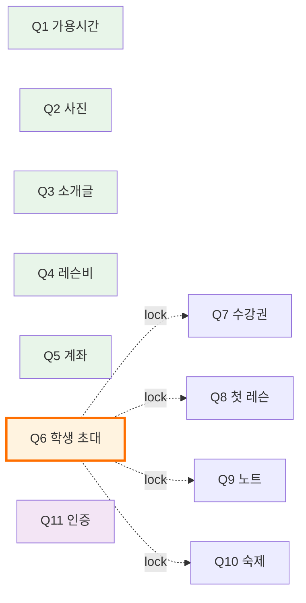
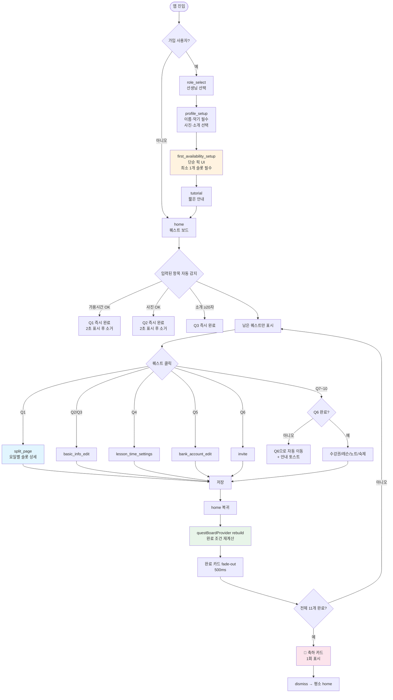

# 선생님 퀘스트 시스템 재설계 스펙

> 작성일: 2026-06-08
> 단계: cg-harness Phase 2 — 스펙 초안 (Phase 6 통과 후 `docs/specs/onboarding/teacher_quest_system.md` 로 머지)
> 입력 자료: [`docs/specs/design/teacher_quest_audit_2026-06-08.md`](../../docs/specs/design/teacher_quest_audit_2026-06-08.md) (Step 1 audit, 종합 26/70 = 37%)
> 글로서리: [`.harness/knowledge/glossary.md`](../knowledge/glossary.md) §3 가용시간 (`TeacherAvailability`)
> Supersedes: [`docs/specs/onboarding/teacher_first_availability_setup.md`](../../docs/specs/onboarding/teacher_first_availability_setup.md) §2 "블로커 퀘스트" 원칙
> 관련 코드: `frontend/lib/features/home/presentation/widgets/quest_board_card.dart`, `frontend/lib/features/onboarding/presentation/screens/first_availability_setup_screen.dart`, `frontend/lib/features/schedule/presentation/screens/teacher_availability_split_page.dart`

---

## 1. 배경 — Step 1 Audit 요약

UX 전문가 7차원 평가 결과 종합 **26/70 (37%)**. 11개 퀘스트가 모두 "구현"은 됐지만 시스템 차원에서 다음 3대 문제가 존재한다.

| 차원 | 점수 | 핵심 진단 |
|---|---|---|
| 목적 명료성 | 4/10 | "Step N" 명명 vs 자유 선택 신호 충돌 |
| 사용자 여정 정합성 | 3/10 | 가입에서 입력한 값이 퀘스트 완료에 자동 반영 안 됨 |
| 퀘스트 vs 설정 역할 분리 | 2/10 | Q1만 별도 화면 + 별도 도메인 → SSOT 위반 P0 |
| 완료 기준 | 5/10 | Q3 ≥20자 등 임계값 비공개 |
| 진입점 일관성 | 4/10 | Q1만 단일 진입점 (재방문 경로 없음) |
| 스킵 정책 | 3/10 | 11개 중 1개만 "선택" 표기 |
| 재방문/수정 경로 | 5/10 | Q1 수정은 split_page (다른 화면) — 비대칭 |

---

## 2. 문제 정의 (3대 시스템 문제)

### P0-1. 목적 모호 (Step 명명 ↔ 자유 선택 충돌)

- "Step 1, Step 2" 명명은 순차적 절차를 암시
- 실제로는 Q1 lock 외에는 자유 선택 가능
- 사용자 정신 모델 형성 실패 → "꼭 순서대로 해야 하나?" 의문

### P0-2. SSOT 위반 (Q1 가용시간 이중 화면 + 이중 저장소)

```
first_availability_setup_screen → teacherSettingsNotifierProvider.replaceAvailableSlots(newSlots)
                                   └── 저장: profile.TeacherSettings.availableSlots

teacher_availability_split_page → teacherAvailabilityNotifierProvider
                                   └── 저장: schedule.TeacherAvailability (별개 엔티티/repository)
                                   └── ref.invalidate(teacherSettingsProvider) ← 캐시 정리만, 진짜 동기화 아님
```

→ 두 화면에서 본 가용시간이 다를 위험.

### P0-3. 가입 ↔ 퀘스트 자동 완료 비동기

- 가입 시 `profile_setup` 에서 사진·소개 입력해도 home 도착 시 Q2/Q3 "미완료"로 보일 가능
- "방금 입력했는데 왜 또 입력해야 하지?" 의문 발생 — 1차 이탈 risk

---

## 3. 설계 원칙

본 재설계는 모바일 앱 온보딩의 검증된 3대 패턴을 결합한다.

| 패턴 | 정의 | 본 시스템 적용 |
|---|---|---|
| **Progressive Onboarding** | 가입은 최소 진입 장벽 — 핵심만 빠르게 | `first_availability_setup` 의 단순 픽 UI 유지 (요일×시간대 1쌍) |
| **Just-in-time Configuration** | 본격 설정은 필요한 순간 풀 화면으로 | 퀘스트 클릭 시 `split_page` (요일별 슬롯 상세) 로 진입 |
| **Self-eliminating Education** | 학습 항목 완료 시 스스로 사라짐 | 자동 완료 감지 → 카드 즉시 fade-out |

---

## 4. 시스템 재정의

> **퀘스트 = 학습 가이드 + 단축 진입점** (의무 아님)

- 모든 퀘스트는 선택 — 강제는 가입 흐름에서만 (`first_availability_setup` 최소 1개 슬롯 필수)
- 퀘스트 진입점 = 설정 메뉴와 동일한 화면 (단축 wrapper 화면 금지)
- "Step N" 명명 폐기 → 3-group 시맨틱 분류로 교체
- 완료 즉시 카드 소거 → 미완료 항목에 집중

---

## 5. 분류 체계 (3-group)

| 그룹 | 퀘스트 | 목적 | 카드 시각 |
|---|---|---|---|
| **🪪 프로필 설정** | Q1~Q5 | 학생에게 보일 정보 준비 | 기본 카드 |
| **🎓 운영 시작** | Q6~Q10 | 학생 연결 → 실제 운영 흐름 학습 | 기본 카드 |
| **✨ 선택 보너스** | Q11 | 신뢰도 강화 (인증 선생님 배지) | `[선택]` 라벨 + 외곽 점선 |

### 5.1 퀘스트 인벤토리 (재정의)

| ID | 제목 | 그룹 | 자동 완료 트리거 | 진입 라우트 | Lock 의존 |
|---|---|---|---|---|---|
| Q1 | 가용시간 설정 | 프로필 설정 | `TeacherAvailability.slots.isNotEmpty` | `AppRoutes.teacherAvailability` (split_page) | 없음 |
| Q2 | 프로필 사진 | 프로필 설정 | `User.profileImageUrl != null` | `AppRoutes.basicInfoEdit` | 없음 |
| Q3 | 소개글 작성 (≥20자) | 프로필 설정 | `User.introduction.length >= 20` | `AppRoutes.basicInfoEdit` | 없음 |
| Q4 | 레슨비 설정 | 프로필 설정 | `PriceTable.items.isNotEmpty` | `AppRoutes.lessonTimeSettings` | 없음 |
| Q5 | 입금 계좌 | 프로필 설정 | `BankAccount` 존재 | `AppRoutes.bankAccountEdit` | 없음 |
| Q6 | 첫 학생 초대 | 운영 시작 | `homeStudents.isNotEmpty` | `AppRoutes.invite` | 없음 |
| Q7 | 첫 수강권 발급 | 운영 시작 | `Subscription` 1건 이상 | `AppRoutes.issueSubscription` | **Q6** |
| Q8 | 첫 레슨 완료 | 운영 시작 | `Lesson.status == completed` 1건 | `AppRoutes.lessons` | **Q6** |
| Q9 | 첫 레슨 노트 | 운영 시작 | `Lesson.teacherNotes` 1건 | `AppRoutes.quickFeedbackList` | **Q6** |
| Q10 | 첫 연습 과제 등록 | 운영 시작 | `Practice.assigned ≥ 1` | `AppRoutes.assignmentDashboard` | **Q6** |
| Q11 | 전화 인증 | 선택 보너스 | `User.isPhoneVerified == true` | `AppRoutes.teacherPhoneVerification` | 없음 |

**변경 요지:**
- Q1 진입 라우트: `teacherFirstAvailability` (단순 UI) → `teacherAvailability` (split_page, 풀 UI) 로 교체
- Lock: 현재 Q1 → {Q2~Q11} 전부 → Q6 → {Q7,Q8,Q9,Q10} 만 유지
- Q11도 일반 lock 적용에서 제외 (현재 `isLocked: slotsBlocker` 처리 → 자유 진입)

---

## 6. 데이터 SSOT

### 6.1 SSOT 결정

| 도메인 | 엔티티 | 역할 |
|---|---|---|
| `schedule` (SSOT) | `TeacherAvailability` | 가용시간 단일 진실 소스 |
| `profile` (deprecated) | `TeacherSettings.availableSlots` | 4단계 마이그레이션 완료 후 제거 |

### 6.2 화면별 데이터 흐름 (목표 상태)

```
first_availability_setup_screen (가입 단순 UI)  ─┐
                                                  ├─ schedule.TeacherAvailability
teacher_availability_split_page (풀 UI)         ─┘   (단일 저장소)
                                                  ↑
home questBoardCard (완료 감지) ──────────────────┘
                                                  ↑
profile_tab teacherAvailability 진입 ─────────────┘
```

### 6.3 4단계 마이그레이션 방향 (Step 3 위임)

본 스펙에서는 방향만 명시. 실제 마이그레이션 PR 분할은 Step 3 (writing-plans) 에서 결정.

| 단계 | 작업 | 위험도 | 다음 단계 진입 조건 |
|---|---|---|---|
| 1 | `first_availability_setup_screen` 이 schedule 도메인에도 dual-write (역호환 유지) | 낮음 | 다음 항목 ↓ |
| 검증 | dual-write 검증 기간 — **최소 7일 + 신규 가입 50건 이상** 누적 후 동기 검증 스크립트 통과 (BE: `TeacherSettings.availableSlots` vs `TeacherAvailability.slots` diff = 0건) | — | 모든 검증 PASS 시 단계 2 진입 |
| 2 | 모든 reader (home, quest, profile_tab) 가 `TeacherAvailability` 참조 | 중간 (회귀 가능) | 1주 안정성 모니터링 |
| 3 | `TeacherSettings.availableSlots` deprecated 마킹 + 신규 코드 차단 (analyzer rule 또는 grep CI) | 낮음 | 단계 4 백엔드 조율 완료 |
| 4 | DB 마이그레이션 후 필드 제거 (백엔드 조율 필수) | 높음 | — |

**in-flight 데이터 보호:**
- 단계 1 배포 직전 사용자가 가입 진행 중인 상태에서 앱 강제 종료 → 단계 2 배포 후 재진입 케이스: `TeacherAvailability.slots == empty` 면 가입 흐름 재진입 (`first_availability_setup` 재노출)
- 검증 단계의 diff 스크립트가 0이 아닌 경우 단계 2 진입 차단 — 잔재 케이스 수동 복구

---

## 7. Lock 매트릭스



### 7.1 Lock 카드 UX

- Q7~Q10: 자물쇠 아이콘 + 문구 "학생 초대 후 진행 가능" (현재 "가용시간 설정 후 진행 가능" → 교체)
- 클릭 시: Q6(`AppRoutes.invite`) 로 자동 이동 + 토스트 안내 "먼저 학생을 초대해주세요"

### 7.2 제거되는 lock

- ❌ `slotsBlocker` (`!hasSlots`) 변수 자체 제거
- ❌ Q2~Q11 의 `isLocked: slotsBlocker` 라인 제거
- ✅ Q7 의 `hasStudents ? ... : null` 조건 → Q8~Q10 에도 동일 패턴 확장

---

## 8. 자동 완료 + 즉시 소거 UX

### 8.1 자동 완료 트리거

5장 인벤토리의 "자동 완료 트리거" 컬럼 참조. 모든 트리거는 **reactive provider** 로 감지 — 별도 사용자 액션 불필요.

### 8.2 카드 소거 애니메이션 (5단계)

```
입력 저장 → home 복귀
  ① questBoardProvider rebuild (provider invalidate)
  ② 완료 카드 checkmark fade-in (300ms)
  ③ 카드 slide + fade-out (500ms ease-out)
  ④ 그룹 헤더 (완료 N/M) 카운터 +1
  ⑤ 아래 항목 자연스럽게 collapse
```

**구현 메모:**
- `AnimatedSwitcher` + `AnimatedList` 조합
- 가입 직후 home 첫 도착 시점만 예외: 자동 완료된 카드를 **2초 표시 후 소거** (사용자가 "내가 한 게 반영됐다" 인지)
- 일반 복귀 시점에는 즉시 소거 (사용자가 이미 본 카드)

**"가입 직후 첫 도착" 판별 기준** (Step 3 에서 한 가지로 확정):

| 후보 | 장점 | 단점 |
|---|---|---|
| 라우트 히스토리 검사 (직전 라우트 = `tutorial` 또는 onboarding 흐름) | 추가 필드 불필요 | 라우터 상태 의존 — 딥링크 시 부정확 |
| `User.signupCompletedAt` 신규 필드 (현재 시각 - 가입완료 < N분) | 명시적·예측 가능 | BE 필드 추가 비용 |
| `SharedPreferences.questFirstShownAt` (FE Hive only) | BE 변경 없음 | 사용자가 앱 재설치 시 false-positive |

→ Step 3 PLAN 첫 결정 항목으로 명시 (`User.questCelebratedAt` 결정과 함께).

### 8.3 전체 완료 시 축하 카드 (1회만)

```
┌─────────────────────────────────────┐
│  🎉 모든 준비를 마치셨어요!         │
│                                     │
│  이제 본격적으로 레슨을 운영해보세요. │
│                                     │
│  [오늘의 레슨 보기]  [주간 통계]    │
└─────────────────────────────────────┘
```

- dismiss하면 사라지고 재진입 시 등장 X — `SharedPreferences` 또는 `User.questCelebratedAt` 필드로 1회성 보장
- "퀘스트 다시 보기" 버튼은 도입 X (모든 항목은 설정 메뉴에서 접근 가능 — YAGNI)
- 영구 재방문 경로 = 프로필 > 설정 메뉴

---

## 9. 완료 임계값 공개 (권고 D)

| 퀘스트 | 임계값 | 사용자에게 보이는 방식 |
|---|---|---|
| Q3 소개글 | ≥20자 | 입력 화면 카운터 "N/20자 (최소 20자)" + 미달 회색, 도달 primary 색 |
| Q4 레슨비 | `priceTable.items ≥ 1` | "최소 1개 가격 항목 필요" 빈 상태 hint |
| Q10 숙제 | `assigned ≥ 1` | "1건 등록 시 완료" 카드 설명 추가 |
| 나머지 (Q1, Q2, Q5~Q9, Q11) | boolean | 임계값 개념 없음 — 별도 표시 불필요 |

### 9.1 카드 본문 패턴 (예시)

```
[Q3 소개글 작성]
  학생들에게 자신을 소개해주세요
  · 최소 20자 입력 시 완료
```

---

## 10. 스킵/필수 정책 (권고 E)

### 10.1 퀘스트 보드 (home)

| 그룹 | 라벨 | 시각 | 정책 |
|---|---|---|---|
| 프로필 설정 | 없음 | 기본 카드 | 권장 — 학생 확보를 위해 |
| 운영 시작 | 없음 | 기본 카드 | 권장 — 운영 흐름 학습 |
| 선택 보너스 | `[선택]` | 외곽 점선 | 명시적 선택 |

→ **모든 퀘스트는 선택**. "건너뛰기" 명시 버튼은 도입 X (인지 부하).

### 10.2 가입 흐름 (별도 정책)

| 화면 | 항목 | 정책 |
|---|---|---|
| `profile_setup` | 이름·악기 | 필수 (validation) |
| `profile_setup` | 사진·소개 | 선택 (현재 정책 유지) |
| `first_availability_setup` | 최소 1개 슬롯 | **필수** — 슬롯 0개면 "다음" 버튼 비활성 |

근거: 가용시간 0개로 home 진입 시 학생이 예약 불가 → 가입 후 즉시 무용 상태 방지. 단, 가입 단계에서만 강제이고 home 퀘스트 카드에서는 일반 선택 항목.

---

## 11. UX 흐름 (Mermaid)



---

## 12. 영향받는 코드·스펙 (Supersedes)

### 12.1 deprecated 처리

| 대상 | 처리 | 시점 |
|---|---|---|
| `docs/specs/onboarding/teacher_first_availability_setup.md` §2 "블로커 퀘스트" 원칙 | 본 스펙에 의해 superseded — 헤더에 deprecated 표기 추가 | Phase 5 구현 직전 |
| `profile.TeacherSettings.availableSlots` 필드 | 마이그레이션 단계 3에서 deprecated 마킹 | Step 3 마이그레이션 PR |
| `quest_board_card.dart:146` `slotsBlocker` 변수 | 라인 제거 (Q2~Q11 의 `isLocked: slotsBlocker` 9건 일괄 제거) | Phase 5 |
| `home_screen.dart:84,99,107` `_maybeShowFirstAvailabilityInterstitial()` | 가용시간 0개 인터스티셜 모달 제거 | Phase 5 |
| `teacher_availability_split_page.dart:269, 452` `ref.invalidate(teacherSettingsProvider)` | 마이그레이션 단계 3 완료 후 호출 제거 (현재는 두 저장소 캐시 동기화 목적 — 단일 SSOT 후 불필요) | Step 3 마이그레이션 단계 3 |
| `teacher_settings_provider` 의 `hasSlots` 도출 로직 (있는 경우) | reader 교체 후 `TeacherAvailability.slots.isNotEmpty` 로 대체 | Step 3 마이그레이션 단계 2 |

### 12.2 추가/변경

| 대상 | 변경 |
|---|---|
| `quest_board_card.dart` | 3-group 분류 구조 도입, "Step N" 명명 제거, 자동 완료 즉시 소거 애니메이션, 전체 완료 축하 카드 |
| `first_availability_setup_screen.dart` | 저장 경로를 `teacherSettingsNotifierProvider` → `teacherAvailabilityNotifierProvider` 로 교체 (단계 1: dual-write) |
| `quest_board_card.dart` Q1 진입 | `AppRoutes.teacherFirstAvailability` → `AppRoutes.teacherAvailability` |
| `AppStrings` 퀘스트 문구 | 아래 §12.2.1 참조 — 4종 신규 + 1종 폐기 |
| `User.questCelebratedAt` (신규 필드) | 축하 카드 1회성 보장. nullable DateTime. **BE 필드 vs Hive 로컬 결정은 Step 3 첫 결정 항목** |

### 12.2.1 AppStrings 갱신 명세

| 키 | 변경 | 문구 |
|---|---|---|
| `questLockToastForOps` (신규) | 추가 | "먼저 학생을 초대해주세요" — Q7~Q10 클릭 시 (Q6 미완료) |
| `questLockCardHintForOps` (신규) | 추가 | "학생 초대 후 진행 가능" — Q7~Q10 카드 부제 |
| `questGroupTitleProfile` (신규) | 추가 | "프로필 설정" — 그룹 1 헤더 |
| `questGroupTitleOperation` (신규) | 추가 | "운영 시작" — 그룹 2 헤더 |
| `questGroupTitleBonus` (신규) | 추가 | "선택 보너스" — 그룹 3 헤더 |
| `questCelebrationTitle` (신규) | 추가 | "모든 준비를 마치셨어요!" — 축하 카드 |
| `questCelebrationBody` (신규) | 추가 | "이제 본격적으로 레슨을 운영해보세요." |
| `questThresholdIntroHint` (신규) | 추가 | "최소 20자 입력 시 완료" — Q3 카드 부제 |
| 기존 `questTitleSlots` 부제 ("가용시간 설정 후 진행 가능") | 제거 | — (lock 자체 제거) |
| 기존 step number prefix ("Step 1" 등 11개) | 제거 | — (명명 폐기) |

### 12.3 글로서리 추가 (있는 경우)

`glossary.md` §3 가용시간 항목은 이미 `TeacherAvailability` 를 SSOT 로 명시 — 추가 변경 불필요. 단, `TeacherSettings.availableSlots` 가 deprecated 됨을 §1.x 또는 §9 (FE-BE 매핑) 에 명시할지 Step 3 에서 결정.

---

## 13. 성공 기준 / 측정

### 13.1 정성적 기준

- Audit 7차원 점수 37% → **75% 이상** (Step 1 보고서 재평가로 측정)
- 가입 직후 home 도착 시 자동 완료된 퀘스트가 "이미 처리됨" 으로 사용자에게 보임
- Q1 lock 제거 후 사용자가 가용시간 없이 다른 항목 입력 가능

### 13.2 정량적 기준 (가능한 측정 지표)

| 지표 | 측정 방법 | 목표 |
|---|---|---|
| 가입 → home 첫 도착 시 완료된 퀘스트 비율 | 분석 로그 | 평균 ≥2개 (가용시간 + 사진 또는 소개 중 일부) |
| Q1 클릭 후 첫 슬롯 등록 완료까지 시간 | UX 추적 | 가입 흐름 30초 / 퀘스트 흐름 60초 이내 |
| 전체 11개 완료 비율 (가입 후 30일) | 분석 로그 | 50% 이상 |
| 가용시간 데이터 불일치 (FE-BE) | 자동 검증 스크립트 | 0건 (마이그레이션 단계 2 완료 후) |

### 13.3 회귀 검증 (Phase 6 critic 기준)

**단위 / 위젯 / 통합 / 마이그레이션 4 카테고리:**

| 카테고리 | 시나리오 | 측정 |
|---|---|---|
| 단위 | `first_availability_setup_screen` 저장 후 `TeacherAvailability.slots` 채워짐 | provider state 검증 |
| 단위 | Lock 매트릭스 (Q6 미완료 시 Q7~Q10 `isLocked == true`, Q6 완료 시 false) | quest 빌드 함수 직접 호출 검증 |
| 단위 | 자동 완료 트리거 (11개 모두) — 입력 변경 → `questBoardProvider` rebuild → 완료 상태 변화 | provider listener 검증 |
| Widget smoke | `quest_board_card` 3-group 렌더 + 자동 완료 + 축하 카드 — `RenderBox`/`BoxConstraints` 회귀 방지 | `tester.takeException()` null |
| Widget smoke | Lock 카드 클릭 시 토스트 표시 + Q6 화면 이동 | `find.byType(SnackBar)` + 라우트 검증 |
| Widget smoke | 가입 직후 첫 도착 시점 카드 2초 표시 → 소거 애니메이션 | `pumpAndSettle` + 카드 존재 여부 |
| 통합 | 가입 → home 도착 → 자동 완료 확인 → 퀘스트 클릭 → 입력 → 복귀 → 카드 소거 | end-to-end 시나리오 |
| 통합 | 전체 11개 완료 → 축하 카드 표시 → dismiss → 재진입 시 미표시 | `questCelebratedAt` 상태 검증 |
| 마이그레이션 단계 2 | reader 교체 후 home·profile_tab·quest_board 의 `hasSlots` 도출이 모두 `TeacherAvailability.slots` 기반인지 | 3 화면 동기 검증 (snapshot diff) |
| 마이그레이션 단계 2 | dual-write 모드에서 사용자 가용시간 변경 시 두 저장소 일치 | diff 스크립트 자동 실행 |
| 회귀 (자동 이동) | Q7 클릭 → Q6 화면 진입 → 학생 초대 완료 → home 복귀 → Q7 자동 unlock | 통합 시나리오 |

**Red-Green 검증 의무**: 본 스펙 결정 항목 중 다음은 Phase 6 에서 Red→Green 사이클 필수
- Q1 lock 제거 검증 (테스트가 회귀 시 실제로 잡는지)
- 자동 완료 즉시 소거 (가입 직후 2초 예외 포함)
- Lock 카드 자동 이동 + 토스트 (UX 의도)

---

## 14. 결정 로그 (Lore)

Step 5 구현 커밋에 들어갈 trailer 후보 (본 프로젝트는 bare key 형식 — 글로벌 `Lore-` prefix 는 hook reject):

```
Directive: 선생님 퀘스트 시스템을 "학습 가이드 + 단축 진입점"으로 재정의 — 모든 퀘스트는 선택, 강제는 가입 흐름에서만
Directive: 가용시간 SSOT 를 schedule.TeacherAvailability 로 일원화 — profile.TeacherSettings.availableSlots 는 4단계 마이그레이션 후 제거
Directive: Lock 정책을 의미적 의존성만 유지 — Q6→{Q7,Q8,Q9,Q10}, Q1 lock 제거
Directive: 자동 완료된 퀘스트 카드는 즉시 소거 (Notion "Welcome" 패턴) — 가입 직후 첫 도착 시점만 2초 표시 예외
Constraint: 가입 흐름의 first_availability_setup 만 가용시간 강제 (최소 1개 슬롯) — home 퀘스트 카드에서는 모든 항목이 선택
Constraint: profile.TeacherSettings.availableSlots 필드 제거는 BE DB 마이그레이션 + FE 단계 1~3 완료 후에만 — 단계 1~2 사이 dual-write 검증 게이트 (7일 + 50건 + diff=0) 통과 필수
Rejected: 퀘스트 시스템 완전 폐기 — 11개 모두 구현된 학습 가이드 가치 손실
Rejected: 1회성 튜토리얼화 (7일 후 자동 제거) — 장기 미완료 항목 재방문 경로 부재
Rejected: 화면 1개로 통합 (split_page 만 유지) — 가입 직후 669줄 복잡 UI 노출로 이탈 risk
Rejected: Q1 lock 유지 — Q1 입력 안 한 사용자도 학생 초대·계좌 등록 가능해야 자연스러움
Rejected: "건너뛰기" 명시 버튼 도입 — 모든 퀘스트가 이미 선택이므로 인지 부하만 가중
```

---

## 15. 후속 단계

| 단계 | 산출물 | 도구 |
|---|---|---|
| **Step 3** | 본 스펙 기반 구현 계획 (PLAN.md) — PR 분할, 의존성, 검증 전략 | `writing-plans` 스킬 |
| **Step 4** | PR 시리즈 (surgical 분할 — 데이터 dual-write / UI 통합 / 자동 완료 wiring 등) | `cg-decomposition` + `cg-execution-loop` |
| **Step 5** | Phase 6 평가 (3-critic: code / test / e2e) | `cg-evaluation` |
| **Step 6** | 본 스펙을 `docs/specs/onboarding/teacher_quest_system.md` 로 머지 + `teacher_first_availability_setup.md` deprecated 헤더 | Phase 6 통과 후 |

### 15.1 Step 3 진입 시 결정해야 할 항목 (open questions)

본 스펙은 시스템 차원의 결정만 확정. 다음 항목은 PLAN 단계 첫 회의에서 확정한다.

| # | 결정 항목 | 후보 |
|---|---|---|
| O1 | "가입 직후 첫 도착" 판별 기준 | 라우트 히스토리 / `User.signupCompletedAt` / `SharedPreferences.questFirstShownAt` (§8.2 참조) |
| O2 | `User.questCelebratedAt` 저장 위치 | BE 필드 / FE Hive 로컬 (§12.2 참조) |
| O3 | Lock 카드 클릭 시 진입 UX | 즉시 자동 이동 + 토스트 (현 방향) / BottomSheet 안내 후 사용자 확인 진입 |
| O4 | "선택 보너스" 글로서리 등록 | 등록 / 미등록 (구현 후 회고에서 결정) |
| O5 | dual-write 검증 스크립트 위치 | BE Python 스크립트 / 백오피스 페이지 / 일회성 SQL 쿼리 |
| O6 | 마이그레이션 단계 3 의 신규 코드 차단 방법 | analyzer rule / grep CI 훅 / lint 메시지 |

각 항목의 trade-off 분석은 Step 3 (`writing-plans`) 에서 수행.

---

## 부록 A. 본 스펙이 다루지 않는 것 (out of scope)

- 학생 측 퀘스트 시스템 (별도 스펙)
- 학부모 측 퀘스트 시스템 (구현 여부 미정)
- 퀘스트 보드 자체의 디자인 시스템 변경 (Notebook 토큰 적용 등) — 별도 디자인 작업
- 퀘스트 보상 (포인트/배지) 시스템 — Q11 "인증 선생님" 외에 추가 도입 안 함

## 부록 B. 가정과 위험

| 가정 | 위험 |
|---|---|
| `TeacherAvailability` 가 schedule 도메인의 안정적인 SSOT | 백엔드 모델 변경 시 마이그레이션 단계 4 영향 |
| `User.questCelebratedAt` 신규 필드 추가 가능 | 백엔드 마이그레이션 필요 (또는 FE Hive 로컬 저장 대체) |
| 가입 흐름 변경 없이 데이터 저장 경로만 교체 | first_availability_setup 의 풀 dual-write 검증 필요 |
| `AnimatedList` 소거 애니메이션이 자연스러움 | 실기 검증 필요 (Phase 6 ui-review) |
| Q10 의 `Practice.assigned ≥ 1` 을 감지하는 reactive provider 가 현재 존재 | Phase 5 첫 확인 항목 — 미존재 시 신규 provider 작성 필요 |
