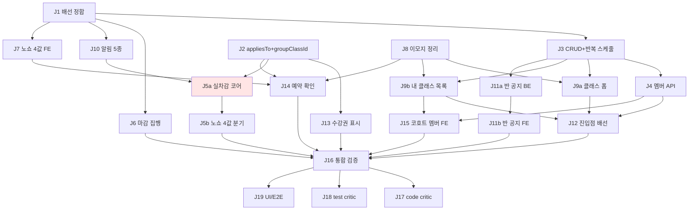

# Decomposition — group-lesson (P1+P2)

> Spec: `.harness/spec/2026-07-31-group-lesson.md` (locked)
> Visuals: `.harness/visuals/group-lesson/` | AC Tree: `ac-tree-2026-07-31-group-lesson.md`
> 실행: 전용 worktree (main 직접 금지). 1 job = 1 커밋.
> rev2 (2026-07-31): plan-check REVISE 반영 — 스케줄 생성 주체(J3)·노쇼 4값 BE(J5)·J9/J11 분할·엣지 2 추가·C8 제외

## Jobs (DAG)

| ID | 제목 | 의존성 | 예상 | 유형 | Spec 기준 |
|----|------|--------|------|------|-----------|
| J1 | BE GroupClass 배선 정합 (모델·마이그레이션·기존 회귀) | — | 3h | dev | P1-0 |
| J2 | BE `appliesTo`+`groupClassId` 필드 (null=universal, 실PG 검증, 그룹 템플릿 발급) | — | 2.5h | dev | P1-4 |
| J8 | FE 기존 그룹 화면 이모지 정리 (이모지만 — C8 raw alpha 는 별도 백로그, surgical) | — | 1h | dev | P1-6 |
| J3 | BE 클래스 CRUD API + **반(regular) 반복 스케줄 자동 생성·연장** (+ownership) | J1 | 4h | dev | P1-1 |
| J6 | BE 마감시간 집행 (예약·취소 4xx) | J1 | 2h | dev | P2-1 |
| J10 | BE 그룹 알림 5종 emit + NotificationType 확장 (예약확정·리마인더2·오픈·노쇼경고) | J1 | 3h | dev | P2-2 |
| J7 | FE NoShowPolicy 2값→4값 정합 | J1 | 1.5h | dev | P2-3 |
| J13 | FE 수강권 표시 정합 (클래스명/그룹 라벨 규칙·배지·폴백 0·그룹 템플릿) | J2 | 3h | dev | P1-4·P1-5 |
| J4 | BE 코호트 멤버 API (배정·정원 검증) | J3 | 2h | dev | P2-4 |
| J9a | FE 클래스 생성·수정 폼 (반 기본·드롭인 폼 옵션) | J3, J8 | 3h | dev | P1-1 |
| J9b | FE 내 클래스 목록 화면 | J3, J8 | 2h | dev | P1-1 |
| J11a | BE 반 공지 — TeacherAnnouncement scope 확장 + 발행 알림 emit | J3 | 2h | dev | P2-5·P2-2 |
| J11b | FE 반 공지 작성·수신 UI | J11a | 2h | dev | P2-5 |
| J14 | FE 예약 확인 다이얼로그 + 정책 박스 재배치 (4값 정책·차감 수강권 표시) | J8, J7, J2 | 2h | dev | P2-6 |
| **J5a** | **BE 실차감 코어 (add_usage·선택 규칙·멱등·flag 제거)** | **J2, J10** | 2.5h | dev | P1-3 |
| J5b | BE 노쇼 4값 분기 (기존 1:1 SSOT 재사용·reschedule→MakeupCredit) | J5a | 2h | dev | P1-3·P2-3 |
| J12 | FE 진입점 배선 (교사 홈·학생 아젠다 반 행·교사 상세 섹션·라우트 3곳 미러) | J9a, J9b, J4 | 3h | dev | P1-2 |
| J15 | FE 코호트 멤버 관리 (배정 UI + 챗형 신청·승인 연결) | J4, J9b | 3h | dev | P2-4 |
| J16 | 통합 검증 (flutter test 전체 + pytest 전체 + evals run) | 모든 dev job | 1h | dev | 공통 게이트 |
| J17 | Code critic (fresh context) | J16 | auto | eval | — |
| J18 | Test critic (spec vs 테스트만) | J16 | auto | eval | — |
| J19 | UI/E2E 검증 (2뷰포트 + tall 프로브, 실라우터) | J16 | auto | eval | — |

## 의존성 그래프

**병렬 트랙**: 시작점 3개(J1 BE 코어 / J2 구독 / J8 FE 정리) 동시 착수 가능.

## 하드 제약 (DAG 에 인코딩됨)

1. **J5a(실차감) ← J10(예약·승격 알림 5종)**: 스펙 §8 릴리스 순서 — 알림 없는 자동승격 차감 금지. 반 공지 알림(J11a)은 이 제약 무관.
2. **J8(이모지) ← J9a/J9b/J14**: HARD-GATE 위반 화면 위에 신규 UI 쌓기 금지.
3. **J12 ← J4**: 학생 아젠다 "등록된 반 행"은 멤버십 데이터 선행 (plan-check).
4. **J14 ← J7, J2**: 확인 다이얼로그가 4값 노쇼정책·차감 수강권을 표시 (plan-check).
5. J12 라우트 추가 시 **route_integrity 수동 미러 3곳 동반 갱신** (main RED 방지).
6. J2 마이그레이션은 **throwaway PG 실검증** (SQLite 은폐 함정).
7. FE 신규 화면 전부 **widget smoke test** (HARD-GATE) + 실라우터 렌더.
8. 신규 provider 추가 시 기존 위젯테스트 Timer 누출 점검 (#1142 교훈).

## Job 상세 (인수 기준 → AC Tree 참조)

핵심만 (전체는 AC Tree):

### J1: BE GroupClass 배선 정합
- **인수**: `GroupClassSchedule.group_class_id` → `GroupClass` FK. alembic 실PG 통과. 기존 정원·대기열·출석 pytest 전체 green (회귀 0).
- **산출물**: 모델 수정 + 마이그레이션 + `tests/test_group_class_wiring.py`
- **주의**: 기존 스케줄 데이터의 FK 값 이관 전략(백필 or 신규 생성) 마이그레이션에 명시

### J3: 클래스 CRUD + 반복 스케줄
- **인수**: CRUD + ownership(타 교사 403) + **반 생성 시 N주 `GroupClassSchedule` 자동 생성, 수정 시 미래 회차 갱신** (스펙 P1-1 세부)
- **산출물**: `tests/test_group_class_crud.py` (스케줄 생성 케이스 포함)

### J5a: BE 실차감 코어 (최고 리스크 job)
- **인수**: 출석 확정 → `add_usage` 차감(잔여 감소) · 중복 확정 멱등 · `appliesTo` 검증(1:1 전용권 4xx) · 선택 규칙(group→universal, 만료 임박 우선) · `subscription_deducted` flag-only 코드 제거
- **산출물**: `tests/test_group_lesson_deduction.py` (TDD 선행)
- **주의**: `use_lesson`/`deduct_lesson` legacy 미사용 유지 — 새 경로 발명 금지

### J5b: BE 노쇼 4값 분기
- **인수**: 노쇼 처리 시 클래스 정책 4분기(deductCredit/halfCredit/noDeduction/reschedule→MakeupCredit 적립) — **기존 1:1 노쇼 SSOT(#239) 시맨틱 재사용, 신규 발명 금지**. pytest 4분기 전부
- **산출물**: `tests/test_group_lesson_deduction.py` 노쇼 케이스 추가

### J16: 통합 검증
- **인수**: `python3 .harness/evals/run.py` 9/9 PASS + flutter analyze 0 + 전체 스위트 sweep (per-cluster 아님 — X→Y 회귀 감지)
