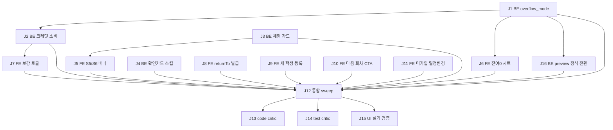

# Decomposition — lesson-add-intent

> Spec (마스터, origin/main `5455a3b4` 머지됨):
> - 필수: `docs/specs/subscription/subscription_required_spec.md` §2.6~2.7 (규범 SSOT)
> - 보조: `docs/specs/subscription/makeup_credit_spec.md` §5.4 · `docs/specs/subscription/subscription_schedule_management_spec.md` §8 · `docs/specs/lesson/quick_add_lesson.md` 경로 4
> - 기획 이력: `docs/proposal/lesson_add_intent_redesign.md` (D1~D5 확정)
> 작성: 2026-08-03 (Phase 4)

## 실행 전제 (하드 제약)

1. **Phase 5 는 origin/main 기반 새 worktree 에서만** — 이 체크아웃(chore/cg-harness-resync)은 main 대비 201커밋 뒤처져 있어 코드 작업 금지.
2. S1/S2(흔한 경우)의 기존 동작·탭 수는 불변 — 회귀 테스트로 고정.
3. 기존 경로 침해 금지: 예약 3경로(학생측)·확인 카드 recurring 생성·§2.5 분기·수기/수강권 편집 분기.
4. FE 신규 위젯(시트·토글·배너)은 widget smoke test 필수 + AppStrings(C5) + 신규 상수 직후 `flutter analyze`.
5. 머지 전 `flutter test test/architecture` + 전체 스위트 sweep (per-cluster 타깃만 금지).

## Jobs (DAG)

| ID | 제목 | 의존성 | 예상 | 유형 | Spec 역추적 |
|----|------|--------|------|------|-------------|
| J1 | BE `overflow_mode` 파라미터 (bonus 명시화 + renewal_pending/isPreview) | — | 2h | dev | §2.6.2 BE |
| J2 | BE 보강 크레딧 소비 모드 (잔여 무관, §5.3 처리 재사용) | J1 | 1.5h | dev | §2.6.1 S4 / §5.4 |
| J3 | BE 체험권 재생성 가드 (`trial_already_used`, 가입 학생만) | — | 1h | dev | §2.6.5 (D2) |
| J4 | BE 미가입 학생 즉시발급 시 확인 카드 스킵 (조사+분기) | — | 1.5h | dev | §2.7 스케줄 확정 |
| J5 | FE S5/S6 배너 — 체험 자동발급 명시 + [정식 수강권 먼저 발급] + `trial_already_used` 발급 유도 | J3 | 1.5h | dev | §2.6.1 S5·S6 |
| J6 | FE 잔여 0 처리 방식 시트 + `overflow_mode` 전송 + 미가입 분기(갱신 발급) | J1 | 2h | dev | §2.6.1 S3 / §2.6.2 (D1) |
| J7 | FE 보강 토글 (기본 OFF) + 크레딧 소비 전송 + 보강 배지(MakeupCredit 연결) | J2 | 2h | dev | §2.6.1 S4 / §2.6.6 (D3) |
| J8 | FE 발급 연속 플로우 — `returnTo=addLesson` 왕복 + 미가입 학생 제안 UI 숨김 | — | 2.5h | dev | §2.6.3 / §2.7 즉시발급만 |
| J9 | FE 학생 선택 시트 [+ 새 학생 등록] + 복귀 자동 선택 + 발급 다이얼로그 스킵 | — | 1.5h | dev | §2.6.4 / quick_add 경로 4 |
| J10 | FE 다음 회차 CTA — 수강권 상세 [N회차 예약하기] + AddLesson `subscriptionId` 파라미터 + 학생측 직접예약 라우팅 | — | 2h | dev | schedule_mgmt §8 |
| J11 | FE 미가입 학생 일정 변경 선생님 단독 (수강권 레슨 날짜/시간 편집 잠금 해제 분기) | — | 2h | dev | §2.7 일정 변경 |
| J16 | BE 갱신 입금 확인 시 preview 레슨 정식 전환 (조사 선행 + 재귀속/차감) | J1 | 2h | dev | §2.6.2 "입금 확인 시 정식 회차 전환" |
| J12 | 통합 sweep — FE 전체 스위트 + architecture 테스트 + BE 회귀 전체 | J1~J11, J16 | 1h | dev | 실행 전제 5 |
| J13 | Code critic (스펙 준수) | J12 | auto | eval | 전체 |
| J14 | Test critic (spec-vs-test, 코드 미열람) | J12 | auto | eval | 전체 |
| J15 | UI 실기 검증 — web-server + 2뷰포트(375/1440) 시나리오 6종 | J12 | auto | eval | frontend-verify |

## 의존성 그래프

**병렬 시작점**: J1 / J3 / J4 / J8 / J9 / J10 / J11 (7개 독립). FE-BE 접점은 J5(J3)·J6(J1)·J7(J2) 뿐.

## Job 상세

### J1: BE `overflow_mode` 파라미터
- **내용**: `LessonCreate` 에 `overflow_mode: bonus | makeup_credit | renewal_pending | None` 추가.
  `lesson_service.create` 잔여 0 분기 — `None`(레거시)=기존 §2.3 보너스 확장 유지(하위 호환),
  `bonus`=명시 보너스(동작 동일), `renewal_pending`=차감·보너스 없이 `is_preview=True` 레슨 생성.
  `makeup_credit` 값은 J2 에서 구현(이 job 에선 422 거부).
- **인수 기준**: 파라미터별 분기 단위 테스트 (레거시 None 회귀 포함) + `is_preview` 레슨이 차감/보너스 카운터 불변임을 검증
- **산출물**: `backend/app/schemas/lesson.py` + `backend/app/services/lesson_service.py` + 테스트
- **주의**: 스펙 §2.6.2 의 `overflow_mode` 정의를 그대로 구현. `_apply_deduction_counter` SSOT 불변.

### J2: BE 보강 크레딧 소비 모드
- **내용**: `overflow_mode=makeup_credit` 을 잔여 무관(S4)으로 허용. `makeup_credit_service` 재사용 —
  §5.3 처리(usedAt/usedLessonId 기록, 정규 미차감, scheduledLessons+=1). 크레딧 0개면 409.
  레슨은 크레딧 `source_subscription_id` 수강권에 우선 귀속.
- **인수 기준**: 잔여>0 + 크레딧 사용 시 정규 카운터 불변 / 크레딧 0개 409 / usedLessonId 연결 테스트
- **산출물**: `lesson_service.py` + 테스트

### J3: BE 체험권 재생성 가드
- **내용**: `_find_or_create_subscription` — 동일 (teacher,student) 자동 체험권(trial, amount=0) 이력 존재
  + 학생 `connected_at != null` 이면 `trial_already_used` 에러(422/409). 미가입 학생은 기존 동작 유지.
- **인수 기준**: 가입 학생 2회째 차단 / 미가입 학생 무제한 통과 / 첫 생성 회귀 테스트
- **산출물**: `lesson_service.py` + 테스트

### J4: BE 미가입 즉시발급 확인 카드 스킵
- **내용**: 조사 선행 — 즉시발급(`SubscriptionService.create` 직접 발급 경로)이 확인 카드를 생성하는지
  확인 후, 미가입 학생(`user_id is None`)이면 카드 생성 스킵 (고아 카드 방지). 이미 스킵이면 회귀 테스트만 추가.
- **인수 기준**: 미가입 학생 즉시발급 → 확인 카드 0건 + **알림 발송 0건(§2.7 "알림 없음")** + 기존 가입 학생 경로 회귀
- **산출물**: 서비스 분기 + 테스트 (조사 결과 무변경이면 테스트만)

### J16: BE 갱신 입금 확인 시 preview 레슨 정식 전환
- **내용**: 조사 선행 — `overflow_mode=renewal_pending` 으로 생성된 `is_preview=True` 레슨이
  갱신(SubscriptionRenewal) 입금 확인 시 어떻게 정식 회차가 되는지 경로 부재를 메움:
  입금 확인 시 해당 (teacher, student) 의 preview 레슨을 **신규 수강권으로 재귀속 + `is_preview=False`
  + 정상 차감 경로 편입**. 제안↔preview 연결은 기존 필드 재사용 우선(신규 FK 컬럼 지양) — 조사 후 확정.
  갱신 거절/만료 시 preview 레슨 처리(취소 or 잔존 경고)도 함께 정의.
- **인수 기준**: 입금 확인 → preview 해제 + 신규 수강권 귀속 + 회차 카운터 정합 테스트 / 갱신 거절 시 preview 처리 테스트
- **산출물**: `subscription_service`(또는 renewal 서비스) 전환 로직 + 테스트

### J5: FE S5/S6 배너
- **내용**: `manual_lesson_subscription_section.dart` 확장 — S5: "체험 1회권이 자동 발급됩니다" 배너
  + [정식 수강권 먼저 발급] 보조 버튼(J8 라우팅 사용, J8 미완이면 기존 발급 화면으로 우선 연결).
  S6: 저장 시 `trial_already_used` 수신 → 발급 유도 다이얼로그.
- **인수 기준**: 상태별 배너 위젯 테스트 + smoke test + AppStrings 상수화
- **산출물**: 위젯 + `add_lesson_screen.dart` 에러 처리 + 테스트

### J6: FE 잔여 0 처리 방식 시트
- **내용**: §2.6.2 시트 (보강[크레딧 보유 시만]/보너스/갱신 제안 — 기본 강조 갱신, D1).
  선택값 → `overflow_mode` 전송. 갱신 제안: 갱신 제안 발송 + `isPreview` 레슨 생성.
  미가입 학생: 3번째 항목 = [갱신 발급] → 발급 화면(returnTo, J8 라우팅 재사용).
- **인수 기준**: 잔여 0 저장 시 시트 노출 / 항목별 전송값 / 미가입 분기 위젯 테스트 + smoke test
  + **S1/S2 회귀 고정** — 잔여>0(1개/2+개) 저장 시 시트 미노출·기존 즉시 저장 동작 불변 테스트
- **산출물**: `lesson_form/` 신규 시트 위젯 + add_lesson 연동 + 테스트
- **주의**: NotebookBottomSheet 헬퍼(`showNotebookModalBottomSheet`) 사용. destructive 아님 — 확인 다이얼로그 불요.
  미가입 [갱신 발급] 라우팅은 J8 의 returnTo 재사용 — **J8 미완이면 기존 발급 화면으로 우선 연결(폴백)**, DAG 엣지 없음.

### J7: FE 보강 토글 + 배지
- **내용**: S4 — 크레딧 보유 학생 선택 시 배너에 잔량 + "보강으로 처리" 토글(기본 OFF, D3).
  ON 저장 → `overflow_mode=makeup_credit`. 보강 배지: 레슨 상세/타임라인 블록에서 MakeupCredit
  연결(usedLessonId) 기반 표시 (신규 enum 금지 — §2.6.6).
- **인수 기준**: 토글 표시 조건(크레딧>0) / OFF 기본값 / ON 전송값 / 배지 표시 위젯 테스트
  + **체험 배지(`subscription.type == trial`) 기존 구현 여부 확인** — 있으면 회귀만, 없으면 함께 추가
- **산출물**: 배너 확장 + 배지 + 테스트

### J8: FE 발급 연속 플로우 (returnTo)
- **내용**: `issue_subscription_screen` 에 `returnTo=addLesson` 쿼리 지원 — 학생 프리필,
  즉시 발급 완료 시 AddLessonScreen 복귀(폼 상태 유지 + 새 수강권 자동 귀속 재해석).
  제안 경로: 복귀 없이 종료 + 안내 스낵바. **미가입 학생이면 제안 버튼 숨김(즉시 발급만, §2.7)**.
- **인수 기준**: 왕복 라우팅 spy-mock 테스트(GoRouter 화면테스트=spy 필수) + 미가입 제안 숨김 위젯 테스트
- **산출물**: `issue_subscription_screen.dart` + `subscription_routes.dart` + add_lesson 복귀 처리 + 테스트

### J9: FE 학생 선택 시트 [+ 새 학생 등록]
- **내용**: add_lesson 학생 선택 시트 최상단 항목 추가 → `add_student` 푸시(returnTo 플래그) →
  등록 완료 복귀 시 방금 학생 자동 선택. 이 경로에서 등록 직후 "수강권 발급?" 다이얼로그 스킵.
- **인수 기준**: 시트 항목 표시 / 복귀 자동 선택 / 다이얼로그 스킵 spy-mock 테스트
- **산출물**: 학생 선택 시트 + `add_student_screen.dart` returnTo 분기 + 테스트

### J10: FE 다음 회차 CTA
- **내용**: schedule_mgmt §8 — 수강권 상세(선생님 뷰)에 미정 회차(`scheduledLessons < remaining`) 시
  [N회차 예약하기] CTA (`AppStrings.sessionBookingRequired` 死문자열 재사용) →
  `AddLessonScreen?studentId=&subscriptionId=` (subscriptionId 쿼리 파라미터 신규 — §2.5 자동 귀속보다 우선).
  학생 뷰: 직접예약(`/schedule/booking/direct`) 라우팅. 정규권은 CTA 비노출.
- **인수 기준**: CTA 노출 조건 3분기(미정 있음/없음/정규권) + subscriptionId 프리필 귀속 테스트
- **산출물**: `subscription_detail_screen.dart` CTA + add_lesson 파라미터 + 테스트

### J11: FE 미가입 일정 변경 선생님 단독
- **내용**: §2.7 — 미가입 학생의 수강권 레슨은 챗 협상 대신 선생님 단독 변경:
  lesson 편집 분기(lesson_master §14)에서 **미가입 학생 예외** — 날짜/시간 잠금 해제(전체 편집 허용).
  액션 시트 "일정 변경 → 수강권 상세(챗)" 항목을 미가입 학생은 "일정 수정(직접)" 으로 대체.
- **인수 기준**: 미가입/가입 학생별 편집 필드 잠금 분기 위젯 테스트 + 액션 시트 분기 테스트
- **산출물**: `lesson_action_sheet.dart` + edit_lesson 분기 + 테스트
- **doc-sync**: lesson_master §14 표에 미가입 예외 1행 추가 (같은 PR)

### J12: 통합 sweep
- **인수 기준**: `flutter test`(전체) 0 fail + `flutter test test/architecture` 0 fail + `pytest`(backend 전체) 0 fail
- **주의**: main 기존 실패 4건(휴가 날짜의존 BE 2 + per_student_disposition FE 2)은 baseline worktree 로 회귀 여부 판별 — 신규 실패만 blocking.

### J13~J15: 평가 (Oracle 분리)
- J13 code critic: 스펙 §2.6~2.7·§5.4·§8 대비 구현 준수 (별개 컨텍스트)
- J14 test critic: 코드 미열람, spec↔테스트 대조 (test-critic 에이전트)
- J15 UI 실기: `flutter run -d web-server` + chrome MCP — 시나리오 6종
  (S3 시트 / S4 토글 / S5 배너+발급 왕복 / 새 학생 등록 / 다음 회차 CTA / 미가입 편집) × 375/1440 뷰포트

## 커밋/PR 전략

- 1 job = 1 커밋 (한글 Conventional Commits + `Signed-off-by: 🐙 Autopus <noreply@autopus.co>`)
- PR 분할: PR-A(BE: J1~J4, J16) → PR-B(FE 인텐트: J5~J7) → PR-C(FE 플로우: J8~J9) → PR-D(FE 배선: J10~J11)
  순 랜딩 권장. 각 PR 직전 fetch + 최신 base(stale base Frankenstein 방지).
- PR 머지 전 J12 스위트 + architecture 테스트 필수.
