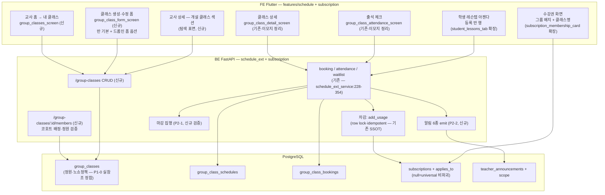
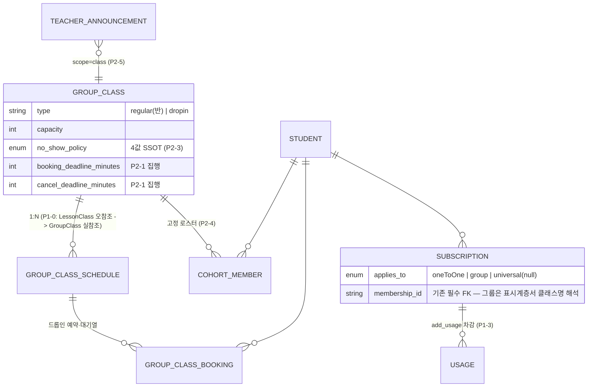

# group-lesson — 아키텍처 (Phase 3)

> spec: `.harness/spec/2026-07-31-group-lesson.md` (locked 2026-07-31)

## 1. 컴포넌트 아키텍처

## 2. 데이터 모델 (P1-0 배선 정합 후)

## 3. 핵심 불변식 (다이어그램이 강제하는 것)

- 차감 경로는 **`add_usage` 단 하나** — 그림에 두 번째 차감 화살표를 그리지 말 것
- `GroupClassSchedule` 의 부모는 **`GroupClass` 뿐** — `LessonClass` 화살표는 P1-0 에서 제거되는 대상
- 알림은 **BE emit 만** (FE 로컬 발화 화살표 금지 — #1191)
- 공지 엔티티는 `teacher_announcements` **1개** (ClassNote 박스 추가 금지)
