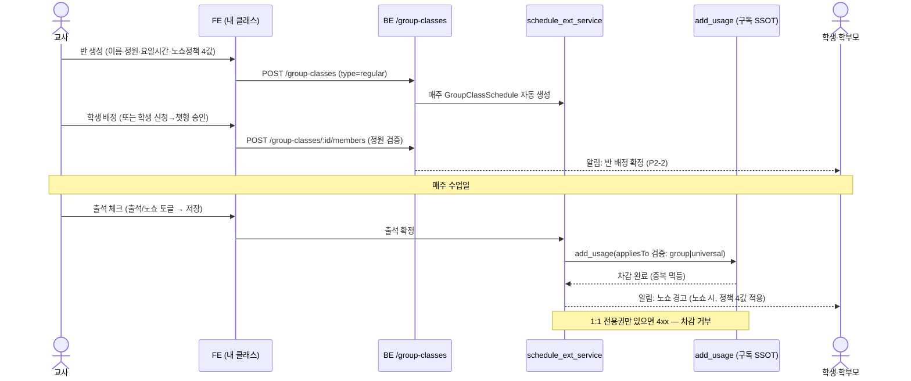
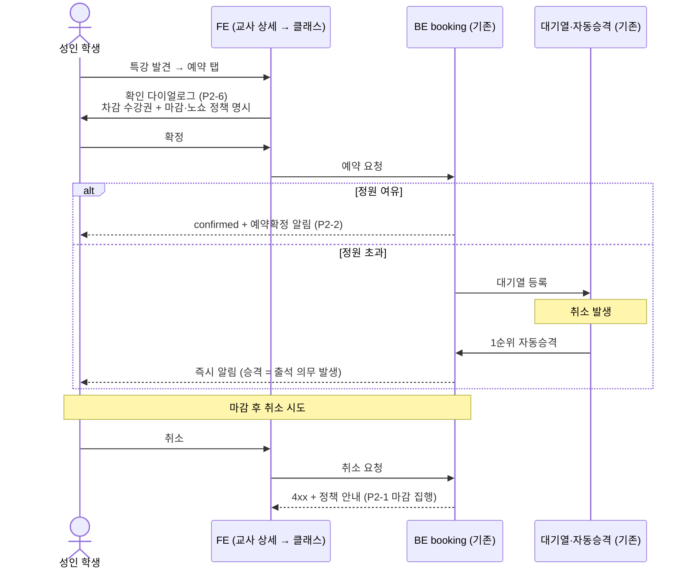
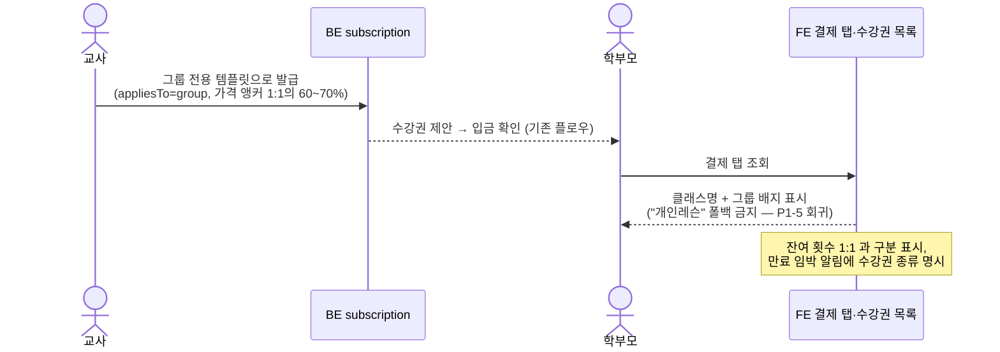
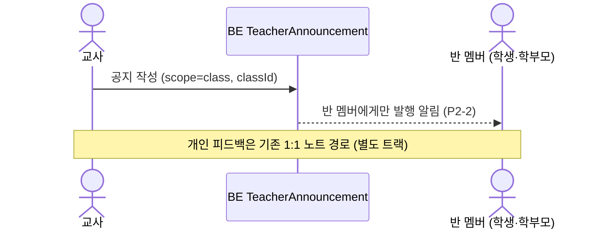
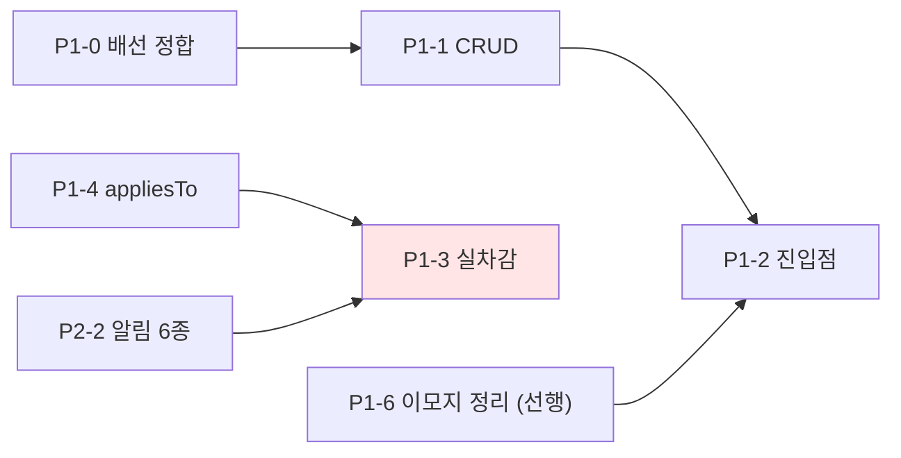

# group-lesson — 주요 시나리오 플로우 (Phase 3)

> spec: `.harness/spec/2026-07-31-group-lesson.md` §3 시나리오 1~4 대응

## 1. 코호트 반 운영 (시나리오 1·4)

## 2. 드롭인 즉시예약 + 대기열 (시나리오 3)

## 3. 그룹 수강권 발급·표시 (시나리오 2)

## 4. 반 공지 (P2-5)

## 릴리스 순서 제약 (spec §8)

> **P1-3 실차감은 P2-2 알림과 같은 릴리스 이전 배포 금지** — 알림 없는 자동승격 차감 방지.
