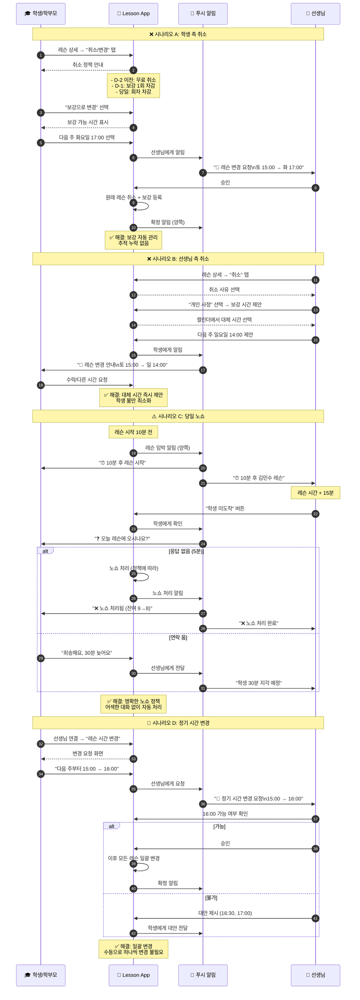

# 레슨 취소/변경 플로우

> 마지막 업데이트: 2026-02-06

레슨 취소, 보강, 노쇼, 정기 시간 변경 시나리오를 다룹니다.

👉 [전체 플로우 인덱스](flow_with_app.md)

---

## 시퀀스 다이어그램

---

## 개선 효과 비교

| 시나리오 | 앱 미사용 | 앱 사용 | 개선율 |
|----------|----------|--------|:------:|
| 학생 취소 | 메시지 핑퐁 | **1-2클릭** | 🔥 90% |
| 보강 관리 | 수동 추적 | **자동 관리** | 🔥 100% |
| 선생님 취소 | 어색한 알림 | **앱 자동 안내** | 🔥 100% |
| 노쇼 처리 | 즉흥 대응 | **정책 기반 자동** | 🔥 100% |
| 시간 변경 | 모든 일정 수동 | **일괄 변경** | 🔥 100% |
