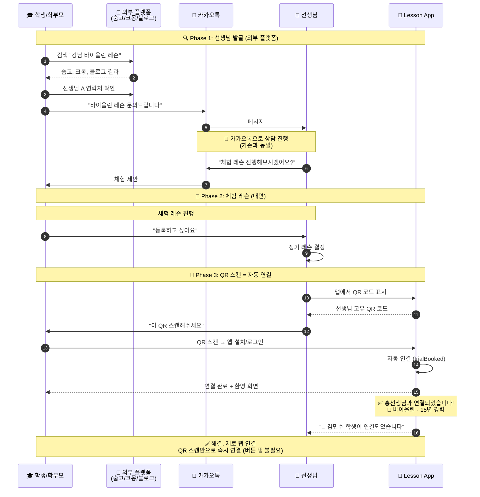
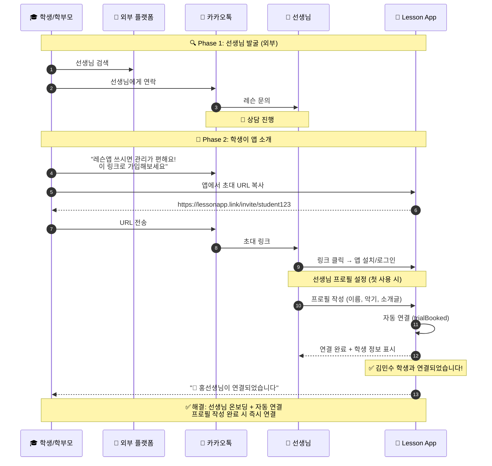
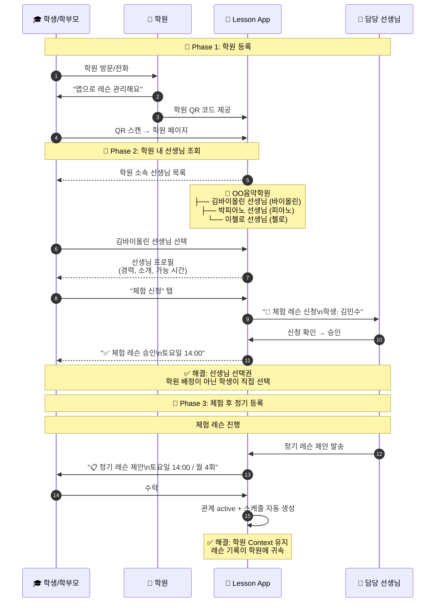
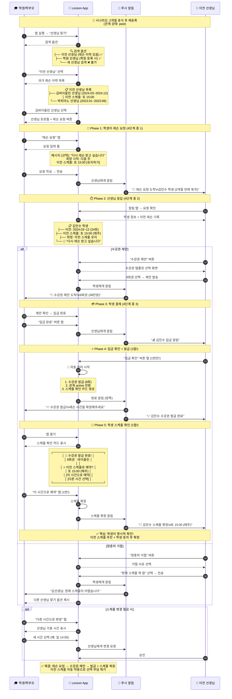
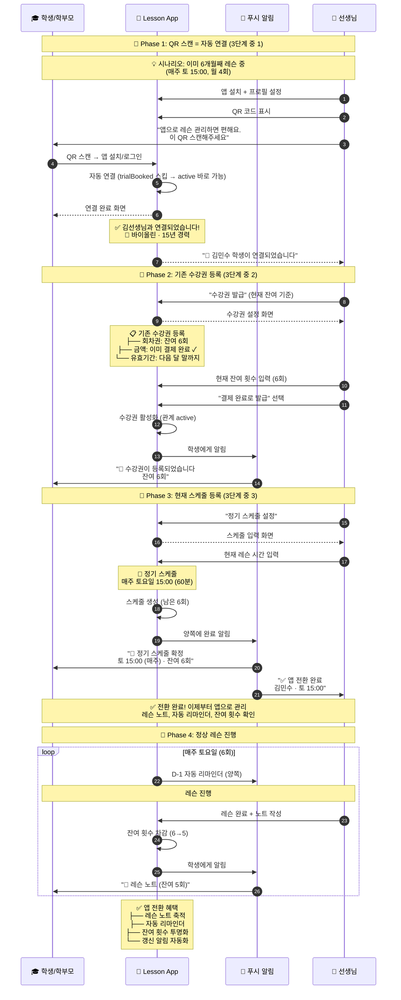

# 선생님-학생 연결 플로우

> 마지막 업데이트: 2026-02-06

선생님과 학생이 앱에서 연결되는 다양한 시나리오를 다룹니다.

👉 [전체 플로우 인덱스](flow_with_app.md)

---

## 목차

1. [개인 레슨: 선생님이 초대 (신규)](#1-개인-레슨-선생님이-초대-신규)
2. [개인 레슨: 학생이 초대 (역방향)](#2-개인-레슨-학생이-초대-역방향)
3. [학원 레슨](#3-학원-레슨)
4. [휴식 후 재등록 (past 상태)](#4-휴식-후-재등록-past-상태)
5. [기존 정기레슨 → 앱 전환](#5-기존-정기레슨--앱-전환)
6. [연결 방식 비교](#6-연결-방식-비교)

---

## 1. 개인 레슨: 선생님이 초대 (신규)

> **QR 스캔 = 자동 연결**: 추가 버튼 탭 없이 스캔 즉시 연결됩니다.



#### QR 연결 완료 화면 (학생 앱)

```
┌─────────────────────────────────────┐
│                                     │
│         ✅ 연결 완료!               │
│                                     │
│    ┌───────────────────────────┐    │
│    │        👤                 │    │
│    │    홍선생님               │    │
│    │  🎻 바이올린 · 15년 경력   │    │
│    └───────────────────────────┘    │
│                                     │
│    체험 레슨 후 수강권을 받으면     │
│    정기 레슨을 시작할 수 있어요     │
│                                     │
│         [프로필 보기]               │
│         [홈으로 가기]               │
│                                     │
│  ─ ─ ─ ─ ─ ─ ─ ─ ─ ─ ─ ─ ─ ─ ─    │
│  잘못 연결되었나요? [연결 해제]     │
│                                     │
└─────────────────────────────────────┘
```

#### 왜 자동 연결인가?

| 관점 | 이유 |
|------|------|
| **UX** | QR 스캔 자체가 명시적 동의, 추가 탭은 마찰 |
| **상황** | 체험 후 대면 상황에서 확인 단계는 과잉 |
| **선생님** | 어색한 대기 시간 없이 프로페셔널한 경험 |
| **학생** | "뭘 눌러야 하지?" 혼란 없이 간단명료 |

---

## 2. 개인 레슨: 학생이 초대 (역방향)

> **URL 클릭 = 자동 연결**: 선생님이 초대 링크로 가입하면 즉시 연결됩니다.



---

## 3. 학원 레슨



---

## 4. 휴식 후 재등록 (past 상태)

> ⚠️ **이전 선생님 재연결은 "레슨 요청" 버튼 사용** (신규 QR 자동 연결과 다름)
>
> 이전 선생님은 이미 체험을 했으므로, **수강권 제안 → 발급**까지 완결되는 플로우
>
> 상세: [lesson_request_system.md](../subscription/lesson_request_system.md)
>
> **📋 구현 현황**: 기본 플로우 구현 완료. 알림 연동 및 스케줄 자동 복원 작업 중.

#### 휴식 기간에 따른 관계 상태

| 휴식 기간 | 관계 상태 | 설명 | 재등록 방식 |
|----------|----------|------|------------|
| ~30일 | `expired` | 수강권 만료 유예 | 갱신 알림 → 간편 재등록 |
| **30일+** | `past` | 이전 학생 | **레슨 요청 필요** |

> **2개월 휴식 = `past` 상태** → 선생님이 스케줄 여유 확인 후 수강권 제안



#### 휴식 후 재등록 플로우 요약 (5단계)

| # | 주체 | 액션 | 앱 미사용 |
|:-:|:----:|------|----------|
| 1 | S | 레슨 요청 | 연락처 찾아서 카톡 |
| 2 | T | 수강권 제안 | 카톡으로 비용 안내 |
| 3 | S | 수락 + 입금 | 입금 |
| 4 | T | 입금 확인 → 수강권 발급 | 확인 |
| 5 | S | **스케줄 확인** (이전 시간 추천) | 스케줄 등록 |
| | **5단계** | | **4단계** |

> **핵심 개선**: 이전 스케줄 추천 + 학생 명시적 확인!

#### 이전 선생님 재연결: 왜 "레슨 요청"인가?

> ⚠️ **신규 QR 연결**과 다름: 이전 선생님은 체험이 이미 끝났으므로 수강권 제안이 필요
>
> **갱신 알림(expired)과 다름**: 30일+ 휴식 시 선생님 스케줄이 바뀌었을 수 있음

| 항목 | 설명 |
|------|------|
| **버튼** | "레슨 요청" (신규 QR과 달리 버튼 필요) |
| **이유** | 선생님이 스케줄 여유 확인 후 수강권 제안해야 함 |
| **학생 액션** | 희망 시작일, 이전 스케줄 유지 여부, 메시지 |
| **선생님 액션** | 수강권 제안 또는 정중히 거절 |
| **결과** | 수강권 발급 + **이전 스케줄 자동 복원** |

#### 갱신 vs 휴식 후 재등록 비교

| 구분 | 갱신 (expired) | 휴식 후 재등록 (past) |
|------|---------------|---------------------|
| 휴식 기간 | ~30일 | 30일+ |
| 시작 주체 | **시스템 자동** | **학생 요청** |
| 선생님 확인 | 불필요 | **필요** (스케줄 여유) |
| 스케줄 | 자동 유지 | **자동 복원** (변경 가능) |
| 단계 수 | 3단계 | **4단계** |

---

## 5. 기존 정기레슨 → 앱 전환

> ⚠️ **이미 정기레슨 진행 중인 경우**: 체험 없이 바로 수강권 발급

기존에 앱 없이 정기레슨을 진행하다가 앱으로 전환하는 경우입니다.
이미 선생님과 학생 간의 신뢰가 형성되어 있으므로 **체험 단계 없이** 바로 수강권 발급으로 진행합니다.

#### 앱 전환이 필요한 상황

| 상황 | 예시 |
|------|------|
| 선생님이 앱 도입 | "이제 레슨앱으로 관리할게요" |
| 학생이 앱 추천 | "이 앱 쓰면 잔여 횟수 확인 편해요" |
| 기록 관리 필요 | "레슨 노트를 남기고 싶어요" |

#### 앱 전환 vs 신규 등록 비교

| 구분 | 신규 등록 | 앱 전환 |
|------|----------|--------|
| 관계 | 처음 만남 | **이미 형성됨** |
| 체험 | 필요 | **불필요** |
| 스케줄 | 체험 시간 기준 | **현재 스케줄 입력** |
| 단계 수 | 5단계 | **3단계** |



#### 앱 전환 플로우 요약 (3단계)

| # | 주체 | 액션 | 설명 |
|:-:|:----:|------|------|
| 1 | S | QR 스캔 → 연결 | 자동 연결 |
| 2 | T | 수강권 등록 | 현재 잔여 횟수 입력 |
| 3 | T | 스케줄 등록 | 현재 레슨 시간 입력 |
| | **3단계** | | 체험 없이 바로 전환 |

> **핵심**: 이미 신뢰 관계 + 결제 완료 상태이므로 체험/결제 단계 스킵!

#### "결제 완료로 발급" 옵션

> 기존 정기레슨에서 이미 결제가 완료된 상태이므로, 입금 확인 단계 없이 바로 발급

```
┌─────────────────────────────────────┐
│ ← 수강권 발급                        │
├─────────────────────────────────────┤
│                                     │
│  학생: 김민수                        │
│  상태: 기존 정기레슨 전환             │
│                                     │
│  📋 수강권 정보                       │
│                                     │
│  ┌─────────────────────────────────┐│
│  │ 수강권 유형: 회차권               ││
│  │ 잔여 횟수: [  6  ] 회             ││  ← 현재 남은 횟수 입력
│  │ 유효기간: 2024-02-28까지         ││
│  └─────────────────────────────────┘│
│                                     │
│  💳 결제 상태                        │
│  ○ 결제 대기 (입금 확인 필요)        │
│  ● 결제 완료 (이미 결제됨) ✓         │  ← 기존 레슨은 이미 결제됨
│                                     │
│  [수강권 발급하기]                    │
└─────────────────────────────────────┘
```

#### 앱 전환 시 주의사항

| 항목 | 설명 |
|------|------|
| **잔여 횟수 정확히** | 현재 남은 횟수를 정확히 입력 (양측 혼란 방지) |
| **기존 스케줄 유지** | 갑자기 변경하지 않고 현재 시간 그대로 입력 |
| **레슨 노트 시작점** | 전환 시점부터 노트 축적 시작 (과거 기록은 없음) |
| **학생에게 안내** | "잔여 횟수 확인 가능해요" 등 앱 장점 설명 |

#### 앱 전환 vs 다른 시나리오 비교

| 시나리오 | 체험 | 결제 | 스케줄 | 단계 |
|----------|:----:|:----:|:------:|:----:|
| **신규 등록** | ✅ | ✅ | 체험 시간 자동 | 5 |
| **휴식 후 재등록** | ❌ | ✅ | 이전 스케줄 복원 | 4 |
| **앱 전환** | ❌ | ❌ (완료) | 현재 스케줄 입력 | **3** |
| **갱신** | ❌ | ✅ | 유지 | 3 |

---

## 6. 연결 방식 비교

| 구분 | 앱 미사용 | 앱 사용 | 개선 |
|------|----------|--------|------|
| **신규 선생님** | 외부 플랫폼 → 카톡 연락 | 외부 플랫폼 → **QR 스캔 = 자동 연결** | 제로 탭 연결 |
| **이전 선생님** | 연락처 찾기 → 다시 연락 | **앱에서 이력 검색 → 재연결** | 🔥 간편한 재연결 |
| **학원 레슨** | 전화 → 학원 배정 | 앱에서 **선생님 직접 선택** | 선택권 + 투명성 |
| **연결 관리** | 연락처로만 관리 | 앱에서 **관계 상태 확인** | 명확한 관계 |

#### QR/URL 연결 원칙

| 시나리오 | 연결 방식 | 이유 |
|----------|----------|------|
| **개인 선생님 QR** | 스캔 = 자동 연결 | 체험 후 대면 상황, 동의 명확 |
| **개인 선생님 URL** | 클릭 + 가입 = 자동 연결 | 카톡으로 이미 상담 완료 |
| **학원 QR** | 스캔 → 선생님 선택 → 체험 신청 | 선생님 미정, 선택 필요 |
