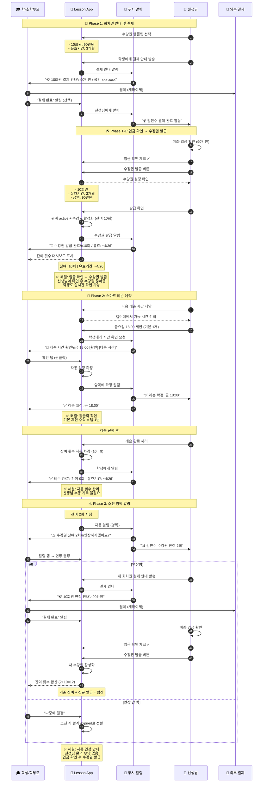

# 회차권 레슨 플로우

> 마지막 업데이트: 2026-02-06

회차권(N회권) 레슨의 결제, 예약, 소진, 연장 플로우입니다.

👉 [전체 플로우 인덱스](flow_with_app.md) | [결제 플로우](flow_payment.md)

---

## 시퀀스 다이어그램

---

## 개선 효과 비교

| 단계 | 앱 미사용 | 앱 사용 | 개선율 |
|------|----------|--------|:------:|
| 매 예약 | 3-5회 메시지 | **1-2회 탭** | 🔥 90% |
| 횟수 관리 | 수동 기록 | **자동 차감** | 🔥 100% |
| 잔여 안내 | 선생님이 알림 | **앱에서 확인** | 🔥 100% |
| 연장 안내 | 선생님이 문의 | **자동 알림** | 🔥 100% |

**10회권 총 메시지: 40-60회 → 10-15회**
