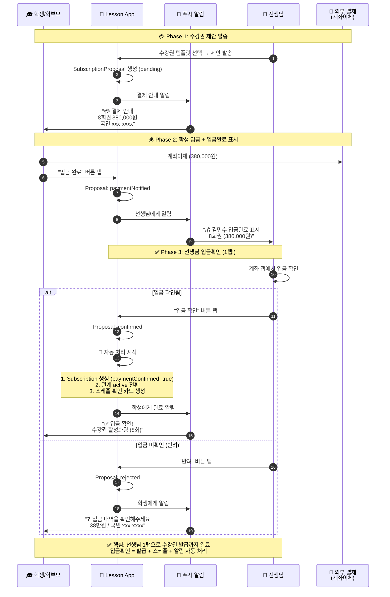
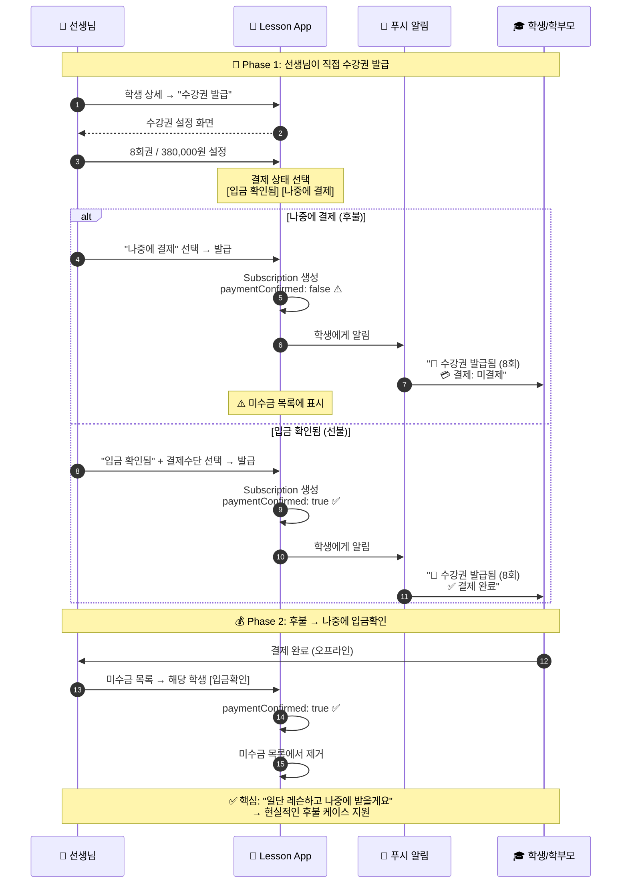

# 결제/미수금 관리 플로우

> 마지막 업데이트: 2026-02-06
>
> **변경**: Payment → Subscription 통합 ([세션 로그](../../session/2026-02-06_payment_redesign.md))

결제 상태 관리, 2단계 입금확인, 미수금 처리 플로우입니다.

👉 [전체 플로우 인덱스](flow_with_app.md) | [결제 시스템 스펙](../payment/payment_unified_spec.md)

---

## 목차

1. [결제 상태 모델](#1-결제-상태-모델)
2. [2단계 입금확인 플로우 (선불)](#2-2단계-입금확인-플로우-선불)
3. [후불 발급 플로우](#3-후불-발급-플로우)
4. [미수금 관리 플로우 (선생님)](#4-미수금-관리-플로우-선생님)
5. [개선 효과 비교](#5-개선-효과-비교)

---

## 1. 결제 상태 모델

### Subscription 기반 결제 상태

결제 정보는 `Subscription` 엔티티에 직접 포함됩니다.

```mermaid
stateDiagram-v2
    [*] --> 선불_결제확인후_발급 : SubscriptionProposal 경로
    [*] --> 후불_발급먼저 : 직접 발급 경로

    state 선불_결제확인후_발급 {
        제안 --> 입금대기 : 학생 수락
        입금대기 --> 입금완료 : 학생 입금 + "입금완료" 탭
        입금완료 --> 발급완료 : 선생님 "입금확인" 탭
        Note right of 발급완료: paymentConfirmed: true
    }

    state 후불_발급먼저 {
        직접발급 --> 미수금 : "나중에 결제" 선택
        직접발급 --> 결제완료 : "입금 확인됨" 선택
        미수금 --> 결제완료 : 나중에 입금확인
        Note right of 미수금: paymentConfirmed: false
        Note right of 결제완료: paymentConfirmed: true
    }
```

### 핵심 변경사항 (2026-02-06)

| 이전 (레거시) | 이후 (통합) |
|-------------|-----------|
| `Payment` 엔티티 별도 관리 | **`Subscription.paymentConfirmed`** |
| `PaymentStatus` 6개 상태 | **`bool paymentConfirmed`** |
| `UnpaidPolicy` (미구현) | **삭제** (선생님 직접 관리) |
| D+3/5/7 자동 리마인더 (미구현) | **삭제** (푸시 알림 미구현) |
| overdue 자동 전환 (미구현) | **삭제** (백엔드 없음) |

### 미수금 판별

```dart
// 미수금 = 활성 수강권 중 미결제
bool get isUnpaid => status == SubscriptionStatus.active && !paymentConfirmed;
```

---

## 2. 2단계 입금확인 플로우 (선불)

### 2.1 시퀀스 다이어그램



### 2.2 입금확인 플로우 요약

| # | 주체 | 액션 | 앱 미사용 |
|:-:|:----:|------|----------|
| 1 | 시스템 | 제안 발송 + 결제 안내 | 카톡으로 계좌 전달 |
| 2 | 학생 | 계좌이체 → "입금 완료" 탭 | 이체 → 카톡 "입금했어요" |
| 3 | 선생님 | "입금 확인" 탭 (1번!) | 확인 → 카톡 "확인했어요" |
| | | → 수강권 발급 + 스케줄 자동 | → 수강권/스케줄 수동 처리 |

---

## 3. 후불 발급 플로우

### 3.1 시퀀스 다이어그램



### 3.2 선불 vs 후불 비교

| 구분 | 선불 (Proposal 경로) | 후불 (직접 발급) |
|------|:------------------:|:---------------:|
| 결제 시점 | 발급 전 | 발급 후 |
| 미수금 가능 | X | O |
| `paymentConfirmed` | 항상 true | false → true |
| 사용 사례 | 신규 학생, 체험 후 등록 | 기존 학생 연장, 신뢰 관계 |

---

## 4. 미수금 관리 플로우 (선생님)

### 4.1 미수금 대시보드

```
┌─────────────────────────────────────┐
│ ← 미수금 관리                        │
├─────────────────────────────────────┤
│                                     │
│  💰 총 미수금                        │
│  ┌─────────────────────────────────┐│
│  │       200,000원                 ││
│  │       1건 · 학생 1명             ││
│  └─────────────────────────────────┘│
│                                     │
│  ─── 미결제 수강권 ───────────────── │
│                                     │
│  ┌─────────────────────────────────┐│
│  │ ⚠️ 이서연                       ││
│  │ 4회권 · 200,000원               ││
│  │ 발급일: 2026-01-30 (후불)        ││
│  │                                 ││
│  │ [입금확인]      [알림 보내기]    ││
│  └─────────────────────────────────┘│
│                                     │
└─────────────────────────────────────┘
```

### 4.2 미수금 데이터 소스

```dart
// Subscription 기반 미수금 조회
final unpaid = subscriptions.where((s) => s.isUnpaid).toList();

// 미수금 총액
final totalAmount = unpaid.fold(0, (sum, s) => sum + s.amount);

// 미수금 학생 수
final studentCount = unpaid.map((s) => s.studentId).toSet().length;
```

### 4.3 입금확인 처리

```dart
// 선생님이 입금확인 탭
await repository.confirmPayment(
  subscriptionId,
  paymentMethod: SubscriptionPaymentMethod.bankTransfer,
);
// → paymentConfirmed: true
// → paidAt: now
// → paymentConfirmedAt: now
```

---

## 5. 개선 효과 비교

| 항목 | 앱 미사용 | 앱 사용 | 개선율 |
|------|----------|--------|:------:|
| **결제 요청** | 카톡으로 직접 연락 | **앱 자동 알림** | 🔥 100% |
| **입금 확인** | 선생님 직접 확인 | **선생님 직접 확인 (동일)** | - |
| **미수금 파악** | 수기 기록 / 기억 | **대시보드에서 한눈에** | 🔥 100% |
| **수강권 발급** | 구두/메모 | **입금확인 1탭으로 자동** | 🔥 90% |
| **잔여 횟수** | 선생님만 기억 | **학생도 실시간 확인** | 🔥 100% |
| **결제 기록** | 없음 | **앱에 이력 저장** | 🔥 100% |
| **후불 관리** | 기억에 의존 | **미수금 목록 자동 표시** | 🔥 100% |

---

## 관련 문서

| 문서 | 설명 |
|------|------|
| [payment_unified_spec.md](../payment/payment_unified_spec.md) | 결제 시스템 통합 스펙 |
| [payment.md](../../schema/entities/payment.md) | Payment 엔티티 (레거시) |
| [subscription.md](../../schema/entities/subscription.md) | Subscription 엔티티 (결제 필드 포함) |
| [flow_regular.md](flow_regular.md) | 정기 레슨 등록 (결제 포함) |
| [flow_package.md](flow_package.md) | 회차권 레슨 (결제 포함) |
| [2026-02-06_payment_redesign.md](../../session/2026-02-06_payment_redesign.md) | Payment→Subscription 통합 세션 로그 |
