# 정기 레슨 등록 플로우

> 마지막 업데이트: 2026-02-06

체험 레슨 후 정기 레슨으로 전환하는 플로우입니다.
수강권 제안 → 결제 → 수강권 발급 → 스케줄 선택 순서로 진행합니다.

👉 [전체 플로우 인덱스](flow_with_app.md) | [결제 플로우](flow_payment.md)

---

## 목차

1. [핵심 순서](#1-핵심-순서)
2. [시퀀스 다이어그램](#2-시퀀스-다이어그램)
3. [플로우 요약](#3-플로우-요약)
4. [앱 사용 vs 미사용 비교](#4-앱-사용-vs-미사용-비교)
5. [자동 스케줄 로직](#5-자동-스케줄-로직)
6. [수강권 제안 UI](#6-수강권-제안-ui)
7. [결제 관련 비교](#7-결제-관련-비교)
8. [개선 효과 비교](#8-개선-효과-비교)

---

## 1. 핵심 순서

> **핵심 순서**: 수강권 제안 → 결제 → 수강권 발급 → **그 후** 스케줄 선택
>
> 수강권이 없으면 레슨 예약이 무의미하므로, 스케줄 선택은 수강권 발급 **후**에 진행합니다.

---

## 2. 시퀀스 다이어그램

```mermaid
sequenceDiagram
    autonumber
    participant S as 🎓 학생/학부모
    participant App as 📱 Lesson App
    participant Push as 🔔 푸시 알림
    participant T as 🎻 선생님
    participant Bank as 🏦 외부 결제<br/>(계좌이체)

    Note over S,Bank: ✅ Phase 1: 수강권 제안 (체험 후)

    T->>App: 체험 레슨 완료 처리

    alt 자동 제안 설정 ON
        App->>App: 자동 제안 트리거
        App-->>S: 수강권 제안 자동 발송 (골든타임 할인 적용)
    else 수동 제안
        App-->>T: "정기 레슨으로 전환하시겠습니까?"
        T->>App: "수강권 제안" 버튼
        App-->>T: 수강권 템플릿 선택 화면

        Note over T,App: 📋 수강권 템플릿 선택 (체크박스)

        T->>App: 템플릿 선택 (복수 가능)
        Note over App: ☑ 4회 정기권 (20만원)<br/>☑ 8회 정기권 (38만원) ⭐추천<br/>☐ 16회 정기권 (70만원)

        T->>App: 추천 템플릿 지정 + 메시지 작성
        T->>App: 제안 발송
    end

    App->>Push: 학생에게 제안 알림
    Push->>S: "🎫 수강권 제안\n선생님이 수강권을 제안했어요"

    Note over S,Bank: 💳 Phase 2: 학생 템플릿 선택 + 결제

    S->>App: 제안 확인
    App-->>S: 수강권 옵션 표시 (라디오 버튼)

    Note over S,App: 📋 수강권 선택 (1개만)<br/>○ 4회 정기권 (20만원)<br/>● 8회 정기권 (38만원) ⭐추천<br/>○ 16회 정기권 (70만원)

    S->>App: 템플릿 선택 (8회권)
    App-->>S: 결제 정보 표시
    Note over App: 💳 결제 안내<br/>38만원 / 국민 xxx-xxxx

    S->>Bank: 계좌이체 (38만원)

    Note over S,Bank: 🔄 결제는 외부에서 처리<br/>(계좌이체, 현금 등)

    S->>App: "입금 완료" 버튼 탭

    App->>Push: 선생님에게 알림
    Push->>T: "💰 김민수 입금 알림\n8회 정기권 (38만원)"

    Note over T,App: 💳 Phase 3: 입금 확인 = 발급 + 스케줄 (1탭 완료!)

    T->>T: 계좌 입금 확인 (38만원)
    T->>App: "입금 확인" 버튼 탭 (1번만!)

    App->>App: 🔄 자동 처리 시작
    Note over App: 1. 수강권 발급<br/>2. 관계 active 전환<br/>3. 스케줄 확인 카드 생성

    App->>Push: 학생에게 완료 알림
    Push->>S: "🎫 수강권 발급!\n레슨 시간을 확정해주세요"

    App->>Push: 선생님에게 확정 알림
    Push->>T: "✅ 김민수 수강권 발급 완료"

    Note over S,T: 📅 Phase 4: 학생 스케줄 확인 (1탭!)

    S->>App: 앱 열기
    App-->>S: 스케줄 확인 카드 표시

    Note over App: ┌───────────────────────┐<br/>│ 🎉 수강권 발급 완료!   │<br/>│ 8회권 · 바이올린      │<br/>│                       │<br/>│ ⭐ 체험 시간으로 예약? │<br/>│ 토 15:00 (매주)       │<br/>│ [이 시간으로 예약]    │<br/>│ [다른 시간 선택]      │<br/>└───────────────────────┘

    alt 추천 시간 수락
        S->>App: "이 시간으로 예약" 탭 (1번!)
        App->>App: 스케줄 확정 (토 15:00 × 8회)
    else 다른 시간 선택
        S->>App: "다른 시간 선택" 탭
        App-->>S: 선생님 가용 시간 표시
        S->>App: 새 시간 선택
    end

    App->>Push: 양쪽에 스케줄 확정 알림
    Push->>S: "📅 스케줄 확정!\n토 15:00 (매주)"
    Push->>T: "📅 김민수 스케줄 확정\n토 15:00 (매주)"

    App-->>S: 대시보드 업데이트
    Note over App: 잔여: 8회 | 다음 레슨: 토 15:00

    Note over S,T: ✅ 핵심: 학생이 명시적 확인!<br/>자동이 아닌 학생 동의 후 스케줄 확정

    Note over S,Bank: 🎻 Phase 5: 정기 레슨 진행

    loop 매주 토요일 (8회)
        App->>Push: D-1 자동 리마인더 (양쪽)
        Push->>S: "📅 내일 15:00 레슨"
        Push->>T: "📅 내일 15:00 김민수"

        Note over T,S: 레슨 진행

        T->>App: 레슨 완료 → 레슨 노트 작성
        App->>App: 잔여 횟수 차감 (8→7)

        App->>Push: 학생에게 노트 공유
        Push->>S: "📝 레슨 노트 (잔여 7회)"
    end

    Note over App: ✅ 해결: 체계적 기록<br/>레슨 이력 자동 관리

    Note over S,Bank: 🔄 Phase 6: 소진 임박 → 갱신

    Note over App: 잔여 2회 시점

    App->>Push: 갱신 안내 (시스템 자동)
    Push->>S: "⚠️ 수강권 잔여 2회\n갱신하시겠어요?"
    Push->>T: "📊 김민수 수강권 잔여 2회 (정보성)"

    alt 갱신함 (3단계로 간소화!)
        S->>App: 갱신하기 → 이전과 동일 템플릿 자동 선택
        App-->>S: "지난번과 동일 (8회 38만원)"
        S->>App: 확인 → 입금
        S->>Bank: 계좌이체
        S->>App: "입금 완료"
        T->>App: "입금 확인" 버튼 탭 (1번만!)

        App->>App: 🔄 자동 처리
        Note over App: 1. 수강권 발급 (횟수 합산: 2+8=10)<br/>2. 스케줄 유지 (이전과 동일: 토 15:00)

        App->>Push: 완료 알림 (양쪽)
        Push->>S: "🎫 갱신 완료! 잔여 10회\n스케줄 유지: 토 15:00"
        Push->>T: "✅ 김민수 갱신 완료 (10회)"

        Note over S,T: ✅ 핵심 개선: 스케줄 선택 불필요!<br/>이전 스케줄 자동 유지
    else 갱신 안 함
        S->>App: "나중에 결정"
        App->>App: 소진 시 관계 expired로 전환
    end

    Note over App: ✅ 해결: 시스템 주도 갱신 + 자동 스케줄<br/>선생님 문의 부담 없음, 학생 선택 부담 없음
```



---

## 3. 플로우 요약 (간소화 버전!)

```
체험 완료
    ↓
┌─────────────────────────────────────────────────────────┐
│ Phase 1: 수강권 제안 (자동 또는 수동)                     │
│   → 자동 제안 ON: 시스템이 자동 발송 (선생님 액션 없음)    │
│   → 수동 제안: 선생님이 템플릿 선택 후 발송                │
└─────────────────────────────────────────────────────────┘
    ↓
┌─────────────────────────────────────────────────────────┐
│ Phase 2: 학생 응답 + 결제                                │
│   학생: 템플릿 선택 → 계좌이체 → "입금 완료"              │
└─────────────────────────────────────────────────────────┘
    ↓
┌─────────────────────────────────────────────────────────┐
│ ⭐ Phase 3: 입금 확인 = 발급 + 스케줄 (1탭 완료!)        │
│   선생님: "입금 확인" 버튼 1번만 탭                       │
│   → 자동: 수강권 발급                                    │
│   → 자동: 관계 상태 active                               │
│   → 자동: 스케줄 생성 (체험 시간 기준)                    │
│   → 자동: 양쪽에 완료 알림                               │
└─────────────────────────────────────────────────────────┘
    ↓
레슨 진행 (잔여 횟수 차감)
    ↓
┌─────────────────────────────────────────────────────────┐
│ ⭐ 재등록: 3단계로 간소화!                               │
│   1. 시스템: 자동 갱신 제안 (잔여 2회 시)                 │
│   2. 학생: 수락 + 입금                                   │
│   3. 선생님: 입금 확인 (발급 + 스케줄 유지 자동!)         │
└─────────────────────────────────────────────────────────┘
```

---

## 4. 앱 사용 vs 미사용 비교

| 시나리오 | 앱 미사용 | 앱 사용 | 차이 |
|----------|:--------:|:------:|:----:|
| **신규 등록** | 5단계 | **5단계** | 동일 |
| **재등록** | 2-3단계 | **3단계** | 동일 |

> **핵심**: 앱을 써도 단계 수는 동일하면서, **자동화 혜택**을 받음
> - 자동 리마인더
> - 자동 스케줄 생성
> - 잔여 횟수 자동 관리
> - 레슨 기록 자동 축적

---

## 5. 자동 스케줄 로직

> **핵심**: 스케줄은 **자동 생성**, 필요 시만 변경

#### 신규 학생

```
체험 레슨 시간 → 정기 레슨 시간 (자동)

예시:
- 체험: 토요일 15:00
- 정기: 토요일 15:00 (매주) × 8회 자동 생성
```

#### 재등록 학생

```
이전 정기 레슨 시간 → 갱신 후 스케줄 (유지)

예시:
- 이전: 토요일 15:00 (매주)
- 갱신: 토요일 15:00 (매주) 유지
```

#### 스케줄 변경이 필요한 경우

> 학생이 "다른 시간 선택" 버튼 탭 시에만 표시

```
┌─────────────────────────────────────┐
│ 📅 레슨 스케줄                       │
├─────────────────────────────────────┤
│                                     │
│  ✅ 체험과 동일 시간으로 등록         │
│     토요일 15:00 (매주)              │
│                                     │
│  ─────────────────────────────      │
│                                     │
│  [다른 시간 선택하기]                 │  ← 필요한 경우만
│                                     │
└─────────────────────────────────────┘
```

#### 학생용 시간 선택 UI (변경 시)

> **전제 조건**: 학생이 "다른 시간 선택" 탭한 경우에만 표시
>
> **상세 스펙**:
> - [teacher_availability_spec.md](../schedule/teacher_availability_spec.md) 섹션 8 - 시간 선택 UI
> - [subscription_proposal_spec.md](../subscription/subscription_proposal_spec.md) - 수강권 제안 시스템

```
┌─────────────────────────────────────┐
│  ◀  2/18(화)  ▶                     │
├─────────────────────────────────────┤
│                                     │
│  예약 가능한 시간                    │
│                                     │
│  ┌────────┐  ┌────────────┐        │
│  │ 15:00  │  │ ⭐ 16:00   │        │  ← 평소 시간 추천
│  └────────┘  └────────────┘        │
│  ┌────────┐                        │
│  │ 17:00  │                        │
│  └────────┘                        │
│                                     │
│  🎻 16:00 (60분)                    │
│  김선생님 · 수강권 5/8회             │  ← 잔여 횟수 표시
│                                     │
│  [예약하기]                          │
└─────────────────────────────────────┘
```

**핵심 원칙:**

| 원칙 | 설명 |
|------|------|
| 수강권 필수 | 수강권 없으면 예약 버튼 비활성화 |
| 단일 뷰 | 칩 버튼만 사용 (토글 뷰 제거) |
| 가용 시간만 | 예약 불가 시간은 숨김 |
| ⭐ 스마트 추천 | 평소 레슨 시간 하이라이트 |
| 빈 상태 대응 | 가용 시간 없으면 대안 날짜 제안 |

---

## 6. 수강권 제안 UI

> **상세 스펙**: [subscription_proposal_spec.md](../subscription/subscription_proposal_spec.md) 참조

#### 선생님 앱 (템플릿 체크박스로 복수 선택)

```
┌─────────────────────────────────────┐
│ ← 수강권 제안                        │
├─────────────────────────────────────┤
│                                     │
│  학생: 김서연                        │
│                                     │
│  📋 제안할 수강권 선택 (복수 가능)     │
│                                     │
│  ┌─────────────────────────────────┐│
│  │ ☑ 바이올린 4회권         ⭐추천 ││
│  │    200,000원                     ││
│  └─────────────────────────────────┘│
│                                     │
│  ┌─────────────────────────────────┐│
│  │ ☑ 바이올린 8회권                 ││
│  │    380,000원                     ││
│  └─────────────────────────────────┘│
│                                     │
│  ┌─────────────────────────────────┐│
│  │ ☐ 바이올린 16회권                ││
│  │    700,000원                     ││
│  └─────────────────────────────────┘│
│                                     │
│  2개 선택됨 (학생이 1개 선택)         │
│                                     │
│  [2개 수강권 제안 보내기]             │
└─────────────────────────────────────┘
```

#### 학생 앱 (라디오 버튼으로 1개만 선택)

```
┌─────────────────────────────────────┐
│ ← 수강권 제안                        │
├─────────────────────────────────────┤
│                                     │
│  🎫 수강권 2개 중 선택                │
│  선생님 제안                         │
│                                     │
│  ┌─────────────────────────────────┐│
│  │ ● 바이올린 4회권         ⭐추천 ││
│  │    200,000원                     ││
│  └─────────────────────────────────┘│
│                                     │
│  ┌─────────────────────────────────┐│
│  │ ○ 바이올린 8회권                 ││
│  │    380,000원                     ││
│  └─────────────────────────────────┘│
│                                     │
│  💳 결제 정보                        │
│  국민은행 123-456-789012            │
│  예금주: 김선생                      │
│                                     │
│  [입금 완료했어요]                    │
└─────────────────────────────────────┘
```

---

## 7. 결제 관련 비교

| 항목 | 앱 미사용 | 앱 사용 | 차이 |
|------|----------|--------|------|
| **결제 방식** | 계좌이체 | **계좌이체 (동일)** | - |
| **입금 확인** | 선생님 직접 확인 | **선생님 직접 확인 (동일)** | - |
| **수강권 발급** | 구두/메모 | **앱에서 발급 → 학생 확인** | ✅ 개선 |
| **미수금 관리** | 수기 기록 | **앱에서 미수금 목록 관리** | ✅ 개선 |
| **잔여 횟수** | 선생님만 기억 | **학생도 실시간 확인** | ✅ 개선 |
| **결제 요청** | 카톡으로 직접 | **앱 자동 알림** | ✅ 개선 |
| **독촉** | 어색한 개인 연락 | **앱 자동 리마인더** | ✅ 개선 |
| **결제 기록** | 없음 | **앱에 이력 저장** | ✅ 개선 |

👉 결제/미수금 상세: [flow_payment.md](flow_payment.md)

---

## 8. 개선 효과 비교

| 단계 | 앱 미사용 | 앱 사용 | 개선율 |
|------|----------|--------|:------:|
| 조건 협의 | 메시지 왕복 | **앱 내 제안/수락** | 🔥 90% |
| 계약 | 구두 약속 | **명시적 기록** | 🔥 100% |
| 스케줄 등록 | 매월 수동 | **자동 생성** | 🔥 100% |
| 리마인더 | 수동 발송 | **자동 푸시** | 🔥 100% |
| 레슨 기록 | 수기/엑셀 | **인앱 노트** | 🔥 90% |
| 결제 요청 | 직접 연락 | **자동 알림** | 🔥 100% |
| 입금 확인 | 수동 | **수동 (변동 없음)** | - |
| 수강권 발급 | 구두/메모 | **앱 발급 → 학생 확인** | 🔥 90% |
| 잔여 횟수 확인 | 선생님에게 문의 | **학생 실시간 확인** | 🔥 100% |

**선생님 월간 관리 시간: 4-6시간 → 1시간 미만**
