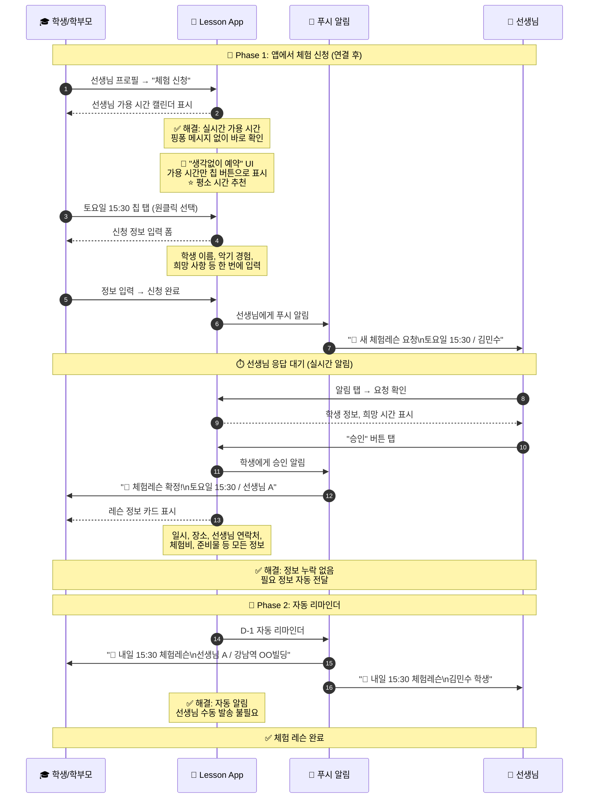

# 체험 레슨 예약 플로우

> 마지막 업데이트: 2026-02-06

선생님-학생 연결 후 체험 레슨을 예약하는 플로우입니다.

👉 [전체 플로우 인덱스](flow_with_app.md)

---

## 시퀀스 다이어그램

---

## 개선 효과 비교

| 단계 | 앱 미사용 | 앱 사용 | 개선율 |
|------|----------|--------|:------:|
| 일정 조율 | 5-10회 메시지 | **1클릭 선택** | 🔥 95% |
| 정보 교환 | 여러 번 왕복 | **자동 전달** | 🔥 100% |
| 리마인더 | 수동 | **자동 푸시** | 🔥 100% |
