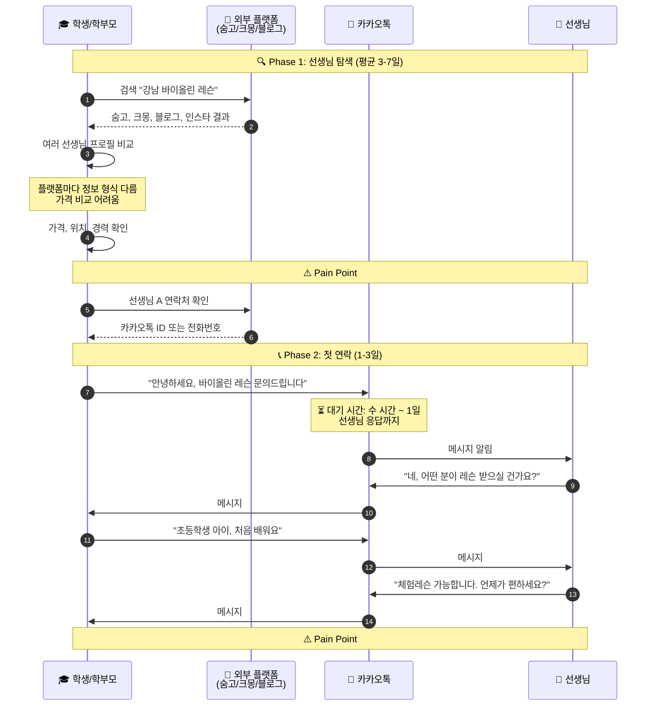
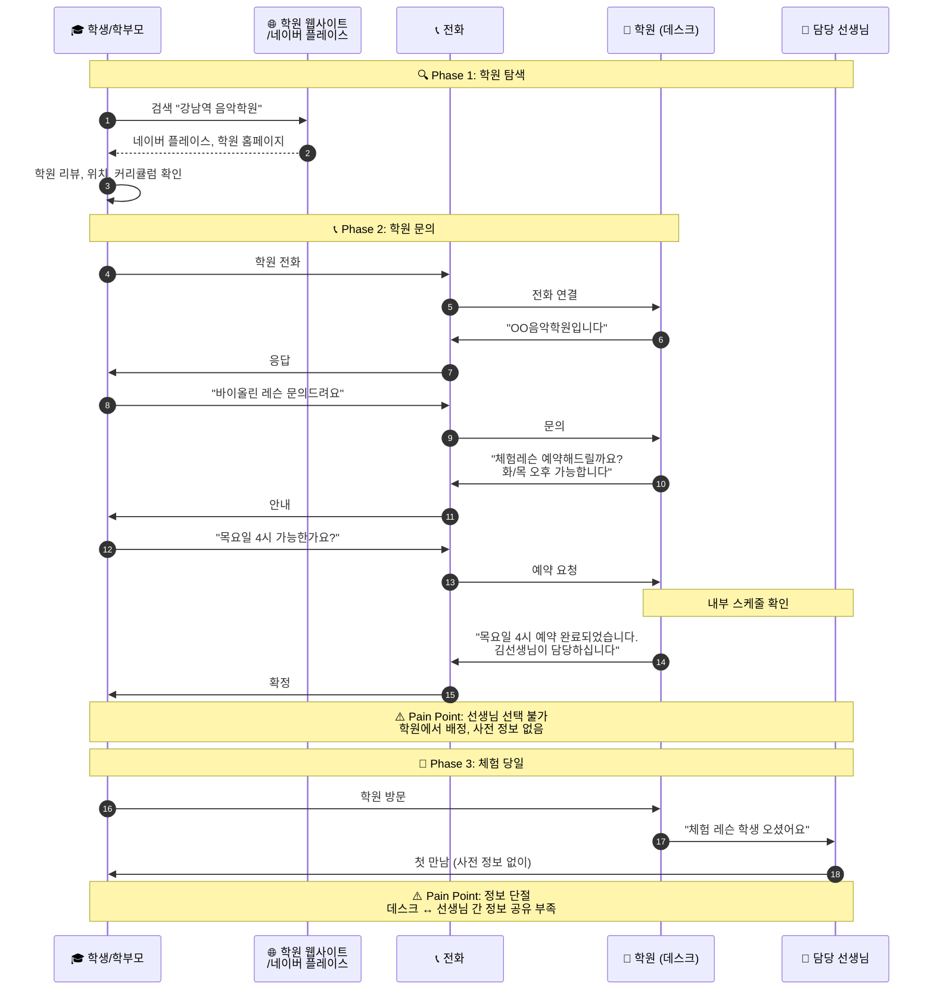
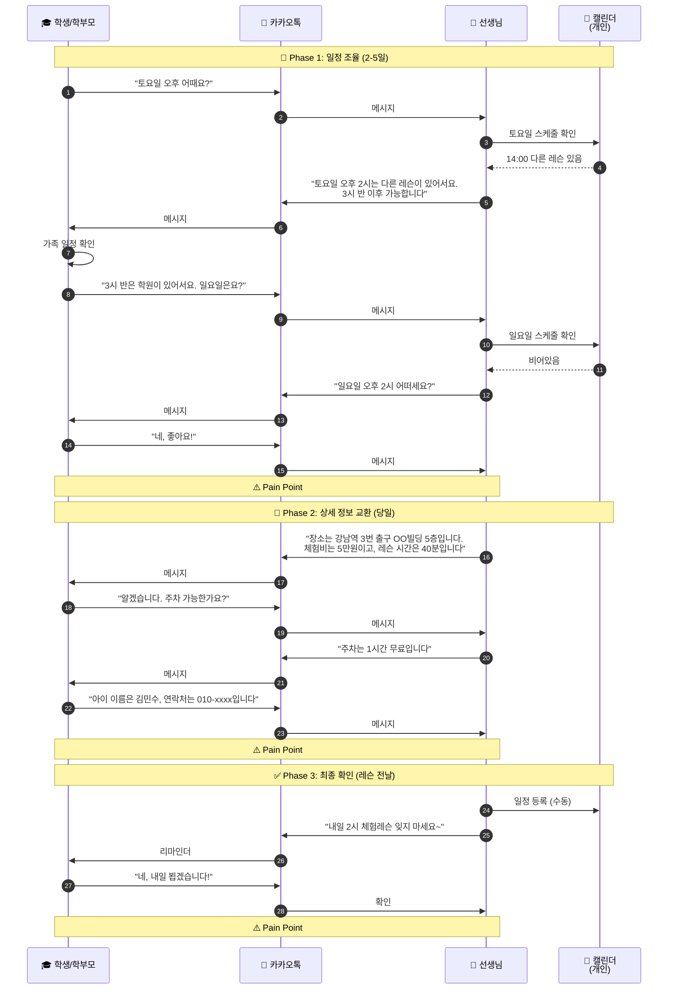
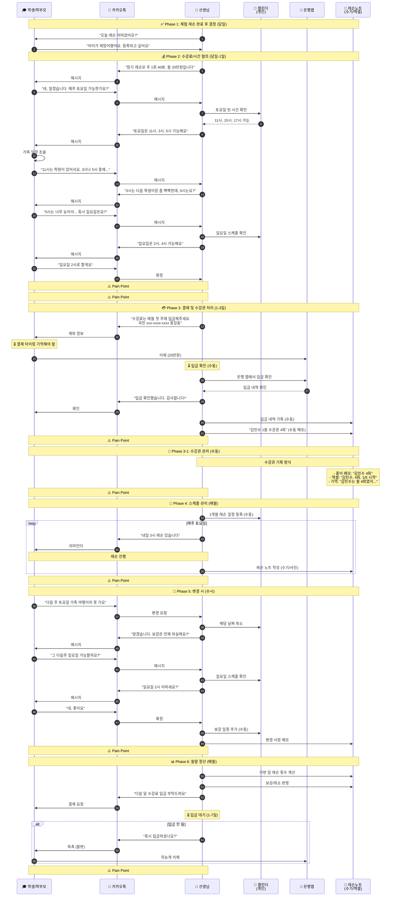
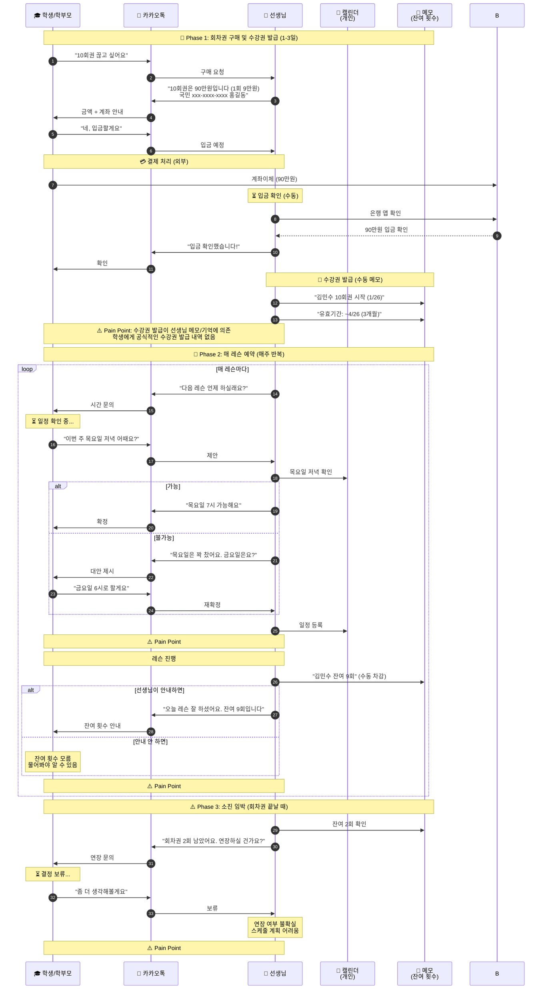
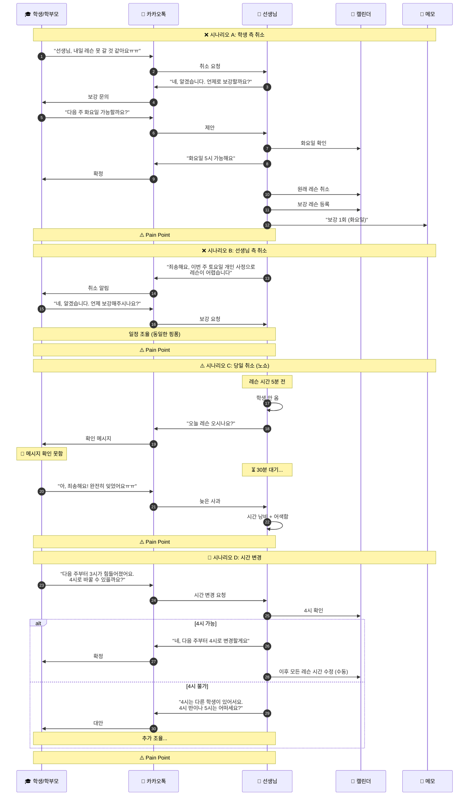

# 레슨 스케줄 플로우 (앱 미사용)

> 마지막 업데이트: 2026-01-27

실제 강사-학생 간 레슨 스케줄을 잡는 현실적인 플로우입니다.
앱 없이 카카오톡, 전화, 문자 등을 사용하는 일반적인 상황을 다룹니다.

---

## 1. 선생님 발굴 및 첫 연락 플로우

### 1.1 개인 레슨 - 시퀀스 다이어그램



### 1.2 학원 레슨 - 시퀀스 다이어그램



### 1.3 Pain Points 요약

| 구분 | 개인 레슨 | 학원 레슨 |
|------|----------|----------|
| 탐색 | 플랫폼마다 정보 분산 | 학원 정보만 있음 (선생님 정보 부족) |
| 연락 | 응답 대기 시간 길음 | 전화 연결 필요 |
| 선택 | 선생님 직접 선택 | 학원에서 배정 (선택 불가) |
| 정보 | 메시지로 산발적 교환 | 데스크 ↔ 선생님 정보 단절 |

---

## 2. 체험 레슨 예약 플로우

### 2.1 시퀀스 다이어그램



### 2.2 Pain Points 요약

| 단계 | 문제점 | 영향 |
|------|--------|------|
| 탐색 | 정보 파편화 | 3-7일 소요, 비교 어려움 |
| 첫 연락 | 응답 대기 | 수 시간 ~ 1일 |
| **일정 조율** | **단일 제안 핑퐁** | **5-10회 왕복, 2-5일** |
| 정보 교환 | 누락/반복 | 필수 정보 여러 번 요청 |
| 리마인더 | 수동 알림 | 선생님 부담, 노쇼 위험 |

> 💡 **다중 옵션 없이 단일 제안 반복**: "토요일 2시요?" → "안돼요" → "그럼 3시요?" → "그것도..." → 반복
>
> 🎯 **앱 해결책**: 선생님이 가용 시간 오픈 → 학생이 원하는 시간 선택 → 즉시 예약 (조율 0회)

**총 소요 시간: 평균 7-14일** → 앱 사용 시: **즉시 (탭 1회)**

---

## 3. 정기 레슨 등록 플로우

### 3.1 시퀀스 다이어그램



### 3.2 Pain Points 요약

| 단계 | 문제점 | 영향 |
|------|--------|------|
| **일정 조율** | **단일 제안 핑퐁** | **5-8회 메시지 왕복, 2-3일 소요** |
| 계약 | 구두 약속만 | 분쟁 시 증거 없음 |
| 결제 | 수동 입금 확인 | 선생님 매번 은행 앱 확인 필요 |
| **수강권 발급** | **수동 메모/기억** | **학생에게 공식 내역 없음** |
| **잔여 횟수** | **선생님만 알고 있음** | **학생은 물어봐야 함** |
| 스케줄 | 수동 등록 | 매월 반복 작업 |
| 리마인더 | 수동 알림 | 선생님 부담 |
| 변경 | 추적 어려움 | 보강/취소 내역 혼란 |
| 정산 | 어색한 독촉 | 관계 부담 |

> 💡 **다중 옵션 부재**: 선생님이 "토요일 11시, 3시, 5시 가능해요" → 학생 "3시는 안되고..." → 재조율 반복
>
> 🎯 **앱 해결책**: 선생님이 시간대 미리 오픈 → 학생이 칩 버튼으로 선택 → 메시지 0회

**선생님 월간 관리 시간: 평균 4-6시간** → 앱 사용 시: **30분 미만**

---

## 4. 회차권 레슨 플로우

### 4.1 시퀀스 다이어그램



### 4.2 Pain Points 요약

| 단계 | 문제점 | 영향 |
|------|--------|------|
| **수강권 발급** | **메모/기억에 의존** | **공식 발급 내역 없음** |
| **예약** | **매번 단일 제안 조율** | **레슨당 3-5회 메시지** |
| 횟수 관리 | 수동 카운트 | 선생님이 직접 기록/차감 |
| **잔여 안내** | **선생님 재량** | **학생은 모르거나 물어봐야 함** |
| 연장 | 불확실성 | 스케줄 계획 어려움 |

> 💡 **다중 옵션 부재**: "목요일 어때요?" → "안돼요" → "금요일은요?" → "그것도..." → 반복 (매 레슨마다!)
>
> 🎯 **앱 해결책**: 선생님이 오픈한 시간대에서 학생이 직접 선택 → 매 레슨마다 조율 필요 없음

**레슨당 메시지: 평균 4-6회** → 앱 사용 시: **0회**
**10회권 총 메시지: 40-60회** → 앱 사용 시: **0회**

---

## 5. 레슨 취소/변경 플로우

### 5.1 시퀀스 다이어그램



### 5.2 Pain Points 요약

| 시나리오 | 문제점 | 영향 |
|----------|--------|------|
| 학생 취소 | 보강 추적 어려움 | 잊어버리거나 누락 |
| 선생님 취소 | 신뢰 문제 | 학생/학부모 불만 |
| 당일 취소 | 정책 불명확 | 환불 분쟁 |
| 시간 변경 | 연쇄 수정 | 수동으로 모든 일정 변경 |

---

## 6. 전체 Pain Points 종합

### 6.1 Pain Points 전체 목록

| # | Pain Point | 카테고리 | 영향받는 주체 |
|---|------------|----------|--------------|
| 1 | 정보 파편화 | 탐색 | 학생/학부모 |
| 2 | 비동기 커뮤니케이션 | 연락 | 양쪽 |
| **3** | **단일 제안 핑퐁 메시지** | **일정 조율** | **양쪽** |
| 4 | 정보 누락 | 정보 교환 | 양쪽 |
| 5 | 수동 리마인더 | 알림 | 선생님 |
| **6** | **일정 조율 핑퐁** | **정기 등록** | **양쪽** |
| **6-1** | **구두 약속** | **계약** | **양쪽** |
| 7 | 수동 입금 확인 | 결제 | 선생님 |
| **7-1** | **수강권 발급 수동** | **결제** | **선생님** |
| 8 | 반복 작업 | 관리 | 선생님 |
| 9 | 변경 추적 어려움 | 스케줄 | 선생님 |
| 10 | 어색한 독촉 | 결제 | 양쪽 |
| **11** | **매번 단일 제안 조율** | **회차권** | **양쪽** |
| **11-1** | **잔여 횟수 불투명** | **회차권** | **학생/학부모** |
| 12 | 연장 불확실성 | 회차권 | 선생님 |
| 13 | 보강 추적 | 취소/변경 | 선생님 |
| 14 | 신뢰 문제 | 취소/변경 | 학생/학부모 |
| 15 | 노쇼 처리 | 취소/변경 | 양쪽 |
| 16 | 연쇄 수정 | 취소/변경 | 선생님 |

> 💡 **공통 원인 - 다중 옵션 부재**: #3, #6, #11은 모두 "한 번에 하나씩 제안 → 거절 → 다시 제안" 패턴에서 발생
>
> 🎯 **앱 해결책**: 선생님이 시간대 오픈 → 학생이 칩 버튼으로 선택 → 조율 자체 불필요

### 6.2 이해관계자별 불편함

#### 학생/학부모 입장

| 문제 | 상세 | 심각도 |
|------|------|:------:|
| **정보 찾기 어려움** | 여러 플랫폼에 정보 분산 | 🔴 |
| **연락 지연** | 응답까지 수 시간~1일 | 🔴 |
| **일정 조율 피로** | 단일 제안 → 거절 → 재제안 반복 | 🔴 |
| **결제 타이밍 기억** | 매월 언제 입금해야 하는지 | 🟡 |
| **수강권 발급 내역 없음** | 공식적인 발급 기록 없음 | 🟠 |
| **잔여 횟수 불확실** | 선생님에게 물어봐야 알 수 있음 | 🔴 |
| **레슨 기록 없음** | 진도, 숙제 기억에 의존 | 🟠 |
| **리마인더 불규칙** | 선생님 상황에 따라 다름 | 🟡 |

#### 선생님 입장

| 문제 | 상세 | 심각도 |
|------|------|:------:|
| **스케줄 관리 부담** | 수동으로 모든 일정 관리 | 🔴 |
| **결제 독촉 어색함** | 입금 안 되면 직접 요청 | 🔴 |
| **입금 확인 반복** | 매번 은행 앱에서 계좌 확인 | 🔴 |
| **수강권 발급 수동** | 메모/엑셀/기억으로 관리 | 🔴 |
| **잔여 횟수 수동 차감** | 레슨 후 직접 기록해야 함 | 🟠 |
| **리마인더 발송** | 모든 학생에게 수동 알림 | 🟠 |
| **레슨 기록 작성** | 수기/엑셀로 관리 | 🟠 |
| **보강 추적** | 누가 보강 남았는지 혼란 | 🟠 |
| **노쇼 대응** | 정책 없이 즉흥 대응 | 🟡 |

### 6.3 시간 낭비 통계

| 활동 | 앱 미사용 시 | 빈도 |
|------|-------------|------|
| 체험 레슨 예약 | 7-14일 | 신규 학생당 |
| 레슨 시간 조율 | 30분-1시간 | 매 레슨 (회차권) |
| 월 스케줄 등록 | 30분 | 매월 |
| 입금 확인 | 5분 × 학생 수 | 매월 |
| **수강권 발급/기록** | **3분 × 학생 수** | **매월** |
| **잔여 횟수 차감** | **1분 × 레슨 수** | **매 레슨** |
| 리마인더 발송 | 2분 × 학생 수 | 매주 |
| 레슨 기록 | 10분 | 매 레슨 |
| **잔여 횟수 문의 응답** | **2분 × 문의 수** | **수시** |

**선생님 10명 관리 시 월간 관리 시간: 약 8-12시간**

### 6.4 감정적 부담

```
😓 결제 독촉
   └── "입금 안 하셨는데... 말씀드리기 불편하네"

😰 노쇼 대응
   └── "레슨 못 온다고 연락도 없고... 어떻게 하지"

😤 일정 조율
   └── "또 메시지로 시간 맞춰야 하네"

😥 기록 누락
   └── "저번에 뭐 했더라... 기억이 안 나네"

😞 불확실한 미래
   └── "다음 달에도 계속 다닐까... 연장할지 모르겠네"
```

---

## 7. 결론

### 핵심 문제 요약

1. **커뮤니케이션 비효율**: 단일 제안 → 거절 → 재제안 반복 (다중 옵션 부재)
2. **수동 관리 부담**: 스케줄, 결제, 기록 모두 선생님이 직접 관리
3. **정보 비대칭**: 잔여 횟수, 결제 내역 등 학생은 확인 어려움
4. **관계 부담**: 결제 독촉, 노쇼 대응 등 어색한 상황 발생
5. **기록 부재**: 레슨 이력, 진도 등 체계적 관리 불가

### 앱으로 해결 가능한 영역

| 문제 | 해결 방안 | 기대 효과 |
|------|----------|----------|
| **일정 조율 핑퐁** | **선생님 시간 오픈 → 학생 선택** | **조율 0회 (100%↓)** |
| 결제 관리 | 자동 알림 + 입금 확인 체크 | 독촉 부담 제거 |
| **수강권 발급** | **입금 확인 → 앱에서 발급** | **공식 발급 내역 제공** |
| **잔여 횟수** | **자동 차감 + 실시간 표시** | **학생도 직접 확인 가능** |
| 스케줄 관리 | 정기 레슨 자동 생성 | 월 30분 → 0분 |
| 리마인더 | 자동 푸시 알림 | 수동 알림 불필요 |
| 레슨 기록 | 인앱 노트 + 녹음 | 체계적 이력 관리 |

> **시간 오픈 → 선택 방식**: 선생님이 미리 가용 시간대를 오픈 → 학생이 칩 버튼으로 원하는 시간 선택 → 즉시 예약 확정
>
> 기존 "다중 옵션 제안"보다 발전된 방식으로, **조율 자체가 필요 없음**

### 핵심 해결책: 시간 오픈 → 학생 선택 예약 시스템

앱 미사용 시 가장 큰 문제인 **일정 조율 핑퐁**을 근본적으로 해결:

```
┌─────────────────────────────────────────────────────────────────┐
│  [앱 미사용]                      [앱 사용]                      │
│                                                                 │
│  선생님: "토요일 어때요?"         선생님: 가용 시간 미리 오픈      │
│  학생: "안돼요"                   ┌─────────────────────────────┐│
│  선생님: "그럼 일요일은요?"       │  ◀  2/18(화)  ▶             ││
│  학생: "일요일도..."             │  예약 가능한 시간             ││
│  ... (5-10회 반복)               │  [15:00] [⭐16:00] [17:00]  ││
│                                  │                              ││
│  ⏱️ 평균 2-5일 소요              │  → 탭 한 번으로 예약 완료!    ││
│                                  └─────────────────────────────┘│
│                                  ⏱️ 즉시 완료 (0회 조율)         │
└─────────────────────────────────────────────────────────────────┘
```

#### 선생님 관점
- **사전 작업**: 가용 시간대를 블록 그리드로 한 번 설정
- **이후 작업**: 없음 (학생이 알아서 선택)
- **효과**: 메시지 주고받기 0회, 시간 절약

#### 학생 관점
- **보이는 것**: 선생님이 오픈한 시간대만 칩 버튼으로 표시
- **하는 것**: 원하는 시간 탭 → 즉시 예약
- **평소 시간 추천**: ⭐ 표시로 "생각 없이" 선택 가능

→ 상세 UI 스펙: [teacher_availability_spec.md](../schedule/teacher_availability_spec.md)

→ [앱 사용 시 플로우](flow_with_app.md) 문서에서 상세 비교
