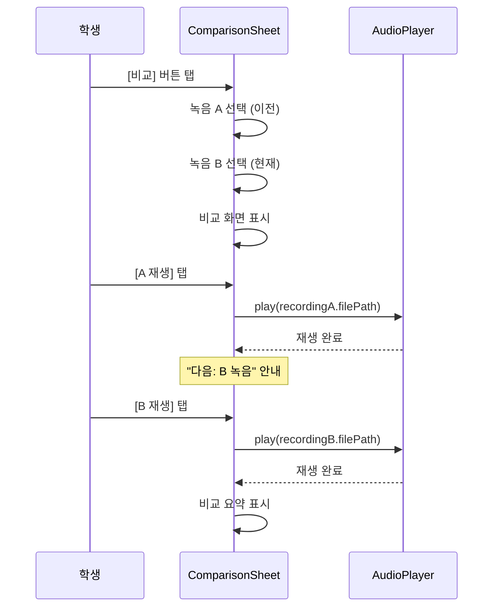

# 녹음 비교 재생 스펙

> 작성일: 2026-03-02
> 상태: 설계 완료
> Pain Point: C(실력 성장 체감 불가)
> 관련 문서: [recording_player_ui.md](recording_player_ui.md), [waveform_improvements.md](waveform_improvements.md)
> 엔티티: `PracticeRecording` in [practice_repertoire.dart](../../../frontend/lib/features/practice/domain/entities/practice_repertoire.dart)

<!-- @uses: tokens/colors, tokens/typography -->
<!-- @uses: components/waveform -->

---

## 1. 개요

### 1.1 목적

같은 곡의 과거/현재 녹음을 비교하여 **실력 성장을 체감**할 수 있게 한다.
"6개월 전 연주와 지금 비교 불가능" → 녹음 타임라인으로 같은 곡 A/B 비교 재생.

### 1.2 핵심 결정사항

| 항목 | 결정 |
|------|------|
| Phase 1 | A/B 순차 비교 재생 (한 번에 하나씩) |
| Phase 2 | 병렬 파형 비교 (두 파형 동시 표시) |
| 진입 경로 | 섹션 상세 > [비교] 버튼 |
| 비교 대상 선택 | 동일 섹션의 녹음 2개를 선택 |
| 기존 활용 | PracticeRecording.sectionId, createdAt, bpm |
| 파형 재사용 | 기존 ZoomableWaveformProgressBar 활용 |

---

## 2. 기존 활용 엔티티

### 2.1 PracticeRecording (HiveType 30)

**파일**: `frontend/lib/features/practice/domain/entities/practice_repertoire.dart`

```dart
class PracticeRecording {
  final String id;
  final String sectionId;         // ← 동일 섹션 필터링 기준
  final String filePath;
  final int durationSeconds;
  final int? bpm;                 // ← BPM 비교 지표
  final bool isRepresentative;
  final DateTime createdAt;       // ← 시간순 정렬 기준

  String get formattedDuration;   // mm:ss
  String get bpmText;             // "120 BPM" or ""
}
```

### 2.2 비교에 활용하는 필드

| 필드 | 비교 용도 |
|------|----------|
| `sectionId` | 동일 섹션 녹음끼리만 비교 |
| `createdAt` | 시간순 정렬 → "3개월 전" vs "오늘" |
| `bpm` | BPM 변화 표시 (72 → 108 BPM ↑36) |
| `durationSeconds` | 연주 시간 변화 표시 |
| `filePath` | 오디오 파일 재생 |

---

## 3. 사용자 플로우

### 3.1 비교 진입

```
섹션 상세 화면 (SectionDetailScreen)
    │
    └─ 녹음 목록 상단 [비교] 버튼
        │
        └─ RecordingComparisonSheet (바텀시트)
            │
            ├─ Step 1: 녹음 A 선택 ("이전 녹음")
            │   → 동일 섹션 녹음 목록 (날짜순, 오래된 것 먼저)
            │
            ├─ Step 2: 녹음 B 선택 ("현재 녹음")
            │   → A 이후 녹음만 표시
            │
            └─ Step 3: 비교 재생 화면
                ├─ A 재생 → B 재생 순차
                ├─ 메타데이터 비교 카드
                └─ [번갈아 듣기] 토글
```

### 3.2 비교 재생



---

## 4. 화면 스펙

### 4.1 비교 버튼 (섹션 상세 내)

```
┌─────────────────────────────────────────┐
│ 🎵 녹음 (5개)                   [비교] │  ← 녹음 2개 이상일 때만 표시
├─────────────────────────────────────────┤
│ ▶ 1/15 (수) 14:30    0:42   120 BPM   │
│ ▶ 1/10 (금) 16:00    0:38   108 BPM   │
│ ...                                     │
└─────────────────────────────────────────┘
```

### 4.2 녹음 선택 단계

```
┌─────────────────────────────────────────┐
│ ─── (드래그 핸들)                       │
│ 🔀 녹음 비교                           │
├─────────────────────────────────────────┤
│                                         │
│ Step 1/2: 이전 녹음 선택               │
│                                         │
│ ┌─────────────────────────────────────┐ │
│ │ ○ 10/15 (화) 14:30   0:35  72 BPM │ │
│ │ ○ 11/20 (수) 15:00   0:38  84 BPM │ │
│ │ ● 12/10 (금) 16:00   0:40  96 BPM │ │  ← 선택됨
│ │ ○  1/10 (금) 16:00   0:38 108 BPM │ │
│ │ ○  1/15 (수) 14:30   0:42 120 BPM │ │
│ └─────────────────────────────────────┘ │
│                                         │
│             [다음 →]                    │
└─────────────────────────────────────────┘
```

### 4.3 비교 재생 화면 (Phase 1)

```
┌─────────────────────────────────────────┐
│ ─── (드래그 핸들)                       │
│ 🔀 녹음 비교                    [닫기] │
├─────────────────────────────────────────┤
│                                         │
│ 🅰️ 이전 녹음 (12/10)                   │
│ ┌─────────────────────────────────────┐ │
│ │ ░░░░░██░░░░░░░░░░░░░░░░░░░░░░░░░░ │ │  ← 파형 (ZoomableWaveform)
│ │       ▲                             │ │
│ │   ◀◀  ▶  ▶▶     0:18 / 0:40      │ │
│ │   96 BPM                           │ │
│ └─────────────────────────────────────┘ │
│                                         │
│ 🅱️ 현재 녹음 (1/15)                    │
│ ┌─────────────────────────────────────┐ │
│ │ ░░░░░░░░░░░░░░░░░░░░░░░░░░░░░░░░░ │ │  ← 파형 (ZoomableWaveform)
│ │                                     │ │
│ │   ◀◀  ▶  ▶▶     0:00 / 0:42      │ │
│ │   120 BPM                          │ │
│ └─────────────────────────────────────┘ │
│                                         │
│ 📊 변화                                 │
│ ┌─────────────────────────────────────┐ │
│ │ 🎵 BPM     96 → 120   ▲ 24 (25%) │ │
│ │ ⏱️ 시간    0:40 → 0:42  +2초     │ │
│ │ 📅 기간    12/10 → 1/15  36일     │ │
│ └─────────────────────────────────────┘ │
│                                         │
│       [🔄 번갈아 듣기]                  │
└─────────────────────────────────────────┘
```

### 4.4 상태표

| 상태 | 동작 |
|------|------|
| 녹음 0~1개 | [비교] 버튼 비활성 (disabled) |
| 녹음 2개 이상 | [비교] 버튼 활성 |
| A 선택 → B 선택 | B 목록에서 A 이후 녹음만 표시 |
| A 재생 중 | B 재생 버튼 비활성 |
| B 재생 중 | A 재생 버튼 비활성 |
| 번갈아 듣기 ON | A 재생 완료 → 자동으로 B 재생 시작 |
| BPM null | BPM 변화 섹션 숨김 |

---

## 5. 데이터 모델

### 5.1 비교 상태 (신규)

```dart
/// 녹음 비교 상태
@freezed
class RecordingComparison with _$RecordingComparison {
  const factory RecordingComparison({
    required PracticeRecording recordingA,  // 이전 녹음
    required PracticeRecording recordingB,  // 현재 녹음
  }) = _RecordingComparison;

  /// BPM 변화량 (null if either has no BPM)
  int? get bpmDelta =>
      recordingA.bpm != null && recordingB.bpm != null
          ? recordingB.bpm! - recordingA.bpm!
          : null;

  /// BPM 변화율 (%)
  double? get bpmChangePercent =>
      bpmDelta != null && recordingA.bpm! > 0
          ? (bpmDelta! / recordingA.bpm!) * 100
          : null;

  /// 시간 차이 (초)
  int get durationDelta =>
      recordingB.durationSeconds - recordingA.durationSeconds;

  /// 경과 일수
  int get daysBetween =>
      recordingB.createdAt.difference(recordingA.createdAt).inDays;
}
```

---

## 6. 파일 구조

```
frontend/lib/features/practice/
├── domain/
│   └── entities/
│       └── practice_repertoire.dart         ← PracticeRecording (기존)
├── presentation/
│   ├── providers/
│   │   └── recording_comparison_provider.dart  ← (신규)
│   ├── screens/
│   │   └── section_detail_screen.dart       ← [비교] 버튼 추가
│   └── widgets/
│       ├── recording_comparison_sheet.dart   ← (신규) 비교 바텀시트
│       ├── recording_selector.dart          ← (신규) 녹음 선택 목록
│       ├── comparison_player.dart           ← (신규) A/B 재생 UI
│       ├── comparison_summary_card.dart     ← (신규) 변화 요약
│       └── waveform/
│           └── zoomable_waveform.dart       ← (기존 재사용)
```

---

## 7. Provider

```dart
/// 동일 섹션의 녹음 목록 (비교 대상)
@riverpod
Future<List<PracticeRecording>> sectionRecordings(
  SectionRecordingsRef ref,
  String sectionId,
) async {
  final repository = ref.watch(practiceRepositoryProvider);
  final repertoire = await repository.getRepertoireBySectionId(sectionId);
  if (repertoire == null) return [];

  final section = repertoire.sections.firstWhereOrNull((s) => s.id == sectionId);
  if (section == null) return [];

  return section.recordings
      .toList()
    ..sort((a, b) => a.createdAt.compareTo(b.createdAt));
}

/// 비교 상태 관리
@riverpod
class RecordingComparisonNotifier extends _$RecordingComparisonNotifier {
  @override
  RecordingComparison? build() => null;

  void setComparison(PracticeRecording a, PracticeRecording b) {
    state = RecordingComparison(recordingA: a, recordingB: b);
  }

  void clear() => state = null;
}
```

---

## 8. 에러/엣지 케이스

| 상황 | 동작 |
|------|------|
| 녹음 파일 없음 (삭제됨) | "녹음 파일을 찾을 수 없습니다" 안내 |
| A와 B가 같은 녹음 | 선택 불가 (B 목록에서 A 제외) |
| 재생 중 시트 닫기 | 재생 중지 + 리소스 해제 |
| BPM 정보 없는 녹음 | BPM 비교 섹션 숨김, 날짜/시간만 표시 |
| 매우 긴 녹음 (5분+) | 파형 줌 지원 (기존 핀치줌 활용) |
| 트리밍된 녹음 | .trim 메타데이터 반영 (기존 로직 재사용) |

---

## 9. 구현 체크리스트

### Phase 1: A/B 순차 비교

- [ ] RecordingComparison 모델
- [ ] RecordingComparisonNotifier Provider
- [ ] sectionRecordings Provider
- [ ] 섹션 상세 [비교] 버튼 (녹음 2개 이상 시)
- [ ] RecordingComparisonSheet 바텀시트
- [ ] 녹음 선택 UI (Step 1, 2)
- [ ] 비교 재생 UI (A/B 개별 재생)
- [ ] ComparisonSummaryCard (BPM/시간/기간 변화)
- [ ] [번갈아 듣기] 자동 전환

### Phase 2: 병렬 파형 비교

- [ ] 두 파형 동시 표시 (상하 배치)
- [ ] 동기화 재생 (같은 위치에서 A/B 전환)
- [ ] 파형 오버레이 비교 모드
- [ ] 속도 조절 (A/B 개별 또는 동기)

---

## 10. 변경 이력

| 버전 | 날짜 | 변경 내용 |
|------|------|----------|
| 1.0 | 2026-03-02 | 초안 — A/B 순차 비교 + 병렬 파형 Phase 2 설계 |
