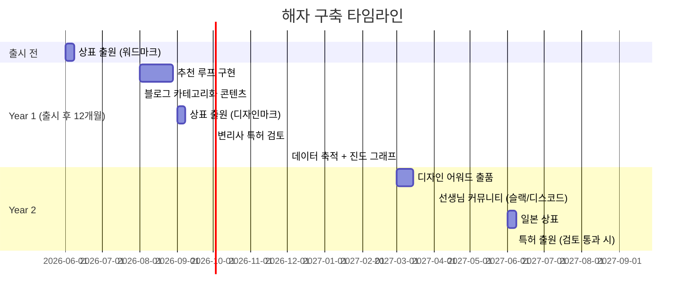

# 경쟁 해자 전략 스펙

> 작성일: 2026-05-18
> 상태: 활성 (마스터 SSOT)
> 우선: 🟠 HIGH (출시 후 3개월)
> 관련: [seo_landing_spec.md](./seo_landing_spec.md), [teacher_referral_spec.md](../lesson/invite/teacher_referral_spec.md)

---

## 0. 개요

기능은 3~6개월에 복제 가능. **법적·네트워크·데이터·브랜드** 4종 해자로 경쟁 진입 비용 상승.

---

## 1. 현황 진단

| 해자 종류 | 현 상태 |
|----------|--------|
| 기능 차별화 | ✅ 1,044 파일, 20 도메인 (best-in-class) |
| 디자인 차별화 | ✅ Notebook × Score 미학 |
| 브랜드 해자 | ❌ 카테고리 미확립 |
| 네트워크 해자 | ❌ 추천 루프 미구현 (`teacher_referral_spec.md`에서 보강) |
| 데이터 해자 | 🟡 레슨 노트 축적 시작 (시간이 약) |
| IP 해자 (상표/특허) | ❌ 출원 X |

---

## 2. 해자 1 — 브랜드 (Notebook × Score 카테고리화)

### 2.1 목표

"Notebook × Score"를 단일 제품명이 아닌 **카테고리**로 만든다. "ERP"가 SAP/Oracle을 넘어선 카테고리인 것처럼.

### 2.2 실행

| 채널 | 콘텐츠 |
|------|--------|
| 블로그 (seo_landing_spec) | "Notebook × Score 디자인 철학" 시리즈 (4편) |
| YouTube | "음악 선생님이 종이 노트를 버리지 않는 이유 — Notebook × Score" |
| 디자인 컨퍼런스 | 발표 1회 (Year 2) |
| 디자인 어워드 | 출품 (한국 디자인 어워드, Year 2) |

### 2.3 비주얼 정체성

- 손글씨 폰트(Gaegu/Stylish) — 시각 시그니처
- 보조 모티프: 오선지/잉크/연필 결
- 디자인 시스템 SSOT: [design_master.md](../design/design_master.md)

---

## 3. 해자 2 — 네트워크 (추천 루프)

### 3.1 구현

`teacher_referral_spec.md` 참조. 핵심:
- 선생님 → 선생님 추천 코드 + 보상
- 추천 5명 → Pro 보상 적층
- 선생님 커뮤니티 형성 (목표: Year 2 슬랙/디스코드)

### 3.2 효과

| 지표 | 목표 (Year 1 말) |
|------|-----------------|
| 추천 가입 비율 | 전체 신규의 20%+ |
| 추천자 평균 추천 수 | 3명 |
| 바이럴 계수 (K) | 0.5+ |

K가 1.0을 넘으면 자생적 성장. Year 2 목표.

---

## 4. 해자 3 — 데이터 (전환 비용)

### 4.1 메커니즘

레슨 노트는 시간이 지날수록 가치 증가:
- 1개월: 가치 적음 (대체 가능)
- 6개월: 학생 N명 × 레슨 20회 × 사진/녹음 → **이전 불가능**
- 1년+: 사실상 lock-in

### 4.2 강화 전략

| 전략 | 효과 |
|------|------|
| 노트 검색 (전문 검색) | 축적 데이터의 가치 가시화 |
| AI 진도 분석 (Year 2) | 데이터 기반 인사이트 제공 |
| 학생별 연도별 진도 그래프 | "1년치 데이터" 자산 시각화 |
| 데이터 내보내기 제공 | 신뢰 확보 (역설적으로 lock-in 강화) |

데이터 내보내기는 [account_lifecycle_spec.md §6](../user/account_lifecycle_spec.md) — "내보낼 수 있다는 사실" 자체가 신뢰 자산.

### 4.3 위협 — 데이터 이전 도구 등장

경쟁사가 "Lessonaza에서 이전" 도구를 만들면 약화. 대응:
- JSON 포맷 임의 변경 (정기적 schema 진화)
- 사진/녹음 파일은 자체 CDN (외부 도구가 다운로드 자동화 어려움)
- 단, GDPR Article 20(데이터 이동권) 준수는 유지

---

## 5. 해자 4 — IP (상표 + 특허)

### 5.1 상표 출원

| 항목 | 예산 | 시점 |
|------|------|------|
| 한국 "Lessonaza" 워드마크 | 30만원 | 출시 전 |
| 한국 "Notebook × Score" 디자인마크 | 50만원 | 출시 후 3개월 |
| 일본 "Lessonaza" | 50만원 | Year 2 진출 시 |
| 미국 "Lessonaza" | 200만원 | Year 3 |

### 5.2 특허 검토

| 후보 | 검토 |
|------|------|
| "3자 음악 레슨 협업 + 비동기 피드백 녹음" 방법 | 진보성 검토 — 변리사 100만원 |
| "수기 노트 디지털 변환 + 메트로놈 동기화" | 약함 — 보류 |
| "수강권 회차 ↔ 레슨 차감 자동 매칭 알고리즘" | 검토 가치 있음 |

변리사 자문 우선. 출원 결정은 검토 후.

### 5.3 저작권 / 디자인권

- 손글씨 일러스트 자체에 저작권 — 발주 계약에 양도 명시
- 앱 아이콘 / 핵심 화면 디자인은 등록 디자인권 (10만원/건)

---

## 6. 해자 우선순위 / 타임라인

---

## 7. 해자 측정 지표

| 해자 | KPI | Year 1 목표 |
|------|-----|-------------|
| 브랜드 | "Notebook × Score" 검색량 | 월 500+ |
| 네트워크 | 바이럴 계수 (K) | 0.5+ |
| 데이터 | 사용자당 평균 노트 수 | 50+ |
| IP | 등록 상표/디자인 수 | 2+ |

---

## 8. 위협 분석

| 위협 | 대응 |
|------|------|
| 대기업(카카오/네이버) 진입 | 카테고리 선점 + 데이터 lock-in으로 시간 벌기 |
| 경쟁사가 Notebook × Score 디자인 모방 | 디자인권 침해 소송 (Year 2 IP 강화 후) |
| 사용자 데이터 유출 사고 | 신뢰 붕괴 → 해자 무력화. account_lifecycle_spec § AuditLog로 보안 강화 |
| AI 도구가 레슨 노트 자동 생성 → 차별성 약화 | AI 통합 가속 (Year 2 로드맵) |

---

## 9. 의사결정 로그

| 일자 | 결정 | 근거 |
|------|------|------|
| 2026-05-18 | 4종 해자 병행 (단일 의존 회피) | 단일 해자는 단일 실패점 |
| 2026-05-18 | 워드마크 출원을 출시 전 진행 | 출시 후 도용 시 입증 어려움 |
| 2026-05-18 | 특허는 변리사 자문 후 결정 | 출원 비용 高, 진보성 약하면 자원 낭비 |
| 2026-05-18 | 데이터 내보내기는 제공 (법 준수) — 단 JSON schema 진화 | 신뢰 확보가 lock-in보다 우선 |

---

## 10. 관련 문서

- [seo_landing_spec.md](./seo_landing_spec.md) — 브랜드 카테고리화 콘텐츠 채널
- [teacher_referral_spec.md](../lesson/invite/teacher_referral_spec.md) — 네트워크 해자 구현
- [account_lifecycle_spec.md](../user/account_lifecycle_spec.md) — 데이터 신뢰 (내보내기/AuditLog)
- [design_master.md](../design/design_master.md) — 브랜드 비주얼 정체성
