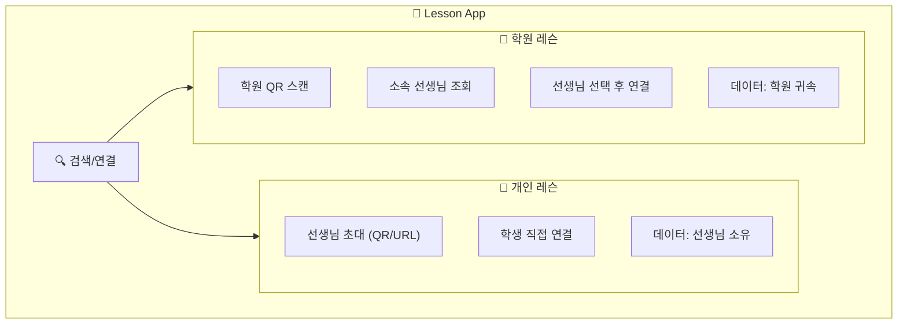

# 레슨 스케줄 플로우 (앱 사용)

> 마지막 업데이트: 2026-02-06

lesson-app을 사용했을 때의 레슨 스케줄 플로우입니다.
[앱 미사용 플로우](flow_without_app.md)와 비교하여 어떤 불편함이 해소되는지 보여줍니다.

---

## 🎯 핵심 원칙: 앱 = 더 간단해야 함

> **"앱을 쓰면 기존보다 복잡해지면 안 된다"**

### 단계 수 비교

| 시나리오 | 앱 미사용 | 앱 사용 |
|----------|:--------:|:------:|
| **신규 학생** | 5단계 | **5단계** (동일) |
| **재등록** | 2-3단계 | **3단계** (동일) |
| **앱 전환** | - | **3단계** ✨ |

### 간소화 핵심

| 자동화 | 설명 |
|--------|------|
| **입금 확인 = 발급 + 스케줄** | 1번 탭으로 3개 작업 완료 |
| **자동 스케줄 (신규)** | 체험 시간 → 정기 시간 (기본값) |
| **자동 스케줄 (재등록)** | 이전 스케줄 유지 (기본값) |
| **앱 전환** | 현재 스케줄 입력 → 바로 시작 (체험/결제 스킵) |
| **자동 갱신 제안** | 잔여 2회 시 시스템 자동 제안 |

👉 상세: [플로우 간소화 분석](../../proposal/flow_simplification_analysis.md)

---

## 관계 모델 개요

> **📌 수강권 중심 관계 모델**
>
> 선생님-학생 관계는 **수강권 상태**에 따라 자동으로 관리됩니다.
>
> | 이벤트 | RelationshipStatus | 설명 |
> |--------|-------------------|------|
> | 체험 예약 | `trialBooked` | 체험 대기 |
> | 수강권 발급 | `active` | 정규 레슨 |
> | 수강권 만료 | `expired` | 30일 유예 기간 |
> | 유예 기간 초과 | `past` | 이전 학생 |
>
> **팔로우 시스템**은 수강권과 별개로 동작합니다:
> - 누구나 선생님/학원을 팔로우 가능 (인스타 스타일)
> - 공연, 이벤트, 소식 알림 수신용
> - 수강권 없이도 팔로우 유지
>
> 👉 상세: [수강권 중심 관계 모델](../invite/subscription_based_relationship.md)

---

## 플로우 목차

각 플로우는 별도 파일로 분리되어 있습니다.

| # | 플로우 | 파일 | 설명 |
|---|--------|------|------|
| 1 | [앱 핵심 특징](#앱-핵심-특징) | 본 문서 | 탐색, 연결, 검색, 결제 개요 |
| 2 | [선생님-학생 연결](flow_connection.md) | flow_connection.md | QR/URL 초대, 학원, 재등록, 앱 전환 |
| 3 | [체험 레슨 예약](flow_trial.md) | flow_trial.md | 체험 신청 → 승인 → 리마인더 |
| 4 | [정기 레슨 등록](flow_regular.md) | flow_regular.md | 수강권 제안 → 결제 → 발급 → 스케줄 |
| 5 | [회차권 레슨](flow_package.md) | flow_package.md | 회차권 결제 → 예약 → 소진 → 연장 |
| 6 | [레슨 취소/변경](flow_cancel.md) | flow_cancel.md | 취소, 보강, 노쇼, 시간 변경 |
| 7 | [결제/미수금 관리](flow_payment.md) | flow_payment.md | 2단계 입금확인, 미결제, 미수금 관리 |
| 8 | [개인 vs 학원 레슨](#개인-레슨-vs-학원-레슨) | 본 문서 | 기능 비교, 데이터 소유권 |
| 9 | [전체 개선 효과](#전체-개선-효과) | 본 문서 | Pain Point 해결, 시간 절약 |

---

## 앱 핵심 특징

### 선생님 탐색: 기존과 동일

> **앱은 신규 선생님 탐색 도구가 아닙니다.**

```
신규 선생님 발굴: 외부 플랫폼 (숨고, 크몽, 블로그)
      ↓
앱 시작점: 체험 레슨 후 QR 스캔 → 연결
```

| 상황 | 앱 역할 |
|------|--------|
| **🆕 신규 선생님** | ❌ 탐색 불가 (외부 플랫폼 이용) |
| **🏫 학원 선생님** | ✅ 학원 내 등록된 선생님 조회 가능 |
| **🔄 재연결** | 이전에 레슨했던 선생님 | ✅ 이력 기반 검색 |

### 연결 방식: 초대 기반 (자동 연결)

> **QR 스캔 = 자동 연결 (제로 탭)**

| 방식 | 사용 시점 | 동작 |
|------|----------|------|
| **QR 코드** | 체험 후 대면 | 스캔 즉시 연결 |
| **URL 링크** | 카톡/문자 공유 | 클릭 + 가입 = 연결 |
| **학원 QR** | 학원 등록 시 | 스캔 → 선생님 선택 |

👉 상세: [flow_connection.md](flow_connection.md)

### 앱 내 검색이 가능한 경우

| 검색 조건 | 가능 여부 |
|----------|:--------:|
| 이전에 레슨한 선생님 | ✅ |
| 학원 소속 선생님 | ✅ |
| 처음 보는 선생님 | ❌ |

### 레슨 유형 구분

| 유형 | 연결 방식 | 데이터 소유 |
|------|----------|------------|
| **👤 개인 레슨** | QR/URL 초대 | 공동 (선생님+학생) |
| **🏫 학원 레슨** | 학원 QR → 선생님 선택 | 공동 (학원+선생님+학생) |

### 결제 및 수강권 발급

> **결제는 외부에서 처리** (계좌이체, 현금 등)
> 앱에서는 **결제 요청 알림**, **입금 확인**, **수강권 발급**을 지원합니다.

```
💳 결제 → 수강권 발급 플로우
1. 앱 → 학생: 결제 안내 알림 (자동)
2. 학생 → 은행: 계좌이체 (외부)
3. 선생님: 입금 확인 → 앱에서 체크 (수동)
4. 선생님 → 앱: 수강권 발급 (수동)
5. 앱 → 학생: 수강권 발급 완료 알림
```

> ⚠️ **입금 확인과 수강권 발급은 선생님이 직접 처리**합니다.

👉 상세: [flow_payment.md](flow_payment.md)

---

## 개인 레슨 vs 학원 레슨

### 앱 내 구분



### 기능 비교

| 기능 | 👤 개인 레슨 | 🏫 학원 레슨 |
|------|-------------|-------------|
| **신규 연결** | QR/URL 초대 | 학원 → 선생님 선택 |
| **신규 선생님 검색** | ❌ 불가 (초대만) | ✅ 학원 내 선생님 조회 |
| **이전 선생님 검색** | ✅ 이력 기반 재연결 | ✅ 이력 기반 재연결 |
| **데이터 소유** | 공동 (선생님+학생) | 공동 (학원+선생님+학생) |
| **수강권 발행** | 선생님 | 학원 |
| **정산** | 선생님 직접 | 학원에서 처리 |
| **선생님 변경** | 새로 연결 | 학원 내 전환 가능 |

### 레슨 노트 데이터 소유권

> **원칙: 비용을 지불한 학생도 레슨 노트 데이터를 소유합니다.**
>
> 상세 정책: [subscription_system_spec.md](../subscription/subscription_system_spec.md) 섹션 4 참조

```
📋 레슨 노트 접근 권한
├── ✅ 선생님: 작성/수정/열람 (담당 학생만)
├── ✅ 학생: 열람 (자신의 레슨만)
├── ❌ 다른 선생님: 기본 접근 불가 (학생 승인 시 공유 가능)
├── ❌ 학원 (개인레슨): 접근 불가
└── ⚠️ 학원 (학원레슨): 학원 정책에 따름
```

| 시나리오 | 학생 | 기존 선생님 | 새 선생님 |
|----------|:----:|:----------:|:--------:|
| **정상 연결 중** | ✅ 열람 | ✅ 열람 | - |
| **연결 해제/변경** | ✅ 계속 열람 | ❌ 차단 | ❌ 기본 불가 |
| **새 선생님에게 공유** | ✅ 열람 | ❌ 차단 | ✅ 학생 승인 시 |
| **이전 선생님 재연결** | ✅ 열람 | ✅ 복원 | - |

> ⚠️ **개인정보 보호**: 레슨 노트는 해당 선생님과 학생만 접근 가능합니다.
> 다른 선생님이나 외부에서는 **학생이 명시적으로 승인하지 않는 한** 확인할 수 없습니다.

### 학원 레슨의 추가 이점

| 이점 | 설명 |
|------|------|
| **선생님 선택권** | 학원 배정이 아닌 학생이 직접 선택 |
| **투명한 정보** | 선생님 프로필, 경력, 리뷰 확인 |
| **기록 보존** | 선생님 퇴사 시에도 학원에 기록 유지 |
| **통합 관리** | 여러 악기 레슨 한 앱에서 관리 |

---

## 전체 개선 효과

### Pain Point 해결 매핑

| # | Pain Point | 앱 해결 방안 | 해결율 |
|---|------------|-------------|:------:|
| 1 | 정보 파편화 | QR/URL 초대로 앱 연결 | 🟡 부분 |
| 2 | 비동기 커뮤니케이션 | 푸시 알림 + 앱 내 메시지 | 🔥 90% |
| 3 | 핑퐁 메시지 | 가용 시간 표시 + 원클릭 예약 | 🔥 95% |
| 4 | 정보 누락 | 자동 정보 전달 | 🔥 100% |
| 5 | 수동 리마인더 | 자동 푸시 알림 | 🔥 100% |
| 6 | 구두 약속 | 앱 내 계약 기록 | 🔥 100% |
| 7 | 수동 정산 | 결제 알림 자동화 (확인은 수동) | 🟡 70% |
| 8 | 반복 작업 | 자동 스케줄 생성 | 🔥 100% |
| 9 | 변경 추적 어려움 | 보강/취소 자동 관리 | 🔥 100% |
| 10 | 어색한 독촉 | 앱 자동 결제 알림 | 🔥 100% |
| 11 | 매번 조율 | 복수 옵션 제안 | 🔥 90% |
| 12 | 연장 불확실성 | 자동 소진 알림 | 🔥 100% |
| 13 | 보강 추적 | 자동 보강 관리 | 🔥 100% |
| 14 | 신뢰 문제 | 투명한 취소 기록 | 🔥 90% |
| 15 | 노쇼 처리 | 정책 기반 자동 처리 | 🔥 100% |
| 16 | 연쇄 수정 | 일괄 시간 변경 | 🔥 100% |

### 시간 절약 비교

| 활동 | 앱 미사용 | 앱 사용 | 절약 |
|------|----------|--------|------|
| 레슨 조율 (회차) | 30분-1시간 | **3분** | 🔥 95% |
| 월 스케줄 등록 | 30분 | **0분 (자동)** | 🔥 100% |
| 리마인더 발송 | 2분 × 학생수 | **0분 (자동)** | 🔥 100% |
| 레슨 기록 | 10분 | **3분** | 🔥 70% |
| 결제 요청 | 5분 × 학생수 | **0분 (자동)** | 🔥 100% |
| 입금 확인 | 5분 × 학생수 | **5분 × 학생수** | - |

### 선생님 월간 관리 시간

```
앱 미사용 (학생 10명 기준)
├── 스케줄 관리: 2시간
├── 입금 확인: 1시간 ← 변동 없음
├── 리마인더 발송: 1.5시간
├── 레슨 기록: 3시간
├── 결제 요청: 1시간
└── 변경/취소 처리: 1시간
총: 약 9.5시간

앱 사용 (학생 10명 기준)
├── 스케줄 관리: 0시간 (자동)
├── 입금 확인: 1시간 ← 변동 없음
├── 리마인더 발송: 0시간 (자동)
├── 레슨 기록: 50분 (간편 입력)
├── 결제 요청: 0시간 (자동)
└── 변경/취소 처리: 10분
총: 약 2시간

절약: 7.5시간/월 (79% 감소)
```

### 핵심 가치 정리

#### 선생님에게

| 가치 | 상세 |
|------|------|
| **시간 절약** | 월 7.5시간 관리 시간 절약 |
| **관계 부담 감소** | 결제 독촉, 노쇼 대응 앱이 처리 |
| **체계적 기록** | 레슨 노트, 진도 히스토리 관리 |
| **학생 확장** | QR/URL로 쉬운 학생 연결 |

#### 학생/학부모에게

| 가치 | 상세 |
|------|------|
| **편리한 예약** | 가용 시간 보고 원클릭 예약 |
| **투명한 정보** | 잔여 횟수, 결제 내역 실시간 확인 |
| **레슨 기록 소유** | 레슨 노트 공동 소유 - 선생님 변경 후에도 보존 |
| **자동 리마인더** | 레슨 일정 알림 자동 수신 |
| **개인정보 보호** | 레슨 노트는 해당 선생님과만 공유 |

#### 학원에게

| 가치 | 상세 |
|------|------|
| **선생님 조회** | 학원 내 선생님 프로필 노출 |
| **데이터 귀속** | 선생님 퇴사 시에도 기록 보존 |
| **통합 관리** | 여러 선생님 레슨 일괄 관리 |

---

## 결론

### 핵심 메시지

> **"선생님은 레슨에만 집중하고,
> 학생/학부모는 투명한 정보를 얻습니다."**

### 앱 사용 시 변화

| 영역 | Before | After |
|------|--------|-------|
| **연결** | 카톡 연락처만 | QR 스캔 = 자동 연결 (제로 탭) |
| **예약** | 메시지 핑퐁 | 원클릭 선택 |
| **스케줄** | 수동 등록 | 자동 생성 |
| **리마인더** | 수동 알림 | 자동 푸시 |
| **결제 요청** | 어색한 독촉 | 자동 알림 |
| **결제 확인** | 수동 | 수동 (변동 없음) |
| **레슨 기록** | 수기/엑셀 (선생님만) | 인앱 노트 (선생님+학생 공동 소유) |
| **기록 접근** | 선생님만 보유 | 해당 선생님+학생만 열람 |
| **잔여 횟수** | 선생님만 앎 | 양쪽 확인 |
| **관계 상태** | 불명확 | 명확한 상태 (active/expired/past) |

### 앱의 한계 (명확화)

| 항목 | 앱 지원 | 비고 |
|------|:------:|------|
| **신규** 선생님 탐색 | ❌ | 외부 플랫폼 이용 (숨고, 크몽 등) |
| **이전** 선생님 검색 | ✅ | 레슨 이력 있으면 앱에서 검색 가능 |
| 학원 선생님 검색 | ✅ | 학원 내 등록된 선생님 조회 |
| 결제 처리 | ❌ | 외부 계좌이체 |
| 입금 확인 | ⚠️ 수동 | 선생님이 직접 확인 |

### 다음 단계

1. **선생님**: 앱 가입 → 프로필 작성 → QR 코드 생성
2. **체험 레슨 후**: QR 스캔 = 자동 연결 (제로 탭)
3. **정기 레슨 설정**: 수강권 발급 → 자동 스케줄 시작
4. **레슨 노트 작성**: 히스토리 축적

---

## 부록 A: "생각없이 사용" UX 원칙 적용

> 상세: [ux_guidelines.md](../design/ux_guidelines.md) 섹션 1.3

### 적용된 UX 개선 사항

| 화면 | 이전 | 개선 | 원칙 |
|------|------|------|------|
| **시간 선택** | 칩 + 블록 토글 뷰 | 칩 버튼만 (단일 뷰) | 선택지 최소화 |
| **시간 선택** | 모든 시간 동등 표시 | ⭐ 평소 시간 추천 | 스마트 기본값 |
| **시간 선택** | "데이터 없음" | 대안 날짜 제안 | 빈 상태 대응 |
| **수강권 발급** | 모든 옵션 펼침 | 템플릿 선택 우선 | Hick's Law |
| **수강권 발급** | 체크박스 다수 | 고급 설정 접기 | 인지 부하 감소 |
| **레슨 제안** | 복수 옵션 필수 | 1개 기본 + 확장 | 단순 플로우 |

### 핵심 법칙 적용

```
🎯 Hick's Law: 선택지 3~4개로 제한
   → 시간 선택: 가용 시간만 표시
   → 수강권 발급: 템플릿 3개 + 직접 입력

🎯 기본값 제공: 추천 값 미리 선택
   → 시간: ⭐ 평소 시간 하이라이트
   → 수강권: 최근 발급 템플릿 상단 배치

🎯 역방향 처리: 기본 체크 + 예외만 해제
   → 그룹레슨 출석: 전원 참석 → 미참석자만 해제
```

---

## 부록 B: 설계 검증 체크리스트

| # | 항목 | 관련 스펙 | 상태 |
|---|------|----------|:----:|
| 1 | QR 코드 초대 | invite_system_v2.md | ✅ |
| 2 | URL 링크 초대 | invite_system_v2.md | ✅ |
| 3 | 학원 내 선생님 검색 | three_party_relationship_spec.md | ✅ |
| 4 | 개인/학원 레슨 구분 | three_party_relationship_spec.md | ✅ |
| 5 | 결제 알림 자동화 | notification_system.md | ✅ |
| 6 | 입금 확인 수동 처리 | payment_unified_spec.md | ✅ |
| 7 | 복수 시간 옵션 제안 | Multi_Option_Schedule_Spec.md | ✅ |
| 8 | 노쇼 정책 자동 처리 | lesson_schedule.md | ✅ |
| 9 | 보강 자동 추적 | lesson_schedule.md | ✅ |
| 10 | 정기 레슨 일괄 시간 변경 | lesson_schedule.md | ✅ |
| 11 | 레슨 노트 공동 소유 | subscription_system_spec.md | ✅ |
| 12 | 레슨 노트 접근 제한 | 본 문서 | ✅ |
| 13 | 시간 선택 UI 단순화 | teacher_availability_spec.md | ✅ |
| 14 | "생각없이 사용" 원칙 | ux_guidelines.md | ✅ |
| 15 | 수강권 템플릿 발급 | subscription_system_spec.md | ✅ |
| 16 | 수강권 중심 관계 모델 | subscription_based_relationship.md | ✅ |
| 17 | 팔로우 시스템 (소식 구독) | subscription_based_relationship.md | ✅ |
| 18 | QR/URL 자동 연결 (제로 탭) | [flow_connection.md](flow_connection.md) | ✅ |
| 19 | 기존 정기레슨 → 앱 전환 | [flow_connection.md](flow_connection.md) | ✅ |
| 20 | 2단계 입금확인 | [flow_payment.md](flow_payment.md) | ✅ |
| 21 | 미수금 관리 | [flow_payment.md](flow_payment.md) | ✅ |

---

## 부록 C: 테스트 체크리스트

> **테스트 문서**: [flow_test_checklist.md](flow_test_checklist.md)

각 시퀀스 다이어그램의 단계를 역할별(선생님/학생/학부모)로 테스트할 수 있는 체크리스트입니다.
실제 앱 화면에서 기능을 검증할 때 참고하세요.

| 플로우 | 파일 | 완료율 |
|--------|------|:------:|
| 선생님-학생 연결 | [flow_connection.md](flow_connection.md) | 80% |
| 체험 레슨 예약 | [flow_trial.md](flow_trial.md) | 90% |
| 정기 레슨 등록 | [flow_regular.md](flow_regular.md) | 60% |
| 결제/수강권 | [flow_payment.md](flow_payment.md) | 85% |
| 회차권 레슨 | [flow_package.md](flow_package.md) | 70% |
| 취소/변경 | [flow_cancel.md](flow_cancel.md) | 80% |
| 가용시간 관리 | - | 100% |
