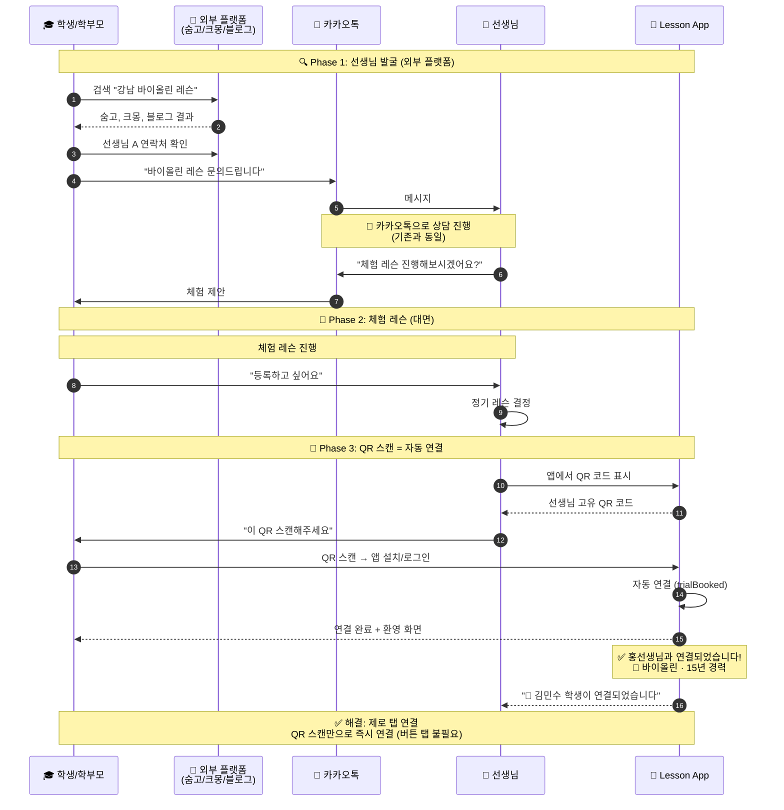
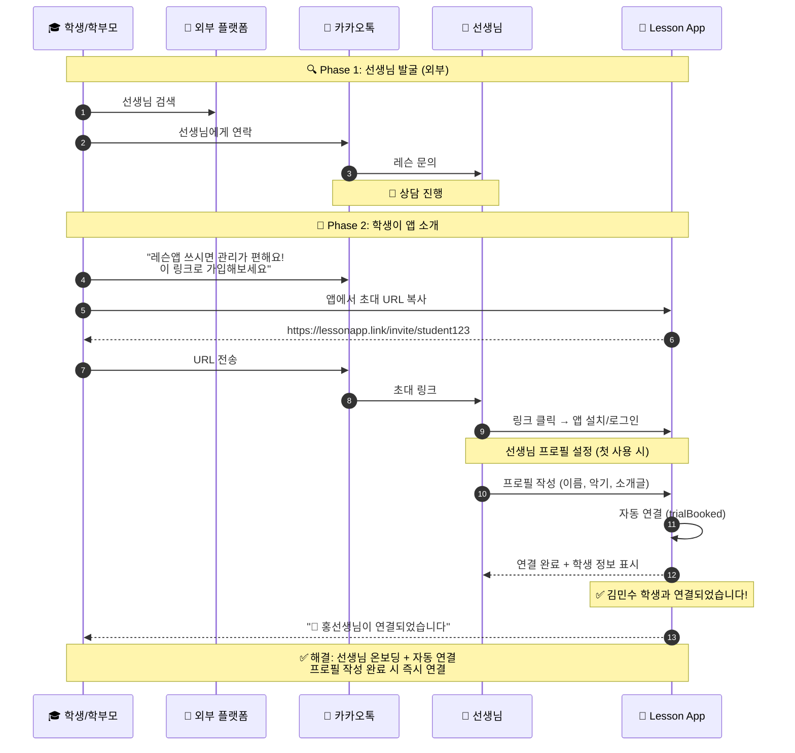
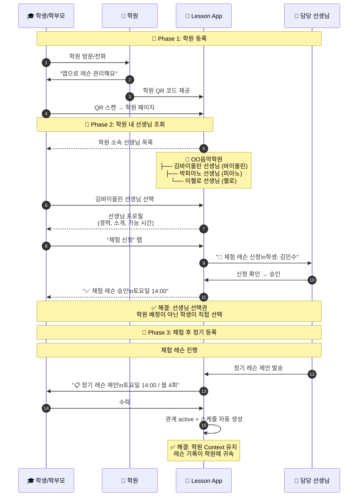
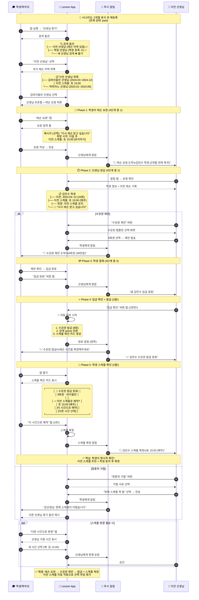
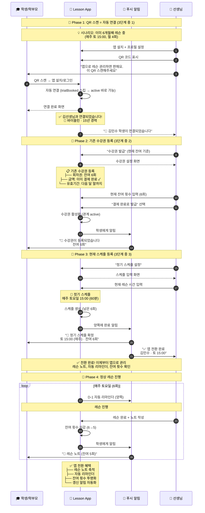
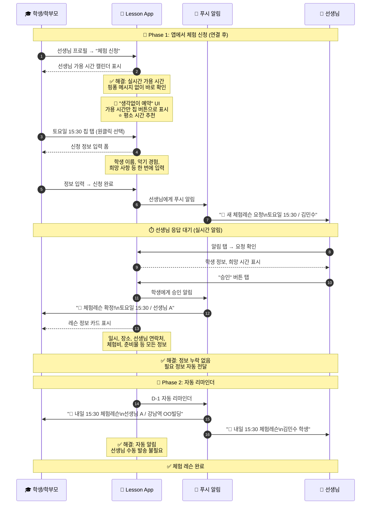
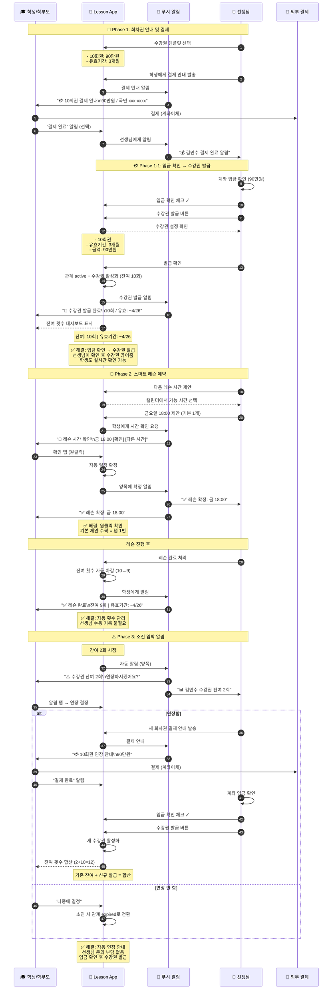
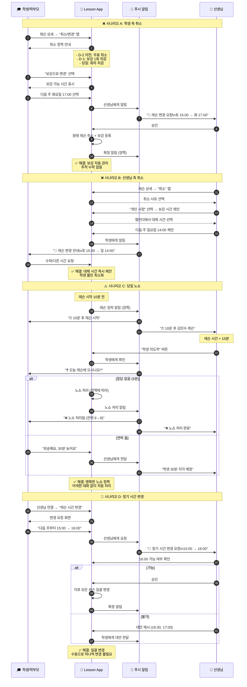
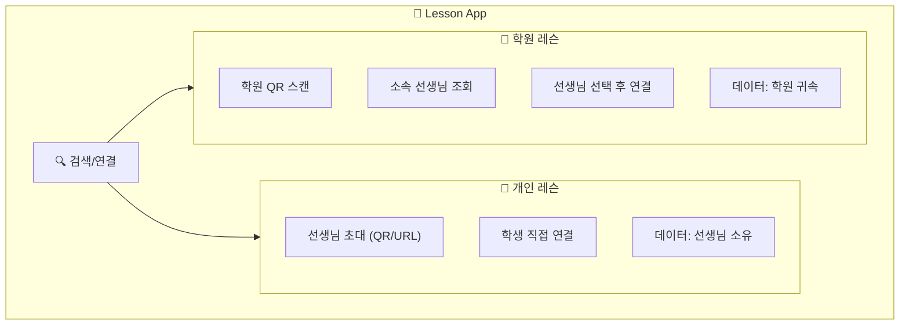

# 레슨 스케줄 플로우 (앱 사용)

> 마지막 업데이트: 2026-01-30

lesson-app을 사용했을 때의 레슨 스케줄 플로우입니다.
[앱 미사용 플로우](flow_without_app.md)와 비교하여 어떤 불편함이 해소되는지 보여줍니다.

---

## 🎯 핵심 원칙: 앱 = 더 간단해야 함

> **"앱을 쓰면 기존보다 복잡해지면 안 된다"**

### 단계 수 비교

| 시나리오 | 앱 미사용 | 앱 사용 |
|----------|:--------:|:------:|
| **신규 학생** | 5단계 | **5단계** (동일) |
| **재등록** | 2-3단계 | **3단계** (동일) |
| **앱 전환** | - | **3단계** ✨ |

### 간소화 핵심

| 자동화 | 설명 |
|--------|------|
| **입금 확인 = 발급 + 스케줄** | 1번 탭으로 3개 작업 완료 |
| **자동 스케줄 (신규)** | 체험 시간 → 정기 시간 (기본값) |
| **자동 스케줄 (재등록)** | 이전 스케줄 유지 (기본값) |
| **앱 전환** | 현재 스케줄 입력 → 바로 시작 (체험/결제 스킵) |
| **자동 갱신 제안** | 잔여 2회 시 시스템 자동 제안 |

👉 상세: [플로우 간소화 분석](../../proposal/flow_simplification_analysis.md)

---

## 관계 모델 개요

> **📌 수강권 중심 관계 모델**
>
> 선생님-학생 관계는 **수강권 상태**에 따라 자동으로 관리됩니다.
>
> | 이벤트 | RelationshipStatus | 설명 |
> |--------|-------------------|------|
> | 체험 예약 | `trialBooked` | 체험 대기 |
> | 수강권 발급 | `active` | 정규 레슨 |
> | 수강권 만료 | `expired` | 30일 유예 기간 |
> | 유예 기간 초과 | `past` | 이전 학생 |
>
> **팔로우 시스템**은 수강권과 별개로 동작합니다:
> - 누구나 선생님/학원을 팔로우 가능 (인스타 스타일)
> - 공연, 이벤트, 소식 알림 수신용
> - 수강권 없이도 팔로우 유지
>
> 👉 상세: [수강권 중심 관계 모델](../invite/subscription_based_relationship.md)

---

## 목차

1. [앱 핵심 특징](#1-앱-핵심-특징)
2. [선생님-학생 연결 플로우](#2-선생님-학생-연결-플로우)
   - 2.1 개인 레슨: 선생님이 초대 (신규)
   - 2.2 개인 레슨: 학생이 초대 (역방향)
   - 2.3 학원 레슨
   - 2.4 휴식 후 재등록 (past 상태)
   - 2.5 **기존 정기레슨 → 앱 전환** ✨
   - 2.6 연결 방식 비교
3. [체험 레슨 예약 플로우](#3-체험-레슨-예약-플로우)
4. [정기 레슨 등록 플로우](#4-정기-레슨-등록-플로우)
5. [회차권 레슨 플로우](#5-회차권-레슨-플로우)
6. [레슨 취소/변경 플로우](#6-레슨-취소변경-플로우)
7. [개인 레슨 vs 학원 레슨](#7-개인-레슨-vs-학원-레슨)
8. [전체 개선 효과](#8-전체-개선-효과)
9. [결론](#9-결론)

---

## 1. 앱 핵심 특징

### 1.1 선생님 탐색: 기존과 동일

> **lesson-app은 선생님 검색/매칭 플랫폼이 아닙니다.**
> 선생님 탐색은 **기존과 동일하게 외부 플랫폼**(숨고, 크몽, 블로그 등)에서 진행합니다.

```
🔍 선생님 탐색 (앱 미사용과 동일)
├── 숨고, 크몽 등에서 선생님 검색
├── 블로그, 인스타에서 프로필 확인
├── 카카오톡으로 상담
└── 체험 레슨 진행
    ↓
📱 앱 연결 (여기서부터 앱 사용)
├── 선생님이 QR 코드 제시
├── 학생이 스캔 → 자동 연결 (버튼 탭 없음)
└── 이후 레슨 관리는 앱에서
```

### 1.2 연결 방식: 초대 기반 (자동 연결)

선생님-학생 연결은 **상호 초대**를 통해서만 가능합니다.

> **핵심 원칙**: QR 스캔/URL 클릭 = 자동 연결 (추가 버튼 탭 없음)

| 방식 | 설명 | 연결 시점 |
|------|------|----------|
| **QR 코드** | 대면 시 선생님이 QR 제시 → 학생 스캔 | 스캔 즉시 연결 |
| **URL 링크** | 카톡/문자로 초대 링크 공유 | 가입 완료 시 연결 |
| **초대 코드** | 선생님 고유 코드 입력 | 입력 즉시 연결 |

**왜 자동 연결인가?**
- QR 스캔/URL 클릭 자체가 **명시적 동의**
- 체험 후 대면 상황에서 **추가 확인은 과잉**
- "생각없이 사용" 원칙에 부합

### 1.3 앱 내 검색이 가능한 경우

| 검색 유형 | 조건 | 설명 |
|----------|------|------|
| **이전 선생님 검색** | 과거 레슨 이력 있음 | 그만뒀다가 다시 시작할 때 |
| **학원 내 선생님** | 학원에 등록된 선생님 | 학원 레슨 등록 시 |

> ⚠️ **신규 선생님 검색은 불가** - 외부 플랫폼에서 찾은 후 초대로 연결

### 1.4 레슨 유형 구분

| 카테고리 | 설명 | 앱 내 검색 |
|----------|------|:----------:|
| **👤 개인 레슨** | 선생님 개인이 직접 관리 | ❌ (초대만) |
| **🏫 학원 레슨** | 학원 소속 선생님 레슨 | ✅ 학원 내 선생님 조회 |
| **🔄 재연결** | 이전에 레슨했던 선생님 | ✅ 이력 기반 검색 |

### 1.5 결제 및 수강권 발급

> **결제는 외부에서 처리** (계좌이체, 현금 등)
> 앱에서는 **결제 요청 알림**, **입금 확인**, **수강권 발급**을 지원합니다.

```
💳 결제 → 수강권 발급 플로우
1. 앱 → 학생: 결제 안내 알림 (자동)
2. 학생 → 은행: 계좌이체 (외부)
3. 선생님: 입금 확인 → 앱에서 체크 (수동)
4. 선생님 → 앱: 수강권 발급 (수동)
5. 앱 → 학생: 수강권 발급 완료 알림
```

> ⚠️ **입금 확인과 수강권 발급은 선생님이 직접 처리**합니다.

---

## 2. 선생님-학생 연결 플로우

### 2.1 개인 레슨: 선생님이 초대 (주요 시나리오)

> **QR 스캔 = 자동 연결**: 추가 버튼 탭 없이 스캔 즉시 연결됩니다.



#### QR 연결 완료 화면 (학생 앱)

```
┌─────────────────────────────────────┐
│                                     │
│         ✅ 연결 완료!               │
│                                     │
│    ┌───────────────────────────┐    │
│    │        👤                 │    │
│    │    홍선생님               │    │
│    │  🎻 바이올린 · 15년 경력   │    │
│    └───────────────────────────┘    │
│                                     │
│    체험 레슨 후 수강권을 받으면     │
│    정기 레슨을 시작할 수 있어요     │
│                                     │
│         [프로필 보기]               │
│         [홈으로 가기]               │
│                                     │
│  ─ ─ ─ ─ ─ ─ ─ ─ ─ ─ ─ ─ ─ ─ ─    │
│  잘못 연결되었나요? [연결 해제]     │
│                                     │
└─────────────────────────────────────┘
```

#### 왜 자동 연결인가?

| 관점 | 이유 |
|------|------|
| **UX** | QR 스캔 자체가 명시적 동의, 추가 탭은 마찰 |
| **상황** | 체험 후 대면 상황에서 확인 단계는 과잉 |
| **선생님** | 어색한 대기 시간 없이 프로페셔널한 경험 |
| **학생** | "뭘 눌러야 하지?" 혼란 없이 간단명료 |

### 2.2 개인 레슨: 학생이 초대 (역방향)

> **URL 클릭 = 자동 연결**: 선생님이 초대 링크로 가입하면 즉시 연결됩니다.



### 2.3 학원 레슨: 학원 → 선생님 선택



### 2.4 휴식 후 재등록 플로우 (이전 선생님)

> ⚠️ **이전 선생님 재연결은 "레슨 요청" 버튼 사용** (신규 QR 자동 연결과 다름)
>
> 이전 선생님은 이미 체험을 했으므로, **수강권 제안 → 발급**까지 완결되는 플로우
>
> 상세: [lesson_request_system.md](../subscription/lesson_request_system.md)
>
> **📋 구현 현황**: 기본 플로우 구현 완료. 알림 연동 및 스케줄 자동 복원 작업 중.

#### 휴식 기간에 따른 관계 상태

| 휴식 기간 | 관계 상태 | 설명 | 재등록 방식 |
|----------|----------|------|------------|
| ~30일 | `expired` | 수강권 만료 유예 | 갱신 알림 → 간편 재등록 |
| **30일+** | `past` | 이전 학생 | **레슨 요청 필요** |

> **2개월 휴식 = `past` 상태** → 선생님이 스케줄 여유 확인 후 수강권 제안



#### 휴식 후 재등록 플로우 요약 (5단계)

| # | 주체 | 액션 | 앱 미사용 |
|:-:|:----:|------|----------|
| 1 | S | 레슨 요청 | 연락처 찾아서 카톡 |
| 2 | T | 수강권 제안 | 카톡으로 비용 안내 |
| 3 | S | 수락 + 입금 | 입금 |
| 4 | T | 입금 확인 → 수강권 발급 | 확인 |
| 5 | S | **스케줄 확인** (이전 시간 추천) | 스케줄 등록 |
| | **5단계** | | **4단계** |

> **핵심 개선**: 이전 스케줄 추천 + 학생 명시적 확인!

#### 이전 선생님 재연결: 왜 "레슨 요청"인가?

> ⚠️ **신규 QR 연결**과 다름: 이전 선생님은 체험이 이미 끝났으므로 수강권 제안이 필요
>
> **갱신 알림(expired)과 다름**: 30일+ 휴식 시 선생님 스케줄이 바뀌었을 수 있음

| 항목 | 설명 |
|------|------|
| **버튼** | "레슨 요청" (신규 QR과 달리 버튼 필요) |
| **이유** | 선생님이 스케줄 여유 확인 후 수강권 제안해야 함 |
| **학생 액션** | 희망 시작일, 이전 스케줄 유지 여부, 메시지 |
| **선생님 액션** | 수강권 제안 또는 정중히 거절 |
| **결과** | 수강권 발급 + **이전 스케줄 자동 복원** |

#### 갱신 vs 휴식 후 재등록 비교

| 구분 | 갱신 (expired) | 휴식 후 재등록 (past) |
|------|---------------|---------------------|
| 휴식 기간 | ~30일 | 30일+ |
| 시작 주체 | **시스템 자동** | **학생 요청** |
| 선생님 확인 | 불필요 | **필요** (스케줄 여유) |
| 스케줄 | 자동 유지 | **자동 복원** (변경 가능) |
| 단계 수 | 3단계 | **4단계** |

### 2.5 기존 정기레슨 → 앱 전환 플로우

> ⚠️ **이미 정기레슨 진행 중인 경우**: 체험 없이 바로 수강권 발급

기존에 앱 없이 정기레슨을 진행하다가 앱으로 전환하는 경우입니다.
이미 선생님과 학생 간의 신뢰가 형성되어 있으므로 **체험 단계 없이** 바로 수강권 발급으로 진행합니다.

#### 앱 전환이 필요한 상황

| 상황 | 예시 |
|------|------|
| 선생님이 앱 도입 | "이제 레슨앱으로 관리할게요" |
| 학생이 앱 추천 | "이 앱 쓰면 잔여 횟수 확인 편해요" |
| 기록 관리 필요 | "레슨 노트를 남기고 싶어요" |

#### 앱 전환 vs 신규 등록 비교

| 구분 | 신규 등록 | 앱 전환 |
|------|----------|--------|
| 관계 | 처음 만남 | **이미 형성됨** |
| 체험 | 필요 | **불필요** |
| 스케줄 | 체험 시간 기준 | **현재 스케줄 입력** |
| 단계 수 | 5단계 | **3단계** |



#### 앱 전환 플로우 요약 (3단계)

| # | 주체 | 액션 | 설명 |
|:-:|:----:|------|------|
| 1 | S | QR 스캔 → 연결 | 자동 연결 |
| 2 | T | 수강권 등록 | 현재 잔여 횟수 입력 |
| 3 | T | 스케줄 등록 | 현재 레슨 시간 입력 |
| | **3단계** | | 체험 없이 바로 전환 |

> **핵심**: 이미 신뢰 관계 + 결제 완료 상태이므로 체험/결제 단계 스킵!

#### "결제 완료로 발급" 옵션

> 기존 정기레슨에서 이미 결제가 완료된 상태이므로, 입금 확인 단계 없이 바로 발급

```
┌─────────────────────────────────────┐
│ ← 수강권 발급                        │
├─────────────────────────────────────┤
│                                     │
│  학생: 김민수                        │
│  상태: 기존 정기레슨 전환             │
│                                     │
│  📋 수강권 정보                       │
│                                     │
│  ┌─────────────────────────────────┐│
│  │ 수강권 유형: 회차권               ││
│  │ 잔여 횟수: [  6  ] 회             ││  ← 현재 남은 횟수 입력
│  │ 유효기간: 2024-02-28까지         ││
│  └─────────────────────────────────┘│
│                                     │
│  💳 결제 상태                        │
│  ○ 결제 대기 (입금 확인 필요)        │
│  ● 결제 완료 (이미 결제됨) ✓         │  ← 기존 레슨은 이미 결제됨
│                                     │
│  [수강권 발급하기]                    │
└─────────────────────────────────────┘
```

#### 앱 전환 시 주의사항

| 항목 | 설명 |
|------|------|
| **잔여 횟수 정확히** | 현재 남은 횟수를 정확히 입력 (양측 혼란 방지) |
| **기존 스케줄 유지** | 갑자기 변경하지 않고 현재 시간 그대로 입력 |
| **레슨 노트 시작점** | 전환 시점부터 노트 축적 시작 (과거 기록은 없음) |
| **학생에게 안내** | "잔여 횟수 확인 가능해요" 등 앱 장점 설명 |

#### 앱 전환 vs 다른 시나리오 비교

| 시나리오 | 체험 | 결제 | 스케줄 | 단계 |
|----------|:----:|:----:|:------:|:----:|
| **신규 등록** | ✅ | ✅ | 체험 시간 자동 | 5 |
| **휴식 후 재등록** | ❌ | ✅ | 이전 스케줄 복원 | 4 |
| **앱 전환** | ❌ | ❌ (완료) | 현재 스케줄 입력 | **3** |
| **갱신** | ❌ | ✅ | 유지 | 3 |

### 2.6 연결 방식 비교

| 구분 | 앱 미사용 | 앱 사용 | 개선 |
|------|----------|--------|------|
| **신규 선생님** | 외부 플랫폼 → 카톡 연락 | 외부 플랫폼 → **QR 스캔 = 자동 연결** | 제로 탭 연결 |
| **이전 선생님** | 연락처 찾기 → 다시 연락 | **앱에서 이력 검색 → 재연결** | 🔥 간편한 재연결 |
| **학원 레슨** | 전화 → 학원 배정 | 앱에서 **선생님 직접 선택** | 선택권 + 투명성 |
| **연결 관리** | 연락처로만 관리 | 앱에서 **관계 상태 확인** | 명확한 관계 |

#### QR/URL 연결 원칙

| 시나리오 | 연결 방식 | 이유 |
|----------|----------|------|
| **개인 선생님 QR** | 스캔 = 자동 연결 | 체험 후 대면 상황, 동의 명확 |
| **개인 선생님 URL** | 클릭 + 가입 = 자동 연결 | 카톡으로 이미 상담 완료 |
| **학원 QR** | 스캔 → 선생님 선택 → 체험 신청 | 선생님 미정, 선택 필요 |

---

## 3. 체험 레슨 예약 플로우

### 3.1 시퀀스 다이어그램



### 3.2 개선 효과 비교

| 단계 | 앱 미사용 | 앱 사용 | 개선율 |
|------|----------|--------|:------:|
| 일정 조율 | 5-10회 메시지 | **1클릭 선택** | 🔥 95% |
| 정보 교환 | 여러 번 왕복 | **자동 전달** | 🔥 100% |
| 리마인더 | 수동 | **자동 푸시** | 🔥 100% |

---

## 4. 정기 레슨 등록 플로우

### 4.1 핵심 순서

> **핵심 순서**: 수강권 제안 → 결제 → 수강권 발급 → **그 후** 스케줄 선택
>
> 수강권이 없으면 레슨 예약이 무의미하므로, 스케줄 선택은 수강권 발급 **후**에 진행합니다.

### 4.2 시퀀스 다이어그램

```mermaid
sequenceDiagram
    autonumber
    participant S as 🎓 학생/학부모
    participant App as 📱 Lesson App
    participant Push as 🔔 푸시 알림
    participant T as 🎻 선생님
    participant Bank as 🏦 외부 결제<br/>(계좌이체)

    Note over S,Bank: ✅ Phase 1: 수강권 제안 (체험 후)

    T->>App: 체험 레슨 완료 처리

    alt 자동 제안 설정 ON
        App->>App: 자동 제안 트리거
        App-->>S: 수강권 제안 자동 발송 (골든타임 할인 적용)
    else 수동 제안
        App-->>T: "정기 레슨으로 전환하시겠습니까?"
        T->>App: "수강권 제안" 버튼
        App-->>T: 수강권 템플릿 선택 화면

        Note over T,App: 📋 수강권 템플릿 선택 (체크박스)

        T->>App: 템플릿 선택 (복수 가능)
        Note over App: ☑ 4회 정기권 (20만원)<br/>☑ 8회 정기권 (38만원) ⭐추천<br/>☐ 16회 정기권 (70만원)

        T->>App: 추천 템플릿 지정 + 메시지 작성
        T->>App: 제안 발송
    end

    App->>Push: 학생에게 제안 알림
    Push->>S: "🎫 수강권 제안\n선생님이 수강권을 제안했어요"

    Note over S,Bank: 💳 Phase 2: 학생 템플릿 선택 + 결제

    S->>App: 제안 확인
    App-->>S: 수강권 옵션 표시 (라디오 버튼)

    Note over S,App: 📋 수강권 선택 (1개만)<br/>○ 4회 정기권 (20만원)<br/>● 8회 정기권 (38만원) ⭐추천<br/>○ 16회 정기권 (70만원)

    S->>App: 템플릿 선택 (8회권)
    App-->>S: 결제 정보 표시
    Note over App: 💳 결제 안내<br/>38만원 / 국민 xxx-xxxx

    S->>Bank: 계좌이체 (38만원)

    Note over S,Bank: 🔄 결제는 외부에서 처리<br/>(계좌이체, 현금 등)

    S->>App: "입금 완료" 버튼 탭

    App->>Push: 선생님에게 알림
    Push->>T: "💰 김민수 입금 알림\n8회 정기권 (38만원)"

    Note over T,App: 💳 Phase 3: 입금 확인 = 발급 + 스케줄 (1탭 완료!)

    T->>T: 계좌 입금 확인 (38만원)
    T->>App: "입금 확인" 버튼 탭 (1번만!)

    App->>App: 🔄 자동 처리 시작
    Note over App: 1. 수강권 발급<br/>2. 관계 active 전환<br/>3. 스케줄 확인 카드 생성

    App->>Push: 학생에게 완료 알림
    Push->>S: "🎫 수강권 발급!\n레슨 시간을 확정해주세요"

    App->>Push: 선생님에게 확정 알림
    Push->>T: "✅ 김민수 수강권 발급 완료"

    Note over S,T: 📅 Phase 4: 학생 스케줄 확인 (1탭!)

    S->>App: 앱 열기
    App-->>S: 스케줄 확인 카드 표시

    Note over App: ┌───────────────────────┐<br/>│ 🎉 수강권 발급 완료!   │<br/>│ 8회권 · 바이올린      │<br/>│                       │<br/>│ ⭐ 체험 시간으로 예약? │<br/>│ 토 15:00 (매주)       │<br/>│ [이 시간으로 예약]    │<br/>│ [다른 시간 선택]      │<br/>└───────────────────────┘

    alt 추천 시간 수락
        S->>App: "이 시간으로 예약" 탭 (1번!)
        App->>App: 스케줄 확정 (토 15:00 × 8회)
    else 다른 시간 선택
        S->>App: "다른 시간 선택" 탭
        App-->>S: 선생님 가용 시간 표시
        S->>App: 새 시간 선택
    end

    App->>Push: 양쪽에 스케줄 확정 알림
    Push->>S: "📅 스케줄 확정!\n토 15:00 (매주)"
    Push->>T: "📅 김민수 스케줄 확정\n토 15:00 (매주)"

    App-->>S: 대시보드 업데이트
    Note over App: 잔여: 8회 | 다음 레슨: 토 15:00

    Note over S,T: ✅ 핵심: 학생이 명시적 확인!<br/>자동이 아닌 학생 동의 후 스케줄 확정

    Note over S,Bank: 🎻 Phase 5: 정기 레슨 진행

    loop 매주 토요일 (8회)
        App->>Push: D-1 자동 리마인더 (양쪽)
        Push->>S: "📅 내일 15:00 레슨"
        Push->>T: "📅 내일 15:00 김민수"

        Note over T,S: 레슨 진행

        T->>App: 레슨 완료 → 레슨 노트 작성
        App->>App: 잔여 횟수 차감 (8→7)

        App->>Push: 학생에게 노트 공유
        Push->>S: "📝 레슨 노트 (잔여 7회)"
    end

    Note over App: ✅ 해결: 체계적 기록<br/>레슨 이력 자동 관리

    Note over S,Bank: 🔄 Phase 6: 소진 임박 → 갱신

    Note over App: 잔여 2회 시점

    App->>Push: 갱신 안내 (시스템 자동)
    Push->>S: "⚠️ 수강권 잔여 2회\n갱신하시겠어요?"
    Push->>T: "📊 김민수 수강권 잔여 2회 (정보성)"

    alt 갱신함 (3단계로 간소화!)
        S->>App: 갱신하기 → 이전과 동일 템플릿 자동 선택
        App-->>S: "지난번과 동일 (8회 38만원)"
        S->>App: 확인 → 입금
        S->>Bank: 계좌이체
        S->>App: "입금 완료"
        T->>App: "입금 확인" 버튼 탭 (1번만!)

        App->>App: 🔄 자동 처리
        Note over App: 1. 수강권 발급 (횟수 합산: 2+8=10)<br/>2. 스케줄 유지 (이전과 동일: 토 15:00)

        App->>Push: 완료 알림 (양쪽)
        Push->>S: "🎫 갱신 완료! 잔여 10회\n스케줄 유지: 토 15:00"
        Push->>T: "✅ 김민수 갱신 완료 (10회)"

        Note over S,T: ✅ 핵심 개선: 스케줄 선택 불필요!<br/>이전 스케줄 자동 유지
    else 갱신 안 함
        S->>App: "나중에 결정"
        App->>App: 소진 시 관계 expired로 전환
    end

    Note over App: ✅ 해결: 시스템 주도 갱신 + 자동 스케줄<br/>선생님 문의 부담 없음, 학생 선택 부담 없음
```



### 4.3 정기 레슨 등록 플로우 요약 (간소화 버전!)

```
체험 완료
    ↓
┌─────────────────────────────────────────────────────────┐
│ Phase 1: 수강권 제안 (자동 또는 수동)                     │
│   → 자동 제안 ON: 시스템이 자동 발송 (선생님 액션 없음)    │
│   → 수동 제안: 선생님이 템플릿 선택 후 발송                │
└─────────────────────────────────────────────────────────┘
    ↓
┌─────────────────────────────────────────────────────────┐
│ Phase 2: 학생 응답 + 결제                                │
│   학생: 템플릿 선택 → 계좌이체 → "입금 완료"              │
└─────────────────────────────────────────────────────────┘
    ↓
┌─────────────────────────────────────────────────────────┐
│ ⭐ Phase 3: 입금 확인 = 발급 + 스케줄 (1탭 완료!)        │
│   선생님: "입금 확인" 버튼 1번만 탭                       │
│   → 자동: 수강권 발급                                    │
│   → 자동: 관계 상태 active                               │
│   → 자동: 스케줄 생성 (체험 시간 기준)                    │
│   → 자동: 양쪽에 완료 알림                               │
└─────────────────────────────────────────────────────────┘
    ↓
레슨 진행 (잔여 횟수 차감)
    ↓
┌─────────────────────────────────────────────────────────┐
│ ⭐ 재등록: 3단계로 간소화!                               │
│   1. 시스템: 자동 갱신 제안 (잔여 2회 시)                 │
│   2. 학생: 수락 + 입금                                   │
│   3. 선생님: 입금 확인 (발급 + 스케줄 유지 자동!)         │
└─────────────────────────────────────────────────────────┘
```

### 4.4 앱 사용 vs 미사용 비교

| 시나리오 | 앱 미사용 | 앱 사용 | 차이 |
|----------|:--------:|:------:|:----:|
| **신규 등록** | 5단계 | **5단계** | 동일 |
| **재등록** | 2-3단계 | **3단계** | 동일 |

> **핵심**: 앱을 써도 단계 수는 동일하면서, **자동화 혜택**을 받음
> - 자동 리마인더
> - 자동 스케줄 생성
> - 잔여 횟수 자동 관리
> - 레슨 기록 자동 축적

### 4.5 자동 스케줄 로직

> **핵심**: 스케줄은 **자동 생성**, 필요 시만 변경

#### 신규 학생

```
체험 레슨 시간 → 정기 레슨 시간 (자동)

예시:
- 체험: 토요일 15:00
- 정기: 토요일 15:00 (매주) × 8회 자동 생성
```

#### 재등록 학생

```
이전 정기 레슨 시간 → 갱신 후 스케줄 (유지)

예시:
- 이전: 토요일 15:00 (매주)
- 갱신: 토요일 15:00 (매주) 유지
```

### 4.6 스케줄 변경이 필요한 경우

> 학생이 "다른 시간 선택" 버튼 탭 시에만 표시

```
┌─────────────────────────────────────┐
│ 📅 레슨 스케줄                       │
├─────────────────────────────────────┤
│                                     │
│  ✅ 체험과 동일 시간으로 등록         │
│     토요일 15:00 (매주)              │
│                                     │
│  ─────────────────────────────      │
│                                     │
│  [다른 시간 선택하기]                 │  ← 필요한 경우만
│                                     │
└─────────────────────────────────────┘
```

### 4.7 학생용 시간 선택 UI (변경 시)

> **전제 조건**: 학생이 "다른 시간 선택" 탭한 경우에만 표시
>
> **상세 스펙**:
> - [teacher_availability_spec.md](../schedule/teacher_availability_spec.md) 섹션 8 - 시간 선택 UI
> - [subscription_proposal_spec.md](../subscription/subscription_proposal_spec.md) - 수강권 제안 시스템

```
┌─────────────────────────────────────┐
│  ◀  2/18(화)  ▶                     │
├─────────────────────────────────────┤
│                                     │
│  예약 가능한 시간                    │
│                                     │
│  ┌────────┐  ┌────────────┐        │
│  │ 15:00  │  │ ⭐ 16:00   │        │  ← 평소 시간 추천
│  └────────┘  └────────────┘        │
│  ┌────────┐                        │
│  │ 17:00  │                        │
│  └────────┘                        │
│                                     │
│  🎻 16:00 (60분)                    │
│  김선생님 · 수강권 5/8회             │  ← 잔여 횟수 표시
│                                     │
│  [예약하기]                          │
└─────────────────────────────────────┘
```

**핵심 원칙:**

| 원칙 | 설명 |
|------|------|
| 수강권 필수 | 수강권 없으면 예약 버튼 비활성화 |
| 단일 뷰 | 칩 버튼만 사용 (토글 뷰 제거) |
| 가용 시간만 | 예약 불가 시간은 숨김 |
| ⭐ 스마트 추천 | 평소 레슨 시간 하이라이트 |
| 빈 상태 대응 | 가용 시간 없으면 대안 날짜 제안 |

### 4.5 수강권 제안 UI

> **상세 스펙**: [subscription_proposal_spec.md](../subscription/subscription_proposal_spec.md) 참조

#### 선생님 앱 (템플릿 체크박스로 복수 선택)

```
┌─────────────────────────────────────┐
│ ← 수강권 제안                        │
├─────────────────────────────────────┤
│                                     │
│  학생: 김서연                        │
│                                     │
│  📋 제안할 수강권 선택 (복수 가능)     │
│                                     │
│  ┌─────────────────────────────────┐│
│  │ ☑ 바이올린 4회권         ⭐추천 ││
│  │    200,000원                     ││
│  └─────────────────────────────────┘│
│                                     │
│  ┌─────────────────────────────────┐│
│  │ ☑ 바이올린 8회권                 ││
│  │    380,000원                     ││
│  └─────────────────────────────────┘│
│                                     │
│  ┌─────────────────────────────────┐│
│  │ ☐ 바이올린 16회권                ││
│  │    700,000원                     ││
│  └─────────────────────────────────┘│
│                                     │
│  2개 선택됨 (학생이 1개 선택)         │
│                                     │
│  [2개 수강권 제안 보내기]             │
└─────────────────────────────────────┘
```

#### 학생 앱 (라디오 버튼으로 1개만 선택)

```
┌─────────────────────────────────────┐
│ ← 수강권 제안                        │
├─────────────────────────────────────┤
│                                     │
│  🎫 수강권 2개 중 선택                │
│  선생님 제안                         │
│                                     │
│  ┌─────────────────────────────────┐│
│  │ ● 바이올린 4회권         ⭐추천 ││
│  │    200,000원                     ││
│  └─────────────────────────────────┘│
│                                     │
│  ┌─────────────────────────────────┐│
│  │ ○ 바이올린 8회권                 ││
│  │    380,000원                     ││
│  └─────────────────────────────────┘│
│                                     │
│  💳 결제 정보                        │
│  국민은행 123-456-789012            │
│  예금주: 김선생                      │
│                                     │
│  [입금 완료했어요]                    │
└─────────────────────────────────────┘
```

### 4.6 결제 관련 비교

| 항목 | 앱 미사용 | 앱 사용 | 차이 |
|------|----------|--------|------|
| **결제 방식** | 계좌이체 | **계좌이체 (동일)** | - |
| **입금 확인** | 선생님 직접 확인 | **선생님 직접 확인 (동일)** | - |
| **수강권 발급** | 구두/메모 | **앱에서 발급 → 학생 확인** | ✅ 개선 |
| **미수금 관리** | 수기 기록 | **앱에서 미수금 목록 관리** | ✅ 개선 |
| **잔여 횟수** | 선생님만 기억 | **학생도 실시간 확인** | ✅ 개선 |
| **결제 요청** | 카톡으로 직접 | **앱 자동 알림** | ✅ 개선 |
| **독촉** | 어색한 개인 연락 | **앱 자동 리마인더** | ✅ 개선 |
| **결제 기록** | 없음 | **앱에 이력 저장** | ✅ 개선 |

### 4.7 개선 효과 비교

| 단계 | 앱 미사용 | 앱 사용 | 개선율 |
|------|----------|--------|:------:|
| 조건 협의 | 메시지 왕복 | **앱 내 제안/수락** | 🔥 90% |
| 계약 | 구두 약속 | **명시적 기록** | 🔥 100% |
| 스케줄 등록 | 매월 수동 | **자동 생성** | 🔥 100% |
| 리마인더 | 수동 발송 | **자동 푸시** | 🔥 100% |
| 레슨 기록 | 수기/엑셀 | **인앱 노트** | 🔥 90% |
| 결제 요청 | 직접 연락 | **자동 알림** | 🔥 100% |
| 입금 확인 | 수동 | **수동 (변동 없음)** | - |
| 수강권 발급 | 구두/메모 | **앱 발급 → 학생 확인** | 🔥 90% |
| 잔여 횟수 확인 | 선생님에게 문의 | **학생 실시간 확인** | 🔥 100% |

**선생님 월간 관리 시간: 4-6시간 → 1시간 미만**

---

## 5. 회차권 레슨 플로우

### 5.1 시퀀스 다이어그램



### 5.2 개선 효과 비교

| 단계 | 앱 미사용 | 앱 사용 | 개선율 |
|------|----------|--------|:------:|
| 매 예약 | 3-5회 메시지 | **1-2회 탭** | 🔥 90% |
| 횟수 관리 | 수동 기록 | **자동 차감** | 🔥 100% |
| 잔여 안내 | 선생님이 알림 | **앱에서 확인** | 🔥 100% |
| 연장 안내 | 선생님이 문의 | **자동 알림** | 🔥 100% |

**10회권 총 메시지: 40-60회 → 10-15회**

---

## 6. 레슨 취소/변경 플로우

### 6.1 시퀀스 다이어그램



### 6.2 개선 효과 비교

| 시나리오 | 앱 미사용 | 앱 사용 | 개선율 |
|----------|----------|--------|:------:|
| 학생 취소 | 메시지 핑퐁 | **1-2클릭** | 🔥 90% |
| 보강 관리 | 수동 추적 | **자동 관리** | 🔥 100% |
| 선생님 취소 | 어색한 알림 | **앱 자동 안내** | 🔥 100% |
| 노쇼 처리 | 즉흥 대응 | **정책 기반 자동** | 🔥 100% |
| 시간 변경 | 모든 일정 수동 | **일괄 변경** | 🔥 100% |

---

## 7. 개인 레슨 vs 학원 레슨

### 7.1 앱 내 구분



### 7.2 기능 비교

| 기능 | 👤 개인 레슨 | 🏫 학원 레슨 |
|------|-------------|-------------|
| **신규 연결** | QR/URL 초대 | 학원 → 선생님 선택 |
| **신규 선생님 검색** | ❌ 불가 (초대만) | ✅ 학원 내 선생님 조회 |
| **이전 선생님 검색** | ✅ 이력 기반 재연결 | ✅ 이력 기반 재연결 |
| **데이터 소유** | 공동 (선생님+학생) | 공동 (학원+선생님+학생) |
| **수강권 발행** | 선생님 | 학원 |
| **정산** | 선생님 직접 | 학원에서 처리 |
| **선생님 변경** | 새로 연결 | 학원 내 전환 가능 |

### 7.3 레슨 노트 데이터 소유권

> **원칙: 비용을 지불한 학생도 레슨 노트 데이터를 소유합니다.**
>
> 상세 정책: [subscription_system_spec.md](../subscription/subscription_system_spec.md) 섹션 4 참조

```
📋 레슨 노트 접근 권한
├── ✅ 선생님: 작성/수정/열람 (담당 학생만)
├── ✅ 학생: 열람 (자신의 레슨만)
├── ❌ 다른 선생님: 기본 접근 불가 (학생 승인 시 공유 가능)
├── ❌ 학원 (개인레슨): 접근 불가
└── ⚠️ 학원 (학원레슨): 학원 정책에 따름
```

| 시나리오 | 학생 | 기존 선생님 | 새 선생님 |
|----------|:----:|:----------:|:--------:|
| **정상 연결 중** | ✅ 열람 | ✅ 열람 | - |
| **연결 해제/변경** | ✅ 계속 열람 | ❌ 차단 | ❌ 기본 불가 |
| **새 선생님에게 공유** | ✅ 열람 | ❌ 차단 | ✅ 학생 승인 시 |
| **이전 선생님 재연결** | ✅ 열람 | ✅ 복원 | - |

> ⚠️ **개인정보 보호**: 레슨 노트는 해당 선생님과 학생만 접근 가능합니다.
> 다른 선생님이나 외부에서는 **학생이 명시적으로 승인하지 않는 한** 확인할 수 없습니다.

### 7.4 학원 레슨의 추가 이점

| 이점 | 설명 |
|------|------|
| **선생님 선택권** | 학원 배정이 아닌 학생이 직접 선택 |
| **투명한 정보** | 선생님 프로필, 경력, 리뷰 확인 |
| **기록 보존** | 선생님 퇴사 시에도 학원에 기록 유지 |
| **통합 관리** | 여러 악기 레슨 한 앱에서 관리 |

---

## 8. 전체 개선 효과

### 8.1 Pain Point 해결 매핑

| # | Pain Point | 앱 해결 방안 | 해결율 |
|---|------------|-------------|:------:|
| 1 | 정보 파편화 | QR/URL 초대로 앱 연결 | 🟡 부분 |
| 2 | 비동기 커뮤니케이션 | 푸시 알림 + 앱 내 메시지 | 🔥 90% |
| 3 | 핑퐁 메시지 | 가용 시간 표시 + 원클릭 예약 | 🔥 95% |
| 4 | 정보 누락 | 자동 정보 전달 | 🔥 100% |
| 5 | 수동 리마인더 | 자동 푸시 알림 | 🔥 100% |
| 6 | 구두 약속 | 앱 내 계약 기록 | 🔥 100% |
| 7 | 수동 정산 | 결제 알림 자동화 (확인은 수동) | 🟡 70% |
| 8 | 반복 작업 | 자동 스케줄 생성 | 🔥 100% |
| 9 | 변경 추적 어려움 | 보강/취소 자동 관리 | 🔥 100% |
| 10 | 어색한 독촉 | 앱 자동 결제 알림 | 🔥 100% |
| 11 | 매번 조율 | 복수 옵션 제안 | 🔥 90% |
| 12 | 연장 불확실성 | 자동 소진 알림 | 🔥 100% |
| 13 | 보강 추적 | 자동 보강 관리 | 🔥 100% |
| 14 | 신뢰 문제 | 투명한 취소 기록 | 🔥 90% |
| 15 | 노쇼 처리 | 정책 기반 자동 처리 | 🔥 100% |
| 16 | 연쇄 수정 | 일괄 시간 변경 | 🔥 100% |

### 8.2 시간 절약 비교

| 활동 | 앱 미사용 | 앱 사용 | 절약 |
|------|----------|--------|------|
| 레슨 조율 (회차) | 30분-1시간 | **3분** | 🔥 95% |
| 월 스케줄 등록 | 30분 | **0분 (자동)** | 🔥 100% |
| 리마인더 발송 | 2분 × 학생수 | **0분 (자동)** | 🔥 100% |
| 레슨 기록 | 10분 | **3분** | 🔥 70% |
| 결제 요청 | 5분 × 학생수 | **0분 (자동)** | 🔥 100% |
| 입금 확인 | 5분 × 학생수 | **5분 × 학생수** | - |

### 8.3 선생님 월간 관리 시간

```
앱 미사용 (학생 10명 기준)
├── 스케줄 관리: 2시간
├── 입금 확인: 1시간 ← 변동 없음
├── 리마인더 발송: 1.5시간
├── 레슨 기록: 3시간
├── 결제 요청: 1시간
└── 변경/취소 처리: 1시간
총: 약 9.5시간

앱 사용 (학생 10명 기준)
├── 스케줄 관리: 0시간 (자동)
├── 입금 확인: 1시간 ← 변동 없음
├── 리마인더 발송: 0시간 (자동)
├── 레슨 기록: 50분 (간편 입력)
├── 결제 요청: 0시간 (자동)
└── 변경/취소 처리: 10분
총: 약 2시간

절약: 7.5시간/월 (79% 감소)
```

### 8.4 핵심 가치 정리

#### 선생님에게

| 가치 | 상세 |
|------|------|
| **시간 절약** | 월 7.5시간 관리 시간 절약 |
| **관계 부담 감소** | 결제 독촉, 노쇼 대응 앱이 처리 |
| **체계적 기록** | 레슨 노트, 진도 히스토리 관리 |
| **학생 확장** | QR/URL로 쉬운 학생 연결 |

#### 학생/학부모에게

| 가치 | 상세 |
|------|------|
| **편리한 예약** | 가용 시간 보고 원클릭 예약 |
| **투명한 정보** | 잔여 횟수, 결제 내역 실시간 확인 |
| **레슨 기록 소유** | 레슨 노트 공동 소유 - 선생님 변경 후에도 보존 |
| **자동 리마인더** | 레슨 일정 알림 자동 수신 |
| **개인정보 보호** | 레슨 노트는 해당 선생님과만 공유 |

#### 학원에게

| 가치 | 상세 |
|------|------|
| **선생님 조회** | 학원 내 선생님 프로필 노출 |
| **데이터 귀속** | 선생님 퇴사 시에도 기록 보존 |
| **통합 관리** | 여러 선생님 레슨 일괄 관리 |

---

## 9. 결론

### 핵심 메시지

> **"선생님은 레슨에만 집중하고,
> 학생/학부모는 투명한 정보를 얻습니다."**

### 앱 사용 시 변화

| 영역 | Before | After |
|------|--------|-------|
| **연결** | 카톡 연락처만 | QR 스캔 = 자동 연결 (제로 탭) |
| **예약** | 메시지 핑퐁 | 원클릭 선택 |
| **스케줄** | 수동 등록 | 자동 생성 |
| **리마인더** | 수동 알림 | 자동 푸시 |
| **결제 요청** | 어색한 독촉 | 자동 알림 |
| **결제 확인** | 수동 | 수동 (변동 없음) |
| **레슨 기록** | 수기/엑셀 (선생님만) | 인앱 노트 (선생님+학생 공동 소유) |
| **기록 접근** | 선생님만 보유 | 해당 선생님+학생만 열람 |
| **잔여 횟수** | 선생님만 앎 | 양쪽 확인 |
| **관계 상태** | 불명확 | 명확한 상태 (active/expired/past) |

### 앱의 한계 (명확화)

| 항목 | 앱 지원 | 비고 |
|------|:------:|------|
| **신규** 선생님 탐색 | ❌ | 외부 플랫폼 이용 (숨고, 크몽 등) |
| **이전** 선생님 검색 | ✅ | 레슨 이력 있으면 앱에서 검색 가능 |
| 학원 선생님 검색 | ✅ | 학원 내 등록된 선생님 조회 |
| 결제 처리 | ❌ | 외부 계좌이체 |
| 입금 확인 | ⚠️ 수동 | 선생님이 직접 확인 |

### 다음 단계

1. **선생님**: 앱 가입 → 프로필 작성 → QR 코드 생성
2. **체험 레슨 후**: QR 스캔 = 자동 연결 (제로 탭)
3. **정기 레슨 설정**: 수강권 발급 → 자동 스케줄 시작
4. **레슨 노트 작성**: 히스토리 축적

---

## 부록 A: "생각없이 사용" UX 원칙 적용

> 상세: [ux_guidelines.md](../design/ux_guidelines.md) 섹션 1.3

### 적용된 UX 개선 사항

| 화면 | 이전 | 개선 | 원칙 |
|------|------|------|------|
| **시간 선택** | 칩 + 블록 토글 뷰 | 칩 버튼만 (단일 뷰) | 선택지 최소화 |
| **시간 선택** | 모든 시간 동등 표시 | ⭐ 평소 시간 추천 | 스마트 기본값 |
| **시간 선택** | "데이터 없음" | 대안 날짜 제안 | 빈 상태 대응 |
| **수강권 발급** | 모든 옵션 펼침 | 템플릿 선택 우선 | Hick's Law |
| **수강권 발급** | 체크박스 다수 | 고급 설정 접기 | 인지 부하 감소 |
| **레슨 제안** | 복수 옵션 필수 | 1개 기본 + 확장 | 단순 플로우 |

### 핵심 법칙 적용

```
🎯 Hick's Law: 선택지 3~4개로 제한
   → 시간 선택: 가용 시간만 표시
   → 수강권 발급: 템플릿 3개 + 직접 입력

🎯 기본값 제공: 추천 값 미리 선택
   → 시간: ⭐ 평소 시간 하이라이트
   → 수강권: 최근 발급 템플릿 상단 배치

🎯 역방향 처리: 기본 체크 + 예외만 해제
   → 그룹레슨 출석: 전원 참석 → 미참석자만 해제
```

---

## 부록 B: 설계 검증 체크리스트

| # | 항목 | 관련 스펙 | 상태 |
|---|------|----------|:----:|
| 1 | QR 코드 초대 | invite_system_v2.md | ✅ |
| 2 | URL 링크 초대 | invite_system_v2.md | ✅ |
| 3 | 학원 내 선생님 검색 | three_party_relationship_spec.md | ✅ |
| 4 | 개인/학원 레슨 구분 | three_party_relationship_spec.md | ✅ |
| 5 | 결제 알림 자동화 | notification_system.md | ✅ |
| 6 | 입금 확인 수동 처리 | payment_unified_spec.md | ✅ |
| 7 | 복수 시간 옵션 제안 | Multi_Option_Schedule_Spec.md | ✅ |
| 8 | 노쇼 정책 자동 처리 | lesson_schedule.md | ✅ |
| 9 | 보강 자동 추적 | lesson_schedule.md | ✅ |
| 10 | 정기 레슨 일괄 시간 변경 | lesson_schedule.md | ✅ |
| 11 | 레슨 노트 공동 소유 | subscription_system_spec.md | ✅ |
| 12 | 레슨 노트 접근 제한 | 본 문서 섹션 7.3 | ✅ |
| 13 | 시간 선택 UI 단순화 | teacher_availability_spec.md | ✅ |
| 14 | "생각없이 사용" 원칙 | ux_guidelines.md | ✅ |
| 15 | 수강권 템플릿 발급 | subscription_system_spec.md | ✅ |
| 16 | 수강권 중심 관계 모델 | subscription_based_relationship.md | ✅ |
| 17 | 팔로우 시스템 (소식 구독) | subscription_based_relationship.md | ✅ |
| 18 | QR/URL 자동 연결 (제로 탭) | 본 문서 섹션 2.1 | ✅ |
| 19 | 기존 정기레슨 → 앱 전환 | 본 문서 섹션 2.5 | ✅ |

---

## 부록 C: 테스트 체크리스트

> **테스트 문서**: [flow_test_checklist.md](flow_test_checklist.md)

각 시퀀스 다이어그램의 단계를 역할별(선생님/학생/학부모)로 테스트할 수 있는 체크리스트입니다.
실제 앱 화면에서 기능을 검증할 때 참고하세요.

| 플로우 | 완료율 |
|--------|:------:|
| 선생님-학생 연결 | 80% |
| 체험 레슨 예약 | 90% |
| 정기 레슨 등록 | 60% |
| 결제/수강권 | 85% |
| 회차권 레슨 | 70% |
| 취소/변경 | 80% |
| 가용시간 관리 | 100% |
