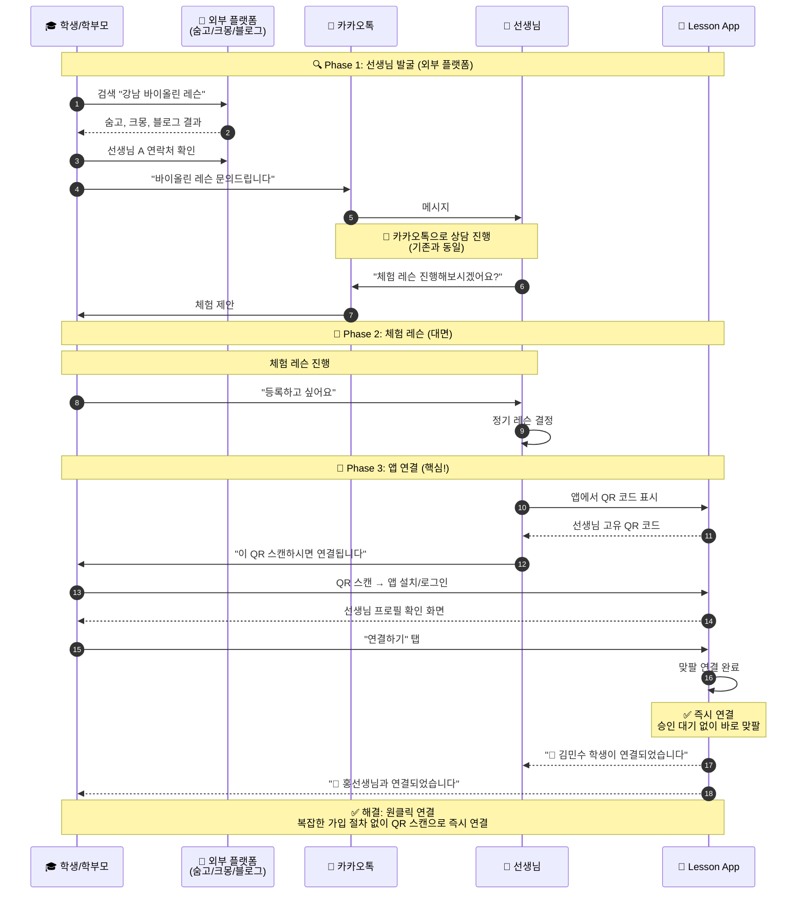
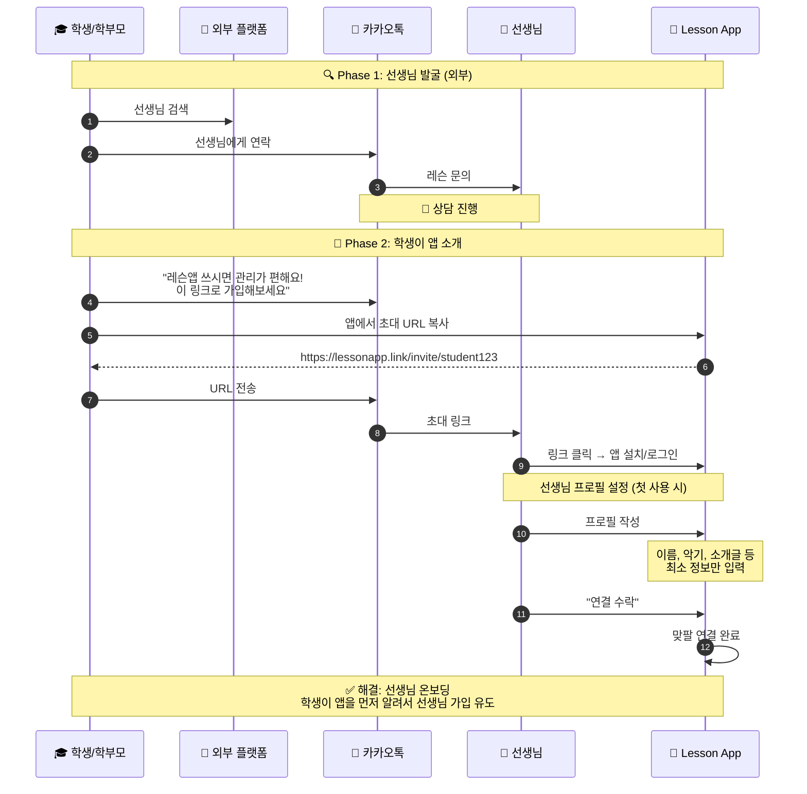
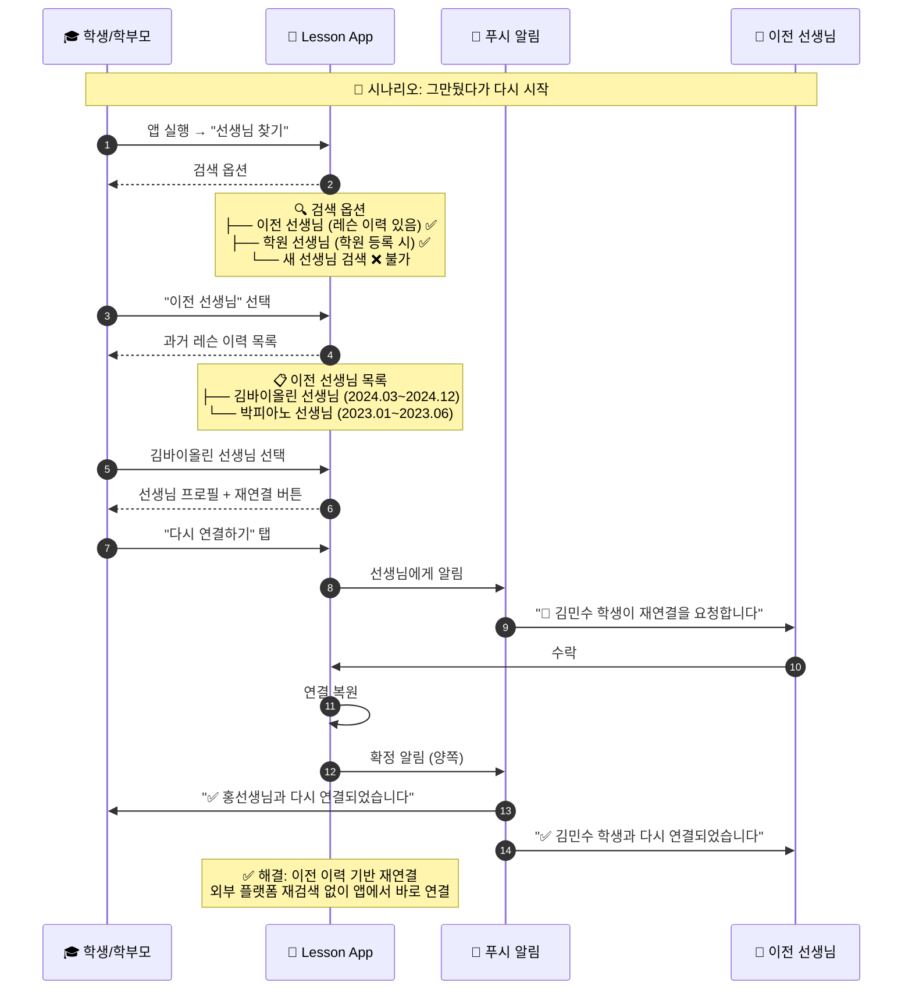
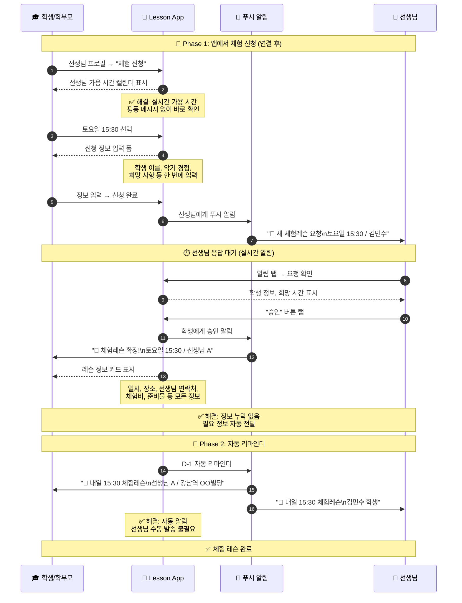
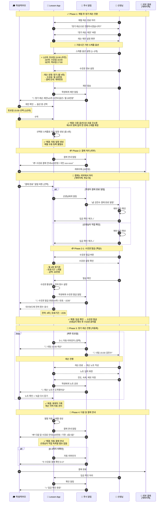
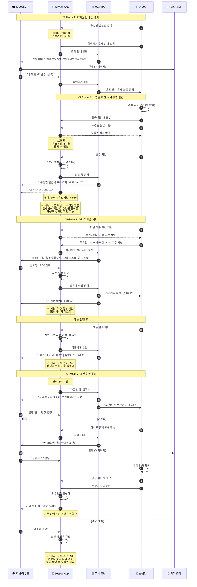
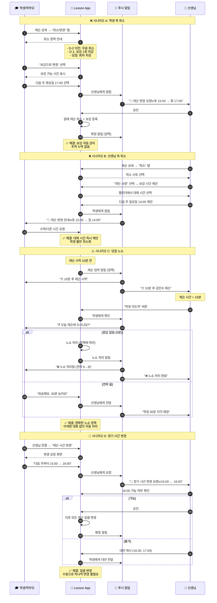
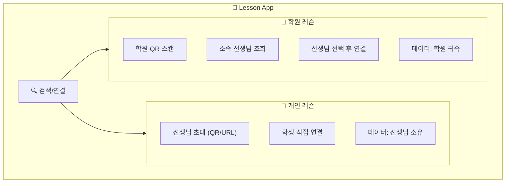

# 레슨 스케줄 플로우 (앱 사용)

> 마지막 업데이트: 2026-01-26

lesson-app을 사용했을 때의 레슨 스케줄 플로우입니다.
[앱 미사용 플로우](flow_without_app.md)와 비교하여 어떤 불편함이 해소되는지 보여줍니다.

---

## 🔑 앱 핵심 특징

### 선생님 탐색: 기존과 동일

> **lesson-app은 선생님 검색/매칭 플랫폼이 아닙니다.**
> 선생님 탐색은 **기존과 동일하게 외부 플랫폼**(숨고, 크몽, 블로그 등)에서 진행합니다.

```
🔍 선생님 탐색 (앱 미사용과 동일)
├── 숨고, 크몽 등에서 선생님 검색
├── 블로그, 인스타에서 프로필 확인
├── 카카오톡으로 상담
└── 체험 레슨 진행
    ↓
📱 앱 연결 (여기서부터 앱 사용)
├── 선생님이 QR 코드 제시
├── 학생이 스캔하여 연결
└── 이후 레슨 관리는 앱에서
```

### 연결 방식: 초대 기반

선생님-학생 연결은 **상호 초대**를 통해서만 가능합니다.

| 방식 | 설명 | 주요 사용 시나리오 |
|------|------|------------------|
| **QR 코드** | 대면 시 선생님이 QR 제시 → 학생 스캔 | 체험 레슨 후 등록 (주요) |
| **URL 링크** | 카톡/문자로 초대 링크 공유 | 비대면 상담 후 연결 |
| **초대 코드** | 선생님 고유 코드 입력 | 전화 상담 후 연결 |

### 앱 내 검색이 가능한 경우

| 검색 유형 | 조건 | 설명 |
|----------|------|------|
| **이전 선생님 검색** | 과거 레슨 이력 있음 | 그만뒀다가 다시 시작할 때 |
| **학원 내 선생님** | 학원에 등록된 선생님 | 학원 레슨 등록 시 |

> ⚠️ **신규 선생님 검색은 불가** - 외부 플랫폼에서 찾은 후 초대로 연결

### 레슨 유형 구분

| 카테고리 | 설명 | 앱 내 검색 |
|----------|------|:----------:|
| **👤 개인 레슨** | 선생님 개인이 직접 관리 | ❌ (초대만) |
| **🏫 학원 레슨** | 학원 소속 선생님 레슨 | ✅ 학원 내 선생님 조회 |
| **🔄 재연결** | 이전에 레슨했던 선생님 | ✅ 이력 기반 검색 |

### 결제 및 수강권 발급

> **결제는 외부에서 처리** (계좌이체, 현금 등)
> 앱에서는 **결제 요청 알림**, **입금 확인**, **수강권 발급**을 지원합니다.

```
💳 결제 → 수강권 발급 플로우
1. 앱 → 학생: 결제 안내 알림 (자동)
2. 학생 → 은행: 계좌이체 (외부)
3. 선생님: 입금 확인 → 앱에서 체크 (수동)
4. 선생님 → 앱: 수강권 발급 (수동)
5. 앱 → 학생: 수강권 발급 완료 알림
```

> ⚠️ **입금 확인과 수강권 발급은 선생님이 직접 처리**합니다.

---

## 1. 선생님-학생 연결 플로우

### 1.1 개인 레슨: 선생님이 초대 (주요 시나리오)



### 1.2 개인 레슨: 학생이 초대 (역방향)



### 1.3 학원 레슨: 학원 → 선생님 선택


### 1.4 이전 선생님 재연결 플로우



### 1.5 연결 방식 비교

| 구분 | 앱 미사용 | 앱 사용 | 개선 |
|------|----------|--------|------|
| **신규 선생님** | 외부 플랫폼 → 카톡 연락 | 외부 플랫폼 → **QR/URL로 앱 연결** | 탐색은 동일, 연결만 앱 |
| **이전 선생님** | 연락처 찾기 → 다시 연락 | **앱에서 이력 검색 → 재연결** | 🔥 간편한 재연결 |
| **학원 레슨** | 전화 → 학원 배정 | 앱에서 **선생님 직접 선택** | 선택권 + 투명성 |
| **연결 관리** | 연락처로만 관리 | 앱에서 **관계 상태 확인** | 명확한 관계 |

---

## 2. 체험 레슨 예약 플로우

### 2.1 시퀀스 다이어그램



### 2.2 개선 효과 비교

| 단계 | 앱 미사용 | 앱 사용 | 개선율 |
|------|----------|--------|:------:|
| 일정 조율 | 5-10회 메시지 | **1클릭 선택** | 🔥 95% |
| 정보 교환 | 여러 번 왕복 | **자동 전달** | 🔥 100% |
| 리마인더 | 수동 | **자동 푸시** | 🔥 100% |

---

## 3. 정기 레슨 등록 플로우

### 3.1 시퀀스 다이어그램



### 3.2 선생님 가용시간 설정 및 다중 옵션 제안

> **상세 스펙**: [Multi_Option_Schedule_Spec.md](Multi_Option_Schedule_Spec.md) Part B 참조
> - 선생님 가용시간 설정 화면 (B.2)
> - 다중 옵션 제안/응답 화면 (B.3, B.4)
> - 데이터 모델 및 비즈니스 로직 (B.6, B.7)

| 항목 | 설명 |
|------|------|
| **핵심** | 선생님이 1~3개 스케줄 옵션 제안 → 학생이 선택 |
| **개선 효과** | 조율 왕복 70%↓, 당일 확정 가능 |

```
선생님 가용시간 설정 → 다중 옵션 제안 발송 → 학생 옵션 선택 → 스케줄 확정
```

---

### 3.3 결제 및 수강권 발급

> **상세 스펙**: [subscription_system_spec.md](../subscription/subscription_system_spec.md) 섹션 5.7 참조
> - 수강권 발급 플로우 (결제 완료 / 미수금)
> - 결제 상태 옵션
> - 수강권 상태 관리

| 항목 | 설명 |
|------|------|
| **핵심** | 선생님이 입금 확인 → 앱에서 수강권 발급 |
| **개선 효과** | 학생도 수강권/잔여 횟수 실시간 확인 가능 |

```
결제 안내 → 학생 결제 (외부) → 선생님 입금 확인 → 수강권 발급 → 학생 알림
```

---

### 3.4 결제 관련 비교

| 항목 | 앱 미사용 | 앱 사용 | 차이 |
|------|----------|--------|------|
| **결제 방식** | 계좌이체 | **계좌이체 (동일)** | - |
| **입금 확인** | 선생님 직접 확인 | **선생님 직접 확인 (동일)** | - |
| **수강권 발급** | 구두/메모 | **앱에서 발급 → 학생 확인** | ✅ 개선 |
| **미수금 관리** | 수기 기록 | **앱에서 미수금 목록 관리** | ✅ 개선 |
| **잔여 횟수** | 선생님만 기억 | **학생도 실시간 확인** | ✅ 개선 |
| **결제 요청** | 카톡으로 직접 | **앱 자동 알림** | ✅ 개선 |
| **독촉** | 어색한 개인 연락 | **앱 자동 리마인더** | ✅ 개선 |
| **결제 기록** | 없음 | **앱에 이력 저장** | ✅ 개선 |

### 3.5 개선 효과 비교

| 단계 | 앱 미사용 | 앱 사용 | 개선율 |
|------|----------|--------|:------:|
| 조건 협의 | 메시지 왕복 | **앱 내 제안/수락** | 🔥 90% |
| 계약 | 구두 약속 | **명시적 기록** | 🔥 100% |
| 스케줄 등록 | 매월 수동 | **자동 생성** | 🔥 100% |
| 리마인더 | 수동 발송 | **자동 푸시** | 🔥 100% |
| 레슨 기록 | 수기/엑셀 | **인앱 노트** | 🔥 90% |
| 결제 요청 | 직접 연락 | **자동 알림** | 🔥 100% |
| 입금 확인 | 수동 | **수동 (변동 없음)** | - |
| 수강권 발급 | 구두/메모 | **앱 발급 → 학생 확인** | 🔥 90% |
| 잔여 횟수 확인 | 선생님에게 문의 | **학생 실시간 확인** | 🔥 100% |

**선생님 월간 관리 시간: 4-6시간 → 1시간 미만**

---

## 4. 회차권 레슨 플로우

### 4.1 시퀀스 다이어그램



### 4.2 개선 효과 비교

| 단계 | 앱 미사용 | 앱 사용 | 개선율 |
|------|----------|--------|:------:|
| 매 예약 | 3-5회 메시지 | **1-2회 탭** | 🔥 90% |
| 횟수 관리 | 수동 기록 | **자동 차감** | 🔥 100% |
| 잔여 안내 | 선생님이 알림 | **앱에서 확인** | 🔥 100% |
| 연장 안내 | 선생님이 문의 | **자동 알림** | 🔥 100% |

**10회권 총 메시지: 40-60회 → 10-15회**

---

## 5. 레슨 취소/변경 플로우

### 5.1 시퀀스 다이어그램



### 5.2 개선 효과 비교

| 시나리오 | 앱 미사용 | 앱 사용 | 개선율 |
|----------|----------|--------|:------:|
| 학생 취소 | 메시지 핑퐁 | **1-2클릭** | 🔥 90% |
| 보강 관리 | 수동 추적 | **자동 관리** | 🔥 100% |
| 선생님 취소 | 어색한 알림 | **앱 자동 안내** | 🔥 100% |
| 노쇼 처리 | 즉흥 대응 | **정책 기반 자동** | 🔥 100% |
| 시간 변경 | 모든 일정 수동 | **일괄 변경** | 🔥 100% |

---

## 6. 개인 레슨 vs 학원 레슨 비교

### 6.1 앱 내 구분



### 6.2 기능 비교

| 기능 | 👤 개인 레슨 | 🏫 학원 레슨 |
|------|-------------|-------------|
| **신규 연결** | QR/URL 초대 | 학원 → 선생님 선택 |
| **신규 선생님 검색** | ❌ 불가 (초대만) | ✅ 학원 내 선생님 조회 |
| **이전 선생님 검색** | ✅ 이력 기반 재연결 | ✅ 이력 기반 재연결 |
| **데이터 소유** | 공동 (선생님+학생) | 공동 (학원+선생님+학생) |
| **수강권 발행** | 선생님 | 학원 |
| **정산** | 선생님 직접 | 학원에서 처리 |
| **선생님 변경** | 새로 연결 | 학원 내 전환 가능 |

### 6.3 레슨 노트 데이터 소유권

> **원칙: 비용을 지불한 학생도 레슨 노트 데이터를 소유합니다.**
>
> 상세 정책: [subscription_system_spec.md](../subscription/subscription_system_spec.md) 섹션 4 참조

```
📋 레슨 노트 접근 권한
├── ✅ 선생님: 작성/수정/열람 (담당 학생만)
├── ✅ 학생: 열람 (자신의 레슨만)
├── ❌ 다른 선생님: 기본 접근 불가 (학생 승인 시 공유 가능)
├── ❌ 학원 (개인레슨): 접근 불가
└── ⚠️ 학원 (학원레슨): 학원 정책에 따름
```

| 시나리오 | 학생 | 기존 선생님 | 새 선생님 |
|----------|:----:|:----------:|:--------:|
| **정상 연결 중** | ✅ 열람 | ✅ 열람 | - |
| **연결 해제/변경** | ✅ 계속 열람 | ❌ 차단 | ❌ 기본 불가 |
| **새 선생님에게 공유** | ✅ 열람 | ❌ 차단 | ✅ 학생 승인 시 |
| **이전 선생님 재연결** | ✅ 열람 | ✅ 복원 | - |

> ⚠️ **개인정보 보호**: 레슨 노트는 해당 선생님과 학생만 접근 가능합니다.
> 다른 선생님이나 외부에서는 **학생이 명시적으로 승인하지 않는 한** 확인할 수 없습니다.

### 6.4 학원 레슨의 추가 이점

| 이점 | 설명 |
|------|------|
| **선생님 선택권** | 학원 배정이 아닌 학생이 직접 선택 |
| **투명한 정보** | 선생님 프로필, 경력, 리뷰 확인 |
| **기록 보존** | 선생님 퇴사 시에도 학원에 기록 유지 |
| **통합 관리** | 여러 악기 레슨 한 앱에서 관리 |

---

## 7. 전체 개선 효과 종합

### 7.1 Pain Point 해결 매핑

| # | Pain Point | 앱 해결 방안 | 해결율 |
|---|------------|-------------|:------:|
| 1 | 정보 파편화 | QR/URL 초대로 앱 연결 | 🟡 부분 |
| 2 | 비동기 커뮤니케이션 | 푸시 알림 + 앱 내 메시지 | 🔥 90% |
| 3 | 핑퐁 메시지 | 가용 시간 표시 + 원클릭 예약 | 🔥 95% |
| 4 | 정보 누락 | 자동 정보 전달 | 🔥 100% |
| 5 | 수동 리마인더 | 자동 푸시 알림 | 🔥 100% |
| 6 | 구두 약속 | 앱 내 계약 기록 | 🔥 100% |
| 7 | 수동 정산 | 결제 알림 자동화 (확인은 수동) | 🟡 70% |
| 8 | 반복 작업 | 자동 스케줄 생성 | 🔥 100% |
| 9 | 변경 추적 어려움 | 보강/취소 자동 관리 | 🔥 100% |
| 10 | 어색한 독촉 | 앱 자동 결제 알림 | 🔥 100% |
| 11 | 매번 조율 | 복수 옵션 제안 | 🔥 90% |
| 12 | 연장 불확실성 | 자동 소진 알림 | 🔥 100% |
| 13 | 보강 추적 | 자동 보강 관리 | 🔥 100% |
| 14 | 신뢰 문제 | 투명한 취소 기록 | 🔥 90% |
| 15 | 노쇼 처리 | 정책 기반 자동 처리 | 🔥 100% |
| 16 | 연쇄 수정 | 일괄 시간 변경 | 🔥 100% |

### 7.2 시간 절약 비교

| 활동 | 앱 미사용 | 앱 사용 | 절약 |
|------|----------|--------|------|
| 레슨 조율 (회차) | 30분-1시간 | **3분** | 🔥 95% |
| 월 스케줄 등록 | 30분 | **0분 (자동)** | 🔥 100% |
| 리마인더 발송 | 2분 × 학생수 | **0분 (자동)** | 🔥 100% |
| 레슨 기록 | 10분 | **3분** | 🔥 70% |
| 결제 요청 | 5분 × 학생수 | **0분 (자동)** | 🔥 100% |
| 입금 확인 | 5분 × 학생수 | **5분 × 학생수** | - |

### 7.3 선생님 월간 관리 시간

```
앱 미사용 (학생 10명 기준)
├── 스케줄 관리: 2시간
├── 입금 확인: 1시간 ← 변동 없음
├── 리마인더 발송: 1.5시간
├── 레슨 기록: 3시간
├── 결제 요청: 1시간
└── 변경/취소 처리: 1시간
총: 약 9.5시간

앱 사용 (학생 10명 기준)
├── 스케줄 관리: 0시간 (자동)
├── 입금 확인: 1시간 ← 변동 없음
├── 리마인더 발송: 0시간 (자동)
├── 레슨 기록: 50분 (간편 입력)
├── 결제 요청: 0시간 (자동)
└── 변경/취소 처리: 10분
총: 약 2시간

절약: 7.5시간/월 (79% 감소)
```

### 7.4 핵심 가치 정리

#### 선생님에게

| 가치 | 상세 |
|------|------|
| **시간 절약** | 월 7.5시간 관리 시간 절약 |
| **관계 부담 감소** | 결제 독촉, 노쇼 대응 앱이 처리 |
| **체계적 기록** | 레슨 노트, 진도 히스토리 관리 |
| **학생 확장** | QR/URL로 쉬운 학생 연결 |

#### 학생/학부모에게

| 가치 | 상세 |
|------|------|
| **편리한 예약** | 가용 시간 보고 원클릭 예약 |
| **투명한 정보** | 잔여 횟수, 결제 내역 실시간 확인 |
| **레슨 기록 소유** | 레슨 노트 공동 소유 - 선생님 변경 후에도 보존 |
| **자동 리마인더** | 레슨 일정 알림 자동 수신 |
| **개인정보 보호** | 레슨 노트는 해당 선생님과만 공유 |

#### 학원에게

| 가치 | 상세 |
|------|------|
| **선생님 조회** | 학원 내 선생님 프로필 노출 |
| **데이터 귀속** | 선생님 퇴사 시에도 기록 보존 |
| **통합 관리** | 여러 선생님 레슨 일괄 관리 |

---

## 8. 결론

### 핵심 메시지

> **"선생님은 레슨에만 집중하고,
> 학생/학부모는 투명한 정보를 얻습니다."**

### 앱 사용 시 변화

| 영역 | Before | After |
|------|--------|-------|
| **연결** | 카톡 연락처만 | QR/URL로 앱 연결 |
| **예약** | 메시지 핑퐁 | 원클릭 선택 |
| **스케줄** | 수동 등록 | 자동 생성 |
| **리마인더** | 수동 알림 | 자동 푸시 |
| **결제 요청** | 어색한 독촉 | 자동 알림 |
| **결제 확인** | 수동 | 수동 (변동 없음) |
| **레슨 기록** | 수기/엑셀 (선생님만) | 인앱 노트 (선생님+학생 공동 소유) |
| **기록 접근** | 선생님만 보유 | 해당 선생님+학생만 열람 |
| **잔여 횟수** | 선생님만 앎 | 양쪽 확인 |

### 앱의 한계 (명확화)

| 항목 | 앱 지원 | 비고 |
|------|:------:|------|
| **신규** 선생님 탐색 | ❌ | 외부 플랫폼 이용 (숨고, 크몽 등) |
| **이전** 선생님 검색 | ✅ | 레슨 이력 있으면 앱에서 검색 가능 |
| 학원 선생님 검색 | ✅ | 학원 내 등록된 선생님 조회 |
| 결제 처리 | ❌ | 외부 계좌이체 |
| 입금 확인 | ⚠️ 수동 | 선생님이 직접 확인 |

### 다음 단계

1. **선생님**: 앱 가입 → 프로필 작성 → QR 코드 생성
2. **체험 레슨 후**: QR 스캔으로 학생 연결
3. **정기 레슨 설정**: 자동 스케줄 시작
4. **레슨 노트 작성**: 히스토리 축적

---

## 부록: 설계 검증 체크리스트

이 문서를 통해 확인된 설계 포인트:

| # | 항목 | 현재 스펙 | 상태 |
|---|------|----------|:----:|
| 1 | QR 코드 초대 | invite_system_v2.md | ✅ |
| 2 | URL 링크 초대 | invite_system_v2.md | ✅ |
| 3 | 학원 내 선생님 검색 | three_party_relationship_spec.md | ✅ |
| 4 | 개인/학원 레슨 구분 | three_party_relationship_spec.md | ✅ |
| 5 | 결제 알림 자동화 | notification_system.md | ✅ |
| 6 | 입금 확인 수동 처리 | payment_unified_spec.md | ✅ |
| 7 | 복수 시간 옵션 제안 | Multi_Option_Schedule_Spec.md | ✅ |
| 8 | 노쇼 정책 자동 처리 | lesson_schedule.md | ⚠️ 상세화 필요 |
| 9 | 보강 자동 추적 | - | ⚠️ 명시적 설계 필요 |
| 10 | 정기 레슨 일괄 시간 변경 | - | ⚠️ 설계 확인 필요 |
| 11 | 레슨 노트 공동 소유 | subscription_system_spec.md | ✅ |
| 12 | 레슨 노트 접근 제한 (선생님+학생만) | - | ✅ 본 문서에 명시 |

→ 발견된 설계 누락은 별도 이슈로 추적
