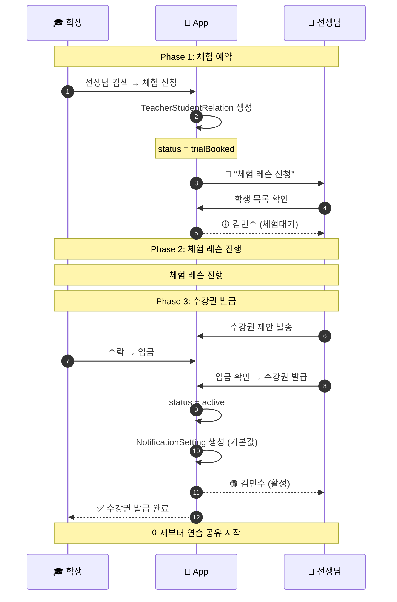
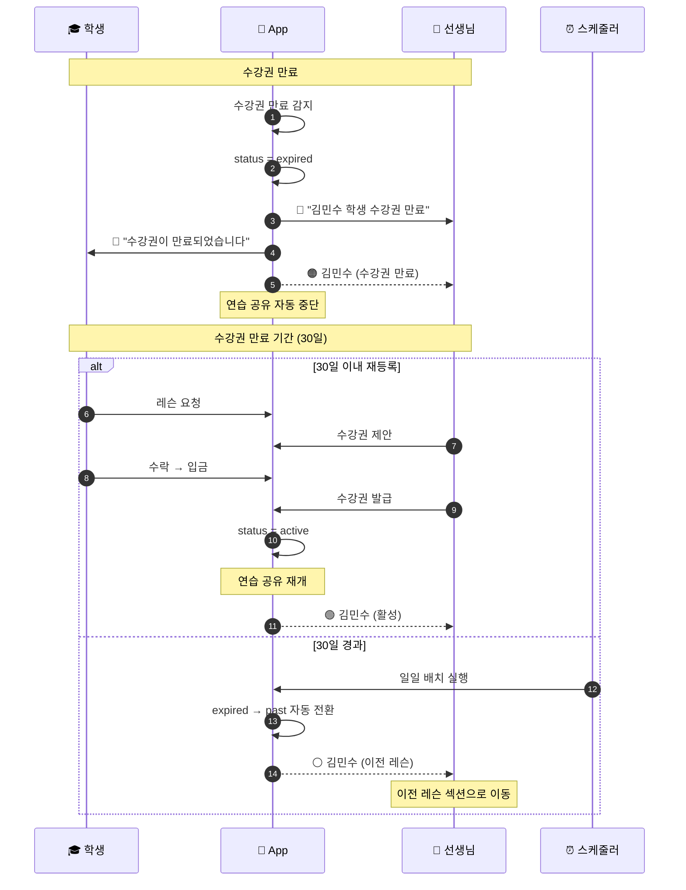
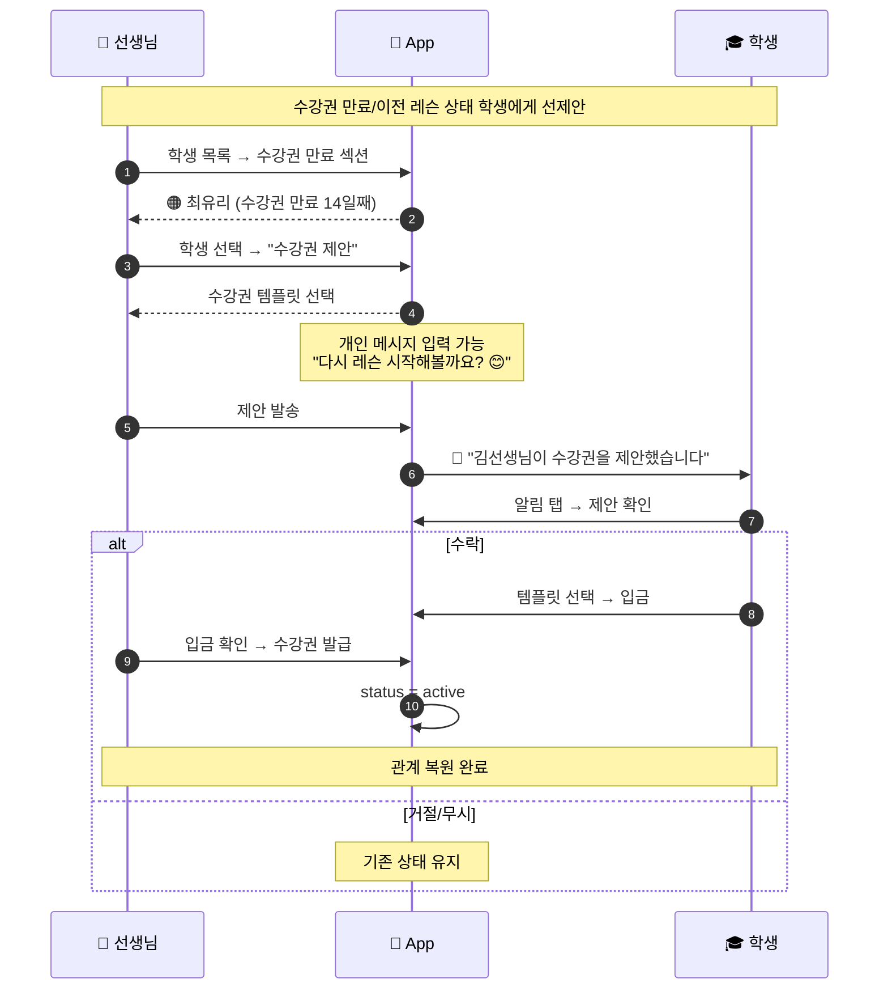
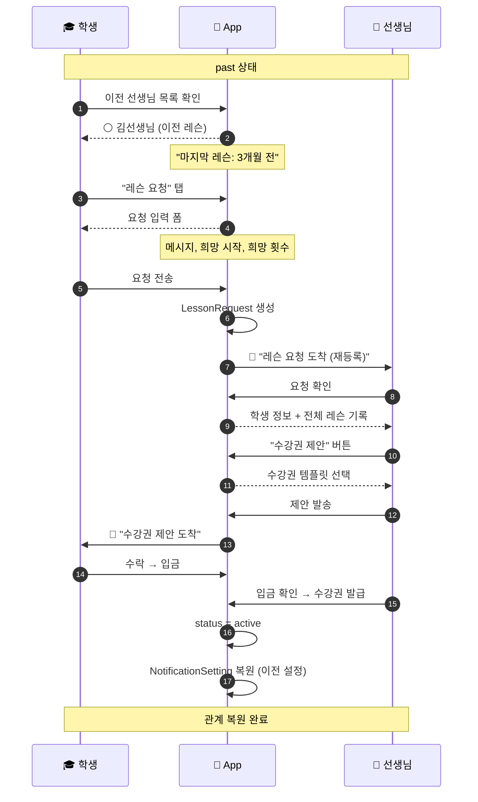
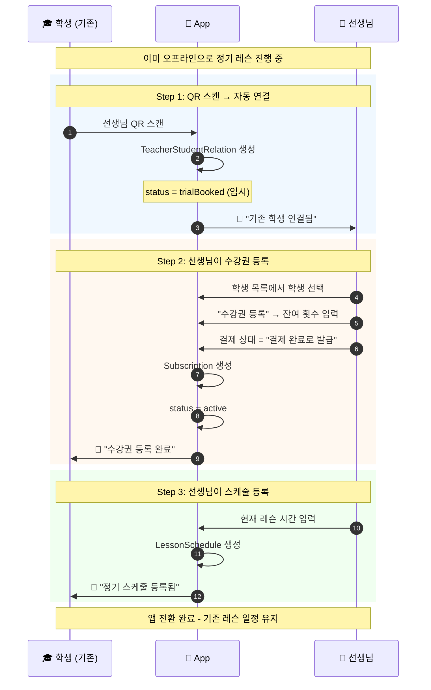

# 수강권 중심 관계 모델 (Subscription-Based Relationship)

> 최종 업데이트: 2026-01-30
> 상태: 설계 완료

> 📖 **용어 정의**: [glossary.md](../glossary.md) 참조

---

## 1. 개요

### 1.1 설계 배경

기존 "연결(Connection)" 중심 모델의 문제점:
- 연결 ≠ 레슨 관계 (개념 불일치)
- 수강권과 연결의 분리로 인한 혼란
- "연결 끊김"이 레슨 관계 종료로 오해됨

### 1.2 핵심 변경

| 항목 | 기존 (Connection 중심) | 변경 (Subscription 중심) |
|------|----------------------|------------------------|
| 관계 정의 | ~~맞팔~~ | **수강권 상태** |
| 연결 의미 | 레슨 관계 | **알림/공유 설정** |
| 상태 기준 | 팔로우 상태 | **수강권 유효 기간** |
| 자동 전환 | 없음 | **30일 후 "이전 레슨"으로 전환** |
| 팔로우 용도 | 레슨 관계 | **소식 구독** (공연/이벤트) |

### 1.3 설계 결정사항

| 항목 | 결정 | 이유 |
|------|------|------|
| 만료 후 대기 기간 | 30일 | 일반적인 레슨 간격 커버 |
| 연습 공유 | 수강권 유효 시만 | 명확한 권한 구분 |
| 체험 전 상태 | 체험대기로 표시 | 선생님 학생 목록 관리 |
| 이전 레슨 접근권 | 전체 유지 | 장기 레슨 이전 레슨 보존 |
| 수기 등록 학생 | 항상 active | 선생님이 직접 관리 |
| 자동 리마인더 | 보내지 않음 | 스팸 방지, 선생님이 직접 제안 |
| 선생님 선제안 | 가능 (월 1회 제한) | 학생 부담 고려 |

### 1.4 용어 정의

> ⚠️ **중요**: "수강권 만료"이라는 용어는 사용하지 않습니다. 앱 수강권 만료과 혼동될 수 있기 때문입니다.

| 상태 | 표시 용어 (한글) | 코드 (영문) | 설명 |
|------|-----------------|------------|------|
| 체험대기 | "체험 예정" | `trialBooked` | 체험 레슨 예약됨 |
| 수강 중 | "수강 중" | `active` | 유효 수강권 있음 |
| 수강권 만료 | "수강권 만료" | `expired` | 만료 후 30일 이내 |
| 이전 레슨 | "이전 레슨" | `past` | 만료 후 30일 초과 |

---

## 2. 관계 상태 모델

### 2.0 수기 등록 학생 (특수 케이스)

> **수기 등록 학생**은 앱을 사용하지 않고 선생님이 직접 등록한 학생입니다.
> 수강권 유무와 관계없이 **항상 active** 상태를 유지합니다.

```
┌─────────────────────────────────────────────────────────────────┐
│  수기 등록 학생 처리                                              │
├─────────────────────────────────────────────────────────────────┤
│                                                                  │
│  특징:                                                           │
│  - 앱 미사용 (offline 학생)                                      │
│  - 선생님이 직접 등록/관리                                        │
│  - 수강권 관리도 선생님이 직접                                    │
│                                                                  │
│  상태 규칙:                                                       │
│  - 항상 active (수강권 만료되어도)                                │
│  - 연습 공유 기능 없음 (앱 미사용이므로)                          │
│  - 수강권 만료/이전 레슨 전환 없음                                            │
│                                                                  │
│  표시:                                                           │
│  - 학생 목록에 ⚪ 오프라인 아이콘 표시                            │
│  - "앱 초대" 버튼 제공                                            │
│                                                                  │
│  앱 연결 시:                                                      │
│  - 수강권 유무에 따라 정상 상태 전환                              │
│  - 수강권 있음 → active                                          │
│  - 수강권 없음 → past (또는 체험 예약 시 trialBooked)         │
│                                                                  │
└─────────────────────────────────────────────────────────────────┘
```

| 구분 | 앱 사용 학생 | 수기 등록 학생 |
|------|:-----------:|:-------------:|
| 상태 전환 | 수강권 기반 자동 | ❌ 항상 active |
| 연습 공유 | ✅ | ❌ |
| 수강권 만료/이전 레슨 전환 | ✅ | ❌ |
| 선생님 기능 | 전체 | 레슨/결제 기록만 |

### 2.1 RelationshipStatus (새로운 상태)

```dart
/// 수강권 기반 선생님-학생 관계 상태
enum RelationshipStatus {
  /// 체험 레슨 예약됨 (수강권 발급 전)
  trialBooked,

  /// 활성 - 수강권 유효 (정규 레슨 진행 중)
  active,

  /// 수강권 만료 - 수강권 만료 후 30일 이내
  expired,

  /// 이전 레슨 - 수강권 만료 기간 종료 (30일 초과)
  past,
}
```

### 2.2 상태별 정의

| 상태 | 조건 | 설명 |
|------|------|------|
| `trialBooked` | 체험 예약 완료, 수강권 없음 | 잠재 학생 |
| `active` | 유효 수강권 존재 | 정규 레슨 진행 중 |
| `expired` | 수강권 만료 후 30일 이내 | 일시적 휴식 |
| `past` | 수강권 만료 후 30일 초과 | 과거 학생 |

### 2.3 상태 전이 다이어그램

```
┌─────────────────────────────────────────────────────────────────────┐
│                      관계 상태 전이도                                 │
├─────────────────────────────────────────────────────────────────────┤
│                                                                      │
│  [신규 학생 유입]                                                    │
│        │                                                             │
│        ▼                                                             │
│  ┌─────────────┐                                                     │
│  │ trialBooked │ ←── 체험 예약                                       │
│  │ (체험대기)   │                                                     │
│  └──────┬──────┘                                                     │
│         │                                                            │
│         │ 수강권 발급 (체험 후 등록)                                  │
│         │ (체험 취소/노쇼 → 관계 종료)                                │
│         ▼                                                            │
│  ┌─────────────┐                                                     │
│  │   active    │ ←─────────────────────────────────────┐             │
│  │  (활성)     │                                        │             │
│  └──────┬──────┘                                        │             │
│         │                                               │             │
│         │ 수강권 만료                                   │             │
│         ▼                                               │             │
│  ┌─────────────┐    선생님 선제안 또는                  │             │
│  │   expired   │    학생 레슨 요청 후                   │             │
│  │ (수강권만료) │ ───────수강권 발급──────────────────────┤             │
│  └──────┬──────┘                                        │             │
│         │                                               │             │
│         │ 30일 경과 (자동 전환)                         │             │
│         ▼                                               │             │
│  ┌─────────────┐    선생님 선제안 또는                  │             │
│  │    past     │    학생 레슨 요청 후                   │             │
│  │ (이전 레슨) │ ───────수강권 발급──────────────────────┘             │
│  └─────────────┘                                                     │
│                                                                      │
│  ─────────────────────────────────────────────────────────────────  │
│                                                                      │
│  [수기 등록 학생 - 별도 경로]                                        │
│                                                                      │
│  ┌─────────────┐                                                     │
│  │   active    │ ←── 선생님이 직접 등록                              │
│  │ (수기/항상) │                                                     │
│  └─────────────┘                                                     │
│        │                                                             │
│        │ 학생이 앱 연결 시                                           │
│        ▼                                                             │
│  (수강권 유무에 따라 정상 상태로 전환)                                │
│                                                                      │
│  ─────────────────────────────────────────────────────────────────  │
│                                                                      │
│  [기존 정기레슨 → 앱 전환 - 별도 경로] ★ NEW                         │
│                                                                      │
│  ┌─────────────┐                                                     │
│  │ trialBooked │ ←── QR 스캔 (기존 학생)                             │
│  │ (임시 상태) │                                                     │
│  └──────┬──────┘                                                     │
│         │                                                             │
│         │ 선생님이 수강권 등록 (결제 완료로 발급)                     │
│         ▼                                                             │
│  ┌─────────────┐                                                     │
│  │   active    │ ←── 스케줄 직접 입력                                │
│  │ (즉시 활성) │                                                     │
│  └─────────────┘                                                     │
│        │                                                             │
│        │ 이후 일반 상태 전이 적용                                    │
│        ▼                                                             │
│  (수강권 만료 시 expired → past)                                     │
│                                                                      │
│  👉 상세: flow_with_app.md 섹션 2.5                                  │
│                                                                      │
└─────────────────────────────────────────────────────────────────────┘
```

### 2.4 재등록 및 앱 전환 경로 (중요)

수강권 만료/이전 레슨 학생이 다시 active로 돌아오는 경로는 **3가지**:

| 경로 | 주체 | 플로우 | 설명 |
|------|------|--------|------|
| **학생 레슨 요청** | 학생 | 레슨 요청 → 선생님 수강권 제안 → 발급 | 앱 내 요청 |
| **선생님 선제안** | 선생님 | 선생님이 직접 수강권 제안 → 학생 수락 → 발급 | 앱 내 제안 |
| **기존 정기레슨 → 앱 전환** | 선생님 | QR 스캔 → 수강권 등록 → 스케줄 등록 | 오프라인→온라인 전환 |

> ⚠️ 모든 경로에서 **수강권 발급**이 최종 트리거입니다.
> 앱 전환 플로우 상세는 lesson_master.md 참조.

---

## 3. 팔로우 시스템 (소식 구독)

### 3.1 개념

> **팔로우 = 소식 구독** (수강권/레슨 관계와 무관)

인스타그램처럼 누구나 선생님이나 학원을 팔로우하여 **공연, 행사, 소식** 등을 받아볼 수 있습니다.

```
┌─────────────────────────────────────────────────────────────────┐
│                     관계 vs 팔로우 비교                          │
├─────────────────────────────────────────────────────────────────┤
│                                                                  │
│  관계 (RelationshipStatus)        팔로우 (Follow)               │
│  ─────────────────────────        ────────────────              │
│  • 수강권 기반                    • 누구나 가능                  │
│  • 레슨/연습/과제 관련            • 소식/공연/행사 알림         │
│  • 학생만 가능                    • 학생/학부모/일반인 가능     │
│  • 선생님의 수락 필요              • 수락 불필요 (일방향)        │
│  • 자동 전환 (수강권 상태)        • 사용자가 직접 팔로우/언팔   │
│                                                                  │
└─────────────────────────────────────────────────────────────────┘
```

### 3.2 팔로우 대상

| 대상 | 팔로우 가능 여부 | 설명 |
|------|:---------------:|------|
| 선생님 | ✅ | 개인 선생님 소식 |
| 학원 | ✅ | 학원 행사/공연 소식 |
| 학생 | ❌ | 팔로우 대상 아님 |

### 3.3 팔로우 알림 종류

| 알림 종류 | 예시 |
|----------|------|
| 🎵 공연 | "김선생님의 제자 발표회 - 12/25" |
| 📢 공지 | "연말 레슨 일정 안내" |
| 🎄 행사 | "크리스마스 특별 클래스 모집" |
| 📰 소식 | "신규 바이올린 클래스 오픈" |

### 3.4 Follow 엔티티

```dart
@HiveType(typeId: 93)
@JsonSerializable()
class Follow extends HiveObject {
  @HiveField(0)
  final String id;

  /// 팔로우 하는 사람 (학생, 학부모, 일반인)
  @HiveField(1)
  final String followerId;

  /// 팔로우 대상 (선생님 또는 학원)
  @HiveField(2)
  final String followingId;

  /// 대상 타입
  @HiveField(3)
  final FollowTargetType targetType;

  /// 알림 수신 여부 (기본 ON)
  @HiveField(4)
  final bool notificationEnabled;

  @HiveField(5)
  final DateTime createdAt;
}

@HiveType(typeId: 94)
enum FollowTargetType {
  @HiveField(0)
  teacher,   // 선생님

  @HiveField(1)
  academy,   // 학원
}
```

### 3.5 팔로우와 레슨 관계의 관계

```
┌─────────────────────────────────────────────────────────────────┐
│                     시나리오별 상태                              │
├─────────────────────────────────────────────────────────────────┤
│                                                                  │
│  Case 1: 팔로우만 함 (레슨 관계 없음)                           │
│  ─────────────────────────────────                              │
│  • 선생님 프로필에서 [팔로우] 클릭                              │
│  • 소식/공연 알림만 수신                                        │
│  • 레슨 관련 기능 없음                                          │
│                                                                  │
│  Case 2: 레슨 학생 + 팔로우                                     │
│  ─────────────────────────                                      │
│  • 수강권 발급 시 자동 팔로우 (선택 가능)                       │
│  • 레슨 알림 + 소식 알림 모두 수신                              │
│  • 수강권 만료되어도 팔로우는 유지                              │
│                                                                  │
│  Case 3: 레슨 학생 + 언팔로우                                   │
│  ─────────────────────────                                      │
│  • 레슨 관계는 그대로 유지                                      │
│  • 소식/공연 알림만 수신 안 함                                  │
│  • 레슨 알림은 정상 수신                                        │
│                                                                  │
│  Case 4: 수강권 만료 후                                         │
│  ────────────────────                                           │
│  • 레슨 관계: expired → past                                    │
│  • 팔로우: 사용자 설정 그대로 유지                              │
│  • 소식 계속 수신 (언팔하지 않았다면)                           │
│                                                                  │
└─────────────────────────────────────────────────────────────────┘
```

### 3.6 UI 예시 - 선생님 프로필

```
┌─────────────────────────────────────────────────────────────────┐
│  ← 김선생님                                                      │
├─────────────────────────────────────────────────────────────────┤
│                                                                  │
│            [프로필 이미지]                                       │
│                                                                  │
│            김선생님                                              │
│            바이올린 · 비올라                                    │
│            📍 서울 강남 · 경력 15년                             │
│                                                                  │
│            팔로워 24명                                           │
│                                                                  │
│        ┌───────────────┐  ┌───────────────┐                     │
│        │   팔로우 ❤️   │  │  체험 신청    │                     │
│        └───────────────┘  └───────────────┘                     │
│                                                                  │
│  ─────────────────────────────────────────────────────────      │
│                                                                  │
│  📢 소식                                                         │
│  ┌─────────────────────────────────────────────────────────┐    │
│  │ 🎵 연말 발표회 안내                          12/20      │    │
│  │    12/25 3시, 예술의전당 리사이틀홀                     │    │
│  └─────────────────────────────────────────────────────────┘    │
│  ┌─────────────────────────────────────────────────────────┐    │
│  │ 📢 신규 앙상블 클래스 오픈                    12/15      │    │
│  │    1월부터 4인 앙상블 클래스 시작합니다                 │    │
│  └─────────────────────────────────────────────────────────┘    │
│                                                                  │
└─────────────────────────────────────────────────────────────────┘
```

### 3.7 학부모 팔로우

```
학부모 A (자녀 B의 선생님: 김선생님)

자동 연동:
├── 자녀 B 연결 시 → 김선생님 자동 팔로우
└── 자녀 B 언팔로우 → 김선생님 팔로우 유지 (선택)

팔로우 상태:
├── 자녀의 레슨 관계와 무관하게 유지
├── 학부모가 직접 언팔 가능
└── 팔로워 수에 포함됨
```

---

## 4. 레슨 알림/공유 설정 (NotificationSetting)

### 4.1 개념 분리

```
기존: "연결" = 관계 + 알림 + 공유 (혼합)

변경:
├── 관계 (RelationshipStatus) = 수강권 기반 자동 관리
└── 설정 (NotificationSetting) = 사용자 선택
```

### 4.2 NotificationSetting 모델

```dart
/// 알림/공유 설정 (사용자가 직접 제어)
class NotificationSetting {
  final String id;
  final String userId;
  final String targetUserId;  // 상대방 ID

  /// 푸시 알림 수신 여부
  final bool pushEnabled;

  /// 연습 현황 공유 (학생만 설정 가능)
  /// - active 상태에서만 실제 공유됨
  /// - expired/past에서는 설정과 무관하게 공유 안 됨
  final bool practiceShareEnabled;

  /// 레슨 리마인더 알림
  final bool lessonReminderEnabled;

  /// 결제 알림
  final bool paymentReminderEnabled;

  final DateTime updatedAt;
}
```

### 4.3 기본값

| 설정 | 기본값 | 변경 가능 |
|------|:------:|:--------:|
| 푸시 알림 | ✅ On | ✅ |
| 연습 공유 | ✅ On | ✅ |
| 레슨 리마인더 | ✅ On | ✅ |
| 결제 알림 | ✅ On | ✅ |

### 4.4 알림 끄기 vs 관계 종료

| 액션 | 결과 | 관계 영향 |
|------|------|----------|
| **알림 끄기** | 푸시 알림 중단 | ❌ 영향 없음 |
| **연습 공유 끄기** | 연습 현황 비공개 | ❌ 영향 없음 |
| **관계 종료 요청** | 명시적 관계 종료 | ✅ past로 전환 |

---

## 5. 상태별 기능 매트릭스

### 5.1 선생님 기능

| 기능 | trialBooked | active | expired | past |
|------|:-----------:|:------:|:-------:|:-------:|
| 학생 목록에 표시 | ✅ (체험대기) | ✅ | ✅ (수강권 만료) | ✅ (이전 레슨) |
| 연습 현황 확인 | ❌ | ✅ | ❌ | ❌ |
| 레슨 노트 작성 | ❌ | ✅ | ❌ | ❌ |
| 과제 배정 | ❌ | ✅ | ❌ | ❌ |
| 레슨 기록 조회 | ❌ | ✅ | ✅ | ✅ |
| 결제 기록 조회 | ❌ | ✅ | ✅ | ✅ |
| 수강권 제안 | ✅ | ✅ | ✅ | ✅ |
| 레슨 예약 | ❌ | ✅ | ❌ | ❌ |

### 5.2 학생 기능

| 기능 | trialBooked | active | expired | past |
|------|:-----------:|:------:|:-------:|:-------:|
| 선생님 목록에 표시 | ✅ | ✅ | ✅ | ✅ (이전 레슨) |
| 레슨 노트 확인 | ❌ | ✅ | ✅ | ✅ |
| 연습 과제 확인 | ❌ | ✅ | ✅ | ✅ |
| 레슨 예약 | ❌ | ✅ | ❌ | ❌ |
| 레슨 요청 | ❌ | ❌ | ✅ | ✅ |
| 연습 기록 | ✅ (개인) | ✅ (공유) | ✅ (개인) | ✅ (개인) |

---

## 6. 세부 플로우

### 6.1 신규 학생 플로우 (체험 → 등록)



### 6.2 수강권 만료 → 재등록 플로우



### 6.3 선생님 선제안 플로우 (수강권 만료/이전 레슨 학생에게)

> **선생님이 먼저** 수강권 만료 또는 이전 레슨 상태의 학생에게 수강권을 제안할 수 있습니다.
> 학생의 레슨 요청 없이도 가능합니다.



### 6.4 이전 레슨 상태에서 재등록 플로우



### 6.5 기존 정기레슨 → 앱 전환 플로우

기존에 오프라인으로 레슨을 진행하던 선생님과 학생이 앱으로 전환하는 경우입니다.
체험 레슨, 결제 대기 과정 없이 바로 관계가 설정됩니다.



#### 앱 전환 특징

| 항목 | 일반 신규 플로우 | 앱 전환 플로우 |
|------|-----------------|---------------|
| 체험 레슨 | ✅ 필요 | ❌ 스킵 |
| 결제 대기 | ✅ 필요 | ❌ 스킵 (이미 결제됨) |
| 스케줄 기본값 | 체험 레슨 시간 | 선생님 직접 입력 |
| 관계 상태 | trialBooked → active | trialBooked → active (즉시) |

#### 앱 전환용 수강권 발급 코드

> 👉 **상세 구현**: [subscription_proposal_spec.md](../subscription/subscription_proposal_spec.md#85-기존-정기레슨--앱-전환)

```dart
/// 앱 전환 시 수강권 즉시 발급 (결제 확인 스킵)
void issueSubscriptionForAppTransition({
  required String studentId,
  required int remainingLessons,
  required Duration validity,
}) {
  // 1. 수강권 발급 (입금 확인 스킵)
  final subscription = Subscription(
    studentId: studentId,
    remainingLessons: remainingLessons,
    validUntil: DateTime.now().add(validity),
    paymentStatus: PaymentStatus.completed,  // 이미 결제됨으로 표시
    isAppTransition: true,  // 앱 전환 플래그
  );

  // 2. 관계 상태 변경
  updateRelationStatus(studentId, RelationshipStatus.active);

  // 3. 알림 발송
  notifyStudent(studentId, "수강권이 등록되었습니다");

  // 4. 스케줄 설정 화면으로 이동
  navigateToScheduleSetup(studentId);
}
```

---

## 7. UI 설계

### 7.1 선생님 - 학생 목록

```
┌─────────────────────────────────────────────────────────────────┐
│  내 학생                                                         │
├─────────────────────────────────────────────────────────────────┤
│                                                                  │
│  활성 (3명)                                                      │
│  ┌─────────────────────────────────────────────────────────┐    │
│  │ 🟢 김민수 · 바이올린                                     │    │
│  │    수강권: 4/8회 남음 · 연습 🟢 우수                      │    │
│  └─────────────────────────────────────────────────────────┘    │
│  ┌─────────────────────────────────────────────────────────┐    │
│  │ 🟢 이서연 · 피아노                                       │    │
│  │    수강권: 2/4회 남음 · 연습 🟠 보통                      │    │
│  └─────────────────────────────────────────────────────────┘    │
│                                                                  │
│  체험대기 (1명)                                                  │
│  ┌─────────────────────────────────────────────────────────┐    │
│  │ 🟡 박지훈 · 첼로                                         │    │
│  │    체험: 1/25 (토) 14:00                                 │    │
│  └─────────────────────────────────────────────────────────┘    │
│                                                                  │
│  수강권 만료 (1명)                                  [레슨 요청 1건 📬]  │
│  ┌─────────────────────────────────────────────────────────┐    │
│  │ 🟠 최유리 · 바이올린                                     │    │
│  │    마지막 레슨: 2주 전 · 수강권 만료 14일째                      │    │
│  │                                                          │    │
│  │    [수강권 제안] ← 학생 요청 없이도 선생님이 먼저 제안     │    │
│  └─────────────────────────────────────────────────────────┘    │
│                                                                  │
│  수기 등록 (2명)                                                 │
│  ┌─────────────────────────────────────────────────────────┐    │
│  │ ⚪ 정민호 · 기타 (오프라인)                              │    │
│  │    수강권: 2/4회 남음                    [앱 초대]        │    │
│  └─────────────────────────────────────────────────────────┘    │
│                                                                  │
│  이전 레슨 (12명)                                          [더보기 >] │
│  ┌─────────────────────────────────────────────────────────┐    │
│  │ ⚪ 한지민 · 바이올린                                     │    │
│  │    마지막 레슨: 3개월 전 · 총 24회                       │    │
│  │                                                          │    │
│  │    [수강권 제안]  [레슨 기록]                            │    │
│  └─────────────────────────────────────────────────────────┘    │
│                                                                  │
└─────────────────────────────────────────────────────────────────┘
```

### 7.2 학생 - 선생님 목록

```
┌─────────────────────────────────────────────────────────────────┐
│  내 선생님                                                       │
├─────────────────────────────────────────────────────────────────┤
│                                                                  │
│  현재 수강 중                                                    │
│  ┌─────────────────────────────────────────────────────────┐    │
│  │ 🟢 김선생님 · 바이올린                                   │    │
│  │    수강권: 4/8회 · 다음 레슨: 1/30 (화) 17:00            │    │
│  │                                                          │    │
│  │    [레슨 예약]  [채팅]  [⚙️]                             │    │
│  └─────────────────────────────────────────────────────────┘    │
│                                                                  │
│  체험 예정                                                       │
│  ┌─────────────────────────────────────────────────────────┐    │
│  │ 🟡 박선생님 · 피아노                                     │    │
│  │    체험: 2/1 (토) 14:00                                  │    │
│  │                                                          │    │
│  │    [일정 확인]  [취소]                                   │    │
│  └─────────────────────────────────────────────────────────┘    │
│                                                                  │
│  이전 선생님                                                     │
│  ┌─────────────────────────────────────────────────────────┐    │
│  │ ⚪ 이선생님 · 첼로                                       │    │
│  │    마지막 레슨: 2024.12.15 · 총 24회                     │    │
│  │                                                          │    │
│  │    [레슨 요청]  [프로필]                                 │    │
│  └─────────────────────────────────────────────────────────┘    │
│                                                                  │
└─────────────────────────────────────────────────────────────────┘
```

### 7.3 알림 설정 화면 (학생용)

```
┌─────────────────────────────────────────────────────────────────┐
│  ← 김선생님 알림 설정                                            │
├─────────────────────────────────────────────────────────────────┤
│                                                                  │
│  📱 푸시 알림                                                    │
│  ┌─────────────────────────────────────────────────────────┐    │
│  │ 레슨 리마인더                                   [🔵 ON]  │    │
│  │ 레슨 1시간 전, 전날 알림                                 │    │
│  ├─────────────────────────────────────────────────────────┤    │
│  │ 결제 알림                                       [🔵 ON]  │    │
│  │ 수강권 만료, 결제 요청 알림                              │    │
│  ├─────────────────────────────────────────────────────────┤    │
│  │ 과제 알림                                       [🔵 ON]  │    │
│  │ 새 과제 배정, 연습 리마인더                              │    │
│  └─────────────────────────────────────────────────────────┘    │
│                                                                  │
│  📊 연습 공유                                                    │
│  ┌─────────────────────────────────────────────────────────┐    │
│  │ 연습 현황 공유                                  [🔵 ON]  │    │
│  │ 선생님이 연습 기록을 확인할 수 있습니다                  │    │
│  │                                                          │    │
│  │ ℹ️ 수강권 유효 기간에만 공유됩니다                       │    │
│  └─────────────────────────────────────────────────────────┘    │
│                                                                  │
│  ─────────────────────────────────────────────────────────      │
│                                                                  │
│  ⚠️ 관계 종료                                                   │
│  ┌─────────────────────────────────────────────────────────┐    │
│  │ 이 선생님과의 관계를 종료합니다                          │    │
│  │ 레슨 기록은 유지되며, 나중에 다시 연결할 수 있습니다     │    │
│  │                                                          │    │
│  │                               [관계 종료 요청]           │    │
│  └─────────────────────────────────────────────────────────┘    │
│                                                                  │
└─────────────────────────────────────────────────────────────────┘
```

---

## 8. 엔티티 설계

### 8.1 TeacherStudentRelation (수정)

```dart
@HiveType(typeId: 90)
@JsonSerializable()
class TeacherStudentRelation extends HiveObject {
  @HiveField(0)
  final String id;

  @HiveField(1)
  final String teacherId;

  @HiveField(2)
  final String studentId;

  /// 관계 상태 (수강권 기반)
  @HiveField(3)
  final RelationshipStatus status;

  /// 현재 활성 수강권 ID (있는 경우)
  @HiveField(4)
  final String? activeSubscriptionId;

  /// 마지막 수강권 만료일
  @HiveField(5)
  final DateTime? lastSubscriptionExpiredAt;

  /// 수강권 만료 전환 예정일 (lastSubscriptionExpiredAt + 30일)
  @HiveField(6)
  final DateTime? expiredUntil;

  /// 첫 연결 시점
  @HiveField(7)
  final DateTime createdAt;

  /// 마지막 상태 변경 시점
  @HiveField(8)
  final DateTime updatedAt;

  /// 체험 레슨 예약 ID (trialBooked 상태인 경우)
  @HiveField(9)
  final String? trialBookingId;

  /// 총 레슨 횟수
  @HiveField(10)
  final int totalLessonCount;

  /// 마지막 레슨 일시
  @HiveField(11)
  final DateTime? lastLessonAt;

  /// 관계 종료 요청자 (명시적 종료 시)
  @HiveField(12)
  final String? terminatedBy;

  /// 관계 종료 사유
  @HiveField(13)
  final String? terminationReason;

  /// 수기 등록 여부 (앱 미사용 학생)
  /// true인 경우 상태 전이 규칙이 적용되지 않음 (항상 active)
  @HiveField(14)
  final bool isManuallyRegistered;

  /// 앱 연결 여부 (수기 등록 학생이 나중에 앱 연결한 경우)
  @HiveField(15)
  final bool isAppConnected;

  /// 앱 연결 시점
  @HiveField(16)
  final DateTime? appConnectedAt;

  // === Computed Properties ===

  /// 실제 적용 상태 (수기 등록이면 항상 active)
  RelationshipStatus get effectiveStatus {
    if (isManuallyRegistered && !isAppConnected) {
      return RelationshipStatus.active;
    }
    return status;
  }

  /// 연습 공유 가능 여부
  bool canSharePractice(NotificationSetting? setting) {
    if (!isAppConnected) return false;  // 앱 미연결
    if (status != RelationshipStatus.active) return false;  // 활성 상태가 아님
    if (setting?.practiceShareEnabled == false) return false;  // 설정 꺼짐
    return true;
  }
}

@HiveType(typeId: 91)
enum RelationshipStatus {
  @HiveField(0)
  trialBooked,  // 체험 예약됨

  @HiveField(1)
  active,       // 활성 (수강권 유효)

  @HiveField(2)
  expired,      // 수강권 만료 (만료 후 30일 이내)

  @HiveField(3)
  past,      // 이전 레슨 (30일 초과)
}
```

### 8.2 NotificationSetting (신규)

```dart
@HiveType(typeId: 92)
@JsonSerializable()
class NotificationSetting extends HiveObject {
  @HiveField(0)
  final String id;

  @HiveField(1)
  final String userId;

  @HiveField(2)
  final String targetUserId;

  @HiveField(3)
  final bool pushEnabled;

  @HiveField(4)
  final bool practiceShareEnabled;

  @HiveField(5)
  final bool lessonReminderEnabled;

  @HiveField(6)
  final bool paymentReminderEnabled;

  @HiveField(7)
  final DateTime createdAt;

  @HiveField(8)
  final DateTime updatedAt;

  /// 기본값으로 생성
  factory NotificationSetting.defaultSetting({
    required String userId,
    required String targetUserId,
  }) {
    return NotificationSetting(
      id: 'ns_${DateTime.now().millisecondsSinceEpoch}',
      userId: userId,
      targetUserId: targetUserId,
      pushEnabled: true,
      practiceShareEnabled: true,
      lessonReminderEnabled: true,
      paymentReminderEnabled: true,
      createdAt: DateTime.now(),
      updatedAt: DateTime.now(),
    );
  }
}
```

### 8.3 상태 전이 로직

```dart
/// 관계 상태 관리 서비스
class RelationshipStatusService {

  /// 수강권 발급 시 호출
  Future<void> onSubscriptionIssued({
    required String teacherId,
    required String studentId,
    required String subscriptionId,
  }) async {
    final relation = await getRelation(teacherId, studentId);

    if (relation == null) {
      // 신규 관계 생성 (체험 없이 바로 등록한 경우)
      await createRelation(
        teacherId: teacherId,
        studentId: studentId,
        status: RelationshipStatus.active,
        activeSubscriptionId: subscriptionId,
      );
    } else {
      // 기존 관계 활성화
      await updateRelation(
        relation.copyWith(
          status: RelationshipStatus.active,
          activeSubscriptionId: subscriptionId,
          expiredUntil: null,
          updatedAt: DateTime.now(),
        ),
      );
    }

    // NotificationSetting 생성/복원
    await ensureNotificationSetting(teacherId, studentId);
  }

  /// 수강권 만료 시 호출
  Future<void> onSubscriptionExpired({
    required String teacherId,
    required String studentId,
  }) async {
    final relation = await getRelation(teacherId, studentId);
    if (relation == null) return;

    final expiredAt = DateTime.now();
    final expiredUntil = expiredAt.add(const Duration(days: 30));

    await updateRelation(
      relation.copyWith(
        status: RelationshipStatus.expired,
        activeSubscriptionId: null,
        lastSubscriptionExpiredAt: expiredAt,
        expiredUntil: expiredUntil,
        updatedAt: DateTime.now(),
      ),
    );

    // 알림 발송
    await notifySubscriptionExpired(teacherId, studentId);
  }

  /// 일일 배치: 수강권 만료 → 이전 레슨 전환
  Future<void> processDormantToHistory() async {
    final now = DateTime.now();
    final expiredRelations = await getDormantRelations();

    for (final relation in expiredRelations) {
      if (relation.expiredUntil != null &&
          now.isAfter(relation.expiredUntil!)) {
        await updateRelation(
          relation.copyWith(
            status: RelationshipStatus.past,
            expiredUntil: null,
            updatedAt: now,
          ),
        );
      }
    }
  }

  /// 체험 예약 시 호출
  Future<void> onTrialBooked({
    required String teacherId,
    required String studentId,
    required String bookingId,
  }) async {
    await createRelation(
      teacherId: teacherId,
      studentId: studentId,
      status: RelationshipStatus.trialBooked,
      trialBookingId: bookingId,
    );
  }

  /// 체험 취소/노쇼 시 호출
  Future<void> onTrialCancelled({
    required String teacherId,
    required String studentId,
  }) async {
    final relation = await getRelation(teacherId, studentId);
    if (relation?.status == RelationshipStatus.trialBooked) {
      // 체험만 예약했던 관계는 삭제
      await deleteRelation(relation!.id);
    }
  }

  /// 명시적 관계 종료 요청
  Future<void> onRelationshipTerminated({
    required String teacherId,
    required String studentId,
    required String terminatedBy,
    String? reason,
  }) async {
    final relation = await getRelation(teacherId, studentId);
    if (relation == null) return;

    await updateRelation(
      relation.copyWith(
        status: RelationshipStatus.past,
        terminatedBy: terminatedBy,
        terminationReason: reason,
        updatedAt: DateTime.now(),
      ),
    );

    // 상대방에게 알림
    await notifyRelationshipTerminated(teacherId, studentId, terminatedBy);
  }
}
```

### 8.4 Follow (소식 구독용)

> **참고**: Follow 엔티티의 상세 정의는 섹션 3.4에 있습니다.

```dart
// 요약 - Hive TypeId 할당
@HiveType(typeId: 93) class Follow
@HiveType(typeId: 94) enum FollowTargetType
```

| 엔티티 | TypeId | 용도 |
|--------|:------:|------|
| `TeacherStudentRelation` | 90 | 레슨 관계 (수강권 기반) |
| `RelationshipStatus` | 91 | 관계 상태 enum |
| `NotificationSetting` | 92 | 레슨 알림 설정 |
| `Follow` | 93 | 소식 구독 (팔로우) |
| `FollowTargetType` | 94 | 팔로우 대상 타입 |

---

## 9. 기존 시스템 마이그레이션

### 9.1 ConnectionStatus → RelationshipStatus 매핑

| 기존 ConnectionStatus | 수강권 유무 | 새 RelationshipStatus |
|----------------------|:-----------:|----------------------|
| `connected` | 유효 | `active` |
| `connected` | 만료 30일 이내 | `expired` |
| `connected` | 만료 30일 초과 | `past` |
| `disconnected` | - | `past` |
| `inviteSent` | - | 삭제 (또는 `trialBooked`) |
| `inviteReceived` | - | 삭제 |
| `offline` | - | `active` (수기등록 유지) |

### 9.2 마이그레이션 스크립트

```dart
Future<void> migrateToSubscriptionBasedRelationship() async {
  final oldConnections = await getAllConnections();

  for (final connection in oldConnections) {
    final subscription = await getActiveSubscription(
      connection.teacherId,
      connection.studentId,
    );

    RelationshipStatus newStatus;

    if (subscription != null && !subscription.isExpired) {
      newStatus = RelationshipStatus.active;
    } else if (subscription != null) {
      final daysSinceExpiry = DateTime.now()
          .difference(subscription.expiredAt)
          .inDays;

      newStatus = daysSinceExpiry <= 30
          ? RelationshipStatus.expired
          : RelationshipStatus.past;
    } else if (connection.status == ConnectionStatus.offline) {
      // 수기 등록 학생 - active 유지
      newStatus = RelationshipStatus.active;
    } else {
      newStatus = RelationshipStatus.past;
    }

    await createTeacherStudentRelation(
      teacherId: connection.teacherId,
      studentId: connection.studentId,
      status: newStatus,
      // ... 기타 필드 마이그레이션
    );
  }
}
```

---

## 10. 알림 설계

### 10.1 자동 알림

| 트리거 | 수신자 | 제목 | 내용 |
|--------|--------|------|------|
| 수강권 만료 | 선생님 | 수강권 만료 | "김민수 학생 수강권이 만료되었습니다" |
| 수강권 만료 | 학생 | 수강권 만료 | "수강권이 만료되었습니다. 재등록하시겠어요?" |
| 수강권 만료 7일 전 | 선생님 | 수강권 만료 전환 예정 | "김민수 학생이 7일 후 이전 레슨으로 전환됩니다" |
| 수강권 만료 → 이전 레슨 | 선생님 | 이전 레슨 전환 | "김민수 학생이 이전 레슨으로 전환되었습니다" |
| 관계 종료 | 상대방 | 관계 종료 | "김민수님이 관계 종료를 요청했습니다" |

### 10.2 리마인더 알림 (선택적)

| 알림 | 조건 | 수신자 |
|------|------|--------|
| 수강권 만료 학생 재등록 유도 | 수강권 만료 14일째 | 학생 |
| 수강권 만료 학생 수강권 제안 유도 | 수강권 만료 7일째 | 선생님 |

---

## 11. 구현 계획

### Phase 1: 엔티티 및 Repository
1. `RelationshipStatus` enum 생성
2. `TeacherStudentRelation` 엔티티 수정
3. `NotificationSetting` 엔티티 생성
4. Repository 인터페이스 및 Mock 구현
5. `build_runner` 실행

### Phase 2: 서비스 로직
6. `RelationshipStatusService` 구현
7. 수강권 이벤트 연동 (발급/만료)
8. 일일 배치 작업 (expired → past)

### Phase 3: UI 수정
9. 선생님 학생 목록 UI 수정
10. 학생 선생님 목록 UI 수정
11. 알림 설정 화면 구현

### Phase 4: 마이그레이션
12. 기존 Connection 데이터 마이그레이션
13. 기존 UI 호환성 유지

### Phase 5: 알림 연동
14. 새 알림 타입 추가
15. 자동 알림 로직 구현

---

## 12. 기존 시스템 대비 변경 요약

### 12.1 개념 변경

| 개념 | 기존 (invite_system_v2) | 변경 (본 문서) |
|------|------------------------|---------------|
| **관계 정의** | 맞팔 (mutual follow) | 수강권 상태 |
| **연결 상태** | connected/disconnected | active/expired/past |
| **연결 해제** | 언팔로우 | 수강권 만료 (자동) 또는 명시적 종료 |
| **재연결** | 다시 팔로우 | 수강권 재발급 |
| **알림 설정** | 연결에 포함 | 별도 설정 (NotificationSetting) |
| **팔로우** | 레슨 관계 = 팔로우 | **소식 구독용** (레슨과 분리) |

### 12.2 삭제되는 개념

| 개념 | 이유 |
|------|------|
| `inviteSent` | 체험 예약 시 trialBooked로 대체 |
| `inviteReceived` | 불필요 (자동 연결) |
| `disconnected` | past로 통합 |

### 12.3 유지 + 재정의되는 개념

| 개념 | 변경 내용 |
|------|----------|
| `Follow` 엔티티 | **용도 변경**: 레슨 관계 → **소식 구독** (공연/행사 알림) |
| QR/URL/코드 초대 | 체험 예약 연결용으로 유지 |
| 수기 등록 | 앱 미사용 학생 관리 유지 |
| 연습 성과 인디케이터 | active 상태에서 표시 |

### 12.4 invite_system_v2.md와의 관계

```
invite_system_v2.md
├── 연결 혜택 (유지) → 본 문서에서 활용
├── 연습 성과 인디케이터 (유지) → active 상태에서만 표시
├── 학부모 연결 (유지) → 본 문서 범위 외
├── 학원 시스템 (유지) → 본 문서 범위 외
│
└── 변경/대체되는 부분
    ├── ConnectionStatus → RelationshipStatus
    ├── Follow 모델 → 용도 변경 (소식 구독용)
    ├── 언팔로우 로직 → 팔로우 = 소식만, 관계 = 수강권 기반
    └── 재연결 플로우 → 수강권 발급 플로우로 대체
```

> ⚠️ **Note**: invite_system_v2.md의 학부모 연결, 학원 시스템 부분은 그대로 유지됩니다.
> 본 문서는 **선생님-학생 관계** 부분만 대체합니다.

---

## 13. FAQ

### Q1: 기존 "연결하기" 버튼은 어떻게 되나요?

**QR 스캔 = 자동 연결** 원칙으로 대체됩니다.

| 시나리오 | 플로우 | 설명 |
|----------|--------|------|
| **체험 후 QR 스캔** | QR 스캔 → 자동 연결 (trialBooked) | 버튼 탭 없음 (제로 탭) |
| **학원 QR 스캔** | QR 스캔 → 선생님 선택 → 체험 신청 | 선생님 선택 필요 |

### Q2: 학생이 알림만 끄고 싶으면?

알림 설정에서 개별 항목을 끌 수 있습니다.
- 알림 끄기 ≠ 관계 종료
- 수강권 유효하면 관계는 유지됨

### Q3: 수강권 없이 연결만 가능한가요?

체험대기(trialBooked) 상태가 됩니다.
- 체험 레슨 예약 시 관계 생성
- 수강권 발급 전까지는 제한된 기능만 사용

### Q4: 수강권 만료 기간에 학생이 연습하면?

연습 기록은 저장되지만 선생님에게 공유되지 않습니다.
- 연습 기록: 학생 앱에 저장됨
- 연습 공유: 수강권 유효 시에만 선생님에게 공유

### Q5: 이전 레슨 상태에서 다른 선생님에게 가면?

기존 선생님과의 관계는 이전 레슨으로 유지됩니다.
- 새 선생님: 별도의 관계 생성
- 기존 선생님: 이전 레슨 상태 유지 (재등록 가능)

### Q6: 선생님이 학생을 삭제할 수 있나요?

"관계 종료"로 이전 레슨 상태로 전환할 수 있습니다.
- 완전 삭제는 지원하지 않음 (레슨 기록 보존)
- 이전 레슨 섹션에서 "숨기기" 옵션 제공 예정

### Q7: 팔로우와 레슨 관계는 어떻게 다른가요?

**팔로우 (Follow)**: 소식 구독
- 누구나 가능 (학생, 학부모, 일반인)
- 공연, 행사, 공지 알림 수신
- 수락 불필요 (인스타그램처럼 일방향)
- 수강권/레슨과 무관

**레슨 관계 (RelationshipStatus)**: 수강권 기반
- 학생만 가능
- 레슨, 과제, 연습 공유 기능
- 수강권 발급 시 자동 생성
- 수강권 만료 시 자동 전환

### Q8: 레슨 학생이 팔로우를 끄면?

레슨 관계는 그대로 유지됩니다.
- 팔로우 끔: 공연/행사 소식만 안 받음
- 레슨 알림: 정상 수신 (별도 설정)
- 연습 공유: 정상 유지

### Q9: 수강권 만료되면 팔로우도 끊기나요?

아니요, 팔로우는 그대로 유지됩니다.
- 레슨 관계: expired → past 자동 전환
- 팔로우: 사용자가 직접 끊지 않는 한 유지
- 공연/행사 소식은 계속 수신 가능

### Q10: 팔로우만 하고 레슨은 안 받을 수 있나요?

네, 가능합니다.
- 선생님 프로필 → [팔로우] 버튼
- 공연/행사 소식만 받고 싶은 경우 유용
- 나중에 체험 신청도 가능

---

## 14. 관련 문서

- [기존 초대 시스템 v2](./invite_system_v2.md) - 학부모/학원 부분 참조
- [수강권 제안 시스템](../subscription/subscription_proposal_spec.md)
- [레슨 요청 시스템](../subscription/lesson_request_system.md)
- [알림 시스템](../notification/notification_system.md)
