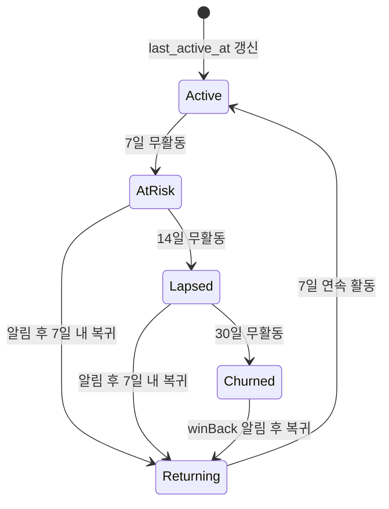

# 리인게이지먼트 스펙

> 작성일: 2026-05-18
> 상태: 활성 (마스터 SSOT)
> 우선: 🔴 CRITICAL (출시 전)
> 관련: [notification_master.md §2.6](./notification_master.md), [user_master.md](../user/user_master.md)

---

## 0. 개요

비활성 사용자를 다시 앱으로 끌어들이는 자동 시퀀스. 알림 타입은 `notification_master.md §2.6`에 정의 — 본 스펙은 **트리거 엔진**과 **백엔드 모델**을 정의한다.

---

## 1. 현황 진단 (2026-05-18)

| 항목 | 상태 |
|------|------|
| 알림 타입 (`inactivityReminder7d/14d`, `winBackOffer30d`) | ✅ 정의됨 (notification_master.md §2.6) |
| `User.last_active_at` 필드 | ❌ 백엔드 모델 없음 |
| `User.engagement_score` 필드 | ❌ |
| `InactivityDetector` 워커 | ❌ |
| 드립 시퀀스 흐름 | ❌ 미정의 |

---

## 2. 백엔드 모델 변경

### 2.1 `User` 필드 추가

```python
class User(Base):
    # ... 기존 필드 ...
    last_active_at: datetime = Field(default_factory=now, index=True)
    engagement_score: int = 0  # 0~100, 활동 빈도 기반
    last_reengagement_sent_at: datetime | None = None
    reengagement_opt_out: bool = False
```

| 필드 | 갱신 시점 |
|------|----------|
| `last_active_at` | 모든 인증된 API 요청 시 (middleware) |
| `engagement_score` | 일일 배치 (실제 의미 있는 행동 — 레슨 작성/완료, 연습 시작 등) |
| `last_reengagement_sent_at` | 리인게이지먼트 알림 발송 직후 |
| `reengagement_opt_out` | 설정 화면에서 사용자가 해제 |

### 2.2 `engagement_score` 계산 공식

```
score = min(100,
  레슨_완료수_7일 * 10 +
  레슨노트_작성수_7일 * 5 +
  연습_세션수_7일 * 3 +
  앱_세션수_7일 * 1
)
```

매일 자정 KST 배치 갱신. 80+ = `active`, 30~79 = `regular`, 1~29 = `at_risk`, 0 = `inactive`.

---

## 3. InactivityDetector (백엔드 워커)

### 3.1 스케줄

매일 09:00 KST. 무작위 발송 방지 위해 지정 시간만.

### 3.2 알고리즘

```python
def detect_and_dispatch():
    now = datetime.now(KST)
    for user in User.where(reengagement_opt_out=False):
        days = (now - user.last_active_at).days
        last_sent = user.last_reengagement_sent_at

        # Day 7 — 마지막 발송 후 5일 이상 경과 + 그 사이 활동 없음
        if 7 <= days < 14 and not _sent_within(last_sent, days=5):
            send(user, type="inactivityReminder7d")

        # Day 14
        elif 14 <= days < 30 and not _sent_within(last_sent, days=10):
            send(user, type="inactivityReminder14d")

        # Day 30
        elif days >= 30 and not _sent_within(last_sent, days=20):
            send(user, type="winBackOffer30d")
```

### 3.3 발송 제외 조건

| 조건 | 사유 |
|------|------|
| `reengagement_opt_out=true` | 명시적 거부 |
| `dndEnabled=true` 시간대 | DND 우회 안 함 (normal/high 우선순위) |
| `days < 7` | 너무 빠름 |
| 마지막 발송 < 5일 | 스팸 방지 |
| 활동이 자동 백그라운드 sync (e.g. notification token refresh) | `last_active_at` 갱신 안 함 — middleware whitelist |

### 3.4 `last_active_at` 갱신 제외 엔드포인트

다음 엔드포인트는 사용자의 의미 있는 행동이 아니므로 `last_active_at`을 갱신하지 않는다:

- `GET /healthz`
- `POST /notifications/token/refresh`
- `GET /app/version`
- `POST /auth/refresh` (토큰 갱신만)

---

## 4. Drip 시퀀스 흐름



### 4.1 단계별 메시지 톤

| 단계 | 톤 | 메시지 |
|------|-----|--------|
| Day 7 (AtRisk) | 부드러운 리마인드 | "이번 주 레슨 정리가 기다리고 있어요" — 행동 1개만 제안 |
| Day 14 (Lapsed) | 가치 환기 | "놓치고 있는 연습이 있어요" — 학생 N명 + 회차 노출 |
| Day 30 (Churned) | 인센티브 | "다시 시작해볼까요? Pro 1개월 무료 체험" — paywall 제안 |

### 4.2 winBack 인센티브

| 사용자 유형 | 제안 |
|------------|------|
| 무료 사용자 | TrialPro 14일 무료 |
| 만료된 Pro | Pro 1개월 50% 할인 코드 |
| Lifetime | 인센티브 없음 (제거 불가) |

---

## 5. UI 사양

### 5.1 설정 화면

`settings → 알림 → 리인게이지먼트` 섹션 추가:

| 라벨 | 기본값 | AppStrings 키 |
|------|--------|----------------|
| 복귀 알림 받기 | true | `reengagementOptInTitle` |
| 알림 빈도 | 7/14/30일 (고정) | — |

OFF 시 `User.reengagement_opt_out=true` 동기화.

### 5.2 winBack 진입점

알림 탭 → `/billing/winback?code=XXX` 딥링크 → 인센티브 적용 후 paywall_spec.md 흐름으로 진입.

---

## 6. AppStrings 키

| 키 | 한국어 |
|----|--------|
| `reengagementOptInTitle` | 복귀 알림 받기 |
| `reengagementOptInSubtitle` | 한동안 앱을 사용하지 않으면 알림으로 알려드려요 |
| `inactivityReminder7dTitle` | 이번 주 레슨 정리가 기다리고 있어요 |
| `inactivityReminder14dTitle` | 놓치고 있는 연습이 있어요 |
| `winBackOffer30dTitle` | 다시 시작해볼까요? |
| `winBackOffer30dBody` | Pro 1개월 무료 체험으로 돌아오세요 |

---

## 7. 검증

| 시점 | 검증 |
|------|------|
| 백엔드 PR | `last_active_at` middleware 단위 테스트 |
| 워커 PR | 7/14/30일 경계 단위 테스트 (timezone 포함) |
| 통합 | seed 데이터로 days=5/7/13/14/29/30 시뮬레이션 |
| 운영 | Day 7 알림 발송 후 7일 내 복귀율 측정 (`analytics_spec` `app_opened`) |

---

## 8. 의사결정 로그

| 일자 | 결정 | 근거 |
|------|------|------|
| 2026-05-18 | Day 7/14/30 3단 사이클 채택 | 일반적인 모바일 SaaS 베스트 프랙티스 (Mixpanel, Amplitude 보고서) |
| 2026-05-18 | 발송 시간 09:00 KST 고정 | 야간 발송 방지, DND 우회 회피 |
| 2026-05-18 | 토큰/healthz 등은 `last_active_at` 갱신 제외 | 백그라운드 활동이 사용자 의미 활동으로 오인되는 것 방지 |

---

## 9. 관련 문서

- [notification_master.md §2.6](./notification_master.md) — 알림 타입 정의
- [paywall_spec.md](../subscription/paywall_spec.md) — winBack 인센티브 paywall 연동
- [user_master.md](../user/user_master.md) — User 모델
- [event_tracking_spec.md](../analytics/event_tracking_spec.md) — 복귀율 측정 이벤트
