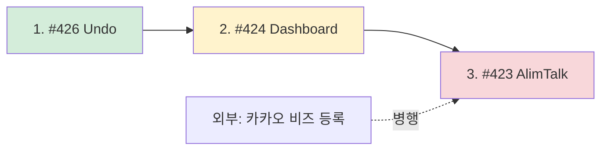

# G2 코드 구현 — 진입 가이드

> 작성일: 2026-06-01
> 그룹: G2 입금 추적·알림 자동화 (송금 자동화 아님)
> 이슈: #423, #424, #426
> 본 폴더의 3개 가이드는 각 이슈를 독립 worktree 에서 진행하기 위한 진입점.

---

## 1. Worktree 구조 (2026-06-01 생성)

| 이슈 | 브랜치 | Worktree 경로 | 가이드 |
|---|---|---|---|
| #426 입금 확인 Undo | `feat/426-payment-undo` | `/private/tmp/lesson-app-worktrees/g2-payment-undo` | [01-payment-undo-impl.md](01-payment-undo-impl.md) |
| #424 입금 대시보드 | `feat/424-payment-dashboard` | `/private/tmp/lesson-app-worktrees/g2-payment-dashboard` | [02-payment-dashboard-impl.md](02-payment-dashboard-impl.md) |
| #423 카카오 알림톡 | `feat/423-alimtalk` | `/private/tmp/lesson-app-worktrees/g2-alimtalk` | [03-alimtalk-impl.md](03-alimtalk-impl.md) |

각 worktree 는 main 에서 분기. 첫 진입 시 `git pull origin main` 로 본 가이드 동기화.

---

## 2. 권장 진행 순서



### 순서 근거

1. **#426 먼저** (가장 작음, 자족적, 1-2일) — 의존성 없음, 학습 곡선 낮음
2. **#424 두번째** (3-5일) — 선생님 측만 우선 구현. 학생 측 알림톡은 #423 결합 시
3. **#423 마지막** (2-3주 + 외부 1-2주) — 카카오 비즈 등록 선행 필요. 코드는 mock 우선

### 병행 가능

- #426 과 #424 는 다른 영역이라 동시 진행 가능 (다른 worktree)
- #423 은 카카오 사업자 등록 (외부) 과 코드 작성 (백엔드) 병행

---

## 3. 공통 진입 명령

각 worktree 에 처음 들어가는 새 세션은 다음을 실행:

```bash
# 1. worktree 진입
cd /private/tmp/lesson-app-worktrees/g2-<name>

# 2. 최신 main 가져오기 (본 가이드 동기화)
git fetch origin
git pull origin main --rebase

# 3. 가이드 확인
cat docs/specs/review/2026-06-01-teacher-e2e/g2-impl/0N-*-impl.md

# 4. 백엔드 의존성
cd backend && uv sync

# 5. 프론트엔드 의존성
cd ../frontend && flutter pub get
```

---

## 4. 공통 작업 규칙

### 4.1 TDD 강제 (golden-principles #3)

- RED → GREEN → REFACTOR
- 백엔드: pytest, 프론트엔드: flutter test
- 커버리지 80%+

### 4.2 도메인 린터 (.claude/rules/domain-linter.md)

- 파일명: `{domain}_page.dart`, `{domain}_card.dart`, `{domain}_provider.dart`
- 클래스명은 파일명에서 파생
- import 순서: dart → flutter → 외부 → 프로젝트

### 4.3 i18n (.claude/rules/i18n-l10n.md)

- 사용자 텍스트는 `AppStrings` 통해 (하드코딩 금지)
- domain/data 레이어에서 AppStrings import 금지 (presentation 만)

### 4.4 Surgical Changes (golden-principles #12)

- 요청된 라인만 변경
- 주변 리팩토링·포매팅 금지
- 의도하지 않은 변경 = 별도 커밋

### 4.5 검증 (.claude/rules/verification.md)

- "It should work" 금지
- 모든 PR 머지 전 실제 명령 실행:
  - `flutter analyze`
  - `flutter test`
  - `uv run pytest`
  - `uv run alembic upgrade head` (마이그레이션 있을 시)

### 4.6 Lore Trailer

각 PR 의 커밋에 의사결정 기록:

```
Lore-directive: <결정>
Lore-rejected: <거절된 대안> — <이유>
Lore-constraint: <제약>
```

---

## 5. PR 및 머지 전략

### 5.1 PR 단위

- 1 worktree = 1 PR (또는 작은 PR 여러 개)
- PR 제목: `feat(<domain>): <설명> #<issue>`
- PR 본문: `Closes #<issue>` + 변경 요약 + 테스트 결과

### 5.2 의존 관계 머지 순서

```
#426 머지 → main 업데이트
#424 머지 (#426 의 main 기반) → main 업데이트
#423 머지 (#424 의 main 기반) → main 업데이트
```

각 머지 후 다른 worktree 는 `git pull origin main --rebase` 로 동기화.

### 5.3 통합 테스트

각 PR 머지 후:

```bash
# 베타 배포
auto deploy-beta  # (또는 /deploy-beta)

# E2E 시나리오 테스트
cd backend && uv run pytest tests/integration_beta/
```

---

## 6. 위험 및 완화

| 위험 | 완화 |
|---|---|
| 3 worktree 간 모델 충돌 (Subscription 필드) | #426 머지 후 #424 가 main 동기화. 동시 머지 금지 |
| 카카오 비즈 등록 지연 (#423) | 코드는 mock 우선, 실제 발신은 키 받은 후 |
| 통합 테스트 환경 (알림톡) | 베타 환경에 mock 모드 전환 가능하게 (`ALIMTALK_USE_MOCK=true`) |
| 머지 충돌 (subscription_service.py 공유) | 작은 PR + 빠른 머지로 충돌 최소화 |

---

## 7. 진행 상태 추적

| 이슈 | 상태 | 담당 세션 | PR |
|---|---|---|---|
| #426 | 가이드 작성 완료, worktree 준비 | (다음 세션) | — |
| #424 | 가이드 작성 완료, worktree 준비 | (다음 세션) | — |
| #423 | 가이드 작성 완료, worktree 준비. **카카오 비즈 등록 선행 필요** | (다음 세션) | — |

---

## 8. 다음 세션 진입 명령 (복사용)

```
# #426 입금 확인 Undo (가장 먼저 권장)
"/private/tmp/lesson-app-worktrees/g2-payment-undo 에서 docs/specs/review/2026-06-01-teacher-e2e/g2-impl/01-payment-undo-impl.md 따라 #426 입금 확인 24h Undo 코드 구현"

# #424 입금 대시보드
"/private/tmp/lesson-app-worktrees/g2-payment-dashboard 에서 docs/specs/review/2026-06-01-teacher-e2e/g2-impl/02-payment-dashboard-impl.md 따라 #424 입금 미확인 대시보드 코드 구현"

# #423 카카오 알림톡 (카카오 비즈 등록 후)
"/private/tmp/lesson-app-worktrees/g2-alimtalk 에서 docs/specs/review/2026-06-01-teacher-e2e/g2-impl/03-alimtalk-impl.md 따라 #423 카카오 알림톡 5종 템플릿 코드 구현 (mock 우선)"
```
