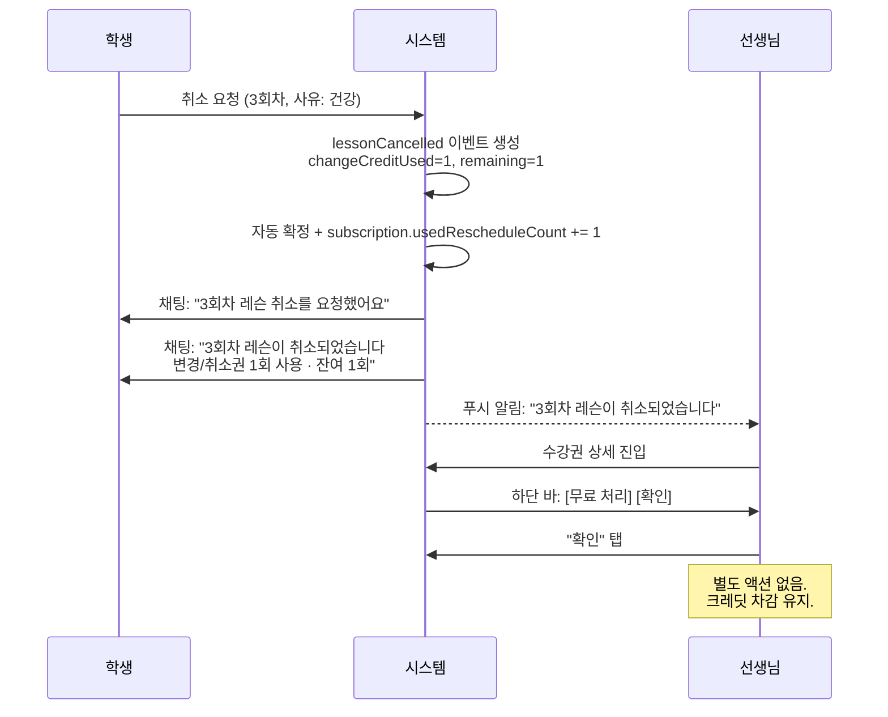
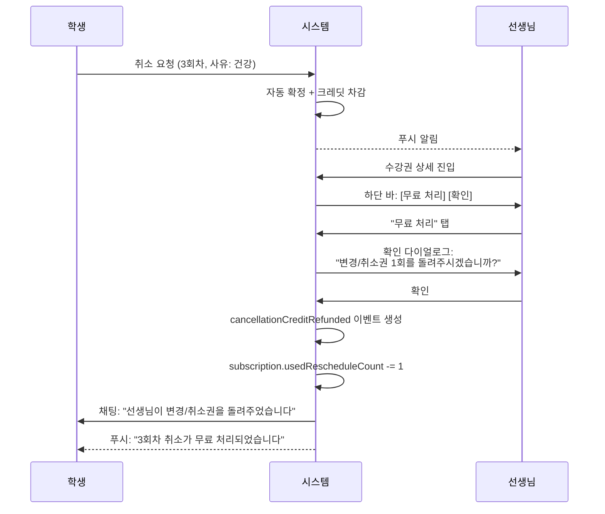
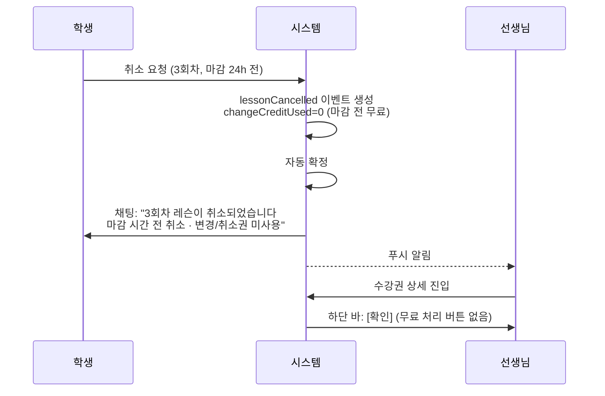
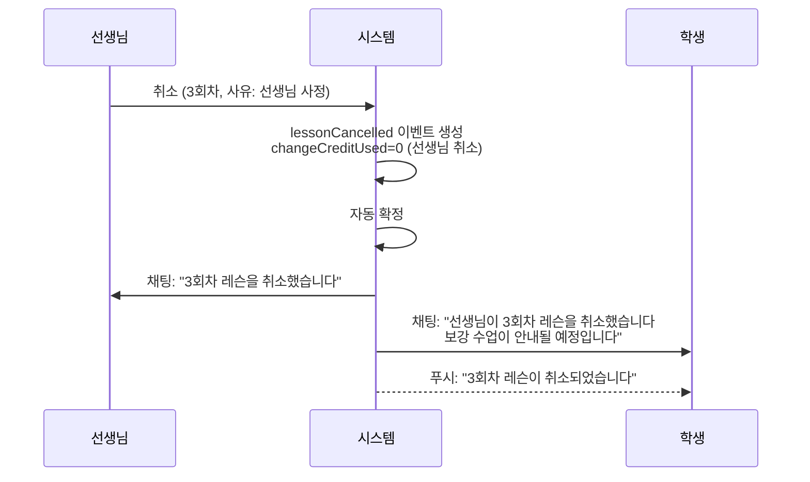

# 레슨 취소 흐름 스펙

> 최종 업데이트: 2026-05-05

## 1. 개요

레슨 취소는 일정 변경과 본질적으로 다르다.

| | 일정 변경 | 레슨 취소 |
|---|---|---|
| 목적 | 다른 시간에 레슨 진행 | 레슨 자체를 포기 |
| 협상 | 양자 협상 (새 시간 합의) | 단방향 (학생 결정) |
| 선생님 역할 | 수락/거절/역제안 | 알림 수신 + 선택적 무료 처리 |

### 설계 원칙

> **취소는 단방향이다. 크레딧 차감은 자동이다.
> 단, 선생님이 선의로 크레딧을 돌려줄 수 있다.**

### 유사 서비스 근거

| 서비스 | 취소 방식 | 선생님 역할 |
|--------|----------|-----------|
| TakeLessons / Lessonface | 단방향 자동 확정 | 알림만 수신 |
| 김과외 / 숨고 | 24h 기준 크레딧 차감 | 알림만 수신 |
| ClassPass | 늦은 취소 = 자동 크레딧 손실 | 강사 승인 불필요 |

모든 유사 서비스에서 취소는 협상이 아닌 **단방향 + 정책 자동 적용** 패턴이다.
Lessonaza는 여기에 **선생님 무료 처리** 옵션을 추가하여 차별화한다.

## 2. 취소 사유

```dart
enum CancelReason {
  studentSchedule,  // 학생 일정 변경
  studentSick,      // 학생 건강 이슈
  teacherCancel,    // 선생님 취소
  mutual,           // 합의 취소
}
```

| 사유 | 크레딧 차감 | 세션 카운트 |
|------|-----------|-----------|
| `studentSchedule` | 마감 후: 차감 / 마감 전: 무료 | 유지 (keepsSessionNumber) |
| `studentSick` | 마감 후: 차감 / 마감 전: 무료 | 유지 |
| `teacherCancel` | 차감 안 함 | 유지 + 보강 안내 |
| `mutual` | 차감 안 함 | 유지 |

## 3. 시퀀스 다이어그램

### 3.1 학생 취소 → 선생님 확인



### 3.2 학생 취소 → 선생님 무료 처리



### 3.3 마감 전 취소 (크레딧 미사용)



### 3.4 선생님 취소



## 4. 상태 다이어그램

### 4.1 하단 바 전체 상태 (일정 변경 + 취소 통합)

```mermaid
stateDiagram-v2
    [*] --> Default: 화면 진입

    %% 일정 변경 흐름
    Default --> Waiting: 일정 변경 제안 전송
    Default --> CanRespond: 상대방 일정 변경 수신
    Waiting --> Default: 상대방 수락
    Waiting --> CanRespond: 상대방 역제안
    CanRespond --> Waiting: 역제안 전송
    CanRespond --> Default: 수락/거절

    %% 취소 흐름
    Default --> CancellationConfirmed: 학생 취소 (자동 확정)

    state CancellationConfirmed {
        [*] --> TeacherReview
        note right of TeacherReview
            선생님: [무료 처리] [확인]
            학생: 읽기 전용
        end note
    }

    CancellationConfirmed --> Default: 선생님 확인/무료 처리
```

### 4.2 세션 상태 전이

```mermaid
stateDiagram-v2
    [*] --> Scheduled: 레슨 예정

    Scheduled --> CancelRequested: 학생 취소 요청
    CancelRequested --> Cancelled: 시스템 자동 확정

    Cancelled --> CancelledFree: 선생님 무료 처리
    Cancelled --> CancelledConfirmed: 선생님 확인

    state Cancelled {
        note right
            keepsSessionNumber=true
            다음 레슨이 같은 회차로 이어짐
        end note
    }
```

## 5. 하단 바 UI 레이아웃

### 5.1 취소 확정 후 — 선생님 화면 (크레딧 사용)

```
┌──────────────────────────────────────┐
│ 3회차 레슨이 취소되었습니다           │
│ 변경/취소권 1회 사용 · 잔여 1회       │
│ 사유: 컨디션이 좋지 않아요            │
│                                      │
│  ┌──────────────┐  ┌──────────────┐ │
│  │  무료 처리    │  │     확인     │ │
│  └──────────────┘  └──────────────┘ │
└──────────────────────────────────────┘
```

### 5.2 취소 확정 후 — 선생님 화면 (크레딧 미사용)

```
┌──────────────────────────────────────┐
│ 3회차 레슨이 취소되었습니다           │
│ 마감 시간 전 취소 · 변경/취소권 미사용 │
│                                      │
│  ┌──────────────────────────────┐    │
│  │            확인              │    │
│  └──────────────────────────────┘    │
└──────────────────────────────────────┘
```

### 5.3 취소 확정 후 — 학생 화면

```
┌──────────────────────────────────────┐
│ 3회차 레슨이 취소되었습니다           │
│ 변경/취소권 1회 사용 · 잔여 1회       │
│ 다음 진행 레슨이 3회차로 이어집니다    │
└──────────────────────────────────────┘
```

학생은 읽기 전용 — 별도 액션 버튼 없음.

### 5.4 무료 처리 후 — 양쪽 화면

채팅 버블에 추가:
```
┌──────────────────────────────────────┐
│ ✓ 선생님이 변경/취소권을             │
│   돌려주었습니다                      │
│   변경/취소권 잔여 2회                │
└──────────────────────────────────────┘
```

## 6. 이벤트 타입

| 이벤트 | HiveField | 트리거 | 크레딧 영향 |
|--------|-----------|--------|-----------|
| `lessonCancelled` | 17 (기존) | 학생/선생님 취소 요청 | `changeCreditUsed` 기록 |
| `lessonCancellationConfirmed` | 27 (신규) | 시스템 자동 확정 | 동일 크레딧 스냅샷 |
| `cancellationCreditRefunded` | 28 (신규) | 선생님 무료 처리 | `changeCreditUsed: 0` |

### 이벤트 필드 스냅샷

```dart
RequestEvent(
  eventType: RequestEventType.lessonCancelled,
  actorType: ProposerRole.student,
  message: '컨디션이 좋지 않아요',
  sessionNumber: 3,
  changeCreditUsed: 1,               // 사용된 크레딧
  changeCreditRemainingAfter: 1,     // 잔여 크레딧
  keepsSessionNumber: true,          // 다음 레슨이 같은 회차
  cancelReason: CancelReason.studentSick,
)
```

## 7. 크레딧 상태 전이표

| 시점 | usedReschedule | remaining | 세션 3 상태 | 다음 레슨 회차 |
|------|---------------|-----------|------------|-------------|
| 취소 전 | 0 | 2 | scheduled | 3 |
| 학생 취소 (마감 후) | 1 | 1 | cancelled | 3 (유지) |
| 선생님 확인 | 1 | 1 | cancelled | 3 |
| 선생님 무료 처리 | 0 | 2 | cancelled | 3 |

| 시점 | usedReschedule | remaining | 세션 3 상태 | 다음 레슨 회차 |
|------|---------------|-----------|------------|-------------|
| 취소 전 | 0 | 2 | scheduled | 3 |
| 학생 취소 (마감 전) | 0 | 2 | cancelled (무료) | 3 (유지) |

## 8. 엣지 케이스

### 8.1 마지막 크레딧 취소

- `maxRescheduleCount=2`, `usedRescheduleCount=1` → 학생 취소 → `used=2, remaining=0`
- 이후 변경/취소 버튼 비활성 ("변경취소권이 소진되었습니다")
- 선생님 무료 처리 시 → `used=1, remaining=1` (복원)

### 8.2 크레딧 0에서 취소 시도

- **마감 전**: 허용 (크레딧 미사용)
- **마감 후**: 차단 — "변경취소권이 소진되었습니다" 스낵바

### 8.3 동일 수강권에서 다중 취소

- 각 취소는 독립적으로 `sessionNumber`별 추적
- 채팅 아코디언에서 각 세션별로 취소 이력 표시
- 크레딧은 누적 차감

### 8.4 선생님이 보강을 제안하고 싶은 경우

취소와 보강은 별개 관심사:
1. 취소: 즉시 확정 (이 스펙)
2. 보강: 선생님이 다음 세션에서 일정 변경 제안 (기존 스펙)

선생님은 "무료 처리" 후 일정 변경 흐름으로 보강 시간을 제안할 수 있다.

### 8.5 취소 후 선생님이 아무 액션도 안 한 경우

- 문제 없음. 취소는 자동 확정이므로 선생님 액션은 선택적.
- "무료 처리"와 "확인"은 선생님의 편의를 위한 것.
- 하단 바는 취소 확정 상태를 유지하다가, 다른 세션 선택 시 해당 세션의 상태로 전환.

## 9. 수강권 필수화에 따른 취소 분기 (2026-05-31)

> 참조: [subscription_required_spec.md](../subscription/subscription_required_spec.md)

### 9.1 결정사항

모든 레슨은 수강권에 연결된다 (Plan B). 따라서 취소는 **항상** 수강권 이벤트 시스템을 경유한다.

### 9.2 선생님이 레슨 상세에서 "취소" 탭 시

```
lesson.subscriptionId != null (정상 — 모든 신규 레슨)
  → 수강권 상세 화면으로 이동
  → 수강권 이벤트 시스템에서 lessonCancelled 이벤트 생성
  → 크레딧 차감 + 학생 알림 + 채팅 말풍선

lesson.subscriptionId == null (레거시 데이터)
  → 기존 직접 취소 (PATCH /status) 유지
  → 마이그레이션 완료 후 이 분기 제거
```

### 9.3 구현 상태

| 항목 | 상태 |
|------|:----:|
| 프론트 취소 분기 (`lesson_detail_screen.dart`) | ✅ 구현 |
| 백엔드 자동 수강권 생성 (`lesson_service.create()`) | ✅ 구현 |
| 보너스 레슨 (남은 횟수 0 → total_lessons/bonus_count 증가) | ✅ 구현 |
| `cancel_lesson_bottom_sheet.dart` (취소 사유 UI) | ❌ 미구현 |
| `update_status()` 가드 (수강권 레슨 직접 취소 차단) | ❌ 미구현 (2단계) |
| 레거시 데이터 마이그레이션 | ❌ 미구현 (4단계) |

## 10. 일정 변경 스펙과의 관계

이 스펙은 `subscription_schedule_change_spec.md`와 함께 수강권 상세화면의
하단 바 상태를 정의한다.

| 상태 | 트리거 | 스펙 |
|------|--------|------|
| Default | 보류 이벤트 없음 | `subscription_schedule_change_spec.md` §4.1 |
| Waiting | 일정 변경 제안 전송 | `subscription_schedule_change_spec.md` §4.2 |
| CanRespond | 상대방 일정 변경 수신 | `subscription_schedule_change_spec.md` §4.3 |
| **CancellationConfirmed** | **학생 취소 자동 확정** | **이 문서 §5** |

## 11. 관련 파일

| 파일 | 역할 |
|------|------|
| `cancel_lesson_bottom_sheet.dart` | 취소 사유 선택 + 제출 UI |
| `subscription_bottom_input_bar.dart` | 하단 바 (4상태 전환) |
| `schedule_change_event_bubble.dart` | 채팅 버블 렌더링 |
| `subscription_providers.dart` | 이벤트 저장 + 크레딧 관리 |
| `request_event.dart` | 이벤트 타입 enum |
| `subscription.dart` | 크레딧 필드 (`usedRescheduleCount`, `maxRescheduleCount`) |
