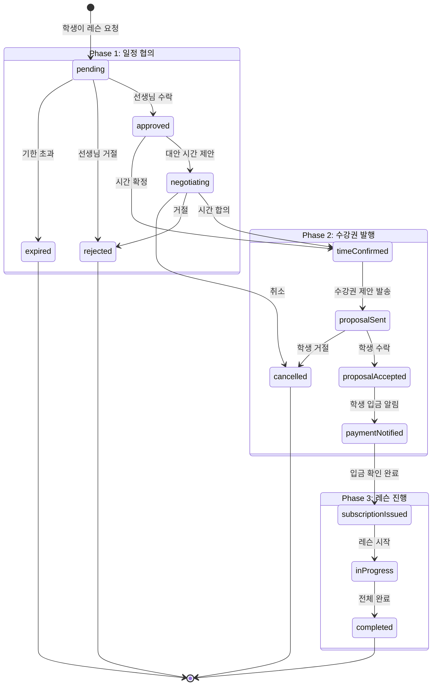
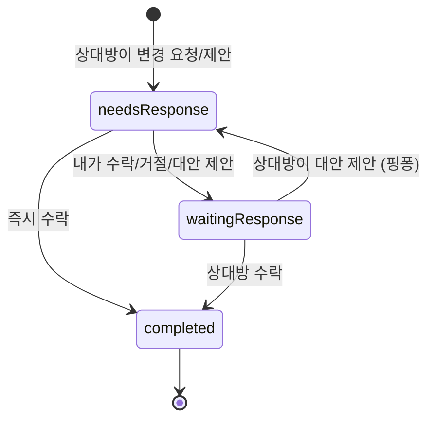
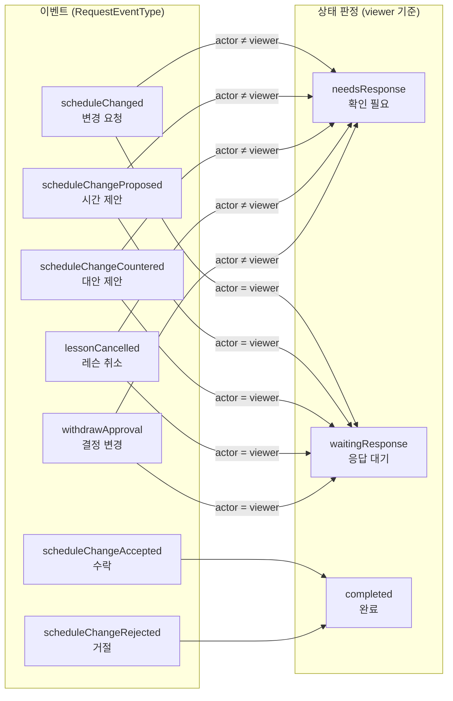
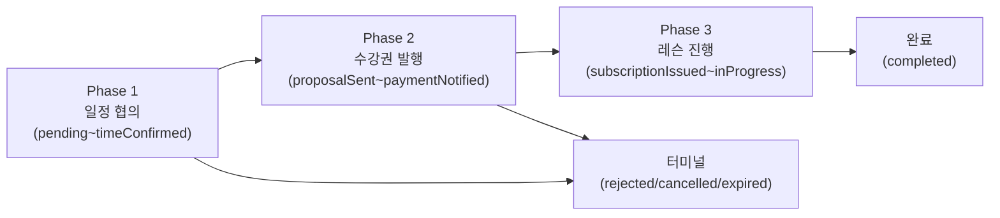

# 레슨 요청 & 스케줄 변경 상태 다이어그램

> 최종 수정: 2026-05-05
> 목적: 레슨 요청과 스케줄 변경 요청의 상태 흐름을 기획/개발이 동일하게 이해할 수 있도록 문서화

---

## 1. 레슨 요청 상태 (UnifiedRequestStatus)

### 1.1 상태 다이어그램



### 1.2 리스트 UI 라벨 — 통일 3분류 체계

> 레슨 요청과 스케줄 변경 요청은 **동일한 3개 라벨**을 사용합니다.
> 12개 내부 상태는 "내 차례인가?"로 판정하여 3분류로 단순화합니다.

#### 공통 3분류

| 라벨 | 색상 | 의미 |
|------|------|------|
| **확인 필요** | `paperAccent` (Vermillion) | 내가 행동해야 함 |
| **응답 대기** | `inkTertiary` (Grey) | 상대방 차례 |
| **완료** | `inkTertiary` (Grey) | 종료됨 (완료/거절/취소/만료) |

#### 선생님 관점 — 내부 상태 → 라벨 매핑

| 내부 상태 | 라벨 | 의미 |
|----------|------|------|
| `pending` | **확인 필요** | 새 요청 도착, 수락/거절 필요 |
| `approved` (내 차례) | **확인 필요** | 대안 시간 제안 필요 |
| `negotiating` (내 차례) | **확인 필요** | 학생 역제안에 응답 필요 |
| `timeConfirmed` | **확인 필요** | 수강권 제안 작성 필요 |
| `paymentNotified` | **확인 필요** | 입금 확인 필요 |
| `inProgress` | **확인 필요** | 레슨 진행 중 (관리 필요) |
| `approved` (상대 차례) | **응답 대기** | 학생 응답 대기 |
| `negotiating` (상대 차례) | **응답 대기** | 학생 응답 대기 |
| `proposalSent` | **응답 대기** | 학생 수강권 수락 대기 |
| `proposalAccepted` | **응답 대기** | 학생 입금 대기 |
| `subscriptionIssued` | **응답 대기** | 수강권 발급 완료 |
| `completed` / `rejected` / `cancelled` / `expired` | **완료** | 터미널 |

#### 학생 관점 — 내부 상태 → 라벨 매핑

| 내부 상태 | 라벨 | 의미 |
|----------|------|------|
| `proposalSent` | **확인 필요** | 수강권 도착, 수락 필요 |
| `proposalAccepted` | **확인 필요** | 결제 필요 |
| `inProgress` | **확인 필요** | 레슨 진행 중 |
| `negotiating` (내 차례) | **확인 필요** | 선생님 역제안에 응답 필요 |
| `approved` (내 차례) | **확인 필요** | 시간 선택 필요 |
| `pending` | **응답 대기** | 선생님 확인 대기 |
| `approved` (상대 차례) | **응답 대기** | 선생님 응답 대기 |
| `negotiating` (상대 차례) | **응답 대기** | 선생님 응답 대기 |
| `timeConfirmed` | **응답 대기** | 수강권 제안 대기 |
| `paymentNotified` | **응답 대기** | 선생님 입금 확인 대기 |
| `subscriptionIssued` | **응답 대기** | 수강권 발급 완료 |
| `completed` / `rejected` / `cancelled` / `expired` | **완료** | 터미널 |

#### 구현 코드 (판정 로직)

```dart
// unified_lesson_request.dart
String get teacherActionLabel {
  if (status.isTerminal) return '완료';
  if (_isTeacherActionRequired) return '확인 필요';
  return '응답 대기';
}

// _isTeacherActionRequired: pending, timeConfirmed, paymentNotified,
//   inProgress, approved/negotiating(내 차례)
// _isStudentActionRequired: proposalSent, proposalAccepted, inProgress,
//   approved/negotiating(내 차례)
```

### 1.3 색상 규칙 (2색 체계)

> 레슨 요청과 스케줄 변경 모두 동일한 규칙을 사용합니다.

| 색상 | 의미 | 토큰 | 배경 |
|------|------|------|------|
| **Vermillion** | 내 차례 — 액션 필요 | `AppColors.paperAccent` | `alpha 0.1` |
| **Grey** | 대기/종료 — 상대 차례 또는 터미널 | `AppColors.inkTertiary` | `alpha 0.1` |

```dart
final color = isMyTurn ? AppColors.paperAccent : AppColors.inkTertiary;
```

---

## 2. 스케줄 변경 요청 상태 (ScheduleChangeRequestStatus)

### 2.1 상태 다이어그램



### 2.2 상태별 UI 라벨

| 상태 (enum) | 라벨 | 색상 | 설명 |
|---|---|---|---|
| `needsResponse` | 확인 필요 | `paperAccent` | 내 차례 — 수락/거절/대안 중 선택 |
| `waitingResponse` | 응답 대기 | `inkTertiary` | 상대 차례 — 내 제안에 대한 응답 대기 |
| `completed` | 완료 | `inkTertiary` | 합의 완료 (수락/거절) |

### 2.3 이벤트 타입 → 상태 매핑



---

## 3. 리스트 아이템 UI 통일 규칙

레슨 요청 리스트와 스케줄 변경 요청 리스트는 동일한 레이아웃을 사용합니다.

### 3.1 레이아웃 (2줄 + 우측 상태)

```
┌─────────────────────────────────────────────────────┐
│ (아바타)  이름 · 악기 · 레벨          [확인 필요]    │
│           개인레슨 · 정규레슨           2시간 전     │
└─────────────────────────────────────────────────────┘

┌─────────────────────────────────────────────────────┐
│ (아바타)  김지수 · 피아노             [응답 대기]    │
│           강남아트스쿨 · 회차권         3시간 전     │
└─────────────────────────────────────────────────────┘
```

### 3.2 구성 요소

| 위치 | 내용 | 타이포 |
|------|------|--------|
| **아바타** | 이름 초성 | `avatarSmall`, `paperAccentSoft` bg |
| **Line 1** | `이름 · 악기` (또는 `이름 · 악기 · 레벨`) | `bodyMedium`, `w600` |
| **Line 2** | `학원명/개인레슨 · 수강권타입/레슨타입` | `caption`, `inkTertiary` |
| **상태 뱃지** | 액션 라벨 | `caption`, `w600`, 배경 `alpha 0.1` |
| **경과 시간** | `N분 전`, `N시간 전` | `caption`, `inkTertiary` |

### 3.3 상태 뱃지 색상 규칙 (통일)

```dart
// 2색 체계: paperAccent (내 차례) / inkTertiary (대기/종료)
final color = isMyTurn ? AppColors.paperAccent : AppColors.inkTertiary;
```

### 3.4 수강권 카드 색상 체계 참조

리스트 아이템에 수강권 타입이 표시되는 경우 (Line 2 메타 라벨 등), 수강권 3색 잉크 체계를 따른다.

| 수강권 타입 | 토큰 | 의미 |
|------------|------|------|
| 체험레슨 (trial) | `paperTrial` | 세피아 앰버 |
| 정기권 (monthly) | `paperOk` | 녹색 펜 |
| 회차권 (package) | `paperAccent` | 버밀리온 |

> 상세: `docs/specs/design/notebook/README.md` §2.1, `docs/specs/design/ux_guidelines.md` §6.1

---

## 4. 라이프사이클 Phase (레슨 요청)



---

## 5. 구현 파일 참조

| 항목 | 파일 |
|------|------|
| 레슨 요청 상태 enum | `features/schedule/domain/entities/unified_lesson_request.dart` |
| 레슨 요청 리스트 아이템 | `features/schedule/presentation/widgets/request_list_item.dart` |
| 스케줄 변경 상태 enum | `features/subscription/presentation/screens/schedule_change_request_list_screen.dart` |
| 이벤트 타입 enum | `features/schedule/domain/entities/request_event.dart` |
| 상태 라벨 상수 | `core/l10n/app_strings.dart` |
| 색상 토큰 | `core/theme/app_colors.dart` (paperAccent, inkTertiary) |
