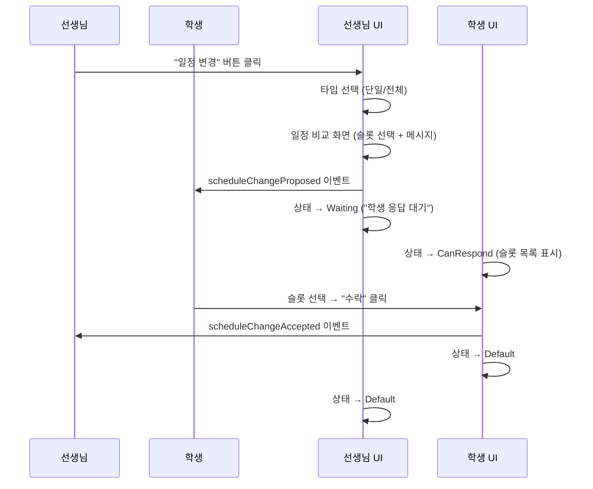
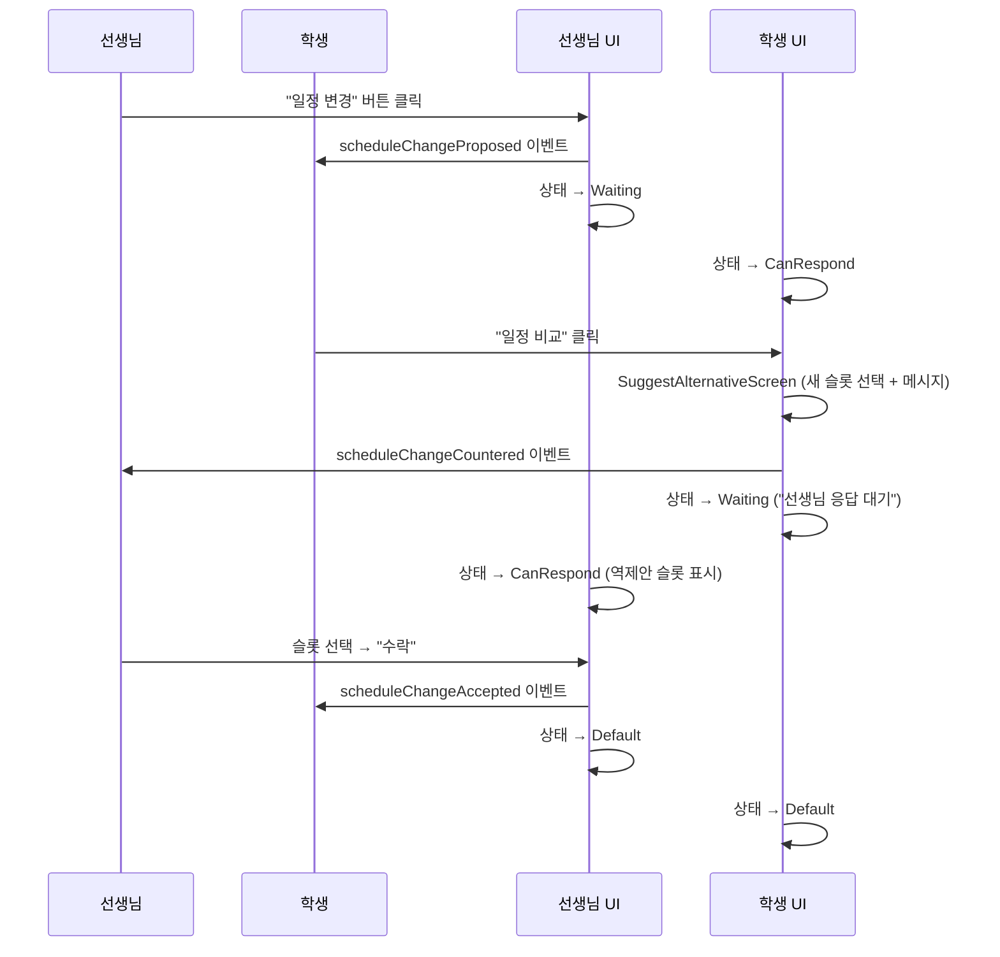
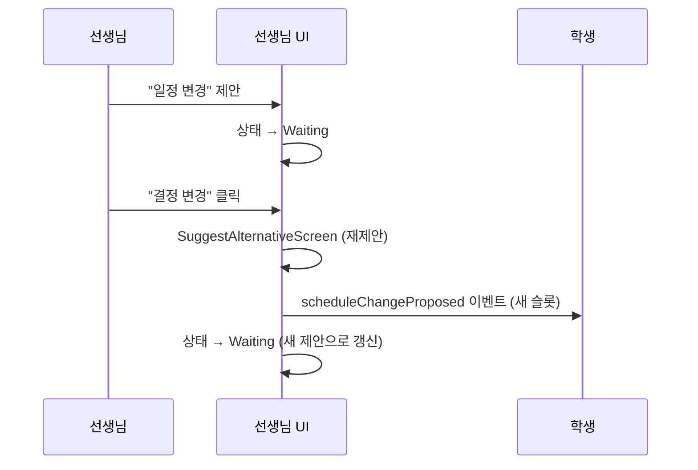

# 수강권 일정 변경 — 턴 기반 잠금 흐름 스펙

> 최종 업데이트: 2026-05-05

## 1. 개요

수강권 상세화면(SubscriptionDetailScreen)은 **일정 변경 협상 전용** 화면이다.
자유 메시지 전송을 제거하고, 레슨 요청 화면(RequestDetailScreen)과 동일한
**턴 기반 잠금 패턴**을 적용한다.

### 설계 원칙

- **목적 집중**: 이 화면은 일정 변경만을 위한 화면. 일반 대화는 공지 기능으로 분리
- **턴 기반 잠금**: 일정 변경 제안 후 상대방 응답 전까지 UI 잠금
- **레슨 요청과 일관성**: RequestDetailScreen의 myTurn/theirTurn 패턴을 동일하게 적용

## 2. 상태 다이어그램

```mermaid
stateDiagram-v2
    [*] --> Default: 화면 진입

    Default --> Waiting: 일정 변경 제안 전송
    Default --> CanRespond: 상대방 일정 변경 수신

    Waiting --> Default: 상대방 수락
    Waiting --> CanRespond: 상대방 역제안
    Waiting --> Waiting: 결정 변경 → 재제안

    CanRespond --> Waiting: 역제안 전송
    CanRespond --> Default: 수락
    CanRespond --> Default: 거절

    state Default {
        [*] --> 일정변경버튼
        note right of 일정변경버튼
            자유 메시지 입력 없음
            "일정 변경 요청하기" 버튼만 표시
        end note
    }

    state Waiting {
        [*] --> 응답대기
        note right of 응답대기
            "OOO님의 응답을 기다리고 있습니다"
            + "결정 변경" 버튼
        end note
    }

    state CanRespond {
        [*] --> 슬롯선택
        note right of 슬롯선택
            제안된 슬롯 목록 + 메시지 입력
            + "일정 비교" / "수락" 버튼
        end note
    }
```

## 3. 시퀀스 다이어그램 — 일정 변경 흐름

### 3.1 기본 흐름: 제안 → 수락



### 3.2 역제안 흐름



### 3.3 결정 변경 흐름



## 4. 하단 바 UI 상태별 레이아웃

### 4.1 Default (보류 중인 일정 변경 없음)

```
┌──────────────────────────────────────┐
│ 일정 변경이 필요하면 아래 버튼을      │
│ 눌러 요청하세요                       │
│                                      │
│  ┌──────────────────────────────┐    │
│  │       일정 변경               │    │
│  └──────────────────────────────┘    │
└──────────────────────────────────────┘
```

- 자유 메시지 입력 필드 없음
- 메시지 전송 버튼 없음
- 일정 변경 버튼만 표시 (전체 너비)

### 4.2 Waiting (내가 제안, 상대방 응답 대기)

```
┌──────────────────────────────────────┐
│ 박지호님의 응답을 기다리고 있습니다   │
│                                      │
│  ┌──────────────────────────────┐    │
│  │       결정 변경               │    │
│  └──────────────────────────────┘    │
└──────────────────────────────────────┘
```

- 상대방 이름 + 대기 메시지
- "결정 변경" 버튼 → 클릭 시 SuggestAlternativeScreen으로 재진입

### 4.3 CanRespond (상대방 제안, 내가 응답할 차례)

```
┌──────────────────────────────────────┐
│ 일정을 탭하여 선택하세요              │
│                                      │
│  ┌──────────────────────────────┐    │
│  │ 1. 월 14:00 - 15:00          │    │
│  └──────────────────────────────┘    │
│  ┌──────────────────────────────┐    │
│  │ 2. 수 10:00 - 11:00          │    │
│  └──────────────────────────────┘    │
│                                      │
│  ┌──────────────────────────────┐    │
│  │ 전달할 메시지를 입력하세요     │    │
│  └──────────────────────────────┘    │
│                                      │
│  ┌────────────┐  ┌────────────┐     │
│  │  일정 비교  │  │    수락    │     │
│  └────────────┘  └────────────┘     │
└──────────────────────────────────────┘
```

- 제안된 슬롯 목록 (탭하여 선택)
- 메시지 입력 필드 (일정 변경에 대한 메시지만)
- "일정 비교" → SuggestAlternativeScreen에서 역제안
- "수락" → 선택한 슬롯으로 확정

## 5. 이벤트 타입 매핑

| 이벤트 | 트리거 | 결과 상태 |
|--------|--------|----------|
| `scheduleChangeProposed` | 일정 변경 제안 | 본인 → Waiting, 상대 → CanRespond |
| `scheduleChangeAccepted` | 슬롯 수락 | 양쪽 → Default |
| `scheduleChangeRejected` | 거절 | 양쪽 → Default |
| `scheduleChangeCountered` | 역제안 | 본인 → Waiting, 상대 → CanRespond |

## 6. 레슨 요청 화면과의 비교

| 항목 | 레슨 요청 (Phase 1) | 수강권 일정 변경 (Phase 3) |
|------|---------------------|--------------------------|
| 자유 메시지 | 없음 | 없음 |
| 턴 기반 잠금 | myTurn / theirTurn | isWaiting / canRespond |
| 결정 변경 | withdrawApproval → 재협상 | 재제안 (새 scheduleChangeProposed) |
| 메시지 첨부 | 수락/역제안 시 | 제안/수락/역제안 시 |
| 일정 비교 | SuggestAlternativeScreen | SuggestAlternativeScreen (동일) |

## 7. 레슨 취소 흐름

레슨 취소는 일정 변경과 본질적으로 다른 단방향 흐름이다.
별도 스펙 문서로 분리: **[lesson_cancellation_flow_spec.md](lesson_cancellation_flow_spec.md)**

하단 바는 일정 변경(3상태) + 취소 확정(1상태) = **총 4상태**로 동작한다.

| 상태 | 트리거 | 스펙 |
|------|--------|------|
| Default | 보류 이벤트 없음 | 이 문서 §4.1 |
| Waiting | 일정 변경 제안 전송 | 이 문서 §4.2 |
| CanRespond | 상대방 일정 변경 수신 | 이 문서 §4.3 |
| CancellationConfirmed | 학생 취소 자동 확정 | [lesson_cancellation_flow_spec.md](lesson_cancellation_flow_spec.md) §5 |

## 8. 관련 파일

| 파일 | 역할 |
|------|------|
| `subscription_detail_screen.dart` | 수강권 상세 화면 (핸들러) |
| `subscription_bottom_input_bar.dart` | 하단 입력 바 (4상태 UI) |
| `suggest_alternative_screen.dart` | 일정 비교 화면 (공유) |
| `schedule_change_slot_bottom_sheet.dart` | 슬롯 선택 바텀시트 |
| `schedule_change_type_bottom_sheet.dart` | 변경 타입 선택 (단일/전체) |
| `cancel_lesson_bottom_sheet.dart` | 취소 사유 선택 + 제출 |
