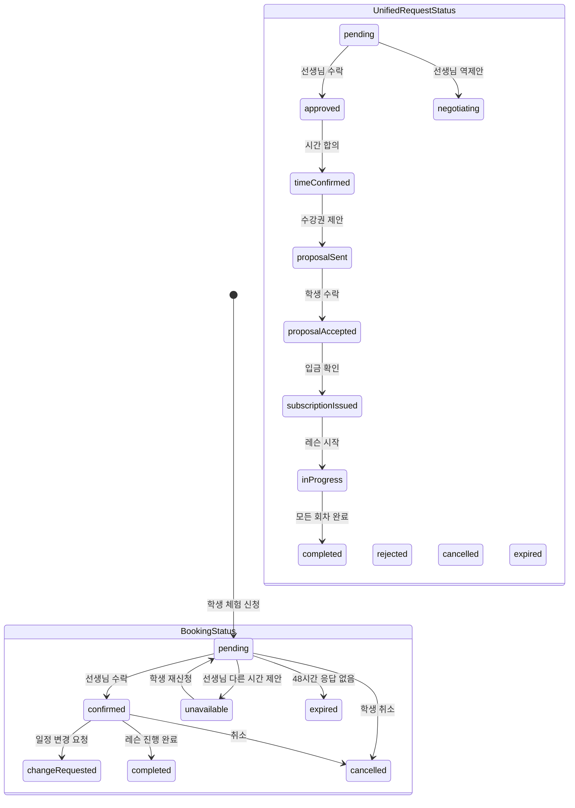

# 체험레슨 상태 흐름 스펙

> 최종 업데이트: 2026-05-06

## 1. 개요

체험레슨은 두 가지 상태 시스템을 통해 관리된다.

| 시스템 | 엔티티 | 용도 |
|--------|--------|------|
| BookingStatus | LessonBooking | 레거시 예약 관리 (학생 홈 "내 체험레슨" 카드) |
| UnifiedRequestStatus | UnifiedLessonRequest | 현재 레슨 요청 협상 흐름 |

## 2. 상태 매핑

## 3. 상태별 한글 라벨

### BookingStatus (학생 홈 카드)

| enum | 한글 라벨 | 색상 | 설명 |
|------|----------|------|------|
| `pending` | 신청완료 | paperAccent | 학생이 신청 → 선생님 응답 대기 |
| `confirmed` | 확정 | paperOk | 선생님 수락 → 레슨 일정 확정 |
| `changeRequested` | 변경요청 | paperAccent | 일정 변경 협상 중 |
| `completed` | 완료 | inkSecondary | 레슨 진행 완료 |
| `cancelled` | 취소 | inkTertiary | 취소됨 |
| `unavailable` | 일정조율 | paperAccent | 선생님이 다른 시간 제안 |
| `expired` | 만료 | inkTertiary | 48시간 응답 없음 |

### UnifiedRequestStatus (레슨 요청 상세)

| enum | 한글 라벨 | 설명 |
|------|----------|------|
| `pending` | 대기 | 요청 접수, 선생님 응답 대기 |
| `approved` | 승인 | 선생님 1차 수락 |
| `negotiating` | 시간조율 | 희망 시간 협상 중 |
| `timeConfirmed` | 시간확정 | 레슨 시간 합의 완료 |
| `proposalSent` | 제안완료 | 수강권 제안 발송 |
| `proposalAccepted` | 수강권수락 | 학생이 수강권 수락 |
| `subscriptionIssued` | 수강권발급 | 수강권 발급 완료 |
| `inProgress` | 진행중 | 레슨 진행 중 |
| `completed` | 완료 | 전 회차 완료 |
| `rejected` | 거절 | 거절됨 |
| `cancelled` | 취소 | 취소됨 |
| `expired` | 만료 | 기한 만료 |

## 4. "신청완료" vs "확정" 차이

| | 신청완료 (pending) | 확정 (confirmed) |
|---|---|---|
| **의미** | 학생이 신청서를 제출함 | 선생님이 수락하여 일정 확정 |
| **선생님 상태** | 아직 미확인 / 검토 중 | 수락 완료 |
| **학생 행동** | 대기 (취소 가능) | 레슨 준비 |
| **표시 위치** | 학생 홈 "내 체험레슨" | 학생 홈 + 내 수강권 |
| **수강권** | 미발급 | 체험 수강권 발급됨 |

## 5. 학생 화면 표시 위치

| 화면 | 신청완료 | 확정 | 완료 |
|------|---------|------|------|
| 내 체험레슨 (대시보드) | ✅ 표시 | ✅ 표시 | ❌ 숨김 |
| 내 수강권 | ❌ 미표시 | ✅ 체험 수강권 | ✅ 만료 |
| 레슨 요청 상세 | ✅ 상세 보기 | ✅ 상세 보기 | ✅ 이력 |
| 스케줄 탭 | ❌ 미표시 | ✅ 일정 표시 | ❌ 숨김 |

## 6. 관련 파일

| 파일 | 역할 |
|------|------|
| `core/booking/entities/lesson_booking.dart` | BookingStatus enum + LessonBooking 엔티티 |
| `schedule/domain/entities/unified_lesson_request.dart` | UnifiedRequestStatus enum |
| `student_home/presentation/widgets/trial_bookings_section.dart` | "내 체험레슨" 섹션 |
| `student_home/presentation/widgets/compact_trial_booking_card.dart` | 체험레슨 카드 |
