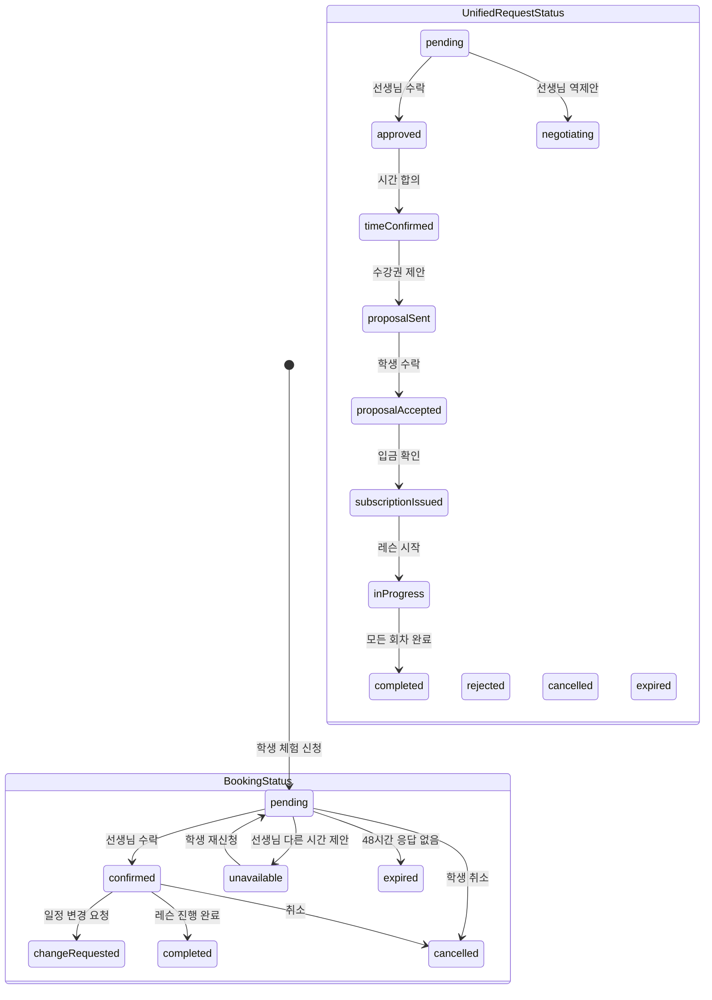

# 체험레슨 상태 흐름 스펙

> 최종 업데이트: 2026-05-06

## 1. 개요

체험레슨은 두 가지 상태 시스템을 통해 관리된다.

| 시스템 | 엔티티 | 용도 |
|--------|--------|------|
| BookingStatus | LessonBooking | 레거시 예약 관리 (학생 홈 "내 체험레슨" 카드) |
| UnifiedRequestStatus | UnifiedLessonRequest | 현재 레슨 요청 협상 흐름 |

## 2. 상태 매핑



## 3. 상태별 한글 라벨

### BookingStatus (학생 홈 카드)

| enum | 한글 라벨 | 색상 | 설명 |
|------|----------|------|------|
| `pending` | 신청완료 | paperAccent | 학생이 신청 → 선생님 응답 대기 |
| `confirmed` | 확정 | paperOk | 선생님 수락 → 레슨 일정 확정 |
| `changeRequested` | 변경요청 | paperAccent | 일정 변경 협상 중 |
| `completed` | 완료 | inkSecondary | 레슨 진행 완료 |
| `cancelled` | 취소 | inkTertiary | 취소됨 |
| `unavailable` | 일정조율 | paperAccent | 선생님이 다른 시간 제안 |
| `expired` | 만료 | inkTertiary | 48시간 응답 없음 |

### UnifiedRequestStatus (레슨 요청 상세)

| enum | 한글 라벨 | 설명 |
|------|----------|------|
| `pending` | 대기 | 요청 접수, 선생님 응답 대기 |
| `approved` | 승인 | 선생님 1차 수락 |
| `negotiating` | 시간조율 | 희망 시간 협상 중 |
| `timeConfirmed` | 시간확정 | 레슨 시간 합의 완료 |
| `proposalSent` | 제안완료 | 수강권 제안 발송 |
| `proposalAccepted` | 수강권수락 | 학생이 수강권 수락 |
| `subscriptionIssued` | 수강권발급 | 수강권 발급 완료 |
| `inProgress` | 진행중 | 레슨 진행 중 |
| `completed` | 완료 | 전 회차 완료 |
| `rejected` | 거절 | 거절됨 |
| `cancelled` | 취소 | 취소됨 |
| `expired` | 만료 | 기한 만료 |

## 4. "신청완료" vs "확정" 차이

| | 신청완료 (pending) | 확정 (confirmed) |
|---|---|---|
| **의미** | 학생이 신청서를 제출함 | 선생님이 수락하여 일정 확정 |
| **선생님 상태** | 아직 미확인 / 검토 중 | 수락 완료 |
| **학생 행동** | 대기 (취소 가능) | 레슨 준비 |
| **표시 위치** | 학생 홈 "내 체험레슨" | 학생 홈 + 내 수강권 |
| **수강권** | 미발급 | 체험 수강권 발급됨 |

## 5. 학생 화면 표시 위치

| 화면 | 신청완료 | 확정 | 완료 |
|------|---------|------|------|
| 내 체험레슨 (대시보드) | ✅ 표시 | ✅ 표시 | ❌ 숨김 |
| 내 수강권 | ❌ 미표시 | ✅ 체험 수강권 | ✅ 만료 |
| 레슨 요청 상세 | ✅ 상세 보기 | ✅ 상세 보기 | ✅ 이력 |
| 스케줄 탭 | ❌ 미표시 | ✅ 일정 표시 | ❌ 숨김 |

## 6. 관련 파일

| 파일 | 역할 |
|------|------|
| `core/booking/entities/lesson_booking.dart` | BookingStatus enum + LessonBooking 엔티티 |
| `schedule/domain/entities/unified_lesson_request.dart` | UnifiedRequestStatus enum |
| `student_home/presentation/widgets/trial_bookings_section.dart` | "내 체험레슨" 섹션 |
| `student_home/presentation/widgets/compact_trial_booking_card.dart` | 체험레슨 카드 |
| `student_home/presentation/widgets/trial_booking_card.dart` | 체험레슨 카드 (확장형) — 액션 버튼 포함 |

---

## 7. 체험레슨 상세 바텀시트

> 학생이 체험레슨 카드를 탭하거나 액션 버튼을 누를 때 표시되는 모달 시트.
> 별도 풀스크린 화면 대신 바텀시트로 컨텍스트 유지.

### 7.1 진입점

| 위치 | 트리거 | 표시 |
|------|--------|------|
| 학생 홈 — `compact_trial_booking_card` 탭 | 카드 영역 탭 | 상세 정보 시트 |
| 학생 홈 — `trial_booking_card` "수정"/"변경 요청"/"취소" 버튼 | 액션 버튼 탭 | 액션 시트 (변경 폼/취소 확인) |

### 7.2 상태별 표시 내용

| 상태 (BookingStatus) | 표시 정보 | 액션 버튼 |
|--------------------|----------|---------|
| `pending` (신청완료) | 신청 시각, 선택 시간 후보, 선생님 메시지 | [수정] [취소] |
| `confirmed` (확정) | 확정 시각, 레슨 시간, 위치, 준비물 | [일정 변경 요청] [취소] |
| `completed` (완료) | 완료 시각, 선생님 피드백 요약 | [수강권 결제하기] |
| `cancelled` (취소) | 취소 시각, 취소 사유 | [다시 신청하기] |
| `rejected` (거절) | 거절 시각, 거절 사유 | [다른 선생님 찾기] |

### 7.3 UI 사양

```
┌─────────────────────────────────────┐
│  ━━━ (드래그 핸들)                   │
│                                     │
│  체험레슨                            │
│  김선생님 · 바이올린                  │
│                                     │
│  ━━━━━━━━━━━━━━━━━━━━━━━━━━━━━━━━━ │
│                                     │
│  상태: ●확정                         │
│                                     │
│  📅 일시                             │
│     5월 25일(일) 14:00 ~ 15:00      │
│                                     │
│  📍 장소                             │
│     선생님 스튜디오                   │
│     서울시 강남구 ...                 │
│                                     │
│  📝 선생님 메시지                    │
│     "악기 가져오시고 편한 복장으로     │
│      오세요"                         │
│                                     │
│  ━━━━━━━━━━━━━━━━━━━━━━━━━━━━━━━━━ │
│                                     │
│  [일정 변경 요청]    [취소]          │
└─────────────────────────────────────┘
```

### 7.4 동작 규칙

| 규칙 | 동작 |
|------|------|
| 시트 높이 | `DraggableScrollableSheet` 초기 60%, 드래그 시 90% 확장 |
| 닫기 | 핸들 드래그 다운, 외부 탭, 뒤로 가기 |
| 액션 후 닫힘 | 액션 버튼 탭 시 시트 닫고 해당 흐름으로 전이 (변경 요청 화면 / 취소 확인 다이얼로그) |
| 키보드 | 시트 내 입력 필드 없음 (액션은 별도 화면으로 전이) |
| 라이프사이클 | 카드 상태 변경 시 (서버 push) 시트가 열려있으면 자동 갱신 |

### 7.5 AppStrings 키

| 키 | 한국어 |
|----|--------|
| `trialDetailTitle` | 체험레슨 |
| `trialDetailDateLabel` | 일시 |
| `trialDetailLocationLabel` | 장소 |
| `trialDetailTeacherMessageLabel` | 선생님 메시지 |
| `trialDetailActionReschedule` | 일정 변경 요청 |
| `trialDetailActionCancel` | 취소 |
| `trialDetailActionResubmit` | 다시 신청하기 |
| `trialDetailActionFindOthers` | 다른 선생님 찾기 |
| `trialDetailActionPay` | 수강권 결제하기 |

### 7.6 미구현 항목

본 스펙은 인터페이스만 정의. 다음은 구현 시 결정:

- 시트 진입 애니메이션 커브 (스펙 기본값: Material default)
- 거절 사유 / 취소 사유 표시 형식 (자유 텍스트 vs 카테고리)
- `confirmed` → `pending` 으로의 변경 요청 흐름이 별도 화면인지 시트 확장인지

---

## 8. 관련 문서

- [Unified_Lesson_Booking_Spec.md](../lesson/Unified_Lesson_Booking_Spec.md) — 체험레슨 신청 흐름 전체
- [returning_student_lesson_request_review.md](./returning_student_lesson_request_review.md) — 재신청 흐름
- [paywall_spec.md](../subscription/paywall_spec.md) — `completed` 상태에서 수강권 결제 진입
