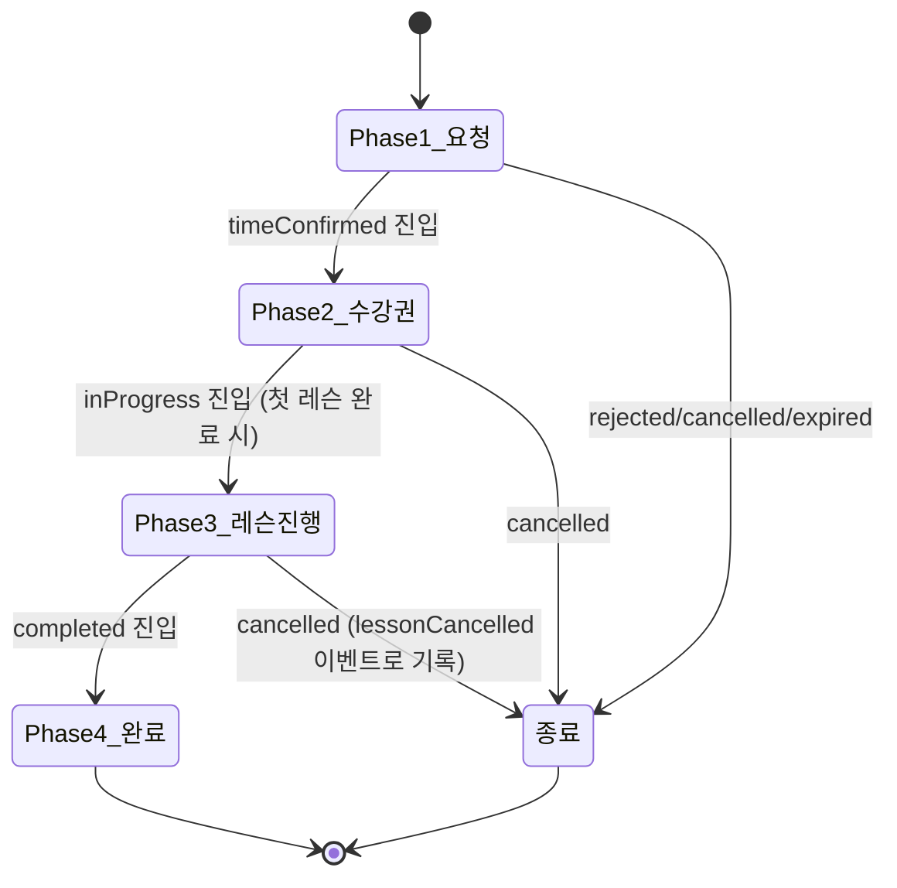

# 통합 레슨 신청 — Phase 1~4 라이프사이클 스펙

> 작성일: 2026-08-11
> 성격: **doc-sync repair** — 이미 배포된 코드의 동작을 서술한다. 새 `RequestEventType` 이나 새 기능을 제안하지 않는다.
> 코드 SSOT: `frontend/lib/features/schedule/domain/entities/unified_lesson_request.dart`, `frontend/lib/features/schedule/domain/entities/request_event.dart`, `backend/app/models/schedule.py`, `backend/app/models/request_event.py`
> 배경: `lesson_request_api_spec.md` §4 는 6개 액션(approve/reject/proposeAlternative/acceptAlternative/counterPropose/cancel)만 정의했으나, 실제 코드는 33개 `RequestEventType` 값과 4단계 `RequestPhase` 라이프사이클(시간협의 → 수강권 제안/결제 → 레슨 진행/일정변경 협상 → 종료/갱신)을 갖는다. 이 문서가 Phase 2~4 를 처음으로 문서화한다.

---

## 1. 개요 및 용어

유비쿼터스 언어(`.harness/knowledge/glossary.md` §3)의 공식 용어를 사용한다.

| 용어 | FE 클래스 | BE 클래스 | 비고 |
|---|---|---|---|
| 레슨 요청 | `UnifiedLessonRequest` | `LessonRequest` | FE-BE 불일치(역사적, glossary §9) — 유지 |
| 요청 상태 | `UnifiedRequestStatus` | `RequestStatus` | FE-BE 불일치 — 유지 |
| 요청 이벤트 | `RequestEvent` | `RequestEvent` | FE=BE 동일 |
| 요청 단계 | `RequestPhase` | (BE 없음, FE 전용) | 챕터형 UI 를 위한 4구간 묶음 |

이 문서는 `UnifiedLessonRequest`(신청 1건)와 그 히스토리인 `RequestEvent`(채팅형 이벤트 로그)가 학생-선생님 최초 연결부터 수강권 발급, 레슨 진행, 종료/갱신까지 전체를 표현하는 방식을 다룬다. 신청 폼 자체의 UI/UX 설계(3안 제출, 주간 캘린더 등)는 이 문서의 범위가 아니다 — §6 참조.

---

## 2. 4-Phase 라이프사이클

`UnifiedLessonRequest.currentPhase`(`unified_lesson_request.dart:364-381`)가 13개 `UnifiedRequestStatus` 값을 5개 `RequestPhase` 값으로 묶는다. 이 묶음이 `RequestDetailScreen`의 진행바(`LessonProgressBar`)·챕터 접기·챗 필터링의 기준이다.

| RequestPhase | 포함 UnifiedRequestStatus | 화면 표시명(`AppStrings`) | 근거 |
|---|---|---|---|
| `request` (Phase 1: 레슨 신청 → 입금 전) | pending, negotiating, approved | `chapterRequest` = "레슨 신청" | `unified_lesson_request.dart:366-368` |
| `subscription` (Phase 2: 수강권 발행) | timeConfirmed, proposalSent, proposalAccepted, paymentNotified, **subscriptionIssued** | `chapterSubscription` = "수강권 & 입금" | `:370-374` |
| `lessons` (Phase 3: 레슨 진행) | inProgress | `chapterLessons` = "레슨 진행" | `:375` |
| `completed` (본 문서에서 "Phase 4: 종료/갱신"으로 서술) | completed | (전용 챕터 타이틀 없음 — `_buildPhase4Completed()`가 수강권 요약만 표시) | `:376` |
| `terminal` | rejected, cancelled, expired | "요청이 종료되었습니다"(`requestClosed`) | `:377-379` |

> **정확도 노트**: `RequestPhase` enum 자체는 `request / subscription / lessons / completed / terminal` 5개 값이며, 코드 주석은 `completed`를 숫자 "Phase 4"로 부르지 않는다. 이 문서는 서술 편의상 브리핑 요청("Phase 4 종료/갱신")을 따라 `completed` 상태를 Phase 4 로 지칭한다 — 근거: `request_detail_screen.dart:97-101`의 `_completedPhaseEventTypes`가 `subscriptionRenewed`(갱신)와 `subscriptionCompleted`/`completed`(종료)를 같은 버킷에 묶는다.
>
> **`subscriptionIssued`는 Phase 3이 아니라 Phase 2에 속한다.** 수강권이 발급된 직후에도 UI는 여전히 "수강권 & 입금" 챕터로 취급하며, 교사가 `recordLessonCompleted()`로 첫 레슨을 완료 처리해야 비로소 상태가 `inProgress`로 바뀌고 Phase 3 로 넘어간다 (`unified_lesson_request_providers.dart:763-790`).

### 2.1 상태(UnifiedRequestStatus) 전이 — 선언된 표

`UnifiedLessonRequest._transitions`(`unified_lesson_request.dart:296-333`, `canTransitionTo()`로 노출)가 선언한 상태 전이표:

| From | To (허용) |
|---|---|
| pending | approved, rejected, cancelled |
| approved | negotiating, timeConfirmed, cancelled, pending(승인 철회) |
| negotiating | timeConfirmed, expired, cancelled |
| timeConfirmed | proposalSent, completed(체험 무료 경로), cancelled |
| proposalSent | proposalAccepted, rejected, expired, cancelled |
| proposalAccepted | paymentNotified, cancelled |
| paymentNotified | subscriptionIssued, cancelled |

> **드리프트 관찰**: 이 표는 `canTransitionTo()`로만 노출되며, 실제 서비스 메서드가 항상 이 표를 거쳐 상태를 바꾸는 것은 아니다.
> - 교사가 학생의 희망 슬롯 1개를 그대로 승인하는 주 경로(`UnifiedLessonRequestWorkflowService.approveRequest`, `unified_lesson_request_workflow_service.dart:54-86`)는 `approved`를 거치지 않고 **`timeConfirmed`로 직접** 전이한다.
> - 반대로 학생이 교사의 대안 제안을 수락하는 경로(`acceptAlternativeRequest`, `:88-110`)는 내부적으로 `repository.approve(id)`를 호출해 상태를 **`approved`**로 설정한다(mock: `mock_unified_lesson_request_repository.dart:1597-1607`, remote: `remote_unified_lesson_request_repository.dart:95-101`). 개념적으로 "슬롯을 수락한다"는 동일한 행동이 액터(교사/학생)에 따라 서로 다른 목표 상태를 만든다.
> - `RequestDetailScreen`/`CurrentRequestBox`의 Phase 1 "누구 차례인가" 판정은 이 상태값이 아니라 **가장 최근 `RequestEvent`의 actor**를 기준으로 한다(`current_request_box.dart:148-166`) — 그래서 위 상태값 불일치가 Phase 1 화면 자체를 깨뜨리지는 않는다. 다만 상태값을 직접 참조하는 다른 소비자(목록 필터 `RequestStatusGroup`, 배지 카운트 등 — `lesson_request_api_spec.md` 참조)에는 영향을 줄 수 있다.
> - `subscription` 단계 진입 이후(Phase 2/3/4)의 전이는 선언 표에 없다. `sendPaymentGuide`/`issueSubscription`/`recordLessonCompleted`/`completeSubscription`/`cancelRequest` 등은 `canTransitionTo()` 검사 없이 `copyWith(status: ...)`로 직접 전이한다.

### 2.2 Phase 2 결제 방식 3분기 — `timeConfirmed` 이후 실제 경로

교사가 `_handleSendPaymentGuide`(`request_detail_screen.dart:755-828`)에서 선택하는 `PaymentMethod`(`proposal_bottom_sheet.dart:17`)에 따라 서로 다른 상태 도달 경로를 탄다:

| PaymentMethod | 호출 메서드 | 결과 상태 | 경유 상태 |
|---|---|---|---|
| `prepaid`(선불) | `sendPaymentGuide()` | `proposalSent` | 이후 학생 `acceptProposal()` → `proposalAccepted` → `confirmPayment()` → `paymentNotified` → 교사 `issueSubscription(paymentConfirmed:true)` → `subscriptionIssued` |
| `postpaid`(후불) | `issueSubscription(paymentConfirmed:false)` | **`subscriptionIssued`로 직진** | `proposalSent`/`proposalAccepted`/`paymentNotified` 모두 건너뜀 — glossary "미수금"(`payment_confirmed=false`) 상태로 발급 |
| `free`(무료) | `issueSubscription(paymentConfirmed:true)` | **`subscriptionIssued`로 직진** | 위와 동일하게 중간 상태 건너뜀 |

근거: `unified_lesson_request_providers.dart:769-824`(`_handleSendPaymentGuide` 분기), `:618-674`(`issueSubscription`).

### 2.3 미사용으로 보이는 선언 경로

`timeConfirmed → completed`(체험 무료 경로, §2.1 표)를 만드는 `UnifiedLessonRequestActions.completeRequest()`(`unified_lesson_request_providers.dart:383-409`)는 코드베이스 전체에서 호출부가 확인되지 않는다(`rg "\.completeRequest\("` 결과 없음). 상태 머신과 서비스 계층에는 존재하나 현재 UI 진입점이 없는 경로로 보인다 — 재구현 판단은 이 문서의 범위 밖.

---

## 3. 이벤트 카탈로그 — RequestEventType 전체 33개

`RequestEventType`(FE `request_event.dart:19-96`, BE `request_event.py:21-70`)은 코드 주석이 이미 7개 그룹으로 나눠 놓았다. 아래 표는 그 그룹을 그대로 따른다. "BE 값"이 FE `RequestEventType`과 다른 경우만 별도 표기(파이썬 멤버명은 snake_case 이나 문자열 값(`values_callable`)은 FE와 동일).

### 3.1 Phase 1 — 레슨 신청 (13개)

| 이벤트 | 트리거 액터 | 의미 |
|---|---|---|
| `initialRequest` | 학생 | 최초 신청 생성. `preferredSlots`를 `suggestedSlots`로 스냅샷 |
| `approve` | 교사 | 학생의 희망 슬롯 1개를 그대로 승인 |
| `reject` | 교사(Phase1) / 학생(Phase2 제안 거절 시에도 재사용) | 거절 + 사유(`message`) |
| `proposeAlternative` | 교사 | 대안 시간 최대 3개 역제안 |
| `counterPropose` | 학생 | 교사의 대안에 대한 재역제안 |
| `acceptAlternative` | 학생 | 교사의 대안 중 1개 수락(`selectedSlotIndex`) |
| `cancel` | 학생/교사 | Phase 1~2 단계 취소 |
| `expire` | 시스템(배치) | 7일 무응답 자동 만료 |
| `proposalSent` | 교사 | 수강권 제안(선불) 발송 |
| `proposalAccepted` | 학생 | 수강권 제안 수락(+ 선택 템플릿 id는 `message`에 기록) |
| `paymentNotified` | 학생 | 입금 완료 알림 |
| `completed` | 교사 | (§2.3 참고 — 현재 호출부 미확인) |
| `withdrawApproval` | 교사/학생 | "결정 변경" — 승인/수락을 되돌려 재협상 |

### 3.2 Phase 2 — 수강권 & 입금 (3개)

| 이벤트 | 트리거 액터 | 의미 |
|---|---|---|
| `paymentRequested` | — | 정의만 존재. FE 워크플로우에서 직접 생성하는 호출부는 확인되지 않음(입금 안내는 `proposalSent`가 담당) |
| `paymentConfirmed` | — | 정의만 존재. 교사의 입금 확인 액션은 실제로 `subscriptionIssued`(§3.3) 이벤트로 기록됨(`_handleVerifyPayment` → `issueSubscription`) |
| `subscriptionIssued` | 교사 | 수강권 발급 완료. `subscriptionId` 필드에 연결된 수강권 id 기록 |

### 3.3 Phase 3 — 레슨 진행 (6개)

| 이벤트 | 트리거 액터 | 의미 |
|---|---|---|
| `lessonCompleted` | 교사 | 레슨 1회 완료 기록. 최초 1회 발생 시 요청 상태가 `inProgress`로 전이 |
| `lessonCancelled` | 교사/학생 | 개별 레슨 취소(사유는 `message`) — `cancelRequest()`가 `subscriptionIssued`/`inProgress` 단계에서 요청을 취소할 때도 이 이벤트 타입을 사용(`unified_lesson_request_providers.dart:434-440`) |
| `scheduleChanged` | 교사/학생 | 일정 변경 최종 확정 요약(타임라인용) — §5 참조 |
| `lessonNoteAdded` | 교사 | 레슨 노트 추가 기록 |
| `subscriptionRenewed` | 교사/학생 | 수강권 연장/재수강 제안(`renewSubscription()`) |
| `subscriptionCompleted` | 교사 | 수강권 전체 소진 → 요청 상태 `completed`로 전이(`completeSubscription()`) |

### 3.4 Phase 3 — 일정 변경 협상 (6개)

§5에서 상세 서브플로우로 다룬다.

| 이벤트 | 트리거 액터 |
|---|---|
| `scheduleChangeProposed` | 교사/학생 |
| `scheduleChangeAccepted` | 교사/학생 |
| `scheduleChangeRejected` | 교사/학생 |
| `scheduleChangeCountered` | 교사/학생 |
| `scheduleChangeExpired` | 시스템(배치, 72h) |
| `scheduleChangeReminder` | 시스템(배치, 24h) — UI 미노출, 알림 전용 |

### 3.5 일반 (1개)

| 이벤트 | 트리거 액터 | 의미 |
|---|---|---|
| `message` | 교사/학생 | 수강권 상세 챗의 일반 텍스트 메시지 |

### 3.6 Phase 3 — 레슨 취소 확정 + 크레딧 반환 (2개)

| 이벤트 | 트리거 액터 | 의미 |
|---|---|---|
| `lessonCancellationConfirmed` | — | `changeCreditUsed`/`changeCreditRemainingAfter`/`keepsSessionNumber` 필드로 취소 확정 시점의 변경권 스냅샷을 보존 |
| `cancellationCreditRefunded` | — | 크레딧 환급 기록 |

### 3.7 Phase 3 — 선생님 일괄 작업 (2개, glossary §7)

| 이벤트(FE 값) | BE 파이썬 멤버명 | 트리거 액터 | 의미 |
|---|---|---|---|
| `lessonCancelledByTeacher`(glossary "선생님 휴강 이벤트") | `lesson_cancelled_by_teacher` | 교사 | 선생님 사유 휴강(일괄/개별). `sessionNumber` + 사유(`message`) + `changeCreditUsed=0` — 변경권 미차감 |
| `teacherAnnouncement`(glossary "선생님 공지 이벤트") | `teacher_announcement` | 교사 | 일괄 공지 메시지(`message`는 "제목\n본문" 형식) |

> BE 스키마상 문자열 값은 FE와 동일(`values_callable=lambda obj: [e.value for e in obj]`, `request_event.py:91-98`) — 파이썬 멤버명(snake_case)만 다르다.

---

## 4. Phase별 화면 · 액션 매핑

`RequestDetailScreen`(`request_detail_screen.dart`)이 상태·이벤트를 읽어 `CurrentRequestBox`(`current_request_box.dart`)에 핸들러를 주입하는 구조다(`request_detail_screen.dart:308-351`). `CurrentRequestBox._buildPhaseContent()`(`:187-197`)가 `request.currentPhase`로 4+1 분기한다.

### 4.1 Phase 1 (request) — `_buildPhase1Request()`

턴 판정은 §2.1의 상태값이 아니라 **최근 이벤트의 actor**로 이뤄진다(`current_request_box.dart:148-166`).

| 화면 상태 | 버튼(AppStrings) | 핸들러(`RequestDetailScreen`) | 생성 이벤트 |
|---|---|---|---|
| 내 차례 — 슬롯 선택 후 | "선택한 일정으로 확정"(`scheduleChangeAccept`) | `_handleAccept` | 교사: `approve` / 학생: `acceptAlternative` |
| 내 차례 — 대안 제시 | "다른 시간 제안하기"(`scheduleChangeCounter`) | `_handleCounterPropose` → `SuggestAlternativeScreen` | `proposeAlternative`(교사) 또는 `reject`(3안 모두 불가) |
| 상대 차례 | "결정 변경"(`withdrawApproval`) | `_handleWithdraw` | `withdrawApproval` (+ 재승인/재제안/거절 이벤트) |
| AppBar "더보기" | "취소하기"(`cancelRequestAction`) | `_handleCancel` → `showCancelLessonBottomSheet` | `cancel`(사유는 `CancelReason.label`) |

### 4.2 Phase 2 (subscription) — `_buildPhase2Subscription()`

| 상태 | 뷰어 | UI | 핸들러 | 생성 이벤트 |
|---|---|---|---|---|
| `timeConfirmed` | 교사 | "수강권 발급"(`proposalTitle`) 버튼 → `ProposalBottomSheet` | `_handleSendPaymentGuide` | §2.2 3분기 참조 |
| `proposalSent` | 교사 | 대기 메시지만(`actionBoxWaitingAccept`) | — | — |
| `proposalSent` | 학생 | 템플릿 선택 + "거절"/"수강권 수락" | `_handleAcceptProposal` / `_handleRejectProposal` | `proposalAccepted` / `reject`(확인 다이얼로그 필수 — destructive) |
| `proposalAccepted` | 교사 | 대기 메시지(`actionBoxWaitingPayment`) | — | — |
| `proposalAccepted` | 학생 | "입금 완료"(`actionConfirmPayment`) | `_handleConfirmPayment` | `paymentNotified` |
| `paymentNotified` | 교사 | "입금 확인"(`actionVerifyPayment`) | `_handleVerifyPayment` | `subscriptionIssued`(paymentConfirmed:true) |
| `paymentNotified` | 학생 | 대기 메시지(`actionBoxWaitingVerify`) | — | — |
| `subscriptionIssued` | 양측 | 대기/완료 메시지만 | — | — |

### 4.3 Phase 3 (lessons) — `_buildPhase3Lessons()`

일정 변경 협상 중인 이벤트가 있으면 응답 배너를, 없으면 수강권 요약 + 일정 변경 진입 버튼을 보여준다(`current_request_box.dart:629-669`, `_pendingScheduleChangeEvent()`).

| UI | 핸들러 | 생성 이벤트 |
|---|---|---|
| "레슨 완료"(`actionLessonComplete`) | `_handleLessonComplete` | `lessonCompleted` (+ 최초 1회는 상태 `inProgress` 전이) |
| "레슨 취소"(`actionLessonCancel`) | `_handleLessonCancel` | `lessonCancelled` |
| 일정 변경(`scheduleChangeButton`, `swap_horiz_rounded` 아이콘) | `_handleScheduleChange` → §5 | `scheduleChangeProposed` |
| 일정 변경 응답 배너(`scheduleChangeResponseNeeded`) | `_handleScheduleChangeResponse` → §5 | `scheduleChangeAccepted`/`Rejected`/`Countered` |
| "메모 추가"(`actionAddNote`) | `_handleAddNote` | `lessonNoteAdded` |

### 4.4 Phase 4 (completed) — `_buildPhase4Completed()`

수강권 요약 카드("상세 보기" 링크)만 표시(`subscriptionSummaryMessage` / `subscriptionDetailLink`). `_handleRenewal`("연장 제안"/`actionProposeRenewal` 교사, "재수강 신청"/`actionRequestRenewal` 학생)이 `subscriptionRenewed` 이벤트를 만들지만 요청 상태 자체를 바꾸지는 않는다(`unified_lesson_request_providers.dart:1032-1053`).

### 4.5 Terminal — `_buildTerminal()`

"요청이 종료되었습니다"(`requestClosed`)만 표시, 액션 없음.

### 4.6 챗 히스토리 표시 버킷 — §3 그룹과 다른 분류축

`RequestDetailScreen`이 챕터 접기/펼치기에서 이벤트를 필터링하는 기준(`_requestPhaseEventTypes` 등, `:63-101`)은 §3의 "코드 주석 그룹"과 다르다 — 예를 들어 `proposalSent`/`proposalAccepted`/`paymentNotified`는 §3에서는 "Phase 1" 주석 아래 있지만, 챗 필터링에서는 `RequestPhase.request` 버킷(즉 Phase 1 챕터)에 포함된다(`:63-76`). 반대로 `completed`는 §3 Phase 1 그룹에 있지만 챗 필터링에서는 `_completedPhaseEventTypes`(§2 Phase 4) 버킷에 들어간다(`:97-101`). 두 분류축 모두 코드에 실재하며, 이 문서는 어느 한쪽으로 통일하지 않고 있는 그대로 병기한다.

---

## 5. 일정 변경 협상 서브플로우

Phase 3 진행 중 레슨 시간을 바꾸는 협상. 별도 엔티티가 아니라 `RequestEvent` + `ScheduleChangeType`(`singleLesson`/`bulkChange`, `request_event.dart:12-16`)만으로 표현된다.

> **엔티티 통합 이력**: `request_event.dart` 상단 주석에 따르면 `ScheduleChangeType`은 원래 `LessonScheduleChange` 엔티티에 있었으나 `RequestEvent` SSOT 정렬을 위해 이쪽으로 옮겨졌고, `LessonScheduleChange` 엔티티 자체는 미사용 dead code로 제거되었다(`request_event.dart:7-11`). glossary §3의 "스케줄 변경 | `ScheduleChange`(FE) / `LessonScheduleChange`(BE)" 항목은 이 이력을 반영하지 못한 상태다 — glossary 갱신은 이 문서의 범위 밖이므로 사실만 남긴다.

### 5.1 흐름

1. 발의: `_handleScheduleChange`(`request_detail_screen.dart:1005-1072`) — 변경 유형 선택(`ScheduleChangeTypeBottomSheet`: 1회성/일괄) → 슬롯 선택(`ScheduleChangeSlotBottomSheet`) → `recordScheduleChangeProposed()` → `scheduleChangeProposed` 이벤트.
2. 응답: `_handleScheduleChangeResponse`(`:1074-1177`) — 상대방이 `ScheduleChangeResponseBottomSheet`에서 3가지 중 선택(`ScheduleChangeResponseAction`: `accept`/`reject`/`counter`):
   - **accept** → `recordScheduleChangeAccepted()` → `scheduleChangeAccepted` 이벤트 + 뒤이어 타임라인 요약용 `scheduleChanged` 이벤트 1건 추가 생성(`unified_lesson_request_providers.dart:949-959`). 레슨/캘린더 캐시를 무효화(`lessonsNotifierProvider` 등, `:964-970`).
   - **reject** → `recordScheduleChangeRejected()` → `scheduleChangeRejected`.
   - **counter** → `recordScheduleChangeCountered()` → `scheduleChangeCountered`(새 대안 슬롯 포함, 1로 돌아가 재협상).
3. `CurrentRequestBox`는 이벤트 로그를 최신순으로 훑어 "상대방이 보낸 미해결 proposed/countered"가 있으면 응답 배너를 띄운다(`_pendingScheduleChangeEvent()`, `current_request_box.dart:671-702`) — `scheduleChangeAccepted`/`scheduleChanged` 이벤트가 나오면 그 스레드는 종료된 것으로 간주.

### 5.2 무응답 배치 처리 (72h/24h/60h)

`backend/app/jobs/schedule_change_expiry_jobs.py`(cron, hourly):

| 경과 시간 | 동작 |
|---|---|
| 24h | `scheduleChangeReminder` 이벤트 기록 + 응답자에게 push 1회(중복 방지: 동일 스레드에 이벤트 존재 여부로 게이트) |
| 60h | 요청자에게 "만료 임박" push 1회 |
| 72h | `scheduleChangeExpired` 이벤트 기록 + 양측 기본값 복귀 + 변경권 복원 |

판정 기준은 마지막 `scheduleChangeProposed`/`scheduleChangeCountered` 이벤트 시각이며, `scheduleChangeAccepted`/`scheduleChangeRejected`/`scheduleChangeExpired`가 발생하면 타이머가 리셋된다(`schedule_change_expiry_jobs.py:1-59`).

### 5.3 상대방 통지

FE 로컬 알림은 액터 자신의 기기에만 뜨므로 상대방 통지로 쓸 수 없다 — 상대 통지는 BE `Notification` row가 SSOT다(`request_detail_screen.dart:1063-1065`, `:1124-1125`, `:1168-1169` 주석). `scheduleChangeRejected`에 대한 상대 통지는 전용 알림 타입이 없어 BE emit이 아직 없다(코드 주석상 잔여 갭으로 명시됨).

---

## 6. 관련 스펙과의 관계

| 문서 | 다루는 범위 | 이 문서와의 관계 |
|---|---|---|
| `docs/specs/schedule/lesson_request_api_spec.md` | REST 엔드포인트 목록. §4의 6-action `POST /lesson-requests/:id/actions`(approve/reject/proposeAlternative/acceptAlternative/counterPropose/cancel)는 백엔드 `apply_action()`(`backend/app/services/lesson_request_service.py:695-750`)이 실제로 구현하는 것과 정확히 일치 — **Phase 1 초기 설계 그대로 유효**. 그러나 Phase 2~4의 상태 전이(§2.2, §3.2~3.7)는 이 6-action 엔드포인트를 거치지 않는다: 실제로는 제네릭 `PATCH /lesson-requests/:id/status`(전체 목표 상태를 그대로 전송)와 제네릭 `POST /lesson-requests/:id/events`(임의의 `RequestEventType` 저장, `backend/app/services/lesson_request_service.py:174-` `add_event()`)가 그 역할을 대신한다. `lesson_request_api_spec.md`는 이 문서로 대체되지 않으며, §4(6-action)와 §1~3(목록/생성/캘린더)는 여전히 SSOT다. |
| `docs/specs/booking/unified_lesson_request_spec.md` | **신청 폼(Phase 1 진입) UI/UX 설계** — 3타입 통합, 3안 제출, 주간 캘린더, 재수강 프리필, 선생님 안내 메시지 등. 파일명이 이 문서와 같지만 디렉토리가 다르다(`booking/` vs `schedule/`) — 혼동 주의. 이 문서는 신청 폼 자체를 다루지 않고, 신청이 접수된 **이후**의 4단계 라이프사이클 전체를 다룬다. 두 문서는 상호 보완 관계이며 어느 쪽도 폐기 대상이 아니다. |
| `docs/specs/schedule/schedule_master.md` §7 "레슨 요청 시스템(LessonRequest)" | 재수강 전용의 구(舊) 6상태(`LessonRequestStatus`: pending/proposalSent/accepted/declined/expired/cancelled) 모델을 서술 — `booking/unified_lesson_request_spec.md` §5.3에 따르면 이 구 모델은 `UnifiedLessonRequest`로 통합되며 폐기 대상이었다. §7은 역사적 참고 문서로 남아 있으며, 실제 13상태 `UnifiedRequestStatus`·33개 `RequestEventType`은 이 문서(§2~3)가 SSOT다. |

---
