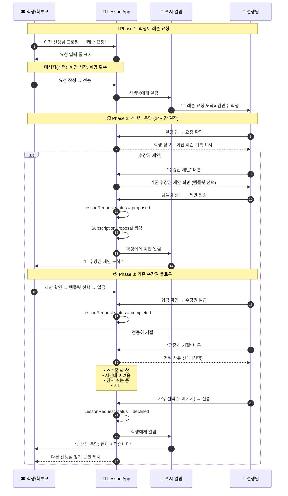

# 학생 레슨 요청 시스템 (Lesson Request System)

> 최종 업데이트: 2026-02-01
> 상태: **구현 진행 중** (v3 - 스케줄 확인 카드 방식)

---

## 구현 현황

| 항목 | 상태 | 파일 |
|------|:----:|------|
| LessonRequest 엔티티 | ✅ | `lib/features/schedule/domain/entities/lesson_request.dart` |
| LessonRequestRepository | ✅ | `lib/features/schedule/domain/repositories/lesson_request_repository.dart` |
| MockLessonRequestRepository | ✅ | `lib/features/schedule/data/repositories/mock_lesson_request_repository.dart` |
| lessonRequestProviders | ✅ | `lib/features/schedule/presentation/providers/lesson_request_providers.dart` |
| 학생 앱: 레슨 요청 화면 | ✅ | `lib/features/schedule/presentation/screens/lesson_request_screen.dart` |
| 선생님 앱: 요청 목록 화면 | ✅ | `lib/features/schedule/presentation/screens/lesson_requests_screen.dart` |
| 수강권 제안 시 상태 연동 | ✅ | `IssueSubscriptionScreen` → `lessonRequestId` 파라미터 추가 |
| 선생님 홈 레슨 요청 버튼 | ✅ | `HomeScreen` → 뱃지 포함 버튼 |
| 학생 앱: 내 요청 현황 화면 | ✅ | `lib/features/schedule/presentation/screens/my_lesson_requests_screen.dart` |
| 스케줄 확인 카드 | ❌ | TODO: 수강권 발급 후 학생에게 스케줄 확인 카드 표시 |
| 알림 시스템 연동 | ❌ | TODO: 푸시 알림 연결 필요 |

### 스케줄 확인 카드 (v3 변경사항)

> ⚠️ **v2에서 변경**: 자동 스케줄 복원 → 학생 확인 후 확정

**이전 (v2)**: 입금 확인 시 이전 스케줄 자동 복원
**현재 (v3)**: 수강권 발급 후 학생에게 스케줄 확인 카드 표시 → 학생이 확인/변경

```
┌─────────────────────────────────────┐
│ 🎉 수강권이 발급되었습니다!          │
│                                     │
│ 김선생님 · 바이올린 8회권            │
│                                     │
│ 📅 레슨 시간을 확정해주세요          │
│                                     │
│ ┌─────────────────────────────────┐ │
│ │ ⭐ 이전 스케줄                   │ │
│ │    매주 월요일 9:00 (60분)       │ │
│ │    [이 시간으로 예약]            │ │
│ └─────────────────────────────────┘ │
│                                     │
│ [다른 시간 선택하기]                 │
└─────────────────────────────────────┘
```

**시나리오별 동작:**

| 시나리오 | 카드 내용 |
|----------|----------|
| 재등록 (이전 기록 O) | "이전 스케줄 월 9시로 예약?" + [다른 시간] |
| 체험 후 정규 | "체험 시간 토 15시로 예약?" + [다른 시간] |
| 추가 악기 (이전 기록 X) | "레슨 시간을 선택해주세요" → 가용시간 표시 |

---

> **관련 문서**: [수강권 중심 관계 모델](../invite/subscription_based_relationship.md)
>
> 본 시스템은 **수강권 만료(expired)** 또는 **이전 레슨(past)** 상태의 학생이
> 선생님에게 재등록을 요청하는 플로우입니다.

---

## 1. 개요

### 1.1 배경

수강권 중심 관계 모델에서 학생이 **능동적으로** 재등록 의사를 표현할 수 있는 시스템입니다.

**관계 상태와 레슨 요청:**

| RelationshipStatus | 레슨 요청 | 설명 |
|-------------------|:---------:|------|
| `trialBooked` | ❌ | 체험 예약 상태 |
| `active` | ❌ | 수강권 유효 → 레슨 예약 사용 |
| `expired` | ✅ | 수강권 만료 → 레슨 요청 가능 |
| `past` | ✅ | 이전 레슨 → 레슨 요청 가능 |

**플로우:**
```
학생: "레슨 요청" → 선생님: 수강권 제안 → 학생: 수락/입금 → 관계 active로 전환
```

### 1.2 경쟁 앱 분석 요약

| 앱 | 방식 | 핵심 특징 |
|----|------|----------|
| **숨고** | 지정요청 | 원하는 전문가에게 직접 요청서 발송, 견적 비교 |
| **김과외** | 상담요청 | 앱 내 메시지로 상담 후 결정, 연락처 교환 |
| **Mindbody** | Request Booking | 강사 승인 후 예약 확정, 요청/직접예약 구분 |
| **StudioMate** | 수강권 종료 알림 | 센터에서 직접 연락 (수동) |

**공통점:** 학생 요청 → 전문가 응답 → 조건 협의 → 결정

---

## 2. 다중 관점 분석

### 2.1 👨‍🎨 UX 디자이너 관점

#### 현재 문제점

| 문제 | 영향 | 심각도 |
|------|------|:------:|
| "다시 연결하기" 버튼의 모호함 | 연결 후 다음 단계 불명확 | 🔴 높음 |
| 수동적 대기 | 학생이 할 수 있는 액션 없음 | 🔴 높음 |
| 가격 정보 부재 | 결정에 필요한 정보 없음 | 🟠 중간 |

#### UX 개선 방향

**1. 명확한 CTA (Call to Action)**
```
변경 전: [다시 연결하기] → 무엇을 위한 연결인지 모호
변경 후: [레슨 요청하기] → 레슨을 받고 싶다는 명확한 의도
```

**2. 진행 상태 시각화**
```
요청 보냄 → 선생님 확인 중 → 제안 도착 → 수락/입금 → 완료
   ●          ○              ○           ○         ○
```

**3. 정보 투명성**
- 평균 응답 시간 표시 ("보통 24시간 내 응답")
- 요청 만료 시간 표시 ("7일 후 만료")
- 응답 없을 시 대안 제시 ("다른 선생님 찾아보기")

**4. "생각없이 사용" 원칙 적용**
```
┌─────────────────────────────────────┐
│  레슨 요청하기                       │
├─────────────────────────────────────┤
│  메시지 (선택):                      │
│  ┌─────────────────────────────────┐│
│  │ 추천 메시지 탭하여 입력          ││
│  │ • "다시 레슨 받고 싶습니다"      ││  ← 원탭 입력
│  │ • "체험 후 정규 등록 희망"       ││
│  └─────────────────────────────────┘│
│                                     │
│  희망 시작: [가능한 빨리 ▼]          │  ← 기본값 제공
│  희망 횟수: [주 1회 ▼]               │  ← 이전 기록 기반
│                                     │
│  [레슨 요청 보내기]                  │
└─────────────────────────────────────┘
```

### 2.2 📚 도메인 전문가 관점

#### 음악 레슨 시장 특성

| 특성 | 설명 | 시스템 반영 |
|------|------|------------|
| **장기 관계** | 선생님-학생 관계가 수년 지속 | 이전 연결 기록 보존 |
| **맞춤 가격** | 학생 수준/관계에 따라 가격 협상 | 선생님이 직접 제안 |
| **계절적 변동** | 방학/시험 기간 중단 후 재개 흔함 | 재등록 요청 기능 필수 |
| **신뢰 기반** | 체험 후 정규 전환 결정 | 요청-응답 모델 적합 |

#### 기존 수강권 제안 시스템과의 관계

```
┌─────────────────────────────────────────────────────────────┐
│                    수강권 제안 시스템                         │
│  ┌──────────────────┐      ┌──────────────────┐            │
│  │ 자동 제안        │      │ 수동 제안        │            │
│  │ (체험 후 72시간)  │      │ (선생님 직접)    │            │
│  └────────┬─────────┘      └────────┬─────────┘            │
│           │                         │                       │
│           └───────────┬─────────────┘                       │
│                       ▼                                     │
│              SubscriptionProposal                           │
│                       ▲                                     │
│           ┌───────────┴─────────────┐                       │
│           │                         │                       │
│  ┌────────┴─────────┐      ┌────────┴─────────┐            │
│  │ 학생 레슨 요청   │      │ 선생님 발의      │            │
│  │ (NEW!)          │      │ (기존)           │            │
│  └──────────────────┘      └──────────────────┘            │
│                                                             │
│  LessonRequest → 선생님 확인 → SubscriptionProposal 생성    │
└─────────────────────────────────────────────────────────────┘
```

**핵심 원칙:** LessonRequest는 SubscriptionProposal을 트리거하는 수단

### 2.3 🎻 선생님 관점

#### 현재 Pain Point

| 문제 | 상황 | 감정 |
|------|------|------|
| 먼저 연락해야 함 | 수강권 만료 학생에게 연락 | "독촉하는 것 같아 불편" |
| 관심도 파악 불가 | 학생이 계속할지 모름 | "연락해야 하나 망설임" |
| 타이밍 어려움 | 언제 연락해야 적절한지 | "너무 빨라도, 늦어도 어색" |

#### 레슨 요청 시스템의 이점

| 이점 | 설명 |
|------|------|
| **수요 확인** | 학생이 먼저 요청 → 관심 있음을 확인 |
| **부담 감소** | 독촉 아닌 응답 → 심리적 부담 감소 |
| **효율적 관리** | 요청 목록으로 우선순위 관리 |
| **맥락 정보** | 학생 희망사항 미리 파악 |

#### 선생님용 UI 요구사항

```
┌─────────────────────────────────────────────────────────────┐
│  📬 레슨 요청 (2건)                              [모두 보기] │
├─────────────────────────────────────────────────────────────┤
│                                                             │
│  ┌─────────────────────────────────────────────────────┐   │
│  │ 🔴 NEW  김민수 (바이올린)                            │   │
│  │                                                      │   │
│  │ 📋 재등록 요청                                       │   │
│  │ 📅 이전: 2025.10~12 (8회 완료)                      │   │  ← 이전 기록 표시
│  │ 💬 "다시 레슨 받고 싶습니다"                         │   │
│  │ ⏰ 6일 후 만료                                       │   │
│  │                                                      │   │
│  │ [수강권 제안]  [정중히 거절]                         │   │  ← 명확한 액션
│  └─────────────────────────────────────────────────────┘   │
│                                                             │
│  ┌─────────────────────────────────────────────────────┐   │
│  │ 이서연 (피아노) - 체험 후 정규 문의                   │   │
│  │ ⏰ 5일 후 만료                                       │   │
│  └─────────────────────────────────────────────────────┘   │
└─────────────────────────────────────────────────────────────┘
```

**핵심:**
- 이전 레슨 기록 바로 확인 가능
- "수강권 제안" 버튼으로 기존 플로우 연결
- "정중히 거절" 옵션으로 어색함 없이 거절

### 2.4 🎓 학생/학부모 관점

#### 현재 Pain Point

| 문제 | 상황 | 감정 |
|------|------|------|
| 수동적 대기 | 선생님 연락 기다림 | "언제 연락 올지 모름" |
| 직접 연락 부담 | 카톡으로 먼저 연락 | "갑자기 연락하기 어색" |
| 가격 불확실 | 얼마인지 모름 | "물어보기 부담스러움" |
| 거절 두려움 | 선생님이 싫어할까봐 | "받아줄지 모르겠음" |

#### 레슨 요청 시스템의 이점

| 이점 | 설명 |
|------|------|
| **능동적 액션** | "요청 보내기"로 명확한 의사 표현 |
| **형식화된 요청** | 앱 통한 요청 → 개인 연락보다 부담 적음 |
| **투명한 상태** | 요청 상태 실시간 확인 가능 |
| **대안 제시** | 거절 시 다른 선생님 찾기 옵션 |

#### 학생용 UI 요구사항

**A. 이전 선생님 목록 (홈 화면)**
```
┌─────────────────────────────────────────────────────────────┐
│  🎻 이전에 레슨 받았던 선생님                                │
├─────────────────────────────────────────────────────────────┤
│                                                             │
│  ┌─────────────────────────────────────────────────────┐   │
│  │ 김선생님 (바이올린)                                  │   │
│  │ 마지막 레슨: 2025.12.15                             │   │
│  │ 수강권: 만료됨                                      │   │
│  │                                                      │   │
│  │ [프로필]  [💬 레슨 요청]                            │   │  ← 주요 CTA
│  └─────────────────────────────────────────────────────┘   │
└─────────────────────────────────────────────────────────────┘
```

**B. 요청 현황 (`my_lesson_requests_screen.dart`)**

> **설계 원칙**: 학생이 알고 싶은 것은 **"응답이 왔나?"** 와 **"언제까지 기다려야 하나?"**

**카드 UI (간소화 버전 - v2):**
```
┌─────────────────────────────────────────────────────────────┐
│  👤 김선생님                                  🎁 제안 도착   │  ← 상태 칩
│     🕐 매주 화요일 15:00 (60분)                             │  ← 스케줄 한 줄
│                                                             │
│                              수강권 확인하기 →              │  ← CTA (탭 가능)
└─────────────────────────────────────────────────────────────┘

┌─────────────────────────────────────────────────────────────┐
│  👤 박선생님                                  ⏳ 대기 중     │
│     🕐 매주 금요일 18:00 (60분)                             │
│     5일 후 만료                                             │  ← 만료 정보
│                                                             │
│                                               취소          │  ← 작은 텍스트
└─────────────────────────────────────────────────────────────┘
```

**상태별 카드 스타일:**

| 상태 | 배경색 | 테두리 | 상태 칩 |
|------|--------|--------|---------|
| 제안 도착 | 연한 녹색 | 녹색 2px | 🎁 제안 도착 (녹색) |
| 대기 중 | 기본 흰색 | 없음 | ⏳ 대기 중 (파랑) |
| 지난 요청 | 연한 회색 | 없음 | 회색 텍스트 |

**핵심 개선 (v1 → v2):**
- 중첩 박스 제거 (스케줄, 메시지 별도 컨테이너 X)
- "보낸 메시지" 제거 (학생이 이미 아는 정보)
- "희망 시작" 제거 (불필요)
- 취소 버튼 축소 (full-width → 작은 텍스트)
- 섹션 헤더 제거 (카드 내 상태 칩으로 충분)

**C. 거절 시 안내**
```
┌─────────────────────────────────────────────────────────────┐
│  😢 선생님 응답                                             │
├─────────────────────────────────────────────────────────────┤
│                                                             │
│  김선생님이 정중히 거절했습니다.                            │
│                                                             │
│  💬 "현재 스케줄이 꽉 차서 어렵습니다.                      │
│      다음에 다시 연락 주세요!"                              │
│                                                             │
│  ────────────────────────────────────────────               │
│                                                             │
│  🔍 다른 선생님을 찾아볼까요?                               │
│                                                             │
│  [다른 선생님 검색]  [닫기]                                 │
└─────────────────────────────────────────────────────────────┘
```

---

## 3. 플로우 설계 (개선)

### 3.1 전체 시퀀스



### 3.2 수강권 중심 관계 모델과의 통합

> **참조**: [subscription_based_relationship.md](../invite/subscription_based_relationship.md) 섹션 6.4
>
> **상세 플로우**: [flow_with_app.md](../lesson/flow_with_app.md) 섹션 2.4 (휴식 후 재등록)

**레슨 요청 후 상태 전환:**

| 단계 | RelationshipStatus | 설명 |
|------|-------------------|------|
| 요청 전 | `expired` 또는 `past` | 수강권 없음 |
| 요청 발송 | 상태 유지 | LessonRequest 생성 |
| 수강권 제안 | 상태 유지 | SubscriptionProposal 연결 |
| 수강권 발급 | → `active` | 관계 복원 완료 + **스케줄 자동 복원** |

```
수강권 중심 플로우 (간소화!):
[expired/past] → "레슨 요청" → 선생님: 수강권 제안 → 입금 → 입금확인 1탭 → [active + 스케줄 복원]
```

**핵심**: 레슨 요청은 `RelationshipStatus`를 직접 변경하지 않습니다.
**수강권 발급**이 트리거가 되어 `active` 상태로 전환됩니다.

### 3.3 자동 스케줄 복원 (입금 확인 시)

> **핵심**: 입금 확인 1탭 = 발급 + 스케줄 복원 완료!

휴식 후 재등록 시, 이전 정기 스케줄이 자동으로 복원됩니다.

```dart
// 입금 확인 시 자동 처리 (휴식 후 재등록)
void onPaymentConfirmed(LessonRequest request) {
  // 1. 수강권 발급
  final subscription = issueSubscription(request.proposalId);

  // 2. 관계 상태 변경
  updateRelationStatus(RelationshipStatus.active);

  // 3. 스케줄 자동 복원 (이전 정기 스케줄)
  final previousSchedule = getPreviousSchedule(request.studentId);
  if (previousSchedule != null) {
    createScheduleFromPrevious(request.studentId);
  }

  // 4. 알림 발송 (양쪽)
  notifyBoth("수강권 발급 + 스케줄 복원 완료!");
  // "✅ 수강권 발급 + 스케줄 복원! 8회 / 토 15:00 (매주)"
}
```

**스케줄 변경 필요 시:**
- 학생이 "다른 시간으로 변경" 버튼 탭 시에만 표시
- 기본값은 이전 스케줄 자동 유지

👉 상세: [subscription_proposal_spec.md](./subscription_proposal_spec.md) 섹션 8.4

---

## 4. 엔티티 설계

### 4.1 LessonRequest (구현 완료)

> **실제 구현 파일**: `lib/features/schedule/domain/entities/lesson_request.dart`

```dart
// Hive TypeId 범위: 98-100

@HiveType(typeId: 98)
enum PreferredStartTiming {
  @HiveField(0) nextWeek,       // 다음 주
  @HiveField(1) nextMonth,      // 다음 달
  @HiveField(2) afterConsultation, // 상담 후 결정
}

@HiveType(typeId: 99)
enum LessonRequestStatus {
  @HiveField(0) pending,        // 요청 대기
  @HiveField(1) proposalSent,   // 수강권 제안됨
  @HiveField(2) accepted,       // 수락됨
  @HiveField(3) declined,       // 레슨 불가
  @HiveField(4) expired,        // 만료됨
  @HiveField(5) cancelled,      // 취소됨
}

@HiveType(typeId: 100)
@JsonSerializable()
class LessonRequest extends HiveObject {
  final String id;
  final String studentId;
  final String teacherId;
  final String? message;
  final PreferredStartTiming preferredTiming;
  final bool keepPreviousSchedule;       // 🆕 이전 스케줄 유지 여부
  final int? previousLessonDay;          // 🆕 이전 레슨 요일 (1=월~7=일)
  final String? previousLessonTime;      // 🆕 이전 레슨 시간 (HH:mm)
  final int? previousLessonDuration;     // 🆕 이전 레슨 시간 (분)
  final LessonRequestStatus status;
  final DateTime createdAt;
  final DateTime expiresAt;              // 만료 시간 (7일)
  final String? proposalId;              // 연결된 수강권 제안 ID
  final String? declineReason;           // 보류 안내 메시지
  final DateTime? statusUpdatedAt;
}
```

**설계 대비 변경 사항:**
- `LessonRequestType` 제거 → 재등록 플로우에 집중
- 이전 스케줄 정보 필드 추가 (자동 복원용)
- `RequestedStartTiming` → `PreferredStartTiming`으로 간소화
- UI 표현 부드럽게 변경 (거절됨 → 레슨 불가, 거절 사유 → 안내 메시지)

### 4.2 상태 전이

```
pending ──┬──→ proposed ──→ completed
          │        │
          │        └──→ expired (제안 만료 시)
          │
          ├──→ declined
          │
          └──→ expired (7일 후)
```

---

## 5. 알림 설계

### 5.1 알림 유형

| 수신자 | 트리거 | 제목 | 내용 |
|--------|--------|------|------|
| 선생님 | 요청 도착 | 💬 레슨 요청 | 김민수 학생이 레슨을 요청했습니다 |
| 선생님 | 24시간 미응답 | ⏰ 응답 필요 | 레슨 요청이 24시간 전에 도착했습니다 |
| 학생 | 제안 도착 | 🎉 수강권 제안 | 김선생님이 수강권을 제안했습니다 |
| 학생 | 거절 | 선생님 응답 | 김선생님: "현재 스케줄이 어렵습니다" |
| 학생 | 48시간 미응답 | 요청 대기 중 | 다른 선생님을 찾아볼까요? |
| 학생 | 만료 | 요청 만료 | 응답 없이 7일이 지났습니다 |

### 5.2 알림 타입 추가 (notification_system.md 연동)

```dart
enum NotificationType {
  // ... 기존 타입들

  // 레슨 요청 관련 (NEW)
  lessonRequestReceived,     // 선생님: 요청 도착
  lessonRequestProposed,     // 학생: 수강권 제안됨
  lessonRequestDeclined,     // 학생: 거절됨
  lessonRequestExpired,      // 학생: 만료됨
  lessonRequestReminder,     // 선생님: 응답 리마인더
}
```

---

## 6. 구현 계획

### Phase 1: 엔티티 및 Repository

1. `LessonRequest` 엔티티 생성 (Hive 어댑터 포함)
2. `LessonRequestRepository` 인터페이스 정의
3. `MockLessonRequestRepository` 구현
4. `build_runner` 실행

### Phase 2: Provider 구현

5. `lessonRequestProviders.dart` 생성
   - `studentLessonRequestsProvider`
   - `pendingLessonRequestsProvider` (선생님용)
   - `LessonRequestNotifier`

### Phase 3: 학생 앱 UI

6. 이전 선생님 목록에 "레슨 요청" 버튼 추가
7. 레슨 요청 다이얼로그/시트 구현
8. 요청 현황 섹션 구현

### Phase 4: 선생님 앱 UI

9. 레슨 요청 목록 화면 구현
10. 요청 상세 + "수강권 제안" 연결
11. "정중히 거절" 다이얼로그 구현

### Phase 5: 알림 연동

12. 새 알림 타입 추가
13. 푸시 알림 템플릿 추가
14. 리마인더 스케줄링

### Phase 6: flow_with_app.md 업데이트

15. 1.4절 "이전 선생님 재연결 플로우" 수정
16. 시퀀스 다이어그램 업데이트

---

## 7. FAQ

### Q1: 기존 "다시 연결하기" 버튼은 어떻게 되나요?

"레슨 요청"으로 대체됩니다. 레슨 요청이 수락되면 연결도 자동으로 복원됩니다.

### Q2: 학생이 이미 연결된 선생님에게도 요청할 수 있나요?

연결된 상태에서는 "레슨 요청" 대신 기존 "레슨 예약" 플로우를 사용합니다. 수강권이 만료되었을 때만 "레슨 요청" 버튼이 노출됩니다.

### Q3: 선생님이 응답하지 않으면?

- 24시간: 선생님에게 리마인더 알림
- 48시간: 학생에게 "다른 선생님 찾기" 옵션 안내
- 7일: 요청 자동 만료, 학생에게 알림

### Q4: 거절 후 재요청 가능한가요?

가능합니다. 단, 동일 선생님에게 7일 이내 재요청은 제한합니다 (스팸 방지).

---

## 8. 관련 문서

- [수강권 중심 관계 모델](../invite/subscription_based_relationship.md) - **핵심 참조**
- [수강권 제안 시스템](./subscription_proposal_spec.md)
- [레슨 스케줄 플로우](../lesson/flow_with_app.md)
- [알림 시스템](../notification/notification_system.md)
- [UX 가이드라인](../design/ux_guidelines.md)
