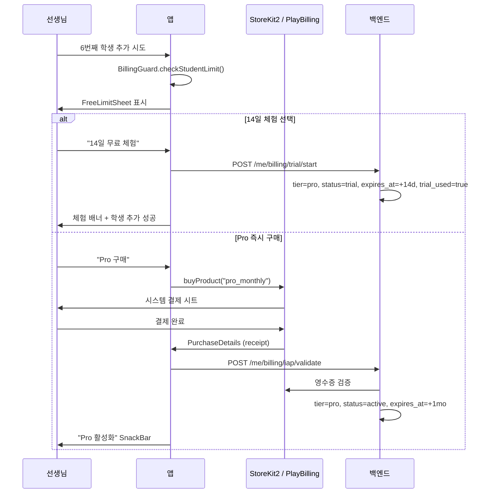

# Paywall Spec — 앱 사용료 과금 (Flow B)

> 작성일: 2026-05-18
> 마지막 업데이트: 2026-06-02 (backend SSOT 동기화 #415 Phase C 후속)
> 상태: 활성 (마스터 SSOT)
> 관련: [payment_architecture.md](./payment_architecture.md) §3 미래 정책
> 옵시디언 원본: `~/Dev/mybrain/10 Projects/레슨앱/11-R4-수익화-상세스펙.md`
> 마일스톤: M5

---

## 0. 범위와 경계

본 스펙은 [payment_architecture.md](./payment_architecture.md) **§3 미래 정책 — 앱관리자 사용료 과금**의 미정의 항목을 채운다.

| 구분 | 흐름 A/A' (수강료) | 흐름 B (앱 사용료, 본 스펙) |
|------|---------------------|------------------------------|
| 돈 주체 | 선생님/학원 | Lessonaza 앱관리자 |
| 결제 수단 | 외부 무통장입금/현금 | StoreKit2 / PlayBilling (IAP) |
| 모델 | `Subscription`, `SubscriptionProposal` | `AppBillingPlan` (신규) |
| 라우터 | `/subscriptions/*` | `/me/billing/*` (canonical), `/app/billing/*` (legacy alias, backend가 같은 router를 두 prefix에 mount) |
| 트리거 | 선생님이 학생에게 수강권 제안 | 선생님이 6번째 학생 추가 시도 |

**물리적 분리**: 흐름 B 모델/서비스/UI는 흐름 A와 동일 파일/테이블에 섞지 않는다.

---

## 1. 플랜 정의

| 플랜 | 학생 수 | 가격 (KRW) | 비고 |
|------|---------|-----------|------|
| **Free** | 5명 | 0 | 가입 기본값. `tier=free, status=active` |
| **Pro 체험** | 무제한 | 0 (14일) | 별도 tier 아님 — `tier=pro, status=trial` 조합. 자동 갱신 없음, 만료 시 Free 복귀 |
| **Pro 월간** | 무제한 | 9,900/월 | 기본 유료 플랜. `tier=pro, status=active` |
| **Pro 연간** | 무제한 | 94,800/년 (7,900/월 환산) | 약 20% 할인. `tier=pro` 동일 (SKU만 차이) |
| **Studio 월간** | 무제한 + 학원 기능 | 29,900/월 | 강사 다중 관리. `tier=studio, status=active` |
| **Lifetime** | 무제한 (영구) | 199,000 (1회) | M5 출시 후 90일 한정 얼리어답터. **프론트엔드 전용 SKU** — 백엔드 `BillingTier` enum 미포함 (M5 후속 확장 예정) |

**Tier vs Plan 명명**:
- 백엔드 `BillingTier` enum (canonical): `free`, `pro`, `studio` — 코드: [`backend/app/models/app_billing.py`](../../../backend/app/models/app_billing.py)
- 백엔드 `BillingPlanStatus` enum: `active`, `trial`, `expired`, `cancelled`
- 프론트엔드 `BillingPlan` enum: `free`, `pro`, `studio`, `lifetime` — `lifetime` 만 백엔드 enum 보다 앞서 있음 ([billing_plan.dart](../../../frontend/lib/features/billing/domain/entities/billing_plan.dart))
- 체험(`Pro 체험`)은 별도 tier 가 아니라 `(tier=pro, status=trial)` 튜플로 표현. spec 본문에서 "TrialPro" 라는 용어는 더 이상 사용하지 않는다.

### 1.1 Lifetime 얼리어답터 오퍼 가용성

`AppBillingSnapshot.lifetimeOfferEndsAt: DateTime?` (백엔드가 채움) 로 노출 윈도우를 관리한다.

| 백엔드 응답 | 클라이언트 효과 |
|------------|---------------|
| `null` (M5 미출시 / 윈도우 종료 / 이미 lifetime 보유) | 프로모 배너 숨김 |
| 미래 datetime (윈도우 내, free/trial 사용자) | 프로모 배너 노출 + D-N 카운트다운 |

배너 노출 조건은 `AppBillingSnapshot.lifetimeOfferActive` getter 가 캡슐화:
- `lifetimeOfferEndsAt` 가 현재보다 미래
- `plan == free` 또는 `status == trial` (이미 결제한 pro/studio/lifetime 사용자는 비노출)

**Graceful degradation**: 백엔드가 필드를 채우기 전까지(M5 출시 전, M5+90일 이후) 클라이언트 코드 변경 없이 자동 숨김.

---

## 2. 상태 전이

상태는 `(tier, status)` 튜플로 표현된다. 다이어그램 노드는 사용자 관점 라벨이고, 괄호 안이 백엔드 enum 값이다.


| 라벨 | 백엔드 매핑 |
|------|-------------|
| Free | `tier=free, status=active` |
| **ProTrial** | `tier=pro, status=trial` (별도 tier 아님) |
| Pro | `tier=pro, status=active` |
| Studio | `tier=studio, status=active` |
| Expired | `tier=pro|studio, status=expired` |
| Lifetime | `tier=lifetime, status=active` (FE 전용 SKU) |

**중요 규칙**:
- ProTrial 종료 시 학생 수가 5명을 초과해도 **기존 학생 데이터는 보존**. 신규 학생 추가만 차단.
- Expired 7일 유예 동안 모든 Pro 기능 유지. 8일째에 Free 강등.
- `trial_used: bool` 컬럼이 backend `app_billing_plans` 에 있어 "체험 1회만 사용 가능" 을 enforce. 재시도 시 409 응답.

---

## 3. Paywall 트리거 (BillingGuard)

### 3.1 트리거 지점

| 행위 | 가드 | 동작 |
|------|------|------|
| 학생 추가 (Free, 5명 초과) | `BillingGuard.checkStudentLimit()` | `FreeLimitSheet` 표시 |
| Pro 전용 기능 진입 (Free 선생님) | `BillingGuard.requireTier(TierRequirement.pro)` | `FeatureLockedSheet` 표시 |
| Studio 전용 기능 진입 (Pro 선생님) | `BillingGuard.requireTier(TierRequirement.studio)` | `FeatureLockedSheet` (Studio 업그레이드) |

**적용 범위 — 선생님 전용**: 본 §3.1 의 가드는 모두 **선생님 화면에만 적용**한다. 학생 화면 (`features/student_home/`, `features/practice/presentation/screens/section_detail_screen.dart` 등 학생 진입 경로) 의 동일 기능 (녹음 비교, 통계 리포트) 은 **무료 접근 유지** — 학생 결제 모델 자체가 현 spec 범위 외이기 때문이다 ([payment_architecture.md](./payment_architecture.md) §1 "흐름 B 미래 정책"). 학생 측 IAP 도입은 시장조사 보고서 [student_billing_research.md](./student_billing_research.md) 참고, 도입 결정 시 별도 spec 분리.

### 3.2 결제 시퀀스



---

## 4. 데이터 모델

### 4.1 백엔드 — `app_billing_plans` 테이블 (실제 구현)

```python
# backend/app/models/app_billing.py
class BillingTier(str, enum.Enum):
    free = "free"
    pro = "pro"
    studio = "studio"
    # lifetime: 프론트엔드 SKU 만 존재. M5 후속 enum 확장 예정.


class BillingPlanStatus(str, enum.Enum):
    active = "active"
    trial = "trial"
    expired = "expired"
    cancelled = "cancelled"


class AppBillingPlan(UUIDMixin, TimestampMixin, Base):
    __tablename__ = "app_billing_plans"

    user_id: Mapped[str] = mapped_column(
        String(36), ForeignKey("users.id", ondelete="CASCADE"), nullable=False,
    )
    tier: Mapped[BillingTier] = mapped_column(
        Enum(BillingTier, native_enum=True), default=BillingTier.free,
    )
    status: Mapped[BillingPlanStatus] = mapped_column(
        Enum(BillingPlanStatus, native_enum=True), default=BillingPlanStatus.active,
    )
    started_at: Mapped[datetime] = mapped_column(server_default=func.now())
    expires_at: Mapped[datetime | None] = mapped_column(nullable=True)
    source: Mapped[str] = mapped_column(String(50), default="admin_grant")
    original_transaction_id: Mapped[str | None] = mapped_column(String(255))
    trial_used: Mapped[bool] = mapped_column(Boolean, default=False)

    # 1 user = 1 plan row (실제 DB UniqueConstraint, 의도 가시화 목적).
    __table_args__ = (
        UniqueConstraint("user_id", name="uq_app_billing_plans_user_id"),
        Index("idx_app_billing_expires", "expires_at"),
        Index("idx_app_billing_status", "status"),
    )


class IapReceipt(UUIDMixin, TimestampMixin, Base):
    """IAP 영수증 감사 로그. Apple/Google 양쪽."""
    __tablename__ = "iap_receipts"
    user_id: Mapped[str]            # FK users.id, CASCADE
    platform: Mapped[IapPlatform]   # apple | google
    raw_receipt: Mapped[str]        # Text
    transaction_id: Mapped[str]
    product_id: Mapped[str]
    status: Mapped[IapReceiptStatus]  # pending_verification | verified | invalid | expired
    validated_at: Mapped[datetime | None]

    # (platform, transaction_id) 전역 unique — replay 차단.
    __table_args__ = (UniqueConstraint("platform", "transaction_id"), ...)
```

흐름 A의 `Subscription`/`Payment` 모델과 **별도 테이블, 별도 서비스, 별도 라우터**.

**spec ↔ 코드 명명 매핑** (drift 잔재 정리):

| spec 초안 (deprecated) | 실제 코드 |
|------------------------|-----------|
| `teacher_id` | `user_id` (테이블 FK는 users.id) |
| `plan: str` 단일 컬럼 | `tier: BillingTier` + `status: BillingPlanStatus` 분리 |
| `trial_pro` (별도 plan 값) | `(tier=pro, status=trial)` 튜플 |
| `trial_ends_at` | `expires_at` (trial 도 동일 컬럼 사용, `status=trial` 로 trial 식별) |
| `store_platform` | (없음) — platform 은 `iap_receipts` 에만 저장 |
| — | `trial_used: bool` 추가 (재시도 enforce) |
| — | `source: str` 추가 (admin_grant / iap / promo) |
| — | `IapReceipt` 별도 테이블 (감사 trail) |

### 4.2 프론트엔드 — Feature 분리

```
features/billing/                          # 신규 도메인
├── domain/
│   ├── entities/
│   │   ├── billing_plan.dart              # enum: free/trialPro/pro/studio/lifetime
│   │   └── app_billing_status.dart        # plan + expiresAt + trialEndsAt
│   ├── repositories/
│   │   └── app_billing_repository.dart    # interface
│   └── services/
│       ├── billing_guard.dart             # checkStudentLimit, requireTier(TierRequirement.pro|studio)
│       └── feature_tier_provider.dart     # Pro/Studio 기능 분기
├── data/
│   └── repositories/
│       └── app_billing_repository_impl.dart  # IAP + API 통합
└── presentation/
    ├── screens/
    │   ├── paywall_sheet.dart             # FreeLimitSheet, FeatureLockedSheet
    │   └── billing_management_screen.dart # 플랜 관리, 영수증
    └── providers/
        └── app_billing_provider.dart      # @riverpod
```

---

## 5. API 인터페이스

backend 라우터는 동일 router 를 **두 prefix 에 mount**: `/api/v1/me/billing/*` (canonical) + `/api/v1/app/billing/*` (legacy alias). 신규 호출자는 `/me/billing/*` 사용.

| Method | Canonical Path | 별칭 (deprecated) | 용도 |
|--------|----------------|-------------------|------|
| GET | `/me/billing/plan` | `/me/billing/me` | 현재 사용자 plan 조회 (FE 채택) |
| POST | `/me/billing/trial/start` | — | 14일 Pro 체험 시작. 409 = 이미 사용 |
| POST | `/me/billing/iap/validate` | `/me/billing/verify-purchase` | IAP 영수증 검증 + 플랜 활성화 |
| POST | `/me/billing/cancel` | — | 다음 갱신 차단 (기존 기간 유지) |
| GET | `/me/billing/receipts` | — | IAP 영수증 감사 이력 |

코드: [`backend/app/api/v1/app_billing.py`](../../../backend/app/api/v1/app_billing.py), router mount: [`backend/app/api/v1/__init__.py`](../../../backend/app/api/v1/__init__.py).

**응답 스키마 — `BillingPlanResponse`** (GET `/me/billing/plan`):

```json
{
  "id": "uuid",
  "user_id": "uuid",
  "tier": "pro",                                    // free | pro | studio
  "status": "trial",                                // active | trial | expired | cancelled
  "started_at": "2026-05-18T00:00:00Z",
  "expires_at": "2026-06-01T00:00:00Z",             // trial 만료 / 다음 갱신 시각
  "source": "iap",                                  // admin_grant | iap | promo
  "original_transaction_id": "1000000123456789",    // IAP 결제 시
  "trial_used": true,                               // 체험 1회 사용 여부
  "lifetime_offer_ends_at": "2026-08-15T00:00:00Z"  // null = 노출 안함 (lifetime promo)
}
```

**frontend 매퍼**: [`app_billing_dto.dart`](../../../frontend/lib/features/billing/data/repositories/app_billing_dto.dart) 가 snake_case + camelCase 둘 다 허용. 404/401 응답은 `freeFallback` 으로 graceful degradation.

**IAP validate 요청 본문** (POST `/me/billing/iap/validate`):

```json
{
  "platform": "apple",    // apple | google
  "receipt": "MIIToQ...",  // 원본 영수증
  "product_id": "pro_monthly"
}
```

응답 `IapValidateResponse`:

```json
{
  "success": true,
  "message": "Receipt validated and plan activated",
  "plan_id": "uuid",
  "tier": "pro",
  "expires_at": "2026-07-01T00:00:00Z"
}
```

**default-deny 가드** (#405): backend 는 production/beta 에서 IAP 검증을 기본 `granted=false` 로 응답하고 영수증만 저장. dev 환경에서 `IAP_AUTO_GRANT_ON_PENDING_DEV_ONLY` 플래그로만 자동 승인. Phase D 에서 Apple S2S + Google RTDN wiring 후 플래그 해제 예정.

---

## 6. UI 사양

### 6.1 FreeLimitSheet (학생 5명 초과 시)

```
┌─────────────────────────────────────┐
│ 🔒 학생 5명 한도에 도달했어요         │
│                                     │
│ 더 많은 학생을 관리하려면 Pro로       │
│ 업그레이드하세요.                    │
│                                     │
│ ┌─ Pro 월간 ───────────────────┐    │
│ │ ₩9,900/월 · 학생 무제한         │ │
│ │ [구매하기]                      │ │
│ └─────────────────────────────────┘ │
│                                     │
│ ┌─ 14일 무료 체험 ────────────────┐ │
│ │ 자동 결제 없음. 만료 시 Free 복귀 │ │
│ │ [체험 시작]                      │ │
│ └─────────────────────────────────┘ │
│                                     │
│ [나중에]                            │
└─────────────────────────────────────┘
```

### 6.2 프로필 구독 배지

```
Pro:    ● PRO   D-23 갱신   ₩9,900/월 · 학생 무제한
                            [플랜 관리]  [영수증]

Free:   ◎ FREE  학생 4/5명 사용 중
                [Pro 업그레이드 → ₩9,900/월]

Trial:  ⏰ TRIAL  D-9 종료   체험 중 · 학생 무제한
                            [Pro 전환]
```

위치: `features/profile/presentation/widgets/subscription_status_card.dart` (신규).

### 6.3 LifetimePromoBanner (얼리어답터 한정)

`AppBillingSnapshot.lifetimeOfferActive == true` 일 때 SubscriptionStatusCard **위 인라인** 으로 표시.

```
┌─────────────────────────────────────┐
│ [얼리어답터 한정] D-69 종료          │   ← eyebrow chip + 카운트다운
│                                     │
│ 평생 무제한 — 1회 결제               │   ← 타이틀 (18px, w700)
│ ₩199,000 한 번 결제로 모든 Pro 기능   │   ← 서브타이틀 (13px, height 1.45)
│ 영구 사용.                          │
│                                     │
│ ┌─ [Lifetime 구매하기] ─────────┐   │   ← FilledButton (full-width, paper bg)
│ └─────────────────────────────────┘ │
└─────────────────────────────────────┘
```

**디자인 토큰**:
- 배경: `AppColors.paperAccent` (#9B1B12 — 노트북 시그니처 적색, 프로모 강조)
- 전경: `AppColors.paper` (#F2ECDD — 크림)
- 패딩: `AppSpacing.space4`, 라운드: `radiusMedium`
- CTA: `buttonHeightSmall`, paper 바탕 + paperAccent 텍스트

**상태 분기**:
- Free / Trial 사용자: 배너 노출 (활성)
- Pro / Studio / Lifetime 사용자: 자동 숨김 (`lifetimeOfferActive == false`)
- `lifetimeOfferEndsAt == null`: 자동 숨김 (backend 미응답 / 윈도우 종료)

**위치**: `features/billing/presentation/widgets/lifetime_promo_banner.dart` (신규).
**진입점**: `features/profile/presentation/screens/profile_tab.dart` — SubscriptionStatusCard 직전 inline.
**구매 흐름**: `handleBuyLifetime` (storeKit 가용성 → 상품 조회 → 구매 → `/me/billing/iap/validate` → completePurchase). `handleBuyPro` 와 동일 구조, `productId=lifetime` 만 다름.

### 6.4 문구 — AppStrings 키

| 키 | 한국어 |
|----|--------|
| `paywallFreeLimitTitle` | 학생 5명 한도에 도달했어요 |
| `paywallProMonthlyTitle` | Pro 월간 |
| `paywallTrialStartCta` | 14일 무료 체험 시작 |
| `paywallTrialNote` | 자동 결제 없음. 만료 시 Free 복귀 |
| `billingStatusFree` | FREE — 학생 {used}/{limit}명 사용 중 |
| `billingStatusPro` | PRO — D-{days} 갱신 |
| `billingStatusTrial` | TRIAL — D-{days} 종료 |
| `paywallLifetimePromoEyebrow` | 얼리어답터 한정 |
| `paywallLifetimePromoTitle` | 평생 무제한 — 1회 결제 |
| `paywallLifetimePromoSubtitle` | ₩199,000 한 번 결제로 모든 Pro 기능 영구 사용. |
| `paywallLifetimePromoCountdown` | D-{days} 종료 |
| `paywallLifetimeBuyCta` | Lifetime 구매하기 |
| `paywallLifetimePurchaseSuccess` | Lifetime 플랜이 활성화되었어요. |
| `paywallLifetimePurchaseCancelled` | Lifetime 구매를 취소했어요. |

**i18n 위반 금지**: 모든 paywall 문구는 코드에 직접 한글 박지 않는다. [i18n_migration_spec.md](../architecture/i18n_migration_spec.md) 참조.

---

## 7. 기능 분기 (BillingGuard.requireTier)

| 기능 | Free | Pro | Studio |
|------|:----:|:---:|:------:|
| 학생 수 | 5명 | 무제한 | 무제한 |
| 레슨 노트 | ○ | ○ | ○ |
| 메트로놈 / 튜너 | ○ | ○ | ○ |
| 녹음 비교 (AI) | ✗ | ○ | ○ |
| 통계 리포트 (월) | ✗ | ○ | ○ |
| 학원 다중 강사 | ✗ | ✗ | ○ |
| 학원 통계 대시보드 | ✗ | ✗ | ○ |

`BillingGuard.requireTier(TierRequirement.pro|studio)` 는 **선생님 화면 진입 시점에 호출**. 실패 시 `FeatureLockedSheet` 노출. 실제 구현: [`billing_guard.dart`](../../../frontend/lib/features/billing/domain/services/billing_guard.dart) + 헬퍼 [`guardProFeatureNavigation`](../../../frontend/lib/features/billing/presentation/utils/billing_guard_actions.dart) (snapshot 로딩 실패 시 fail-open, 서버가 SSOT).

본 §7 의 Pro/Studio 게이팅은 **선생님 user 관점**이다. 같은 기능을 학생이 자기 화면 (`features/student_home/`, `practice_summary_section.dart`, `section_detail_screen.dart` 등) 에서 진입할 때는 가드를 적용하지 않는다 — §3.1 의 "적용 범위 — 선생님 전용" 참조. 학생 측 결제 도입 시 별도 정책 spec 분리 (현재 시장조사 단계, [student_billing_research.md](./student_billing_research.md)).

---

## 8. 신규 파일 / 변경 파일

### 신규
- `backend/app/models/app_billing.py`
- `backend/app/api/v1/app_billing.py`
- `backend/app/services/app_billing_service.py`
- `frontend/lib/features/billing/` 전체
- `frontend/lib/features/billing/presentation/widgets/lifetime_promo_banner.dart` — Phase C2 얼리어답터 프로모 배너
- `frontend/pubspec.yaml` — `in_app_purchase: ^3.2.0` 추가

### 변경
- `features/students/presentation/screens/add_student_screen.dart` — BillingGuard 호출
- `features/profile/presentation/screens/profile_screen.dart` — SubscriptionStatusCard 삽입
- `features/profile/presentation/screens/profile_tab.dart` — Phase C2 LifetimePromoBanner inline 노출
- `features/students/presentation/providers/students_provider.dart` — `studentCountProvider`와 BillingGuard 연결
- `features/billing/domain/entities/app_billing_snapshot.dart` — Phase C2 `lifetimeOfferEndsAt` 필드 + `lifetimeOfferActive` getter 추가
- `features/billing/data/repositories/app_billing_dto.dart` — Phase C2 `lifetime_offer_ends_at` 파싱
- `features/billing/presentation/utils/billing_guard_actions.dart` — Phase C2 `handleBuyLifetime` 추가
- `features/billing/billing_constants.dart` — `lifetimeProductId = 'lifetime'` 상수
- `features/billing/billing_facade.dart` — Phase C2 export 확장

---

## 8.5 코드 반영 추가 (2026-06-03)

> 코드(`features/billing`)에 구현되었으나 위 본문에 누락된 항목. 코드→스펙 단방향 반영.
> 정책 정합: 본 결제는 흐름 B(앱 사용료, 선생님/학원 → 앱관리자)에만 적용. 선생님↔학생 수강료 PG 없음(무통장입금 유지). 코드에 수강료 PG 경로 없음 — 정책 일치.

### 8.5.1 실제 클래스/엔티티명 (스펙 §4.2 대비 차이)

| 스펙 표기 | 실제 코드 | 위치 |
|---|---|---|
| `app_billing_status.dart` (plan+expiresAt+trialEndsAt) | `AppBillingSnapshot` | `billing/domain/entities/app_billing_snapshot.dart` |
| `billing_plan.dart` enum | `BillingPlan` (free/pro/studio/lifetime — `trial_pro` 는 별도 tier 아님, `status=trial` 로 표현) | `billing/domain/entities/billing_plan.dart` |
| (없음) | `BillingStatus` enum: `active`/`trial`/`expired`/`cancelled` | `billing/domain/entities/billing_status.dart` |
| `paywall_sheet.dart` | 실제 분리 파일: `free_limit_sheet.dart`, `feature_locked_sheet.dart` | `billing/presentation/widgets/` |

`AppBillingSnapshot` 주요 필드: `id`, `userId`, `plan`, `status`, `startedAt`, `expiresAt?`, `source`, `originalTransactionId?`, `trialUsed`, `lifetimeOfferEndsAt?`. 헬퍼: `isUnlimited`, `isActiveOrTrial`, `lifetimeOfferActive`, `freeFallback()` 팩토리.

### 8.5.2 IAP 결과 엔티티 (신규, 스펙 미정의)

| 엔티티 | 필드 | 출처 |
|---|---|---|
| `IapValidationResult` | `granted`, `message`, `planId?`, `tier?`, `expiresAt?` | `POST /me/billing/iap/validate` 응답. `granted=false` 면 audit 저장만(pending) |
| `TrialActivationResult` | `success`, `message`, `planId?`, `expiresAt?` | `POST /me/billing/trial/start` 응답. 중복 체험은 409 → `success=false` |

### 8.5.3 IapService 추상화 (신규)

`billing/data/services/iap_service.dart` — `in_app_purchase` 패키지 래핑. `StoreKitIapService` (production) / `FakeIapService` (test).

- `platform` ('apple'/'google'), `isAvailable()`, `queryProducts(ids)`, `purchase(product)`, `completePurchase(purchase)`
- 결과 sealed type: `IapPurchaseOutcome` → `IapPurchaseSuccess` / `IapPurchaseCancelled` / `IapPurchaseFailure`
- receipt 검증은 백엔드 repository 담당. Apple S2S / Google Play Developer API 통합은 Phase D.

### 8.5.4 실제 API 경로 (스펙 §5 대비 차이)

코드 `AppBillingRepository` 가 호출하는 경로는 `/app/billing/*` 가 아니라 `/api/v1/me/billing/*`:

| 메서드 | 실제 경로 | 스펙 §5 표기 |
|---|---|---|
| `fetchSnapshot()` | `GET /api/v1/me/billing/plan` | `GET /app/billing/me` |
| `startTrial()` | `POST /api/v1/me/billing/trial/start` | `POST /app/billing/trial/start` |
| `validatePurchase()` | `POST /api/v1/me/billing/iap/validate` | `POST /app/billing/verify-purchase` |

`validatePurchase` 파라미터: `platform`('apple'/'google'), `receipt`(Apple=base64 / Google=purchase token), `productId`.

### 8.5.5 BillingGuard 결정 모델 (신규)

`billing/domain/services/billing_guard.dart` — `checkStudentLimit({snapshot, currentStudentCount})` → `StudentLimitDecision{allowed, reason}`.

`LimitReason` enum: `withinLimit` / `freeLimitReached` / `planExpired`(무제한 plan 이라도 `status=expired` 면 차단 = 7일 유예 종료 트리거). `freeStudentLimit = 5`. `effectiveStudentLimit(snapshot)` → 무제한이면 null.

### 8.5.6 Store 상품 ID

`billing/billing_constants.dart`: `proMonthlyProductId = 'pro_monthly'`, `lifetimeProductId = 'lifetime'` (백엔드 `IapValidateRequest.product_id` 와 1:1).

---

## 9. 수익 예측 (참고)

| 선생님 수 | Free (55%) | Pro (35%) | Studio (10%) | 월 매출 |
|----------|-----------|-----------|-------------|---------|
| 1,000 | 550 | 350 | 100 | 645만원 |
| 3,000 | 1,650 | 1,050 | 300 | 1,936만원 |
| 10,000 | 5,500 | 3,500 | 1,000 | 6,455만원 |

IAP 수수료(Apple 15% 소기업 / 30% 일반)는 실수령에서 차감.

---

## 10. 의사결정 로그

| 일자 | 결정 | 근거 |
|------|------|------|
| 2026-05-18 | Free 한도 5명, 6번째 학생 시 Paywall | mybrain 11-R4 (사업 존재 이유) |
| 2026-05-18 | TrialPro 14일, 자동 갱신 없음, 만료 시 Free 복귀 | 카드 미등록 진입 장벽 제거 |
| 2026-05-18 | 흐름 B 모델은 흐름 A와 물리적 분리 (`AppBillingPlan` 신규 테이블) | payment_architecture.md §3.3 미래 구현 경계 준수 |
| 2026-05-18 | M5 동시 출시 플랜: Free/TrialPro/Pro 월간. Pro 연간/Studio/Lifetime은 M5 후속 | 초기 SKU 최소화로 검증 |
| 2026-05-29 | Lifetime UI는 `AppBillingSnapshot.lifetimeOfferEndsAt` 단일 nullable 필드로 graceful degradation | 백엔드 미응답/윈도우 종료/이미 lifetime 보유 케이스를 한 곳에서 처리. 클라이언트는 시점/할당 로직 무지. |
| 2026-05-29 | Lifetime 진입점은 프로필 탭 인라인 promo banner (별도 paywall sheet 아님) | 얼리어답터 한정 = 능동 어필 필요. 학생 한도 sheet 와 분리해 일상 결제 흐름 오염 방지. |
| 2026-05-29 | `productId = 'lifetime'` 으로 StoreKit/Play 상품 ID 고정 | `handleBuyPro` 와 동일 흐름 재사용. spec/IAP/백엔드 검증 키를 단일 문자열로 정렬. |
| 2026-06-02 | spec → backend SSOT 동기화 (§1·§2·§4.1·§5) | Phase C1 머지 시 외상화된 drift 해결. `trial_pro` 별도 plan 표기를 `(tier=pro, status=trial)` 튜플로 통합. canonical endpoint 를 `/me/billing/*` 로 명시. `/app/billing/*` 는 legacy alias 로 유지 (backend dual mount). |

---

## 11. 관련 문서

- [payment_architecture.md](./payment_architecture.md) — 흐름 A/A'/B 경계 SSOT
- [subscription_master.md](./subscription_master.md) — 흐름 A 수강권 도메인
- [i18n_migration_spec.md](../architecture/i18n_migration_spec.md) — paywall 문구 i18n 적용
- [11-R4-수익화-상세스펙.md](~/Dev/mybrain/10 Projects/레슨앱/) — 옵시디언 원본 (사업 맥락)
