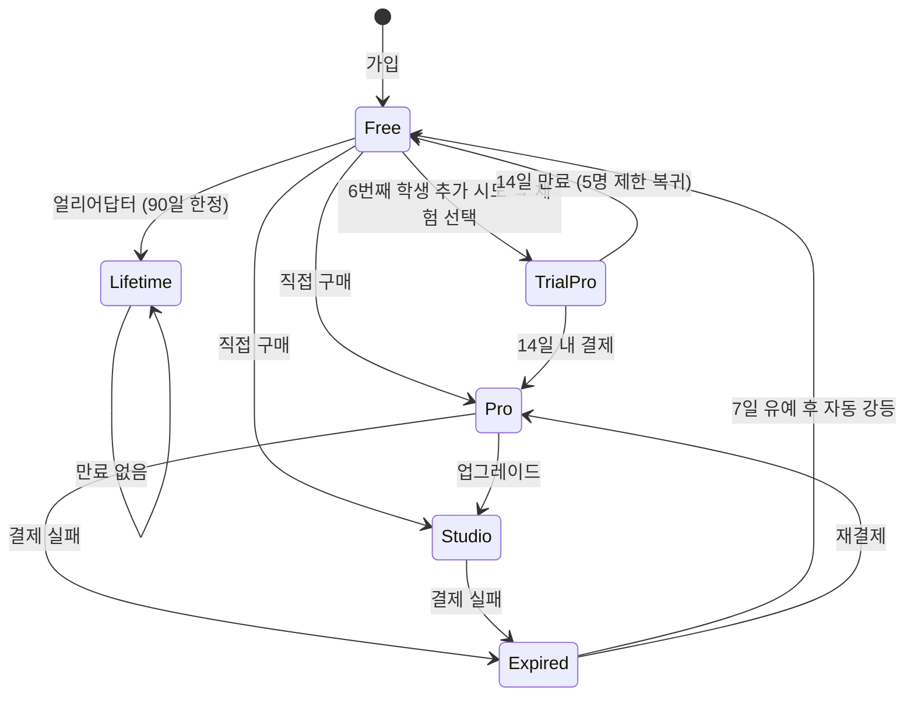
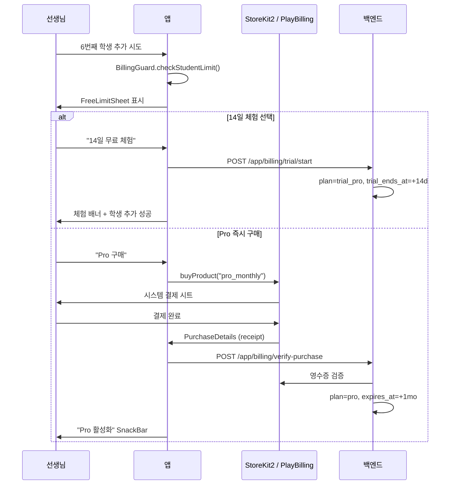

# Paywall Spec — 앱 사용료 과금 (Flow B)

> 작성일: 2026-05-18
> 상태: 활성 (마스터 SSOT)
> 관련: [payment_architecture.md](./payment_architecture.md) §3 미래 정책
> 옵시디언 원본: `~/Dev/mybrain/10 Projects/레슨앱/11-R4-수익화-상세스펙.md`
> 마일스톤: M5

---

## 0. 범위와 경계

본 스펙은 [payment_architecture.md](./payment_architecture.md) **§3 미래 정책 — 앱관리자 사용료 과금**의 미정의 항목을 채운다.

| 구분 | 흐름 A/A' (수강료) | 흐름 B (앱 사용료, 본 스펙) |
|------|---------------------|------------------------------|
| 돈 주체 | 선생님/학원 | Lessonaza 앱관리자 |
| 결제 수단 | 외부 무통장입금/현금 | StoreKit2 / PlayBilling (IAP) |
| 모델 | `Subscription`, `SubscriptionProposal` | `AppBillingPlan` (신규) |
| 라우터 | `/subscriptions/*` | `/app/billing/*` (신규) |
| 트리거 | 선생님이 학생에게 수강권 제안 | 선생님이 6번째 학생 추가 시도 |

**물리적 분리**: 흐름 B 모델/서비스/UI는 흐름 A와 동일 파일/테이블에 섞지 않는다.

---

## 1. 플랜 정의

| 플랜 | 학생 수 | 가격 (KRW) | 비고 |
|------|---------|-----------|------|
| **Free** | 5명 | 0 | 가입 기본값 |
| **TrialPro** | 무제한 | 0 (14일) | 자동 갱신 없음. 만료 시 Free 복귀 |
| **Pro 월간** | 무제한 | 9,900/월 | 기본 유료 플랜 |
| **Pro 연간** | 무제한 | 94,800/년 (7,900/월 환산) | 약 20% 할인 |
| **Studio 월간** | 무제한 + 학원 기능 | 29,900/월 | 강사 다중 관리 |
| **Lifetime** | 무제한 (영구) | 199,000 (1회) | M5 출시 후 90일 한정 얼리어답터 |

플랜 ID는 백엔드 enum `BillingPlan`: `free`, `trial_pro`, `pro`, `studio`, `lifetime`.

### 1.1 Lifetime 얼리어답터 오퍼 가용성

`AppBillingSnapshot.lifetimeOfferEndsAt: DateTime?` (백엔드가 채움) 로 노출 윈도우를 관리한다.

| 백엔드 응답 | 클라이언트 효과 |
|------------|---------------|
| `null` (M5 미출시 / 윈도우 종료 / 이미 lifetime 보유) | 프로모 배너 숨김 |
| 미래 datetime (윈도우 내, free/trial 사용자) | 프로모 배너 노출 + D-N 카운트다운 |

배너 노출 조건은 `AppBillingSnapshot.lifetimeOfferActive` getter 가 캡슐화:
- `lifetimeOfferEndsAt` 가 현재보다 미래
- `plan == free` 또는 `status == trial` (이미 결제한 pro/studio/lifetime 사용자는 비노출)

**Graceful degradation**: 백엔드가 필드를 채우기 전까지(M5 출시 전, M5+90일 이후) 클라이언트 코드 변경 없이 자동 숨김.

---

## 2. 상태 전이



**중요 규칙**:
- TrialPro 종료 시 학생 수가 5명을 초과해도 **기존 학생 데이터는 보존**. 신규 학생 추가만 차단.
- Expired 7일 유예 동안 모든 Pro 기능 유지. 8일째에 Free 강등.

---

## 3. Paywall 트리거 (BillingGuard)

### 3.1 트리거 지점

| 행위 | 가드 | 동작 |
|------|------|------|
| 학생 추가 (Free, 5명 초과) | `BillingGuard.checkStudentLimit()` | `FreeLimitSheet` 표시 |
| Pro 전용 기능 진입 (Free) | `FeatureTierProvider.requirePro()` | `FeatureLockedSheet` 표시 |
| Studio 전용 기능 진입 (Pro) | `FeatureTierProvider.requireStudio()` | `FeatureLockedSheet` (Studio 업그레이드) |

### 3.2 결제 시퀀스



---

## 4. 데이터 모델

### 4.1 백엔드 — `app_billing_plans` 테이블

```python
# backend/app/models/app_billing.py (신규)
class AppBillingPlan(Base):
    __tablename__ = "app_billing_plans"

    id: Mapped[str] = mapped_column(primary_key=True)
    teacher_id: Mapped[str] = mapped_column(ForeignKey("teachers.id"))
    plan: Mapped[str]  # free | trial_pro | pro | studio | lifetime
    store_platform: Mapped[str | None]  # ios | android | web
    original_transaction_id: Mapped[str | None]
    trial_ends_at: Mapped[datetime | None]
    expires_at: Mapped[datetime | None]
    created_at: Mapped[datetime]
    updated_at: Mapped[datetime]

    __table_args__ = (UniqueConstraint("teacher_id"),)
```

흐름 A의 `Subscription`/`Payment` 모델과 **별도 테이블, 별도 서비스, 별도 라우터**.

### 4.2 프론트엔드 — Feature 분리

```
features/billing/                          # 신규 도메인
├── domain/
│   ├── entities/
│   │   ├── billing_plan.dart              # enum: free/trialPro/pro/studio/lifetime
│   │   └── app_billing_status.dart        # plan + expiresAt + trialEndsAt
│   ├── repositories/
│   │   └── app_billing_repository.dart    # interface
│   └── services/
│       ├── billing_guard.dart             # checkStudentLimit, requirePro 등
│       └── feature_tier_provider.dart     # Pro/Studio 기능 분기
├── data/
│   └── repositories/
│       └── app_billing_repository_impl.dart  # IAP + API 통합
└── presentation/
    ├── screens/
    │   ├── paywall_sheet.dart             # FreeLimitSheet, FeatureLockedSheet
    │   └── billing_management_screen.dart # 플랜 관리, 영수증
    └── providers/
        └── app_billing_provider.dart      # @riverpod
```

---

## 5. API 인터페이스

| Method | Path | 용도 |
|--------|------|------|
| GET | `/app/billing/me` | 현재 선생님 플랜 조회 |
| POST | `/app/billing/trial/start` | TrialPro 시작 (Free → TrialPro) |
| POST | `/app/billing/verify-purchase` | IAP 영수증 검증 + 플랜 활성화 |
| POST | `/app/billing/cancel` | 다음 갱신 차단 (기존 기간은 유지) |
| GET | `/app/billing/receipts` | 영수증 이력 |

응답 스키마:

```json
{
  "plan": "pro",
  "store_platform": "ios",
  "trial_ends_at": null,
  "expires_at": "2026-06-18T00:00:00Z",
  "student_count": 12,
  "student_limit": null  // null = 무제한
}
```

---

## 6. UI 사양

### 6.1 FreeLimitSheet (학생 5명 초과 시)

```
┌─────────────────────────────────────┐
│ 🔒 학생 5명 한도에 도달했어요         │
│                                     │
│ 더 많은 학생을 관리하려면 Pro로       │
│ 업그레이드하세요.                    │
│                                     │
│ ┌─ Pro 월간 ───────────────────┐    │
│ │ ₩9,900/월 · 학생 무제한         │ │
│ │ [구매하기]                      │ │
│ └─────────────────────────────────┘ │
│                                     │
│ ┌─ 14일 무료 체험 ────────────────┐ │
│ │ 자동 결제 없음. 만료 시 Free 복귀 │ │
│ │ [체험 시작]                      │ │
│ └─────────────────────────────────┘ │
│                                     │
│ [나중에]                            │
└─────────────────────────────────────┘
```

### 6.2 프로필 구독 배지

```
Pro:    ● PRO   D-23 갱신   ₩9,900/월 · 학생 무제한
                            [플랜 관리]  [영수증]

Free:   ◎ FREE  학생 4/5명 사용 중
                [Pro 업그레이드 → ₩9,900/월]

Trial:  ⏰ TRIAL  D-9 종료   체험 중 · 학생 무제한
                            [Pro 전환]
```

위치: `features/profile/presentation/widgets/subscription_status_card.dart` (신규).

### 6.3 LifetimePromoBanner (얼리어답터 한정)

`AppBillingSnapshot.lifetimeOfferActive == true` 일 때 SubscriptionStatusCard **위 인라인** 으로 표시.

```
┌─────────────────────────────────────┐
│ [얼리어답터 한정] D-69 종료          │   ← eyebrow chip + 카운트다운
│                                     │
│ 평생 무제한 — 1회 결제               │   ← 타이틀 (18px, w700)
│ ₩199,000 한 번 결제로 모든 Pro 기능   │   ← 서브타이틀 (13px, height 1.45)
│ 영구 사용.                          │
│                                     │
│ ┌─ [Lifetime 구매하기] ─────────┐   │   ← FilledButton (full-width, paper bg)
│ └─────────────────────────────────┘ │
└─────────────────────────────────────┘
```

**디자인 토큰**:
- 배경: `AppColors.paperAccent` (#9B1B12 — 노트북 시그니처 적색, 프로모 강조)
- 전경: `AppColors.paper` (#F2ECDD — 크림)
- 패딩: `AppSpacing.space4`, 라운드: `radiusMedium`
- CTA: `buttonHeightSmall`, paper 바탕 + paperAccent 텍스트

**상태 분기**:
- Free / Trial 사용자: 배너 노출 (활성)
- Pro / Studio / Lifetime 사용자: 자동 숨김 (`lifetimeOfferActive == false`)
- `lifetimeOfferEndsAt == null`: 자동 숨김 (backend 미응답 / 윈도우 종료)

**위치**: `features/billing/presentation/widgets/lifetime_promo_banner.dart` (신규).
**진입점**: `features/profile/presentation/screens/profile_tab.dart` — SubscriptionStatusCard 직전 inline.
**구매 흐름**: `handleBuyLifetime` (storeKit 가용성 → 상품 조회 → 구매 → `/me/billing/iap/validate` → completePurchase). `handleBuyPro` 와 동일 구조, `productId=lifetime` 만 다름.

### 6.4 문구 — AppStrings 키

| 키 | 한국어 |
|----|--------|
| `paywallFreeLimitTitle` | 학생 5명 한도에 도달했어요 |
| `paywallProMonthlyTitle` | Pro 월간 |
| `paywallTrialStartCta` | 14일 무료 체험 시작 |
| `paywallTrialNote` | 자동 결제 없음. 만료 시 Free 복귀 |
| `billingStatusFree` | FREE — 학생 {used}/{limit}명 사용 중 |
| `billingStatusPro` | PRO — D-{days} 갱신 |
| `billingStatusTrial` | TRIAL — D-{days} 종료 |
| `paywallLifetimePromoEyebrow` | 얼리어답터 한정 |
| `paywallLifetimePromoTitle` | 평생 무제한 — 1회 결제 |
| `paywallLifetimePromoSubtitle` | ₩199,000 한 번 결제로 모든 Pro 기능 영구 사용. |
| `paywallLifetimePromoCountdown` | D-{days} 종료 |
| `paywallLifetimeBuyCta` | Lifetime 구매하기 |
| `paywallLifetimePurchaseSuccess` | Lifetime 플랜이 활성화되었어요. |
| `paywallLifetimePurchaseCancelled` | Lifetime 구매를 취소했어요. |

**i18n 위반 금지**: 모든 paywall 문구는 코드에 직접 한글 박지 않는다. [i18n_migration_spec.md](../architecture/i18n_migration_spec.md) 참조.

---

## 7. 기능 분기 (FeatureTierProvider)

| 기능 | Free | Pro | Studio |
|------|:----:|:---:|:------:|
| 학생 수 | 5명 | 무제한 | 무제한 |
| 레슨 노트 | ○ | ○ | ○ |
| 메트로놈 / 튜너 | ○ | ○ | ○ |
| 녹음 비교 (AI) | ✗ | ○ | ○ |
| 통계 리포트 (월) | ✗ | ○ | ○ |
| 학원 다중 강사 | ✗ | ✗ | ○ |
| 학원 통계 대시보드 | ✗ | ✗ | ○ |

`FeatureTierProvider`는 화면 진입 시 호출하여 `requirePro()` / `requireStudio()` 실패 시 `FeatureLockedSheet` 노출.

---

## 8. 신규 파일 / 변경 파일

### 신규
- `backend/app/models/app_billing.py`
- `backend/app/api/v1/app_billing.py`
- `backend/app/services/app_billing_service.py`
- `frontend/lib/features/billing/` 전체
- `frontend/lib/features/billing/presentation/widgets/lifetime_promo_banner.dart` — Phase C2 얼리어답터 프로모 배너
- `frontend/pubspec.yaml` — `in_app_purchase: ^3.2.0` 추가

### 변경
- `features/students/presentation/screens/add_student_screen.dart` — BillingGuard 호출
- `features/profile/presentation/screens/profile_screen.dart` — SubscriptionStatusCard 삽입
- `features/profile/presentation/screens/profile_tab.dart` — Phase C2 LifetimePromoBanner inline 노출
- `features/students/presentation/providers/students_provider.dart` — `studentCountProvider`와 BillingGuard 연결
- `features/billing/domain/entities/app_billing_snapshot.dart` — Phase C2 `lifetimeOfferEndsAt` 필드 + `lifetimeOfferActive` getter 추가
- `features/billing/data/repositories/app_billing_dto.dart` — Phase C2 `lifetime_offer_ends_at` 파싱
- `features/billing/presentation/utils/billing_guard_actions.dart` — Phase C2 `handleBuyLifetime` 추가
- `features/billing/billing_constants.dart` — `lifetimeProductId = 'lifetime'` 상수
- `features/billing/billing_facade.dart` — Phase C2 export 확장

---

## 9. 수익 예측 (참고)

| 선생님 수 | Free (55%) | Pro (35%) | Studio (10%) | 월 매출 |
|----------|-----------|-----------|-------------|---------|
| 1,000 | 550 | 350 | 100 | 645만원 |
| 3,000 | 1,650 | 1,050 | 300 | 1,936만원 |
| 10,000 | 5,500 | 3,500 | 1,000 | 6,455만원 |

IAP 수수료(Apple 15% 소기업 / 30% 일반)는 실수령에서 차감.

---

## 10. 의사결정 로그

| 일자 | 결정 | 근거 |
|------|------|------|
| 2026-05-18 | Free 한도 5명, 6번째 학생 시 Paywall | mybrain 11-R4 (사업 존재 이유) |
| 2026-05-18 | TrialPro 14일, 자동 갱신 없음, 만료 시 Free 복귀 | 카드 미등록 진입 장벽 제거 |
| 2026-05-18 | 흐름 B 모델은 흐름 A와 물리적 분리 (`AppBillingPlan` 신규 테이블) | payment_architecture.md §3.3 미래 구현 경계 준수 |
| 2026-05-18 | M5 동시 출시 플랜: Free/TrialPro/Pro 월간. Pro 연간/Studio/Lifetime은 M5 후속 | 초기 SKU 최소화로 검증 |
| 2026-05-29 | Lifetime UI는 `AppBillingSnapshot.lifetimeOfferEndsAt` 단일 nullable 필드로 graceful degradation | 백엔드 미응답/윈도우 종료/이미 lifetime 보유 케이스를 한 곳에서 처리. 클라이언트는 시점/할당 로직 무지. |
| 2026-05-29 | Lifetime 진입점은 프로필 탭 인라인 promo banner (별도 paywall sheet 아님) | 얼리어답터 한정 = 능동 어필 필요. 학생 한도 sheet 와 분리해 일상 결제 흐름 오염 방지. |
| 2026-05-29 | `productId = 'lifetime'` 으로 StoreKit/Play 상품 ID 고정 | `handleBuyPro` 와 동일 흐름 재사용. spec/IAP/백엔드 검증 키를 단일 문자열로 정렬. |

---

## 11. 관련 문서

- [payment_architecture.md](./payment_architecture.md) — 흐름 A/A'/B 경계 SSOT
- [subscription_master.md](./subscription_master.md) — 흐름 A 수강권 도메인
- [i18n_migration_spec.md](../architecture/i18n_migration_spec.md) — paywall 문구 i18n 적용
- [11-R4-수익화-상세스펙.md](~/Dev/mybrain/10 Projects/레슨앱/) — 옵시디언 원본 (사업 맥락)
