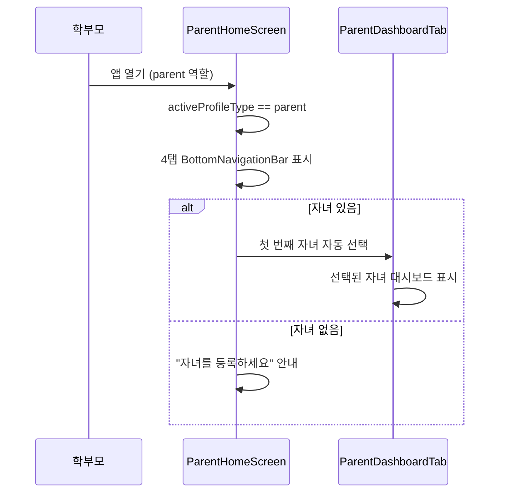

# 학부모 대시보드 스펙

> 작성일: 2026-03-02
> 상태: 구현 완료 (코드 기반 문서화)
> Pain Point: D(학부모에게 보여줄 근거 없음)
> 관련 문서: [parent_system.md](parent_system.md), [parent_login_flow.md](parent_login_flow.md)
> 관련 스펙: [practice_sharing_spec.md](../practice/practice_sharing_spec.md), [practice_report_spec.md](../practice/practice_report_spec.md)

<!-- @uses: tokens/colors, tokens/typography -->

---

## 1. 개요

### 1.1 목적

학부모가 자녀의 레슨 현황, 과제 진행, 연습 통계를 한눈에 파악할 수 있는 대시보드.
"잘하고 있어요"가 아닌 **객관적 데이터로 교육 가치를 증명**한다.

### 1.2 핵심 결정사항

| 항목 | 결정 |
|------|------|
| 탭 구성 | 4탭: 홈, 레슨, 과제, 프로필 |
| 데이터 소스 | 현재 Mock → Phase 2에서 실데이터 전환 |
| 자녀 선택 | 바텀시트로 자녀 전환 + 자동 첫 번째 선택 |
| 프로필 전환 | ProfileSwitcher (부모/자녀/학생 역할) |
| 미연결 자녀 | 별도 대시보드 (UnconnectedChildDashboard) |

---

## 2. 현재 구현 상태

### 2.1 화면 구성

| 탭 | 화면 | 파일 | 상태 |
|----|------|------|:----:|
| 홈 | ParentDashboardTab | `parent_dashboard_tab.dart` | ✅ Mock |
| 레슨 | ParentLessonsTab | `parent_lessons_tab.dart` | ✅ Mock |
| 과제 | ParentAssignmentsTab | `parent_assignments_tab.dart` | ✅ Mock |
| 프로필 | ParentProfileTab | `parent_profile_tab.dart` | ✅ 부분 실데이터 |

### 2.2 Mock → 실데이터 GAP 분석

| 데이터 | 현재 (Mock) | 실데이터 전환 | 의존 스펙 |
|--------|:-----------:|:------------:|----------|
| 자녀 프로필 목록 | ✅ 실데이터 | — | parent_system |
| 선택된 자녀 상태 | ✅ 실데이터 | — | child_profile_provider |
| 이번주 레슨 수 | ❌ 하드코딩 "1회" | lessonProvider 연동 | lesson_schedule |
| 과제 완료율 | ❌ 하드코딩 "4/5" | assignmentProvider 연동 | — |
| 연습 스트릭 | ❌ 하드코딩 "12일" | practiceStreakProvider 연동 | practice_streak_spec |
| 다음 레슨 정보 | ❌ 하드코딩 | lessonProvider 연동 | lesson_schedule |
| 연습 캘린더 | ❌ 하드코딩 | practiceCompletionProvider 연동 | practice_screen_spec |
| 최근 과제 | ❌ 하드코딩 | assignmentProvider 연동 | — |
| 결제 현황 | ❌ 하드코딩 | paymentProvider 연동 | payment_unified_spec |
| 레슨 목록 | ❌ 하드코딩 | lessonProvider 연동 | lesson_schedule |
| 레슨 노트 | ❌ 하드코딩 | lessonProvider 연동 | lesson_note_spec |
| 과제 목록 | ❌ 하드코딩 | assignmentProvider 연동 | — |
| 알림 설정 | ✅ 실데이터 | — | notification_system |

---

## 3. 사용자 플로우

### 3.1 학부모 진입



### 3.2 자녀 전환

```
ParentDashboardTab
    │
    └─ 자녀 이름 탭
        → 바텀시트 표시
            ├─ 자녀1 (김서연) ✓ 선택됨
            ├─ 자녀2 (김지훈) ● 바이올린 · 중급
            └─ [+ 자녀 추가]
                → 선택 시 selectedChildProfileProvider 업데이트
                → 대시보드 UI 즉시 갱신
```

### 3.3 프로필 전환 (ProfileSwitcher)

```
프로필 드롭다운
├─ 👨 학부모 (박부모)
├─ 🎵 학생 (본인 학생 프로필)
├─ ────────
├─ 자녀 프로필
│   ├─ 김서연 (연결됨 · 김선생님)
│   └─ 김지훈 (미연결)
└─ 선택 시 역할 전환 → 해당 앱 화면으로 이동
```

---

## 4. 화면 스펙

### 4.1 홈 탭 (ParentDashboardTab)

```
┌─────────────────────────────────────────┐
│ 학부모 대시보드            [🔔]  [👤▼] │
├─────────────────────────────────────────┤
│ ┌─────────────────────────────────────┐ │
│ │ 🎵 김서연 (8세)                    │ │  ← 그래디언트 헤더
│ │    바이올린 · 초급 · 김선생님      │ │
│ └─────────────────────────────────────┘ │
│                                         │
│ ┌───────────┬───────────┬───────────┐  │
│ │ 📅        │ ✅        │ 🔥        │  │  ← 퀵 스탯 3열
│ │ 이번주 레슨│ 과제 완료 │ 연습 스트릭│  │
│ │    1회     │   4/5    │   12일    │  │
│ └───────────┴───────────┴───────────┘  │
│                                         │
│ 📅 다음 레슨                            │
│ ┌─────────────────────────────────────┐ │
│ │ D-1  1월 16일 (목) 15:00~15:45     │ │
│ │      김선생님                       │ │
│ └─────────────────────────────────────┘ │
│                                         │
│ 📊 이번 주 연습                         │
│ ┌─────────────────────────────────────┐ │
│ │  월  화  수  목  금  토  일         │ │
│ │  ●   ●   ●   ◌   ◌   ◌   ◌       │ │
│ └─────────────────────────────────────┘ │
│                                         │
│ 📝 최근 과제                            │
│ ┌─────────────────────────────────────┐ │
│ │ ☐ 스케일 연습         [필수]       │ │
│ │ ☑ 모차르트 소나타      [권장]       │ │
│ │ ☑ 운지법 연습          [선택]       │ │
│ └─────────────────────────────────────┘ │
│                                         │
│ 💰 결제 현황                            │
│ ┌─────────────────────────────────────┐ │
│ │ 월 수강료 200,000원    미결제       │ │
│ │ 결제일: 1/20            [결제하기]  │ │
│ └─────────────────────────────────────┘ │
├─────┬────────┬────────┬─────────────────┤
│ 홈  │  레슨  │  과제  │  프로필         │
└─────┴────────┴────────┴─────────────────┘
```

### 4.2 레슨 탭 (ParentLessonsTab)

```
┌─────────────────────────────────────────┐
│ 레슨 일정                               │
├─────────────────────────────────────────┤
│ ┌─────────────────────────────────────┐ │
│ │       ◀  2026년 1월  ▶            │ │  ← 캘린더 헤더
│ │  (캘린더 그리드 placeholder)       │ │
│ └─────────────────────────────────────┘ │
│                                         │
│ 📅 예정된 레슨                          │
│ ┌────┬────────────────────────────────┐ │
│ │ 16 │ 1/16 (목) 15:00~15:45        │ │
│ │ 목 │ 김선생님         [예정 🟢]    │ │
│ └────┴────────────────────────────────┘ │
│ ┌────┬────────────────────────────────┐ │
│ │ 23 │ 1/23 (목) 15:00~15:45        │ │
│ │ 목 │ 김선생님         [예정 🟢]    │ │
│ └────┴────────────────────────────────┘ │
│                                         │
│ 📋 지난 레슨                            │
│ ┌────┬────────────────────────────────┐ │
│ │  9 │ 1/9 (목) 15:00~15:45         │ │
│ │ 목 │ 김선생님    [완료 ⚪]   [📝] │ │  ← 노트 보기
│ └────┴────────────────────────────────┘ │
└─────────────────────────────────────────┘
```

**레슨 노트 바텀시트** (📝 탭 시):

```
┌─────────────────────────────────────────┐
│ ─── (드래그 핸들)                       │
│ 📝 1/9 (목) 15:00~15:45               │
├─────────────────────────────────────────┤
│ 수업 내용                               │
│ • 바이올린 자세 교정                    │
│ • 비발디 사계 1악장 연습                │
│                                         │
│ 선생님 코멘트                           │
│ ┌─────────────────────────────────────┐ │
│ │ "활 잡는 자세가 많이 좋아졌어요"    │ │
│ └─────────────────────────────────────┘ │
│                                         │
│ 과제                                    │
│ • [필수] 스케일 연습 30분               │
│ • [권장] 비발디 1악장 3-4페이지         │
│                                         │
│ 🔊 레슨 녹음                    ▶ 3:24 │
└─────────────────────────────────────────┘
```

### 4.3 과제 탭 (ParentAssignmentsTab)

```
┌─────────────────────────────────────────┐
│ 과제 현황                        [필터] │
├─────────────────────────────────────────┤
│ ┌─────────────────────────────────────┐ │
│ │ 🎯 이번 주 과제                    │ │  ← 그래디언트 카드
│ │                          71% 완료  │ │
│ │ ████████████████░░░░░░░░           │ │
│ │ 전체 7  ·  완료 5  ·  진행중 2     │ │
│ └─────────────────────────────────────┘ │
│                                         │
│ ⏳ 미완료 과제 (2)                      │
│ ┌─────────────────────────────────────┐ │
│ │ ○ 스케일 연습             [필수]   │ │
│ │   30분 이상 · 내일 마감            │ │
│ ├─────────────────────────────────────┤ │
│ │ ○ 모차르트 소나타          [권장]   │ │
│ │   3-4페이지 · 2일 남음             │ │
│ └─────────────────────────────────────┘ │
│                                         │
│ ✅ 완료된 과제 (5)                      │
│ ┌─────────────────────────────────────┐ │
│ │ ● 운지법 연습 ~~~~~~~~~~  [✅]    │ │
│ │ ● 음계 연습  ~~~~~~~~~~   [✅]    │ │
│ │ ● 비발디 1-2p ~~~~~~~~~~  [✅]    │ │
│ └─────────────────────────────────────┘ │
└─────────────────────────────────────────┘
```

### 4.4 프로필 탭 (ParentProfileTab)

```
┌─────────────────────────────────────────┐
│ 프로필                                  │
├─────────────────────────────────────────┤
│         ┌────┐                          │
│         │ 박 │  📷                      │  ← 아바타 + 편집
│         └────┘                          │
│        박부모   [학부모]                │
│     parent@example.com                  │
│                                         │
│ 👶 연결된 자녀                   [관리] │
│ ┌─────────────────────────────────────┐ │
│ │ 🟣 김서연 (8세) · 바이올린 · 김선생 │ │
│ │ 🟢 김지훈 (6세) · 피아노 · 미연결  │ │
│ │           [+ 자녀 추가]             │ │
│ └─────────────────────────────────────┘ │
│                                         │
│ 🔔 알림 설정                     [상세] │
│ ├ 과제 알림: 새 과제 등록, 미완료  [ON] │
│ ├ 레슨 알림: 일정 변경, 취소      [ON] │
│ ├ 연습 알림: 연습 완료, 스트릭    [ON] │
│ └ 결제 알림                  [필수 ON] │
│                                         │
│ ⚙️ 설정                                │
│ ├ 다크 모드                      [OFF] │
│ ├ 언어                         한국어  │
│ └ 녹음 백업                             │
│                                         │
│ ❓ 지원                                 │
│ ├ 도움말                                │
│ ├ 피드백 보내기                          │
│ └ 앱 정보                       v1.0.0 │
│                                         │
│ 🔐 계정                                │
│ ├ 이용약관                              │
│ ├ 개인정보처리방침                       │
│ └ 로그아웃                              │
└─────────────────────────────────────────┘
```

---

## 5. 데이터 모델

### 5.1 기존 엔티티

**ChildProfile** (`features/parent_home/domain/entities/child_profile.dart`):

```dart
class ChildProfile {
  final String id;
  final String parentId;
  final String name;
  final int birthYear;
  final String instrument;        // violin, piano, etc.
  final String level;             // beginner, intermediate, etc.
  final String? teacherId;
  final String? teacherName;
  final Color profileColor;
  final ChildProfileStatus status;          // active | inactive
  final ChildConnectionStatus connectionStatus; // connected | pending | unconnected
  final DateTime createdAt;

  // Computed
  int get age => DateTime.now().year - birthYear;
  String get initial => name.isNotEmpty ? name[0] : '?';
  bool get isConnected => connectionStatus == ChildConnectionStatus.connected;
}
```

**UserProfile** (`features/parent_home/domain/entities/user_profile.dart`):

```dart
class UserProfile {
  final String userId;
  final String userName;
  final ProfileType activeProfile;   // parent | student | child
  final String? activeChildId;
  final bool hasStudentProfile;
  final List<ChildProfile> children;

  // Computed
  ChildProfile? get activeChild => ...;
  List<ProfileType> get availableProfiles => ...;
}
```

### 5.2 Phase 2에서 연동할 Provider

| Provider | 현재 | Phase 2 연동 |
|----------|------|-------------|
| `childProfilesProvider(parentId)` | ✅ 실데이터 | — |
| `selectedChildProfileProvider` | ✅ 실데이터 | — |
| `notificationSettingsNotifierProvider` | ✅ 실데이터 | — |
| `lessonProvider(childStudentId)` | ❌ 미연동 | 자녀의 레슨 목록 |
| `practiceStreakProvider(childStudentId)` | ❌ 미연동 | 자녀의 스트릭 |
| `assignmentProvider(childStudentId)` | ❌ 미연동 | 자녀의 과제 |
| `paymentProvider(childStudentId)` | ❌ 미연동 | 자녀의 결제 |

---

## 6. 파일 구조

```
frontend/lib/features/parent_home/
├── domain/
│   └── entities/
│       ├── child_profile.dart         ← ChildProfile, ChildProfileStatus, ChildConnectionStatus
│       └── user_profile.dart          ← UserProfile, ProfileType
├── data/
│   └── repositories/
│       └── mock_child_profile_repository.dart
├── presentation/
│   ├── providers/
│   │   ├── child_profile_provider.dart    ← childProfilesProvider, SelectedChildProfile, ChildProfileManager
│   │   └── user_profile_provider.dart     ← CurrentUserProfile, activeProfileType, isUnconnectedChildMode
│   ├── screens/
│   │   ├── parent_home_screen.dart        ← 루트 4탭 (IndexedStack + BottomNavigationBar)
│   │   ├── parent_dashboard_tab.dart      ← 홈 탭 (퀵스탯, 다음레슨, 연습캘린더, 과제, 결제)
│   │   ├── parent_lessons_tab.dart        ← 레슨 탭 (캘린더, 예정/지난 레슨 목록)
│   │   ├── parent_assignments_tab.dart    ← 과제 탭 (진행률, 미완료/완료 목록)
│   │   ├── parent_profile_tab.dart        ← 프로필 탭 (자녀 관리, 알림, 설정)
│   │   └── unconnected_child_dashboard.dart  ← 미연결 자녀 전용
│   └── widgets/
│       ├── profile_switcher.dart          ← ProfileSwitcher, ProfileSwitcherCompact
│       ├── stat_card.dart                 ← 퀵 스탯 카드
│       ├── section_card.dart              ← 섹션 컨테이너
│       └── notification_settings_sheet.dart ← 알림 상세 설정
```

---

## 7. Provider / Repository

### 7.1 자녀 관리

```dart
/// 학부모의 자녀 목록
@riverpod
Future<List<ChildProfile>> childProfiles(ChildProfilesRef ref, String parentId) async {
  return ref.watch(childProfileRepositoryProvider).getChildProfilesByParent(parentId);
}

/// 선택된 자녀
@riverpod
class SelectedChildProfile extends _$SelectedChildProfile {
  @override
  ChildProfile? build() => null;
  void select(ChildProfile? profile) => state = profile;
  void clear() => state = null;
}

/// 자녀 CRUD
@riverpod
class ChildProfileManager extends _$ChildProfileManager {
  Future<ChildProfile> addChildProfile(...) async { ... }
  Future<ChildProfile> updateChildProfile(ChildProfile profile) async { ... }
  Future<void> deleteChildProfile(String childId, String parentId) async { ... }
  Future<ChildProfile> connectTeacher(...) async { ... }
}
```

### 7.2 프로필 전환

```dart
/// 현재 사용자 프로필 (역할 전환 관리)
@riverpod
class CurrentUserProfile extends _$CurrentUserProfile {
  void switchToParent() => state = state.switchToParent();
  void switchToStudent() => state = state.switchToStudent();
  void switchToChild(String childId) => state = state.switchToChild(childId);
}

/// 미연결 자녀 모드 감지
@riverpod
bool isUnconnectedChildMode(IsUnconnectedChildModeRef ref) {
  final profile = ref.watch(currentUserProfileProvider);
  return profile.activeProfile == ProfileType.child &&
         profile.activeChild?.isUnconnected == true;
}
```

---

## 8. 에러/엣지 케이스

| 상황 | 현재 동작 | Phase 2 대응 |
|------|----------|-------------|
| 자녀 0명 | "자녀를 등록하세요" 안내 | — |
| 미연결 자녀 선택 | UnconnectedChildDashboard 표시 | — |
| 자녀 삭제 후 선택 | 첫 번째 자녀로 자동 전환 | — |
| 레슨/과제 데이터 없음 | 하드코딩 Mock 표시 | 빈 상태 위젯 표시 |
| 선생님 미연결 상태 | 제한된 기능 표시 | 연결 유도 배너 |
| 알림 설정 저장 실패 | — | 에러 스낵바 + 재시도 |

---

## 9. 구현 체크리스트

### Phase 1: Mock UI ✅ 완료

- [x] ParentHomeScreen 4탭 네비게이션
- [x] ParentDashboardTab (퀵스탯, 다음레슨, 연습캘린더, 과제, 결제)
- [x] ParentLessonsTab (캘린더, 예정/지난 레슨, 노트 바텀시트)
- [x] ParentAssignmentsTab (진행률, 미완료/완료 목록)
- [x] ParentProfileTab (자녀 관리, 알림, 설정, 계정)
- [x] ProfileSwitcher (부모/학생/자녀 전환)
- [x] UnconnectedChildDashboard (미연결 전용)
- [x] ChildProfile / UserProfile 엔티티
- [x] childProfilesProvider / SelectedChildProfile / ChildProfileManager

### Phase 2: 실데이터 연동 (예정)

- [ ] 퀵스탯 3종 실데이터 (이번주 레슨, 과제 완료, 스트릭)
- [ ] 다음 레슨 카드 실데이터 (lessonProvider 연동)
- [ ] 연습 캘린더 실데이터 (practiceCompletionProvider 연동)
- [ ] 최근 과제 실데이터 (assignmentProvider 연동)
- [ ] 결제 현황 실데이터 (paymentProvider 연동)
- [ ] 레슨 목록/노트 실데이터 (lessonProvider 연동)
- [ ] 과제 목록/진행률 실데이터 (assignmentProvider 연동)
- [ ] 캘린더 그리드 구현 (placeholder → 실제 캘린더)

### Phase 3: 연습 공유 연동 (예정)

- [ ] 자녀 연습 녹음 재생 (practice_sharing_spec 참조)
- [ ] 연습 통계 그래프 (practice_report_spec 참조)
- [ ] 선생님 코멘트 실시간 반영

---

## 10. 변경 이력

| 버전 | 날짜 | 변경 내용 |
|------|------|----------|
| 1.0 | 2026-03-02 | 초안 — 기존 구현 코드 기반 문서화 + Mock→실데이터 GAP 분석 |
