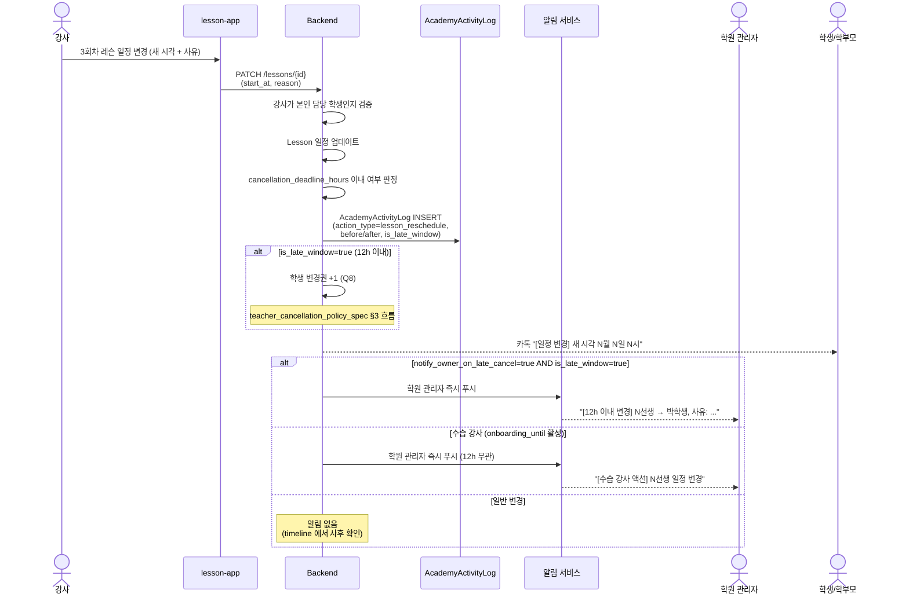

# academy/academy_schedule_authority_spec — 수강권 귀속 + 강사 일정 위임

> 기준일: 2026-05-21 (3차 — 권한 토글 폐기, 무조건 위임으로 재설계)
> 경로: `/subscriptions/new`, `/schedule/master`, `/console/activity`, `/teachers/{id}/onboarding`
> 마일스톤: AC-M2 (귀속 + 강사 위임), AC-M3 (활동 timeline + 수습 모드), AC-M5 (마스터 스케줄 + 충돌 감지)
> 선행: [console_overview_spec.md](console_overview_spec.md), [teacher_management_spec.md](teacher_management_spec.md), 옵시디언 `23-academy-수강권귀속-강사변경권한-설계.md` §6.4 (5차 결정)

## 1. 범위

학원(Academy) 도입 시 수강권 귀속 모델과 강사 일정 권한 체계.

**핵심 원칙 (Q1/Q2 폐기 — 5차 결정)**: 강사는 본인 담당 학생의 일정을 **무조건 위임**받아 직접 관리한다. 학원 관리자는 정책·정산·가시성을 통제할 뿐, 일정 변경을 사전 승인하지 않는다.

근거 (옵시디언 §6.4.2): 글로벌 SaaS 5종 (Mindbody/Acuity/Booksy/Class4Kids/Sawyer) 모두 강사 100% 위임. 일정 권한을 학원장이 토글하는 서비스는 0/5.

포함:
- 수강권 `ownership` 분기 (academy / teacher) — Q3
- 강사 무조건 위임 일정 관리 — §6.4
- 학원 관리자 활동 timeline (audit) — §6.4 신규
- 강사 개인 레슨 Privacy 모드 — §6.3.2
- 학원 vs 개인 레슨 충돌 감지 — §6.3.3
- 마스터 스케줄 뷰 (학원 관리자 read-only) — §6.3.4
- 수습 강사 onboarding 시간 제한 (Q11)

제외:
- 강사 사유 취소 정책 → [teacher_cancellation_policy_spec.md](teacher_cancellation_policy_spec.md)
- 학원장 일괄 휴강 → [owner_bulk_closure_spec.md](owner_bulk_closure_spec.md)
- 강사 페이/정산 (Q4: 앱에서 관리 안 함)
- ~~강사 권한 토글 (Q1/Q2)~~ — 폐기
- ~~일정 변경 요청-확정 워크플로우~~ — 폐기 (강사 직접 변경)

## 2. 데이터 모델

### 2.1 AcademyMember — onboarding_until 옵션 (Q11)

```python
class AcademyMember(Base):
    # ... 기존 필드 (teacher_management_spec.md §2 참조)
    onboarding_until = Column(DateTime, nullable=True)  # NULL = 정식 강사
    # NOT NULL 시 해당 시점까지 학원 관리자가 강사 액션을 강조 모니터링
```

**onboarding_until 의미 (Q11)**:
- 신규 강사 수습 기간 (예: 가입 후 90일) 동안 학원 관리자 알림 강화
- 토글이 아닌 **단일 시간 제한** — 만료 시 정식 강사로 자동 전환
- 강사 본인의 권한은 동일 (모든 권한 보유). UX 차이만:
  - 학원 콘솔: 해당 강사의 activity timeline 시각적 강조
  - 강사 lesson-app: 상단 안내 배너 "수습 기간 N일 남음"
  - 모든 강사 액션에 즉시 푸시 알림 (12h 무관)

> 권한 OFF 가 아니라 **가시성 강화**임에 주의.

### 2.2 AcademySubscription — 귀속 + 정책 변수

```python
class AcademySubscription(Base):
    id = Column(PK)
    academy_id = Column(FK academies)
    student_id = Column(FK users)
    teacher_member_id = Column(FK academy_members)  # 담당 강사
    ownership = Column(Enum("academy", "teacher"), nullable=False, default="academy")  # Q3
    
    # 정책 변수 (작성 시점에 학원/강사 디폴트로부터 스냅샷)
    # 상세: teacher_cancellation_policy_spec.md §2.3 + §5.5 prefill 로직
    cancellation_deadline_hours = Column(Integer, default=12)  # Q7
    student_compensation_extra_minutes_enabled = Column(Boolean, default=True)  # Q8
    include_extra_minutes_text_on_late_cancel = Column(Boolean, default=True)  # Q10 prefill
    student_compensation_extra_minutes_message = Column(String, nullable=True)  # Q10 문구
    notify_owner_on_late_cancel = Column(Boolean, default=True)  # ownership=academy 시 true 권장
    
    # 일반 수강권 필드 (sessions_remaining, fee 등)는 기존 모델 재사용
    created_at = Column(DateTime)
    created_by = Column(FK users)
```

**ownership 분기 (단순화 — 3차)**:

| ownership | 정책 결정자 | 일정 변경 권한 | 12h 이내 학원장 알림 |
|---|---|---|---|
| `academy` | 학원 관리자 (작성 시점 스냅샷) | 강사 직접 변경 | 권장 (default true) |
| `teacher` | 강사 | 강사 직접 변경 | 강사 자율 선택 |

> **3차 변경**: ownership=academy 라도 강사가 직접 변경. 학원 관리자는 **알림 + audit**만 받음. 사전 승인 없음.

### 2.3 Lesson — Privacy 가시성 (§6.3.2)

```python
class Lesson(Base):
    # ... 기존 필드
    academy_id = Column(FK academies, nullable=True)       # NULL = 강사 개인 레슨
    visibility = Column(Enum(
        "academy_full",      # 학원에 전체 공개 (학생명·내용)
        "academy_busy_only", # 학원에 busy 만 (강사 개인 레슨)
    ), default="academy_full")
```

학원에 등록된 강사의 lesson-app 일정 등록 화면:
- 디폴트: `academy_full` (학원 레슨)
- 토글 "학원에 비공개": `academy_busy_only` (강사 개인 레슨)

> 강사가 다른 학원·1:1 개인 학생을 운영하는 현실 반영. 시간 슬롯은 차단되지만 학생명·내용은 학원이 보지 못함.

### 2.4 AcademyActivityLog — 활동 timeline (3차 신규)

```python
class AcademyActivityLog(Base):
    id = Column(PK)
    academy_id = Column(FK academies, nullable=False)
    actor_user_id = Column(FK users, nullable=False)
    actor_role = Column(Enum("teacher", "owner", "student", "parent"))
    
    action_type = Column(Enum(
        "lesson_reschedule",       # 일정 변경
        "lesson_cancel",           # 레슨 취소
        "lesson_create",           # 새 레슨 등록
        "lesson_complete",         # 레슨 완료 처리
        "student_message_sent",    # 학생/학부모 메시지 발송
        "subscription_create",     # 수강권 작성
        "subscription_update",     # 수강권 변경
        "onboarding_expired",      # 수습 기간 만료 (시스템 이벤트)
        "owner_bulk_closure",      # 학원장 일괄 휴강
    ), nullable=False)
    
    target_lesson_id = Column(FK lessons, nullable=True)
    target_subscription_id = Column(FK academy_subscriptions, nullable=True)
    target_student_id = Column(FK users, nullable=True)
    
    before_value = Column(JSON, nullable=True)   # 변경 전 값 (스냅샷)
    after_value = Column(JSON, nullable=True)    # 변경 후 값
    notes = Column(String, nullable=True)         # 강사 입력 사유
    
    is_late_window = Column(Boolean, default=False)  # cancellation_deadline_hours 이내 여부
    
    created_at = Column(DateTime, nullable=False)
```

**기록 시점**:
- 강사가 학원 귀속 레슨을 변경·취소·완료할 때마다 1행
- 학원 관리자가 일괄 휴강할 때도 기록 (`actor_role=owner`)
- 메시지 발송 시 본문은 저장하지 않음 (프라이버시)

**조회**:
- `GET /api/v1/academies/{id}/activity?actor_user_id=&action_type=&from=&to=&late_window_only=`
- 학원 콘솔 `/console/activity` 에 timeline 렌더링

**보존 기간**: 2년 (이후 매월 1일 자동 삭제). 정산 분쟁 대응용.

## 3. 강사 일정 관리 (무조건 위임)

### 3.1 강사 권한 요약

| 영역 | 강사 권한 |
|---|---|
| 본인 담당 학생 일정 변경 | ✓ 직접 (요청·승인 없음) |
| 본인 담당 학생 메시지 발송 | ✓ 직접 (인박스 경유 X) |
| 본인 담당 학생 연락처 열람 | ✓ (담당 학생 한정) |
| 다른 강사 학생 접근 | ✗ |
| 학원 정책 (취소 기한 등) 변경 | ✗ |
| 학원 운영 (일괄 휴강) | ✗ |

### 3.2 강사 lesson-app 일정 변경 흐름



### 3.3 강사 lesson-app 학생 메시지 흐름

강사가 학생/학부모에게 직접 메시지:
- 채널: 인앱 + 카톡 (학원 통합 인박스 경유 안 함)
- AcademyActivityLog 에 `action_type=student_message_sent` 기록 (본문 제외)

### 3.4 API

`PATCH /api/v1/lessons/{lesson_id}`
```json
{
  "start_at": "2026-05-23T14:00:00",
  "duration_minutes": 60,
  "reason": "개인 일정"
}
```

응답:
```json
{
  "lesson_id": 101,
  "before": {"start_at": "2026-05-22T15:00:00"},
  "after": {"start_at": "2026-05-23T14:00:00"},
  "is_late_window": true,
  "student_compensation_credit_added": 1,
  "owner_notified": true,
  "activity_log_id": 5012
}
```

## 4. 학원 관리자 활동 timeline (3차 신규)

### 4.1 화면 위치

`/console/activity` — 학원 관리자 전용

### 4.2 화면

```
┌──────────────────────────────────────────────────────────┐
│ 활동 timeline                                            │
│ 필터: 강사 [전체 ▼] · 액션 [전체 ▼] · 12h 이내 ☐         │
│ 기간: [2026-05-15] ─ [2026-05-21]                        │
├──────────────────────────────────────────────────────────┤
│ 2026-05-21 14:32                                         │
│   김선생 — 일정 변경 (박학생 3회차)                       │
│   05-22 15:00 → 05-23 14:00                              │
│   사유: 개인 일정                                        │
│   ⚠ 12시간 이내 (학생 변경권 +1 자동 적립)               │
│                                                          │
│ 2026-05-21 11:08                                         │
│   ⭐ 수습 강사 — 신선생 일정 변경 (이학생 1회차)         │
│   05-22 16:00 → 05-22 17:00                              │
│                                                          │
│ 2026-05-21 09:14                                         │
│   이선생 — 메시지 발송 (박학생 학부모)                    │
│                                                          │
│ 2026-05-20 18:00                                         │
│   학원장 — 일괄 휴강 (5/27 어린이날)                      │
│   영향: 강사 3명, 학생 47명                              │
└──────────────────────────────────────────────────────────┘
```

### 4.3 API

`GET /api/v1/academies/{id}/activity?actor_user_id=&action_type=&late_window_only=&from=&to=`

응답 예:
```json
{
  "items": [
    {
      "id": 5012,
      "actor_user_id": 7,
      "actor_name": "김선생",
      "actor_role": "teacher",
      "is_onboarding_teacher": false,
      "action_type": "lesson_reschedule",
      "target_student_name": "박학생",
      "before_value": {"start_at": "2026-05-22T15:00:00"},
      "after_value": {"start_at": "2026-05-23T14:00:00"},
      "notes": "개인 일정",
      "is_late_window": true,
      "created_at": "2026-05-21T14:32:00"
    }
  ],
  "total": 142,
  "late_window_count": 3,
  "onboarding_teacher_count": 1
}
```

### 4.4 알림 정책

| 액션 | 학원 관리자 알림 |
|---|---|
| 일정 변경 (12h+ 전) | 알림 없음, timeline 에만 |
| 일정 변경 (12h 이내) | 즉시 푸시 (`notify_owner_on_late_cancel=true` 시) |
| 레슨 취소 (12h 이내) | 즉시 푸시 + 빨간 배지 |
| 노쇼 (시작 후 미진행) | 긴급 알림 |
| 수습 강사(`onboarding_until` 활성)의 모든 액션 | 즉시 푸시 (12h 무관, 시각적 강조) |
| 학생 메시지 발송 | 알림 없음, timeline 에만 |

## 5. 수습 강사 onboarding (Q11)

### 5.1 설정

학원 관리자가 강사 초대 시 또는 강사 상세 화면에서 설정:

`PATCH /api/v1/academies/{id}/teachers/{teacher_id}/onboarding`
```json
{ "onboarding_until": "2026-08-19T00:00:00" }
```

해제:
```json
{ "onboarding_until": null }
```

### 5.2 효과

- **권한은 동일** (정식 강사와 같음 — 일정 변경·메시지·연락처 모두 가능)
- 학원 콘솔 timeline 에서 해당 강사 액션 ⭐ 강조
- 학원 관리자에게 **모든** 액션 즉시 푸시 (12h 무관)
- 강사 lesson-app 상단 배너: "수습 기간 N일 남음"
- 마스터 스케줄 뷰 헤더 배지: "수습 강사 N명"

### 5.3 만료

`onboarding_until < now` 시 자동 정식 강사 전환:
- AcademyActivityLog 에 `action_type=onboarding_expired` 1행 기록 (시스템 이벤트)
- 강사 lesson-app 배너 해제
- 학원 관리자 알림 강도 일반 수준 복귀

스케줄 잡: `daily_cron_onboarding_check` — 매일 자정 만료된 강사 조회 후 timeline 이벤트 INSERT.

## 6. Privacy 모드 (§6.3.2)

### 6.1 강사 lesson-app 일정 등록 UI

```
┌─────────────────────────────────────────────┐
│ 새 일정 등록                                 │
├─────────────────────────────────────────────┤
│ 시작: 2026-05-25 18:00                       │
│ 종료: 2026-05-25 19:00                       │
│                                              │
│ 일정 유형                                    │
│ ⦿ 학원 레슨 (강남리듬 학원)                  │
│ ○ 외부 일정 (학원에 비공개)                 │
│                                              │
│ ─────────────────────────────────────────── │
│ (학원 레슨 선택 시:)                         │
│ 학생: [▼ 박학생]                             │
│ 메모: [____________]                         │
│                                              │
│ [저장]                                       │
└─────────────────────────────────────────────┘
```

- 외부 일정 선택 → `visibility = academy_busy_only`, `academy_id = NULL`
- 학원 캘린더에는 "◐ 외부 일정" (busy/free 만)
- 학생명·내용·메모는 학원 관리자에게 노출되지 않음

### 6.2 학원 마스터 스케줄 표시

```
김선생 캘린더 (학원 관리자 뷰):
14:00 ─ 15:00  [학원] 박학생 피아노        ← visibility=academy_full
15:00 ─ 16:00  ◐ 외부 일정                 ← visibility=academy_busy_only
16:00 ─ 17:00  [학원] 이학생 바이올린
```

## 7. 충돌 감지 (§6.3.3)

### 7.1 감지 시점

강사가 lesson-app 에서 일정 등록·변경 시 (외부/학원 무관):

```python
def detect_conflicts(teacher_user_id, start_at, end_at, exclude_lesson_id=None):
    q = Lesson.query.filter(
        Lesson.teacher_user_id == teacher_user_id,
        Lesson.start_at < end_at,
        Lesson.end_at > start_at,
    )
    if exclude_lesson_id:
        q = q.filter(Lesson.id != exclude_lesson_id)
    return q.all()
```

### 7.2 처리 UX

```
┌─────────────────────────────────────────────┐
│ ⚠ 일정 겹침 감지                            │
├─────────────────────────────────────────────┤
│ 등록하려는 시간: 14:30 ─ 15:30               │
│ 충돌:                                        │
│   • [학원] 박학생 피아노 14:00 ─ 15:00       │
│                                              │
│ 처리                                         │
│ ⦿ 시간 조정 (권장)                          │
│ ○ 그대로 등록 (학원 관리자에 알림)          │
│ ○ 학원 레슨 시간 직접 변경                  │
│   → 14:00 ─ 15:00 레슨 새 시각으로 옮기기   │
└─────────────────────────────────────────────┘
```

"그대로 등록" → 두 일정 모두 저장 + `conflict_flag = true` + 학원 관리자 알림 + 마스터 스케줄 빨간 마커.

"학원 레슨 시간 직접 변경" → 강사가 직접 학원 레슨 일정 수정 (§3.2 흐름). 별도 승인 불필요.

> **3차 변경**: 기존 "학원 레슨 변경 요청 보내기" → "직접 변경" 으로 단순화 (요청-확정 분리 폐기).

## 8. 마스터 스케줄 뷰 (§6.3.4)

### 8.1 경로

`/schedule/master` (학원 관리자 read-only)

### 8.2 화면

```
주간 마스터 뷰                          [← 5/18주] [5/25주] [6/1주 →]
필터: 강사 [전체 ▼] · 악기 [전체 ▼] · 충돌만 ☐ · 12h 이내 변경 ☐

         월        화        수        목        금        토
14:00   김선생    ─         박선생    ─         김선생    이선생
        (피아노)            (바이올린)          (피아노)  (드럼)
14:30   ●        ─         ●        ─         ⚡         ●
                                              (12h내)
15:00   ─         이선생    ─         김선생    ⚠⚠        ─
                  (드럼)              (피아노)  충돌
15:30   ─         ●        ─         ●        ●        ─
16:00   ◐        ─         ─         ─         ─         ─
        외부

[색상]
● 초록: 정상
⚡ 주황: 12h 이내 변경 발생 (timeline 으로 이동)
● 빨강: 충돌 감지
◐ 회색: busy (강사 개인 레슨)
⭐ 수습 강사 액션은 추가 표식
```

> **3차 변경**: 기존 노랑 셀 (admin_review 대기) 제거 — 승인 큐 없음. 대신 ⚡ 주황 (12h 이내 변경) + ⭐ (수습 강사 액션) 추가.

### 8.3 헤더 배지

```
[충돌 1건] [12h 이내 변경 3건] [오늘 휴강 0건] [수습 강사 1명]
```

각 배지 클릭 시 해당 항목 리스트 (별도 화면 또는 timeline 필터링).

### 8.4 API

`GET /api/v1/academies/{id}/schedule/master?week=2026-W22&teacher_id=&conflict_only=&late_window_only=`

```json
{
  "week_start": "2026-05-25",
  "lessons": [
    {
      "id": 101,
      "teacher_member_id": 7,
      "teacher_name": "김선생",
      "is_onboarding_teacher": false,
      "student_name": "박학생",
      "instrument": "피아노",
      "start_at": "2026-05-25T14:00:00",
      "end_at": "2026-05-25T15:00:00",
      "visibility": "academy_full",
      "conflict_flag": false,
      "late_change_within_24h": false
    },
    {
      "id": 102,
      "teacher_member_id": 7,
      "teacher_name": "김선생",
      "is_onboarding_teacher": false,
      "student_name": null,
      "instrument": null,
      "start_at": "2026-05-25T16:00:00",
      "end_at": "2026-05-25T17:00:00",
      "visibility": "academy_busy_only",
      "conflict_flag": false
    }
  ],
  "conflicts": 1,
  "late_changes_this_week": 3,
  "onboarding_teachers": 1
}
```

## 9. 권한 매트릭스 (§6.4.7 옵시디언 매트릭스)

| 작업 | R-AO 학원 관리자 | R-AT 강사 | R-AS 학생/학부모 |
|---|---|---|---|
| 수강권 작성 | ✓ | △ ownership=teacher 일 때만 | ✗ |
| 일정 변경 (모든 ownership) | △ 모니터링·알림 받음 | ✓ **직접** | ✗ (변경권으로 자동 처리) |
| 학생 연락처 열람 | ✓ | ✓ 담당 학생 한정 | — |
| 학생·학부모 직접 메시지 | ✓ (인박스 답변) | ✓ **항상** | ✓ (인박스 발신) |
| 일괄 휴강 | ✓ | ✗ (1h 의견만 — owner_bulk_closure_spec.md) | ✗ |
| 보강 일정 입력 | △ 모니터링 | ✓ 위임됨 (Q6) | ✗ |
| 강사 개인 레슨 등록 | ✗ (busy 만 봄) | ✓ | ✗ |
| 학원 운영 정책 변경 | ✓ | ✗ | ✗ |
| 활동 timeline 조회 | ✓ (read-only) | ✗ | ✗ |
| 수습 강사 onboarding 설정 | ✓ | ✗ | ✗ |
| 마스터 스케줄 뷰 | ✓ (read-only) | ✗ | ✗ |

## 10. 권한 / 보안

- 강사는 본인 담당 학생의 레슨만 변경/조회 가능: `lesson.teacher_member_id == current_member.id` 검증
- 다른 강사의 학생 접근: 403 `FORBIDDEN_NOT_ASSIGNED_TEACHER`
- `visibility = academy_busy_only` 레슨 조회: 학원 관리자는 시간 슬롯만 응답에 포함, `student_name=null`, `instrument=null`
- AcademyActivityLog 조회: `Depends(current_academy_owner)` 만 (강사는 본인 액션 조회 X — 향후 검토)
- 마스터 스케줄 뷰: `Depends(current_academy_owner)` 만 접근
- `onboarding_until` 설정: `Depends(current_academy_owner)` 만
- AcademyActivityLog 보존 기간 2년 (`daily_cron_activity_cleanup` 매월 1일 만료 행 삭제)
- `is_late_window` 판정은 서버에서만 (클라이언트 시계 신뢰 X)

## 11. 실패 / 예외

| 상황 | 처리 |
|---|---|
| 강사가 다른 강사 학생 일정 수정 시도 | 403 `FORBIDDEN_NOT_ASSIGNED_TEACHER` |
| 12h 이내 변경인데 학생 변경권 잔액 0 | 변경권 +1 자동 적립 + 처리 진행 (보호 정책 — teacher_cancellation_policy_spec §3) |
| Privacy 일정이 학원 레슨과 같은 시간대 | conflict_flag 마킹, 학원 관리자 빨간 셀 표시 |
| 수습 강사 onboarding_until 만료 (자동) | activity_log INSERT (action_type=onboarding_expired) + 강사 배너 해제 |
| 강사가 본인 onboarding_until 해제 시도 | 403 (학원 관리자만 가능) |
| Lesson 시작 시각이 이미 지남 + 강사 PATCH | 400 + "지난 일정은 변경 불가, 노쇼 처리는 별도 흐름" |
| AcademyActivityLog INSERT 실패 | 레슨 변경 자체는 성공 처리 + 별도 에러 로깅 (audit 누락은 운영 알림으로 처리, 사용자 흐름은 차단하지 않음) |
| `notify_owner_on_late_cancel=false` 인 academy 귀속 수강권 | 12h 이내 변경 시에도 학원장 푸시 생략, timeline 에는 기록 |

## 12. 변경 이력

- 2026-05-21: 초안 (Q1-Q9 결정 + §6.3 ChatGPT 참고 항목 반영)
- 2026-05-21 (2차): `AcademySubscription` 에 `include_extra_minutes_text_on_late_cancel`, `student_compensation_extra_minutes_message` 추가. Q10 prefill 흐름은 [teacher_cancellation_policy_spec.md §5.5](teacher_cancellation_policy_spec.md) 참조.
- 2026-05-21 (3차): **권한 토글 폐기 — 무조건 위임으로 재설계** (옵시디언 §6.4 5차 결정 반영).
  - 삭제: `AcademyMember.delegated_permissions` JSON, `ScheduleChangeRequest` 5상태 머신 모델 전체, §3 권한 토글 UI, §4 요청-확정 워크플로우.
  - 신규: §2.4 `AcademyActivityLog` 모델, §4 활동 timeline, §5 수습 강사 onboarding (Q11), `AcademyMember.onboarding_until` 옵션 필드.
  - 변경: §3 강사 직접 변경 흐름, §7 충돌 처리 옵션 단순화 ("변경 요청" → "직접 변경"), §8 마스터 스케줄 노랑 셀(admin_review) 제거 + 12h 주황 셀 + 수습 강사 ⭐ 표식 추가, §9 권한 매트릭스 단순화.
