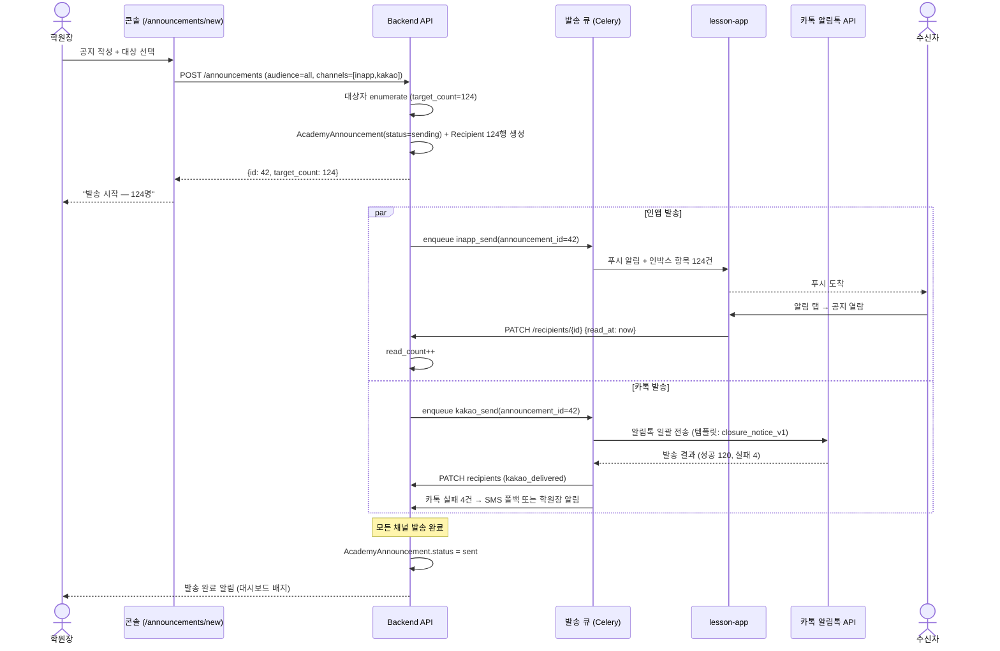

# academy/announcements_spec — 학원 공지사항

> 기준일: 2026-05-20
> 경로: `/announcements`, `/announcements/new`, `/announcements/{id}`
> 마일스톤: AC-M3 (공지 MVP), AC-M5 (예약 발송 + 읽음 통계)
> 선행: [console_overview_spec.md](console_overview_spec.md), [teacher_management_spec.md](teacher_management_spec.md), [student_management_spec.md](student_management_spec.md), 옵시디언 `21-academy-요구사항.md` §3.1 R-AO-24

## 1. 범위

학원장(R-AO) → 전체 강사/학생/학부모에게 일괄 공지.
- 사용 사례: 휴원, 발표회, 방학, 수업료 인상 안내, 명절 휴무
- 채널: lesson-app 인앱 알림 (필수) + 카톡 알림톡 (선택)
- 대상 분기: 전체 / 강사만 / 학부모만 / 학생만 / 특정 강사의 학생들
- 1:1 채팅 X — 응답은 학부모 문의 인박스([inbox_spec.md](inbox_spec.md))로 분리

원칙:
- 공지는 **단방향** (학원장 → 수신자). 댓글/답글 기능 없음
- 학원장 1인 작성 권한 (강사·운영자 위임 X — 책임 명확화)
- 카톡 알림톡 사전 등록된 템플릿만 사용 (커스텀 메시지는 lesson-app 인앱만)

## 2. 데이터 모델

```python
class AcademyAnnouncement(Base):
    id = Column(PK)
    academy_id = Column(FK academies)
    author_user_id = Column(FK users)              # 학원장
    title = Column(String, nullable=False)
    body_markdown = Column(Text, nullable=False)
    audience = Column(Enum(
        "all",                  # 전체 (강사+학생+학부모)
        "teachers",             # 강사만
        "parents",              # 학부모만
        "students",             # 학생만
        "teacher_students",     # 특정 강사의 학생/학부모
    ))
    audience_filter = Column(JSON, nullable=True)   # {teacher_member_id: 7} 등
    channels = Column(JSON)                         # ["inapp", "kakao"]
    kakao_template_id = Column(String, nullable=True)
    scheduled_at = Column(DateTime, nullable=True)  # NULL=즉시, 있으면 예약
    sent_at = Column(DateTime, nullable=True)
    status = Column(Enum("draft", "scheduled", "sending", "sent", "cancelled"))
    target_count = Column(Integer)                  # 발송 대상 수 (확정 시 캡처)
    delivered_count = Column(Integer, default=0)
    read_count = Column(Integer, default=0)
    created_at = Column(DateTime)

class AcademyAnnouncementRecipient(Base):
    """공지 1건 × 수신자 1명 = 1행 (읽음 추적)"""
    id = Column(PK)
    announcement_id = Column(FK)
    user_id = Column(FK users)
    role = Column(Enum("teacher", "parent", "student"))
    delivered_at = Column(DateTime, nullable=True)
    read_at = Column(DateTime, nullable=True)
    kakao_delivered = Column(Boolean, default=False)
    inapp_delivered = Column(Boolean, default=False)
```

UNIQUE 제약: `(announcement_id, user_id)`.

## 3. 작성 흐름

### 3.1 화면 구성 (`/announcements/new`)

```
┌─────────────────────────────────────────────┐
│ 새 공지 작성                                 │
├─────────────────────────────────────────────┤
│ 제목 [_______________________]               │
│ 본문 [Markdown 에디터]                       │
│                                              │
│ 대상  ⦿ 전체  ○ 강사만  ○ 학부모만           │
│       ○ 학생만  ○ 특정 강사 학생들 [▼]      │
│       → 대상 수: 124명 (강사 8, 학부모 87,   │
│                       학생 29)               │
│                                              │
│ 채널  ☑ lesson-app 인앱                     │
│       ☑ 카톡 알림톡 [템플릿 선택 ▼]         │
│       └ "휴원 안내", "발표회 안내", ...      │
│                                              │
│ 발송  ⦿ 즉시  ○ 예약 [2026-05-25 09:00]    │
│                                              │
│ [미리보기] [임시저장] [발송]                 │
└─────────────────────────────────────────────┘
```

### 3.2 API

`POST /api/v1/academies/{id}/announcements`
```json
{
  "title": "5/30(토) 학원 휴무 안내",
  "body_markdown": "...",
  "audience": "all",
  "channels": ["inapp", "kakao"],
  "kakao_template_id": "closure_notice_v1",
  "scheduled_at": null
}
```

응답:
```json
{
  "id": 42,
  "status": "sending",
  "target_count": 124,
  "estimated_delivery_at": "2026-05-20T15:30:00Z"
}
```

## 4. 발송 시퀀스



## 5. 예약 발송 (AC-M5)

```
1. 학원장: scheduled_at = "2026-05-25 09:00" 지정 → status='scheduled'
2. 콘솔: 예약 목록에 표시 — 취소/수정 가능 (발송 전까지)
3. 크론 (1분 간격): scheduled_at <= now AND status='scheduled' 조회
4. status='sending' 전환 → 발송 시퀀스 (§4) 실행
```

## 6. 수신자 화면

### 6.1 lesson-app 인앱

- 알림 센터 상단 배지 (읽지 않은 공지 수)
- 공지 목록 화면 (`/inapp/announcements`):
  - 최신순 정렬
  - 읽지 않은 공지는 **굵게 + 점**
  - 클릭 → 본문 화면 → read_at 자동 기록

### 6.2 카톡 알림톡

알림톡 템플릿 (사전 등록 필수):

| 템플릿 ID | 용도 | 변수 |
|---|---|---|
| `closure_notice_v1` | 휴원 안내 | 학원명, 휴원일, 사유 |
| `event_notice_v1` | 발표회/행사 안내 | 학원명, 행사명, 일시, 장소 |
| `fee_change_v1` | 수강료 인상 안내 | 학원명, 인상률, 적용일 |
| `general_v1` | 일반 공지 | 학원명, 제목, 본문 요약 (200자) |

본문 끝에 deep link: `lessonaza.app/academy/{slug}/announcements/{id}` → 앱 설치 시 자동 열람.

## 7. 읽음 통계 (AC-M5)

`GET /api/v1/academies/{id}/announcements/{id}/stats`

```json
{
  "target_count": 124,
  "delivered_count": 120,
  "read_count": 87,
  "read_rate": 0.70,
  "by_role": {
    "teacher": { "target": 8, "read": 8, "rate": 1.0 },
    "parent": { "target": 87, "read": 62, "rate": 0.71 },
    "student": { "target": 29, "read": 17, "rate": 0.59 }
  },
  "unread_users": [
    { "user_id": 42, "name": "김학부모", "role": "parent" }
  ]
}
```

학원장 화면: 미열람자 명단 → "1:1 재발송" 버튼 (lesson-app 인박스 알림 추가, 카톡 재발송은 비용 발생으로 학원장 명시 확인 필요).

## 8. 권한 / 보안

- `Depends(current_academy_owner)` + academy_id 검증
- 강사·운영자는 공지 작성 권한 없음 (학원장 1인 권한)
- 본문 Markdown 은 XSS sanitize (예: `bleach`, allowlist 태그)
- 카톡 알림톡 발송 비용은 학원장 결제 (학원 SaaS 요금에 포함 vs 별도 — Lite/Pro 정책 참고)

## 9. 실패 / 예외

| 상황 | 처리 |
|---|---|
| 카톡 알림톡 발송 실패 (수신 거부) | lesson-app 인앱만 발송 + 학원장에게 미발송자 명단 |
| 카톡 템플릿 승인 거부 | 학원장 안내 "알림톡 템플릿 미승인 — 인앱만 발송" |
| 예약 시각에 학원장 결제 만료 | 발송 보류 + 학원장 결제 알림 |
| 대상자 0명 (예: 강사 모드인데 강사 0명) | 발송 차단 + 경고 |

## 10. 변경 이력

- 2026-05-20: 초안
- 2026-06-05: §2 데이터 모델 BE 추가. `AcademyAnnouncement` + `AcademyAnnouncementRecipient` 2 테이블 + 3 enum (`audience` 5종, `status` 5단계, `recipient_role` 3종). UNIQUE (announcement_id, user_id) 제약 + 3 인덱스. Alembic migration (`ac_m3_academy_announcements`, revises `ac_m2_user_tokens_revoked_at`). models/__init__ export. service / endpoint / audience targeting / 카톡 알림톡 발송은 별도 후속 작업. AC-M3 진입 첫 스텝.
