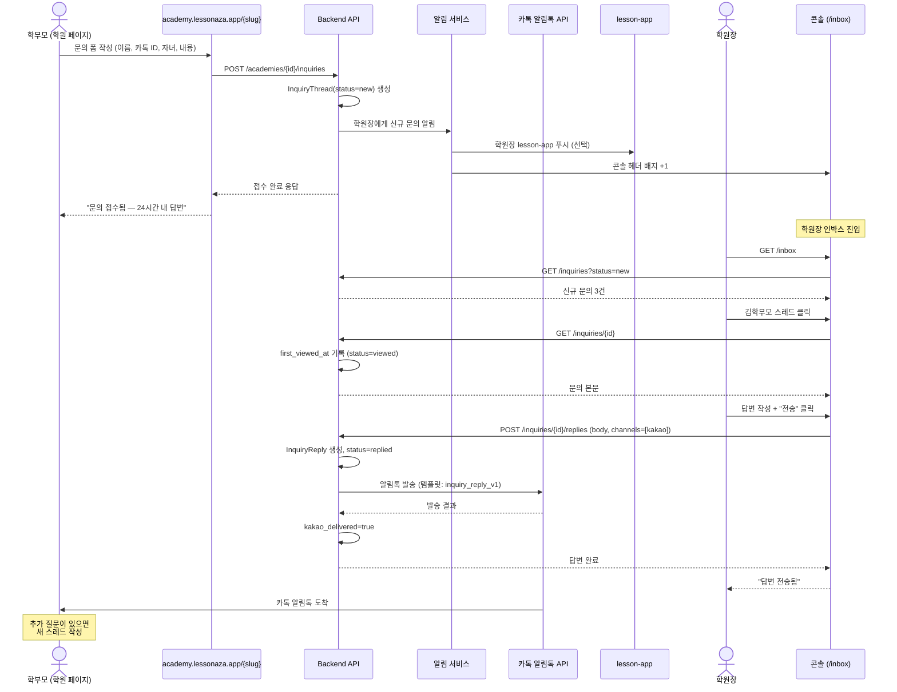

# academy/inbox_spec — 학부모 문의 인박스

> 기준일: 2026-05-20
> 경로: `/inbox`, `/inbox/{thread_id}`
> 마일스톤: AC-M3 (인박스 MVP), AC-M5 (답변 SLA 알림 + 카톡 답장)
> 선행: [console_overview_spec.md](console_overview_spec.md), [public_page_spec.md](public_page_spec.md), 옵시디언 `21-academy-요구사항.md` §3.1 R-AO-25

## 1. 범위

학부모(R-AS 또는 잠재 학부모) → 학원장(R-AO) 문의 게시판.
- **수신 경로 2가지**:
  - 학원 공개 페이지 (`academy.lessonaza.app/{slug}`) 의 문의 폼
  - lesson-app 학부모 화면 → "학원에 문의" 버튼
- **응답 채널**: 학원장이 인박스에서 답변 작성 → 학부모에게 lesson-app 인앱 + 카톡 알림
- **1:1 채팅 X** — 게시판형 (질문 1건 → 답변 1건). 추가 질문은 새 스레드.
- **학부모-강사 직접 채팅 X** (lesson-app 영역) — 인박스는 학원 운영 문의 전용

원칙:
- 답변자는 **학원장 1인** (강사 위임 X — 응대 일관성)
- 답변 SLA: 영업일 24시간 (미답변 시 학원장 알림 + 학부모에게 "검토 중" 자동 메시지)
- 잠재 학부모 (미가입 사용자) 문의도 수신 — 답변 시 이메일/카톡으로 회신

## 2. 데이터 모델

```python
class AcademyInquiryThread(Base):
    id = Column(PK)
    academy_id = Column(FK academies)
    source = Column(Enum("public_page", "lesson_app"))
    sender_user_id = Column(FK users, nullable=True)   # 가입자만 (잠재고객은 NULL)
    sender_name = Column(String, nullable=False)       # 폼 입력값
    sender_contact = Column(String, nullable=False)    # 카톡 ID 또는 이메일 또는 전화
    sender_contact_type = Column(Enum("email", "kakao", "phone"))
    student_name = Column(String, nullable=True)       # 자녀 이름 (선택)
    student_age = Column(Integer, nullable=True)
    instrument = Column(String, nullable=True)
    subject = Column(String, nullable=False)
    body = Column(Text, nullable=False)
    consent_personal_info = Column(Boolean, nullable=False)  # 개인정보 동의
    status = Column(Enum(
        "new",          # 미열람
        "viewed",       # 학원장 열람
        "replied",      # 답변 완료
        "closed",       # 종료 (스팸 / 무관)
    ))
    received_at = Column(DateTime)
    first_viewed_at = Column(DateTime, nullable=True)
    replied_at = Column(DateTime, nullable=True)
    closed_at = Column(DateTime, nullable=True)
    close_reason = Column(Enum("spam", "irrelevant", "duplicate", "resolved"), nullable=True)

class AcademyInquiryReply(Base):
    id = Column(PK)
    thread_id = Column(FK)
    author_user_id = Column(FK users)  # 학원장
    body = Column(Text, nullable=False)
    sent_at = Column(DateTime)
    kakao_delivered = Column(Boolean, default=False)
    email_delivered = Column(Boolean, default=False)
    inapp_delivered = Column(Boolean, default=False)  # 가입자만
```

> **다중 응답 X**: 한 스레드당 답변 1건. 추가 질문은 학부모가 새 스레드 작성 (`status='replied'` 이후 스레드는 read-only).

## 3. 학부모 문의 작성

### 3.1 공개 페이지 폼 (잠재 학부모)

```
┌─────────────────────────────────────────────┐
│ 강남리듬 학원 문의                           │
├─────────────────────────────────────────────┤
│ 이름 [_______________]  (필수)               │
│ 연락처 ⦿ 카톡 ID ○ 이메일 ○ 전화             │
│        [_______________]                     │
│                                              │
│ 자녀 이름 [_______________] (선택)           │
│ 나이      [__] 세                            │
│ 악기      [▼ 피아노]                         │
│                                              │
│ 제목 [_______________________]               │
│ 내용 [_______________________________]       │
│      [_______________________________]       │
│                                              │
│ ☑ 개인정보 수집·이용 동의 (필수)            │
│   상세보기 →                                 │
│                                              │
│ [전송]                                       │
└─────────────────────────────────────────────┘
```

`POST /api/v1/academies/{id}/inquiries` (인증 불필요 — 잠재 학부모용)

### 3.2 lesson-app 가입 학부모

학부모 화면 → "학원에 문의" 버튼:
- 본인 정보 자동 채움 (sender_user_id 설정)
- 자녀 정보는 본인 자녀 중 선택 (드롭다운)
- 응답은 lesson-app 인박스로 수신

## 4. 학원장 인박스 (`/inbox`)

### 4.1 목록 화면

```
┌─────────────────────────────────────────────┐
│ 문의 인박스       [전체] [새 문의 3] [답변 대기 1] │
├──┬──────────┬──────────┬──────┬─────────┬──────┤
│• │ 김학부모  │ 입학 문의  │ 카톡  │ 2시간 전│ 새  │
│  │ 박학부모  │ 수업료 인상│ 이메일│ 1일 전  │ 답변│
│  │ 이학부모  │ 발표회 문의│ 카톡  │ 3일 전  │ 답변│
└──┴──────────┴──────────┴──────┴─────────┴──────┘
```

컬럼: 미열람 점 / 발신자 / 제목 / 채널 / 경과 시간 / 상태

필터: 전체 / 새 문의 / 답변 대기 / 답변 완료 / 종료
정렬: 최신순 / 답변 대기 우선

### 4.2 스레드 상세

```
┌─────────────────────────────────────────────┐
│ ← 인박스      [스팸 처리] [종료]            │
├─────────────────────────────────────────────┤
│ 김학부모 (잠재 학부모)                       │
│ 카톡 ID: kim_parent                          │
│ 자녀: 김지원 (8세, 피아노 희망)              │
│ 받음: 2026-05-20 13:00                       │
│ ─────────────────────────────────────────── │
│ 제목: 입학 문의                              │
│                                              │
│ 안녕하세요, 8살 딸이 피아노를 처음 시작하려  │
│ 합니다. 초보자 강사 매칭 가능할까요?         │
│ ─────────────────────────────────────────── │
│ 답변 작성:                                   │
│ [_______________________________________]    │
│ [_______________________________________]    │
│                                              │
│ ☑ 카톡으로 회신                             │
│ ☐ 이메일도 회신 (등록되어 있을 때)          │
│                                              │
│ [임시저장] [답변 전송]                       │
└─────────────────────────────────────────────┘
```

## 5. 답변 시퀀스



## 6. SLA / 미답변 알림 (AC-M5)

| 경과 시간 | 액션 |
|---|---|
| 신규 수신 즉시 | 학원장 lesson-app 푸시 (옵션) + 콘솔 헤더 배지 |
| received_at + 12h 미열람 | 학원장 카톡 알림 "미열람 문의 N건" |
| received_at + 24h 미답변 | 학원장 카톡 + 콘솔 액션 박스 강조 |
| received_at + 24h 미답변 | 학부모에게 "검토 중" 자동 메시지 (1회만) |
| received_at + 72h 미답변 | 학원장 +1차 경고 + 학부모에게 사과 메시지 |

자동 메시지 템플릿: `inquiry_pending_v1` (카톡 알림톡 사전 등록).

## 7. 종료 / 스팸 처리

```
스팸 처리:
1. 학원장: 스레드 → "스팸 처리" 클릭
2. 사유 선택: spam / irrelevant / duplicate
3. status='closed', closed_at, close_reason
4. 학부모에게 응답 없음 (스팸은 응답 X)

해결됨:
1. 답변 후 학부모가 가입·계약 진행 → 학원장이 "resolved" 표시
2. 스레드 종료 + 통계 집계 (전환율 계산용)
```

## 8. 통계

`GET /api/v1/academies/{id}/inbox/stats`

```json
{
  "total_received": 142,
  "by_source": { "public_page": 98, "lesson_app": 44 },
  "by_status": { "new": 3, "viewed": 5, "replied": 120, "closed": 14 },
  "avg_response_time_hours": 8.5,
  "conversion_rate": 0.28,
  "by_instrument": [
    { "instrument": "피아노", "count": 67, "conversion": 0.31 }
  ]
}
```

대시보드 위젯과 연동: `/`(dashboard) 의 액션 박스에 "학부모 문의 N건" 표시.

## 9. 권한 / 보안

- 공개 페이지 문의 폼: 인증 불필요. **rate limit** (IP 기준 분당 3건, 일 20건)
- 학원장 인박스: `Depends(current_academy_owner)` + academy_id 검증
- 강사는 인박스 접근 권한 없음 (학원장 1인)
- 잠재 학부모 개인정보: consent_personal_info=true 필수. 보존 기간 1년 후 자동 삭제 (PIPA 대응)
- XSS sanitize: 답변 본문 Markdown allowlist
- 첨부 파일 미지원 (P1) — 필요 시 학원장이 카톡으로 전환

## 10. 실패 / 예외

| 상황 | 처리 |
|---|---|
| 카톡 ID 오타로 발송 실패 | 학원장에게 "발송 실패" 알림 + 이메일/전화 폴백 안내 |
| 학부모 lesson-app 미가입 + 카톡 거부 | 이메일로 폴백 (등록되어 있을 때) |
| 학부모가 동일 내용 반복 (스팸) | rate limit 차단 + IP 기록 |
| 답변 작성 중 스레드 다른 사람이 종료 | 충돌 경고 + 저장 차단 |

## 11. 변경 이력

- 2026-05-20: 초안
