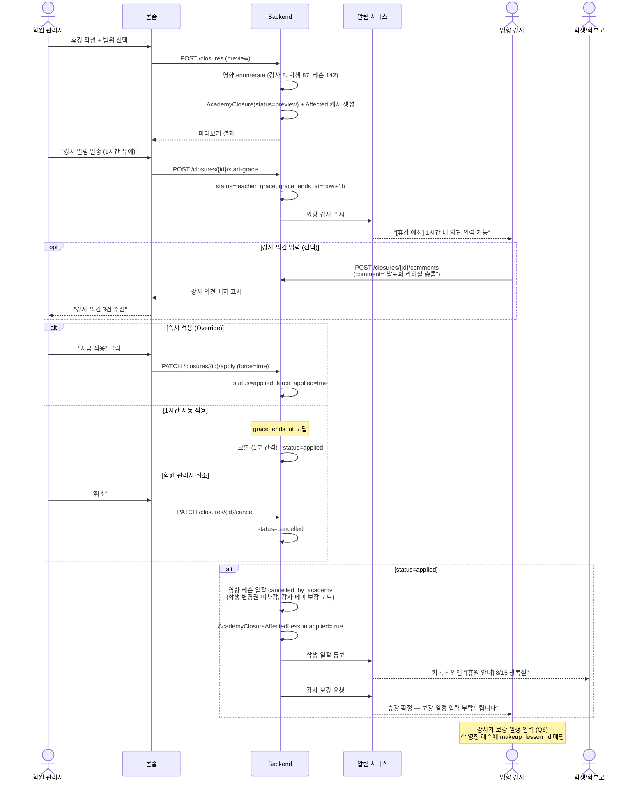

# academy/owner_bulk_closure_spec — 학원장 일괄 휴강

> 기준일: 2026-05-21
> 경로: `/closures`, `/closures/new`, `/closures/{id}`
> 마일스톤: AC-M3 (휴강 MVP), AC-M5 (강사 의견 코멘트 + Override + 보강 위임)
> 선행: [console_overview_spec.md](console_overview_spec.md), [teacher_cancellation_policy_spec.md](teacher_cancellation_policy_spec.md), 옵시디언 `23-academy-수강권귀속-강사변경권한-설계.md` §5 + §6 결정 (Q5=C2, Q6=강사위임)

## 1. 범위

학원 관리자(R-AO) 가 **일괄 휴강** 을 발동하는 기능. 휴원·발표회·천재지변·시설점검 등.

포함:
- 휴강 범위 선택 (전체 / 강사별 / 날짜별 / 학생 cherry-pick)
- C2 워크플로우: 영향 강사에게 1시간 사전 알림 + 강사 의견 코멘트 + 학원 관리자 Override
- 학생 일괄 통보 (카톡 + 인앱)
- 학원 사유 명시 (강사 페이 100% 보장 표기 — 단, 페이 자체는 앱 외 관리)
- 학생 변경권 미차감
- 보강 일정 강사 위임 (Q6)

제외:
- 강사 페이 자동 지급/차감 (Q4: 앱에서 페이 관리 안 함 — 텍스트 표기만)
- 자동 대체강사 매칭 (Q6: 강사 위임으로 결정)
- 강사 동의 워크플로우 (Q5: C2 선택, C3 제외)

## 2. 데이터 모델

### 2.1 AcademyClosure

```python
class AcademyClosure(Base):
    id = Column(PK)
    academy_id = Column(FK academies)
    created_by = Column(FK users)  # 학원 관리자
    
    title = Column(String, nullable=False)
    reason = Column(Text, nullable=False)
    reason_category = Column(Enum(
        "holiday",          # 휴원 (명절, 연휴)
        "event",            # 발표회·행사
        "facility",         # 시설 점검
        "emergency",        # 천재지변·긴급
        "other",
    ))
    
    # 휴강 대상
    scope = Column(Enum(
        "entire_academy",        # 전체 학원
        "by_teachers",           # 특정 강사 전체 학생
        "by_dates",              # 특정 날짜의 모든 레슨
        "cherry_pick_lessons",   # 선택한 레슨들
    ))
    scope_filter = Column(JSON)
    # by_teachers: {"teacher_member_ids": [7, 8]}
    # by_dates: {"start_date": "2026-08-15", "end_date": "2026-08-17"}
    # cherry_pick_lessons: {"lesson_ids": [101, 102, 103]}
    
    # 통계 (preview 시점 캡처)
    affected_teachers_count = Column(Integer)
    affected_students_count = Column(Integer)
    affected_lessons_count = Column(Integer)
    
    # C2 워크플로우 상태
    status = Column(Enum(
        "draft",          # 작성 중
        "preview",        # 미리보기 (영향 enumerate 완료)
        "teacher_grace",  # 1시간 강사 의견 수렴 중
        "applied",        # 적용 완료
        "cancelled",      # 학원 관리자가 취소
    ), default="draft")
    
    teacher_grace_started_at = Column(DateTime, nullable=True)
    teacher_grace_ends_at = Column(DateTime, nullable=True)  # +1시간
    applied_at = Column(DateTime, nullable=True)
    force_applied = Column(Boolean, default=False)  # Override 여부
    
    # 학생 통보
    student_notice_kakao_template_id = Column(String, default="closure_notice_v1")
    student_notice_custom_message = Column(Text, nullable=True)
    
    # 정책 명시
    teacher_pay_protected_note = Column(Boolean, default=True)
    # true 시: 영향 강사에게 "학원 사유 — 강사 페이 영향 없음" 표기
    
    created_at = Column(DateTime)
```

### 2.2 AcademyClosureTeacherComment — 강사 의견 (C2)

```python
class AcademyClosureTeacherComment(Base):
    id = Column(PK)
    closure_id = Column(FK)
    teacher_member_id = Column(FK academy_members)
    comment = Column(Text, nullable=False)
    created_at = Column(DateTime)
```

UNIQUE: `(closure_id, teacher_member_id)` — 강사 1인당 1건 (수정 가능).

### 2.3 AcademyClosureAffectedLesson — 영향 레슨 캐시

```python
class AcademyClosureAffectedLesson(Base):
    id = Column(PK)
    closure_id = Column(FK)
    lesson_id = Column(FK lessons)
    teacher_member_id = Column(FK academy_members)
    student_id = Column(FK users)
    
    original_status = Column(String)
    applied = Column(Boolean, default=False)
    applied_at = Column(DateTime, nullable=True)
    
    # 보강 (Q6 강사 위임)
    makeup_lesson_id = Column(FK lessons, nullable=True)
    makeup_proposed_by_teacher_at = Column(DateTime, nullable=True)
```

## 3. 작성 흐름 (학원 관리자)

### 3.1 화면 (`/closures/new`)

```
┌─────────────────────────────────────────────┐
│ 새 휴강 작성                                 │
├─────────────────────────────────────────────┤
│ 제목 [_______________________]               │
│ 사유 카테고리                                │
│   ⦿ 휴원 ○ 발표회 ○ 시설점검 ○ 긴급 ○ 기타  │
│ 사유 설명 (학생에게도 표시)                  │
│ [_______________________________________]    │
│ [_______________________________________]    │
│                                              │
│ ─────────────────────────────────────────── │
│ 범위                                         │
│ ⦿ 전체 학원                                  │
│ ○ 특정 강사 [▼ 강사 선택]                   │
│ ○ 특정 날짜 [____] ~ [____]                 │
│ ○ 레슨 직접 선택 (cherry-pick)              │
│                                              │
│ 영향 미리보기                                │
│ → 강사 8명, 학부모 87명, 레슨 142건         │
│                                              │
│ ─────────────────────────────────────────── │
│ 처리 안내                                    │
│ • 영향 강사에게 1시간 사전 알림              │
│ • 강사 의견 입력 시간 1시간 (자동 적용 전)   │
│ • 학원 관리자가 즉시 적용도 가능 (Override) │
│ • 학생 변경권은 미차감                       │
│ • 보강 일정은 영향 강사가 입력                │
│                                              │
│ ☑ 강사 페이 영향 없음 표기 (학원 사유)      │
│   (페이 정산은 학원에서 별도 처리)           │
│                                              │
│ ─────────────────────────────────────────── │
│ 학생 통보 메시지 (선택 — 카톡 + 인앱)        │
│ 템플릿: [▼ 휴원 안내 (closure_notice_v1)]   │
│ 추가 메시지 [_______________________________]│
│                                              │
│ [임시저장] [미리보기 → 강사 알림 발송]      │
└─────────────────────────────────────────────┘
```

### 3.2 API — 미리보기

`POST /api/v1/academies/{id}/closures`
```json
{
  "title": "8/15 광복절 휴원",
  "reason": "공휴일 휴원",
  "reason_category": "holiday",
  "scope": "by_dates",
  "scope_filter": {"start_date": "2026-08-15", "end_date": "2026-08-15"},
  "teacher_pay_protected_note": true,
  "student_notice_kakao_template_id": "closure_notice_v1"
}
```

응답:
```json
{
  "id": 12,
  "status": "preview",
  "affected_teachers_count": 8,
  "affected_students_count": 87,
  "affected_lessons_count": 142
}
```

이 시점에서 영향 레슨/강사는 캐시 (`AcademyClosureAffectedLesson`). 실제 적용은 아직 안 됨.

### 3.3 강사 알림 발송 (1시간 유예 시작)

`POST /api/v1/academies/{id}/closures/{closure_id}/start-grace`

- `status = teacher_grace`
- `teacher_grace_started_at = now`
- `teacher_grace_ends_at = now + 1h`
- 영향 강사에게 푸시:
  ```
  [강남리듬 학원] 휴강 예정
  8/15 광복절 휴원 — 영향 레슨 18건
  1시간 이내 의견 입력 가능
  → /closures/12 에서 확인
  ```

## 4. C2 시퀀스 — 1시간 유예 + Override



### 4.1 적용 시 영향

각 `AcademyClosureAffectedLesson` 에 대해:
- `Lesson.status = cancelled_by_academy`
- `Lesson.cancellation_reason = closure.reason` (학생에게도 표시)
- 학생 `cancellation_credits` **미차감** (학원 사유)
- 학생 카톡 발송 (closure_notice_v1 템플릿)
- 강사 인박스 + 푸시 "보강 일정 입력 부탁드립니다"

> 강사 페이 영향: 본 시스템은 **표기만** (`teacher_pay_protected_note = true`). 실제 페이 지급은 학원에서 별도 처리 (Q4).

### 4.2 카톡 알림톡 템플릿 (`closure_notice_v1`)

```
[#{academy_name}]
#{parent_name}님,

#{closure_title}
일시: #{closure_dates}
사유: #{closure_reason}

영향 레슨:
#{lesson_summary}

보강 일정은 #{teacher_name} 선생님이 별도 안내드립니다.
변경권은 차감되지 않습니다.

문의: 학원 인박스
```

## 5. 강사 화면 (lesson-app)

### 5.1 알림 수신

```
[강남리듬 학원] 휴강 예정 — 의견 입력 가능
8/15 광복절 휴원
영향 레슨: 박학생 등 18건
유예 종료: 14:30 (1시간 후)
→ 자세히 보기
```

### 5.2 휴강 상세 화면

```
┌─────────────────────────────────────────────┐
│ ← 8/15 광복절 휴원                          │
├─────────────────────────────────────────────┤
│ 사유: 공휴일 휴원                            │
│ 학원 사유 — 강사 페이 영향 없음              │
│ (페이 정산은 학원에서 별도 처리)             │
│                                              │
│ 유예 종료까지: 47분                          │
│                                              │
│ 영향 받는 내 레슨 (18건)                     │
│ ─────────────────────────────────────────── │
│ • 박학생 14:00 ─ 15:00                       │
│ • 이학생 15:00 ─ 16:00                       │
│ ... (16건 더 보기)                           │
│                                              │
│ 의견 입력 (학원 관리자에게 전달)             │
│ [_______________________________________]    │
│ [_______________________________________]    │
│ [의견 보내기]                                │
│                                              │
│ ⓘ 1시간 후 자동 적용됩니다.                 │
│ ⓘ 학원 관리자가 즉시 적용할 수도 있습니다.  │
└─────────────────────────────────────────────┘
```

### 5.3 적용 후 — 보강 입력 화면

```
┌─────────────────────────────────────────────┐
│ 보강 일정 입력 — 8/15 휴원 영향              │
├─────────────────────────────────────────────┤
│ 박학생 (8/15 14:00 휴강)                     │
│ → 보강 시각: [2026-08-22 14:00] [저장]      │
│                                              │
│ 이학생 (8/15 15:00 휴강)                     │
│ → 보강 시각: [        ] [저장]               │
│                                              │
│ ⓘ 보강 시각은 강사가 직접 확정합니다.       │
│   확정 즉시 학생/학부모에게 통보됩니다.      │
│                                              │
│ [임시저장] [전체 확정]                       │
└─────────────────────────────────────────────┘
```

> 보강 일정 확정은 ownership 무관하게 강사 직접 처리 — [academy_schedule_authority_spec.md §3](academy_schedule_authority_spec.md).
> 학원 관리자는 `AcademyActivityLog` 로 사후 가시성 확보 (12h 이내 변경 + 수습 강사는 푸시 알림).

## 6. 학원 관리자 휴강 관리 화면

### 6.1 휴강 목록 (`/closures`)

```
┌─────────────────────────────────────────────┐
│ 휴강 관리                                    │
├──────────┬────────────┬──────┬───────┬──────┤
│ 제목     │ 일시       │ 범위 │ 영향  │ 상태 │
├──────────┼────────────┼──────┼───────┼──────┤
│ 8/15광복절│ 2026-08-15 │ 전체 │ 142건 │ 적용 │
│ 발표회리허설│2026-09-20 │ 강사2│ 12건  │ 강사의견│
│ 시설점검 │ 2026-07-10 │ 날짜 │ 28건  │ 적용 │
└──────────┴────────────┴──────┴───────┴──────┘
```

### 6.2 휴강 상세 (`/closures/{id}`)

- 범위·영향 통계
- 강사 의견 목록 (실시간 업데이트)
- 학생 통보 상태 (도달률 — 카톡 vs 인앱 분리)
- 보강 진행률 ("142건 중 87건 보강 입력 완료")
- 액션: "즉시 적용 (Override)" / "취소"

## 7. 학원 사유 vs 강사 사유 명시 구분

| 구분 | 표기 | 강사 페이 (앱 외) | 학생 변경권 | 보강 책임 |
|---|---|---|---|---|
| **학원 사유** (이 스펙) | `cancelled_by_academy` + closure 링크 | 학원에서 100% 보장 (앱은 표기만) | 미차감 | 강사 위임 |
| **강사 사유** (teacher_cancellation_policy_spec.md) | `cancelled_by_teacher` | 학원이 별도 처리 (앱 외) | +1 (12h 이내) | 강사 |

UI에 명확히 분리 표시:
- 학원 사유 → 파란 "학원 휴강" 배지
- 강사 사유 → 회색 "강사 사정" 배지

## 8. 권한 / 보안

- `POST /closures`: `Depends(current_academy_owner)` + `academy_id` 검증
- `POST /comments`: `Depends(current_teacher)` + `AcademyClosureAffectedLesson` 에 본인 포함 검증
- `PATCH /closures/{id}/apply`: 학원 관리자만 (Override)
- `PATCH /closures/{id}/cancel`: 학원 관리자만, status=`teacher_grace` 또는 `preview` 만 허용
- 모든 적용은 `AuditLog` 기록 (force_applied 여부 포함)

## 9. 실패 / 예외

| 상황 | 처리 |
|---|---|
| 1시간 유예 중 학원 관리자 결제 만료 | 적용 보류 + 결제 알림 (결제 완료 후 수동 진행) |
| 영향 레슨 0건 (이미 취소된 날짜) | 작성 차단 + 경고 "영향 레슨 없음" |
| 강사 알림 발송 실패 (카톡 거부) | 인앱 푸시만 + 학원 관리자에게 "강사 N명 알림 실패" 통지 |
| 적용 후 학생 카톡 발송 실패 | 인앱 푸시 폴백 + 학원 관리자 미수신 명단 |
| 강사가 보강 일정 미입력 (3일 경과) | 학원 관리자에게 reminder + 콘솔 액션 박스 강조 |
| 적용 후 학원 관리자가 "취소" 시도 | 차단 — 이미 학생에게 발송됨. 새 closure 또는 개별 일정 복구 안내 |

## 10. 옵시디언 결정과의 매핑

| 옵시디언 결정 | 본 스펙 |
|---|---|
| Q5 C2 1h 사전 통보 + Override | §4 시퀀스 (teacher_grace → applied/force_applied) |
| Q6 강사 위임 보강 | §5.3 강사 보강 입력 화면 |
| Q4 강사 페이 관리 안 함 | `teacher_pay_protected_note` 는 텍스트 표기만 — §2.1, §5.2, §7 |
| Q3 ownership 분기 | 보강 일정도 ownership 따라 분기 — §5.3 |
| Q8 학생 변경권 미차감 | §4.1 — 학원 사유는 차감 X |

## 11. 변경 이력

- 2026-05-21: 초안 (Q5=C2, Q6=강사위임, Q4=페이 관리 안 함 결정 반영)
