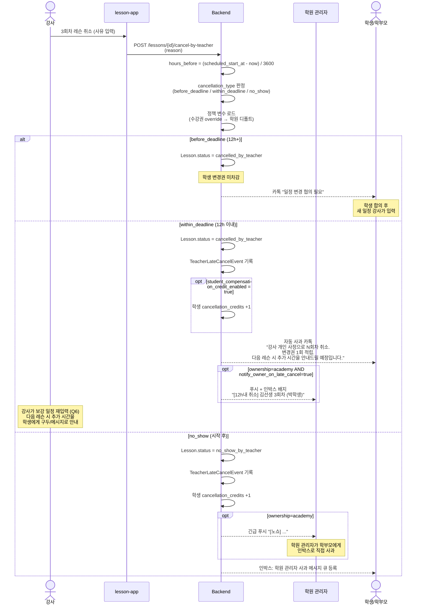

# academy/teacher_cancellation_policy_spec — 강사 사유 변경/취소 정책

> 기준일: 2026-05-21
> 경로: `/settings/cancellation-policy`, `/lessons/{id}/cancel-by-teacher`
> 마일스톤: AC-M3 (정책 적용), AC-M5 (학생 변경권 자동 적립 + 자동 카톡)
> 선행: [academy_schedule_authority_spec.md](academy_schedule_authority_spec.md), 옵시디언 `23-academy-수강권귀속-강사변경권한-설계.md` §4 + §6 결정

## 1. 범위

학원(Academy) 컨텍스트에서 **강사 사유** 로 레슨을 취소·변경할 때의 정책 및 자동 처리.

포함:
- 학원 단위 디폴트 정책 (변경 마감 시간, 학생 보상 ON/OFF)
- **강사 개인 디폴트 정책** (자기 설정화면에서 마감 시간·보상 텍스트 설정)
- 수강권 단위 override (생성 시 ownership에 따라 학원 or 강사 디폴트가 prefill, 작성자가 변경 가능)
- 12h 기준 분기 (이전 / 이내 / 노쇼)
- 학생 변경권 자동 적립 — Q8
- "다음 레슨 시 추가 시간" 자동 안내 — Q8 (텍스트만)
- 학원 관리자 알림 — Q3 (ownership=academy 한정)

제외:
- 강사 페이 차감 (Q4: 앱에서 페이/정산 관리 안 함)
- 보강 우선권 카드 (Q8 결정: 카드 개념 제거)
- 평점/벌점 시스템 (P2 보류)
- 강사 이의 제기 채널 (Q9: 앱 외 커뮤니케이션)

## 2. 데이터 모델

### 2.1 AcademyCancellationPolicy — 학원 디폴트

```python
class AcademyCancellationPolicy(Base):
    """학원 단위 강사 사유 취소 정책 (디폴트)."""
    id = Column(PK)
    academy_id = Column(FK academies, unique=True)
    
    # 마감 시간 (Q7)
    cancellation_deadline_hours = Column(Integer, default=12)
    
    # 학생 보상 (Q8)
    student_compensation_credit_enabled = Column(Boolean, default=True)
    # true 시: 12h 이내 강사 사유 취소에 학생 변경권 +1 자동 적립
    include_extra_minutes_text_on_late_cancel = Column(Boolean, default=True)
    # true 시: 12h 이내 변동 카톡 본문에 "다음 레슨 추가 시간 안내" 문구 포함
    student_compensation_extra_minutes_message = Column(
        String, 
        default="다음 레슨 시 추가 시간을 안내드릴 예정입니다."
    )
    # 학생에게 자동 카톡으로 전송되는 안내 문구. 학원 관리자가 수정 가능.
    
    # 알림
    notify_owner_on_late_cancel = Column(Boolean, default=True)
    auto_apology_kakao_enabled = Column(Boolean, default=True)
    
    updated_at = Column(DateTime)
    updated_by = Column(FK users)
```

### 2.2 TeacherCancellationDefaults — 강사 개인 디폴트

강사가 자기 설정화면에서 정하는 **개인 디폴트**. ownership=teacher 수강권 생성 시 prefill 되며, ownership=academy 수강권에는 prefill 되지 않음 (학원 디폴트 우선).

```python
class TeacherCancellationDefaults(Base):
    """강사 개인의 수강권 생성용 디폴트 정책."""
    id = Column(PK)
    teacher_user_id = Column(FK users, unique=True)
    # 학원에 소속되지 않은 1:1 강사도 가질 수 있음 (academy_member_id 무관)
    
    # 마감 시간 디폴트
    cancellation_deadline_hours = Column(Integer, default=12)
    # 강사가 12/24/48 등 선택 가능. 수강권 생성 시 이 값이 prefill.
    
    # 학생 보상 디폴트
    student_compensation_credit_enabled = Column(Boolean, default=True)
    # 12h 이내 강사 취소 시 학생 변경권 +1 자동 적립할지
    
    include_extra_minutes_text_on_late_cancel = Column(Boolean, default=True)
    # 12h 이내 변동 시 "다음 레슨 시 추가 시간 확보" 텍스트를 학생 카톡에 포함할지
    student_compensation_extra_minutes_message = Column(
        String,
        default="다음 레슨 시 추가 시간을 안내드릴 예정입니다."
    )
    # 위 토글 ON 시 학생 카톡 본문에 삽입되는 문구. 강사가 자기 톤으로 수정 가능.
    
    updated_at = Column(DateTime)
```

> 강사가 학원에 소속되어 있더라도 자기 디폴트는 유지. ownership=teacher 로 수강권을 만들 때만 적용된다 (1:1 모델 호환).

### 2.3 수강권 단위 override

`AcademySubscription` (academy_schedule_authority_spec.md §2.2) 에 이미 포함된 필드:
- `cancellation_deadline_hours`
- `student_compensation_extra_minutes_enabled`
- `notify_owner_on_late_cancel`

추가 필드:
- `include_extra_minutes_text_on_late_cancel` (Boolean) — 본 수강권의 카톡 본문에 추가시간 문구 포함 여부
- `student_compensation_extra_minutes_message` (String, nullable) — 수강권별 카톡 문구 (NULL 시 상속 소스의 메시지 사용)

**prefill 우선순위** (수강권 작성 화면 진입 시 자동 채워지는 값):

| ownership | prefill 소스 | 작성자 |
|---|---|---|
| `academy` | `AcademyCancellationPolicy` (§2.1) | 학원 관리자 |
| `teacher` | `TeacherCancellationDefaults` (§2.2) | 강사 |

작성자는 prefill 된 값을 그대로 두거나 본 수강권에 한해 변경 가능. NULL 저장하지 않고 **항상 작성 시점의 값을 수강권에 스냅샷** 한다 (이후 디폴트가 바뀌어도 기존 수강권은 영향 없음).

### 2.4 TeacherLateCancelEvent — 감사 로그

```python
class TeacherLateCancelEvent(Base):
    """강사 사유 12h 이내 취소/노쇼 기록 (월간 리포트용)."""
    id = Column(PK)
    academy_id = Column(FK)
    subscription_id = Column(FK academy_subscriptions)
    lesson_id = Column(FK lessons)
    teacher_member_id = Column(FK academy_members)
    
    cancelled_at = Column(DateTime)
    scheduled_start_at = Column(DateTime)
    hours_before_lesson = Column(Float)  # 음수 = 노쇼
    
    cancellation_type = Column(Enum(
        "before_deadline",   # 12h+ 이전
        "within_deadline",   # 12h 이내
        "no_show",           # 시작 후
    ))
    
    teacher_reason = Column(String, nullable=True)
    student_credit_added = Column(Boolean, default=False)
    owner_notified = Column(Boolean, default=False)
    student_kakao_sent = Column(Boolean, default=False)
    
    created_at = Column(DateTime)
```

> Q4 결정에 따라 강사 페이 차감 필드 (`teacher_pay_deduction_pct`) 는 도입하지 않음.

## 3. 시점별 분기 (12h 기준)

### 3.1 분기 표

| 시점 (강사 사유) | 학생 변경권 | 학생 통보 | 학원 관리자 알림 | 보강 |
|---|---|---|---|---|
| **12h+ 이전** | 미차감 | 카톡: "일정 변경 협의" | 없음 (디폴트) | 학생 합의 후 변경 |
| **12h 이내** (1h ~ 12h 전) | **+1 자동 적립** | 자동 사과 카톡 + "다음 레슨 추가 시간 안내" | 즉시 푸시 + 인박스 배지 | 강사가 일정 재입력 (Q6) |
| **레슨 시작 후 (노쇼)** | +1 적립 | 학원 관리자 직접 사과 (인박스) | 긴급 알림 | 학원 관리자 1:1 응대 |

### 3.2 ownership 별 적용

| ownership | 12h+ 이전 | 12h 이내 / 노쇼 |
|---|---|---|
| `academy` | 강사 직접 처리 — `AcademyActivityLog` 기록 ([academy_schedule_authority_spec.md §2.4](academy_schedule_authority_spec.md)) | **자동 처리 (auto_rescheduled)** + 학원 관리자 푸시 알림 (12h 이내) |
| `teacher` | 강사 직접 처리 | 학생 변경권 +1 + 학생 카톡. **학원 관리자 알림 생략** |

> ownership=teacher 는 1:1 모델 유지 (현재 `docs/specs/subscription/subscription_edit_spec.md` §6 강사 사유 취소 정책과 동일).

## 4. 처리 흐름

### 4.1 강사 취소 시퀀스



### 4.2 강사 lesson-app 화면

```
┌─────────────────────────────────────────────┐
│ 레슨 취소 — 박학생 3회차                     │
│ 2026-05-25 (수) 14:00                        │
├─────────────────────────────────────────────┤
│ 현재 시각으로부터 8시간 후                   │
│ ⚠ 12시간 이내 취소입니다                     │
│                                              │
│ 사유 입력 (필수)                             │
│ [_______________________________________]    │
│                                              │
│ 처리 안내:                                   │
│ • 학생 변경권 +1 자동 적립                  │
│ • 학생에게 사과 카톡 자동 발송              │
│ • 학원 관리자에게 알림 발송                  │
│ • 보강 일정은 강사님이 직접 안내·재입력     │
│                                              │
│ 다음 레슨 시 추가 시간 제공 안내 메시지:    │
│ "다음 레슨 시 추가 시간을 안내드릴 예정입니다." │
│ (변경 가능)                                  │
│ [_______________________________________]    │
│                                              │
│ [취소하지 않기] [취소 진행]                  │
└─────────────────────────────────────────────┘
```

### 4.3 학생 자동 카톡 템플릿

알림톡 템플릿 ID: `teacher_late_cancel_v1`

```
[강남리듬 학원]
박지원님,

#{teacher_name} 선생님의 개인 사정으로 #{lesson_date} 
레슨이 취소되었습니다.

• 변경권 1회 적립 (사용 가능)
• #{compensation_message}

자세한 일정은 선생님이 다시 안내드립니다.
문의: 학원 인박스
```

변수:
- `teacher_name`: 강사 이름
- `lesson_date`: "5/25(수) 14:00" 형식
- `compensation_message`: 정책 `student_compensation_extra_minutes_message` 값

## 5. 설정 화면 (학원 / 강사)

### 5.1 학원 관리자 — 경로

`/settings/cancellation-policy` (학원 콘솔)

대상 데이터: `AcademyCancellationPolicy` (§2.1)
적용 대상: ownership=academy 수강권 생성 시 prefill

### 5.2 학원 관리자 화면

```
┌─────────────────────────────────────────────┐
│ 강사 변경/취소 정책 (학원 디폴트)            │
├─────────────────────────────────────────────┤
│ 마감 시간                                    │
│ [12] 시간 전까지는 학생 합의 후 변경 가능    │
│ (이 시간 이내 강사 취소 = 자동 보상 처리)    │
│                                              │
│ ─────────────────────────────────────────── │
│ 12시간 이내 강사 사유 취소 처리              │
│                                              │
│ ☑ 학생 변경권 +1 자동 적립                  │
│ ☑ 학생에게 사과 카톡 자동 발송              │
│ ☑ 학원 관리자에게 즉시 푸시                  │
│                                              │
│ 학생 보상 안내 메시지 (카톡 본문 포함):     │
│ ┌─────────────────────────────────────────┐ │
│ │ 다음 레슨 시 추가 시간을 안내드릴      │ │
│ │ 예정입니다.                            │ │
│ └─────────────────────────────────────────┘ │
│                                              │
│ ─────────────────────────────────────────── │
│ 노쇼 (레슨 시작 후 미참여)                   │
│ ☑ 학원 관리자 긴급 알림                      │
│ ☑ 학원 관리자 1:1 사과 응대 큐 등록          │
│                                              │
│ ─────────────────────────────────────────── │
│ 안내                                         │
│ ⓘ 수강권별로 정책 다르게 설정하려면          │
│   수강권 상세 화면에서 override 가능         │
│ ⓘ 강사 페이/정산은 본 앱에서 관리하지 않음   │
│   (학원에서 별도 처리)                       │
│                                              │
│ [저장]                                       │
└─────────────────────────────────────────────┘
```

`PUT /api/v1/academies/{id}/cancellation-policy`

### 5.3 강사 — 경로

`/settings/my-cancellation-defaults` (lesson-app 강사 설정)

대상 데이터: `TeacherCancellationDefaults` (§2.2)
적용 대상: ownership=teacher 수강권 생성 시 prefill (학원 소속 무관)

### 5.4 강사 화면

```
┌─────────────────────────────────────────────┐
│ 내 수강권 디폴트 — 변경/취소 정책            │
├─────────────────────────────────────────────┤
│ 이 설정은 앞으로 새로 만드는 수강권에        │
│ 자동으로 채워집니다.                         │
│ (이미 만든 수강권에는 영향 없음)             │
│                                              │
│ ─────────────────────────────────────────── │
│ 변경 마감 시간                               │
│ ⦿ 12시간 전                                  │
│ ○ 24시간 전                                  │
│ ○ 48시간 전                                  │
│ ○ 직접 입력 [   ] 시간                       │
│                                              │
│ ─────────────────────────────────────────── │
│ 12시간 이내 내가 취소할 때                   │
│                                              │
│ ☑ 학생에게 변경권 +1 자동 적립               │
│                                              │
│ ☑ "다음 레슨 시 추가 시간 확보" 안내 문구    │
│   학생 카톡에 자동 포함                      │
│                                              │
│ 안내 문구 (수정 가능):                       │
│ ┌─────────────────────────────────────────┐ │
│ │ 다음 레슨 시 추가 시간을 안내드릴      │ │
│ │ 예정입니다.                            │ │
│ └─────────────────────────────────────────┘ │
│                                              │
│ ─────────────────────────────────────────── │
│ ⓘ 이 설정은 내 1:1 수강권 (ownership=teacher)│
│   에만 적용됩니다.                           │
│ ⓘ 학원이 만든 수강권은 학원 디폴트를 따릅니다│
│                                              │
│ [저장]                                       │
└─────────────────────────────────────────────┘
```

`PUT /api/v1/me/cancellation-defaults`

### 5.5 수강권 작성 시 prefill + override

`POST /api/v1/academies/{id}/subscriptions` (학원 콘솔) 또는
`POST /api/v1/me/subscriptions` (강사 직접 발급, ownership=teacher)

작성 화면 진입 시 ownership 에 따라 디폴트 자동 채움:

```
┌─────────────────────────────────────────────┐
│ 수강권 생성 — 박학생                         │
├─────────────────────────────────────────────┤
│ 귀속:  ⦿ 학원   ○ 강사 (1:1)                 │
│                                              │
│ 회차: [10] 회   기간: [3개월]                │
│                                              │
│ ─────────────────────────────────────────── │
│ 변경/취소 정책                               │
│ (귀속=학원: 학원 디폴트가 자동 입력됨)       │
│ (귀속=강사: 내 디폴트가 자동 입력됨)         │
│                                              │
│ 변경 마감 시간: [12] 시간                    │
│ ☑ 학생 변경권 자동 적립                      │
│ ☑ 12시간 이내 취소 시 "추가 시간 안내" 문구  │
│   학생 카톡 포함                             │
│                                              │
│ 안내 문구:                                   │
│ ┌─────────────────────────────────────────┐ │
│ │ 다음 레슨 시 추가 시간을 안내드릴      │ │
│ │ 예정입니다.                            │ │
│ └─────────────────────────────────────────┘ │
│                                              │
│ ⓘ 이 값들은 본 수강권에만 적용됩니다.        │
│   디폴트 자체를 바꾸려면 설정 화면에서.      │
│                                              │
│ [생성]                                       │
└─────────────────────────────────────────────┘
```

**prefill 로직**:

```python
def prefill_subscription_policy(ownership: str, teacher_user_id: int, academy_id: int) -> dict:
    if ownership == "academy":
        src = AcademyCancellationPolicy.get_by_academy(academy_id)
    else:  # teacher
        src = TeacherCancellationDefaults.get_by_teacher(teacher_user_id)
        # 강사 디폴트가 없으면 시스템 디폴트 (12h, ON, ON, 기본 문구)
    return {
        "cancellation_deadline_hours": src.cancellation_deadline_hours,
        # subscription 측은 의미 명확화를 위해 _extra_minutes_enabled 로 이름 변경되었음.
        # 양쪽 defaults 의 _credit_enabled 필드와 동일 의미 (학생 변경권 +1 자동 적립).
        "student_compensation_extra_minutes_enabled": src.student_compensation_credit_enabled,
        "include_extra_minutes_text_on_late_cancel": src.include_extra_minutes_text_on_late_cancel,
        "student_compensation_extra_minutes_message": src.student_compensation_extra_minutes_message,
        "notify_owner_on_late_cancel": True if ownership == "academy" else False,
    }
```

작성자가 화면에서 값을 바꾸면 **수강권 행에 스냅샷 저장**. 디폴트는 건드리지 않음.

## 6. 월간 리포트

`GET /api/v1/academies/{id}/reports/teacher-late-cancels?month=2026-05`

```json
{
  "month": "2026-05",
  "total_events": 14,
  "by_type": {
    "before_deadline": 8,
    "within_deadline": 5,
    "no_show": 1
  },
  "by_teacher": [
    {
      "teacher_member_id": 7,
      "name": "김선생",
      "within_deadline_count": 3,
      "no_show_count": 1,
      "total_credits_issued_to_students": 4
    }
  ]
}
```

학원 관리자 통계 화면에 표시 (`/stats` → "강사 결강" 탭).

> **목적**: 학원 관리자가 강사별 결강 패턴 파악. 시스템은 자동 평점/벌점을 매기지 않음 (Q9 외 — 한국 문화 부재). 학원 관리자가 강사와 **앱 외 직접** 커뮤니케이션.

## 7. 학생 변경권 적립 처리

### 7.1 적립 모델

```python
class StudentCancellationCredit(Base):
    """학생 보유 변경권."""
    id = Column(PK)
    student_id = Column(FK users)
    subscription_id = Column(FK academy_subscriptions)
    
    source = Column(Enum(
        "initial_grant",            # 수강권 발급 시 초기 지급
        "teacher_late_cancel",      # 강사 사유 12h 이내 취소 — 자동
        "owner_bulk_closure",       # 학원 일괄 휴강 — 자동
        "owner_manual_grant",       # 학원 관리자 수동 지급
    ))
    source_event_id = Column(Integer, nullable=True)  # TeacherLateCancelEvent.id 등
    
    granted_at = Column(DateTime)
    used_at = Column(DateTime, nullable=True)
    expires_at = Column(DateTime, nullable=True)
```

학생 lesson-app: "수강권 변경권 N회 (강사 결강 보상 +1 2026-05-25)" 표시.

### 7.2 자동 적립 검증

12h 이내 강사 취소 시:
1. `TeacherLateCancelEvent` 생성
2. `StudentCancellationCredit(source="teacher_late_cancel", source_event_id=event.id)` 추가
3. 카톡 발송 (teacher_late_cancel_v1 템플릿)
4. 학원 관리자 알림 (ownership=academy 시)

## 8. 권한 / 보안

- `POST /lessons/{id}/cancel-by-teacher`: `Depends(current_teacher)` + 본인 담당 레슨만
- 정책 변경: `Depends(current_academy_owner)` + 변경 시 AuditLog 기록
- 수강권 override: 작성자 (관리자 또는 강사 - ownership=teacher 시) 만
- `TeacherLateCancelEvent` 는 학원 관리자만 조회 (강사는 본인 것만)

## 9. 실패 / 예외

| 상황 | 처리 |
|---|---|
| 강사가 사유 미입력 | 422 "사유 필수" |
| 학생이 변경권 적립 직후 잔액 조회 | 즉시 반영 (트랜잭션 동기) |
| 카톡 발송 실패 | 인앱 푸시 폴백 + 학원 관리자에게 "학생 통보 실패" 알림 |
| 노쇼 자동 감지 (시작 후 N분 미참여) | 별도 자동 감지 로직 — P2 (지금은 강사 수동 신고) |
| 정책 변경 직후 진행 중 취소 | 취소 시점의 정책 사용 (DB 조회 시점 락) |

## 10. 옵시디언 결정과의 매핑

| 옵시디언 결정 | 본 스펙 |
|---|---|
| Q4 강사 페이 관리 안 함 | 페이 차감 필드 제외 (§2.1) |
| Q7 마감 시간 12h 기본값 | `cancellation_deadline_hours = 12` (§2.1) |
| Q8 다음 레슨 추가 시간 안내 (텍스트) | `student_compensation_extra_minutes_message` (§2.1, §4.3) |
| Q8 보강 우선권 카드 제거 | 카드 모델 없음. 단순 텍스트 안내만 |
| Q3 ownership 분기 | §3.2 — academy vs teacher 알림 정책 차이 |
| Q9 강사 이의 제기 채널 없음 | 본 스펙 미포함 — 학원 관리자가 앱 외 처리 |
| Q10 강사 개인 디폴트 + ownership prefill | `TeacherCancellationDefaults` (§2.2) + §5.5 prefill 로직 |

## 11. 변경 이력

- 2026-05-21: 초안 (Q1-Q9 결정 반영, B4 단순화 — 페이 차감 제외)
- 2026-05-21 (2차): `TeacherCancellationDefaults` 추가. 강사 설정화면 (§5.3-5.4) + 수강권 생성 시 ownership 별 prefill 우선순위 (§5.5) 명시. 수강권 행은 작성 시점의 정책을 **스냅샷** 저장.
- 2026-05-21 (3차): 전반 검증 결과 갭 수정. `AcademyCancellationPolicy` 에 `include_extra_minutes_text_on_late_cancel` 필드 추가 (prefill 함수가 양쪽 디폴트에서 동일 키 호출). prefill 함수에 필드명 비대칭 주석 추가 (defaults `_credit_enabled` ↔ subscription `_extra_minutes_enabled` 동일 의미).
